```python
import pandas as pd
import numpy as np
import matplotlib.pyplot as plt

df = pd.read_csv("risk_decoded.csv")

df.head()
```


<div>
<style scoped>
    .dataframe tbody tr th:only-of-type {
        vertical-align: middle;
    }

    .dataframe tbody tr th {
        vertical-align: top;
    }

    .dataframe thead th {
        text-align: right;
    }
</style>
<table border="1" class="dataframe">
  <thead>
    <tr style="text-align: right;">
      <th></th>
      <th>menopaus</th>
      <th>agegrp</th>
      <th>density</th>
      <th>race</th>
      <th>Hispanic</th>
      <th>bmi</th>
      <th>agefirst</th>
      <th>nrelbc</th>
      <th>brstproc</th>
      <th>lastmamm</th>
      <th>surgmeno</th>
      <th>hrt</th>
      <th>invasive</th>
      <th>cancer</th>
      <th>training</th>
      <th>count</th>
    </tr>
  </thead>
  <tbody>
    <tr>
      <th>0</th>
      <td>premenopausal</td>
      <td>35-39</td>
      <td>almost_entirely_fat</td>
      <td>white</td>
      <td>no</td>
      <td>10-24.99</td>
      <td>age_less_than_30</td>
      <td>zero</td>
      <td>no</td>
      <td>negative</td>
      <td>unknown_or_not_menopausal</td>
      <td>unknown_or_not_menopausal</td>
      <td>no</td>
      <td>no</td>
      <td>training</td>
      <td>4</td>
    </tr>
    <tr>
      <th>1</th>
      <td>premenopausal</td>
      <td>35-39</td>
      <td>almost_entirely_fat</td>
      <td>white</td>
      <td>no</td>
      <td>10-24.99</td>
      <td>age_less_than_30</td>
      <td>zero</td>
      <td>no</td>
      <td>unknown</td>
      <td>unknown_or_not_menopausal</td>
      <td>unknown_or_not_menopausal</td>
      <td>no</td>
      <td>no</td>
      <td>validation</td>
      <td>2</td>
    </tr>
    <tr>
      <th>2</th>
      <td>premenopausal</td>
      <td>35-39</td>
      <td>almost_entirely_fat</td>
      <td>white</td>
      <td>no</td>
      <td>10-24.99</td>
      <td>age_less_than_30</td>
      <td>zero</td>
      <td>no</td>
      <td>unknown</td>
      <td>unknown_or_not_menopausal</td>
      <td>unknown_or_not_menopausal</td>
      <td>no</td>
      <td>no</td>
      <td>training</td>
      <td>4</td>
    </tr>
    <tr>
      <th>3</th>
      <td>premenopausal</td>
      <td>35-39</td>
      <td>almost_entirely_fat</td>
      <td>white</td>
      <td>no</td>
      <td>10-24.99</td>
      <td>age_less_than_30</td>
      <td>zero</td>
      <td>yes</td>
      <td>unknown</td>
      <td>unknown_or_not_menopausal</td>
      <td>unknown_or_not_menopausal</td>
      <td>no</td>
      <td>no</td>
      <td>training</td>
      <td>1</td>
    </tr>
    <tr>
      <th>4</th>
      <td>premenopausal</td>
      <td>35-39</td>
      <td>almost_entirely_fat</td>
      <td>white</td>
      <td>no</td>
      <td>10-24.99</td>
      <td>age_less_than_30</td>
      <td>one</td>
      <td>no</td>
      <td>negative</td>
      <td>unknown_or_not_menopausal</td>
      <td>unknown_or_not_menopausal</td>
      <td>no</td>
      <td>no</td>
      <td>training</td>
      <td>1</td>
    </tr>
  </tbody>
</table>
</div>


```python
print("Размер набора данных:", df.shape)

display(df.head())
display(df.info())
display(df.describe(include="all"))
```

    Размер набора данных: (280660, 16)
    


<div>
<style scoped>
    .dataframe tbody tr th:only-of-type {
        vertical-align: middle;
    }

    .dataframe tbody tr th {
        vertical-align: top;
    }

    .dataframe thead th {
        text-align: right;
    }
</style>
<table border="1" class="dataframe">
  <thead>
    <tr style="text-align: right;">
      <th></th>
      <th>menopaus</th>
      <th>agegrp</th>
      <th>density</th>
      <th>race</th>
      <th>Hispanic</th>
      <th>bmi</th>
      <th>agefirst</th>
      <th>nrelbc</th>
      <th>brstproc</th>
      <th>lastmamm</th>
      <th>surgmeno</th>
      <th>hrt</th>
      <th>invasive</th>
      <th>cancer</th>
      <th>training</th>
      <th>count</th>
    </tr>
  </thead>
  <tbody>
    <tr>
      <th>0</th>
      <td>premenopausal</td>
      <td>35-39</td>
      <td>almost_entirely_fat</td>
      <td>white</td>
      <td>no</td>
      <td>10-24.99</td>
      <td>age_less_than_30</td>
      <td>zero</td>
      <td>no</td>
      <td>negative</td>
      <td>unknown_or_not_menopausal</td>
      <td>unknown_or_not_menopausal</td>
      <td>no</td>
      <td>no</td>
      <td>training</td>
      <td>4</td>
    </tr>
    <tr>
      <th>1</th>
      <td>premenopausal</td>
      <td>35-39</td>
      <td>almost_entirely_fat</td>
      <td>white</td>
      <td>no</td>
      <td>10-24.99</td>
      <td>age_less_than_30</td>
      <td>zero</td>
      <td>no</td>
      <td>unknown</td>
      <td>unknown_or_not_menopausal</td>
      <td>unknown_or_not_menopausal</td>
      <td>no</td>
      <td>no</td>
      <td>validation</td>
      <td>2</td>
    </tr>
    <tr>
      <th>2</th>
      <td>premenopausal</td>
      <td>35-39</td>
      <td>almost_entirely_fat</td>
      <td>white</td>
      <td>no</td>
      <td>10-24.99</td>
      <td>age_less_than_30</td>
      <td>zero</td>
      <td>no</td>
      <td>unknown</td>
      <td>unknown_or_not_menopausal</td>
      <td>unknown_or_not_menopausal</td>
      <td>no</td>
      <td>no</td>
      <td>training</td>
      <td>4</td>
    </tr>
    <tr>
      <th>3</th>
      <td>premenopausal</td>
      <td>35-39</td>
      <td>almost_entirely_fat</td>
      <td>white</td>
      <td>no</td>
      <td>10-24.99</td>
      <td>age_less_than_30</td>
      <td>zero</td>
      <td>yes</td>
      <td>unknown</td>
      <td>unknown_or_not_menopausal</td>
      <td>unknown_or_not_menopausal</td>
      <td>no</td>
      <td>no</td>
      <td>training</td>
      <td>1</td>
    </tr>
    <tr>
      <th>4</th>
      <td>premenopausal</td>
      <td>35-39</td>
      <td>almost_entirely_fat</td>
      <td>white</td>
      <td>no</td>
      <td>10-24.99</td>
      <td>age_less_than_30</td>
      <td>one</td>
      <td>no</td>
      <td>negative</td>
      <td>unknown_or_not_menopausal</td>
      <td>unknown_or_not_menopausal</td>
      <td>no</td>
      <td>no</td>
      <td>training</td>
      <td>1</td>
    </tr>
  </tbody>
</table>
</div>


    <class 'pandas.core.frame.DataFrame'>
    RangeIndex: 280660 entries, 0 to 280659
    Data columns (total 16 columns):
     #   Column    Non-Null Count   Dtype 
    ---  ------    --------------   ----- 
     0   menopaus  280660 non-null  object
     1   agegrp    280660 non-null  object
     2   density   280660 non-null  object
     3   race      280660 non-null  object
     4   Hispanic  280660 non-null  object
     5   bmi       280660 non-null  object
     6   agefirst  280660 non-null  object
     7   nrelbc    280660 non-null  object
     8   brstproc  280660 non-null  object
     9   lastmamm  280660 non-null  object
     10  surgmeno  280660 non-null  object
     11  hrt       280660 non-null  object
     12  invasive  280660 non-null  object
     13  cancer    280660 non-null  object
     14  training  280660 non-null  object
     15  count     280660 non-null  int64 
    dtypes: int64(1), object(15)
    memory usage: 34.3+ MB
    


    None


<div>
<style scoped>
    .dataframe tbody tr th:only-of-type {
        vertical-align: middle;
    }

    .dataframe tbody tr th {
        vertical-align: top;
    }

    .dataframe thead th {
        text-align: right;
    }
</style>
<table border="1" class="dataframe">
  <thead>
    <tr style="text-align: right;">
      <th></th>
      <th>menopaus</th>
      <th>agegrp</th>
      <th>density</th>
      <th>race</th>
      <th>Hispanic</th>
      <th>bmi</th>
      <th>agefirst</th>
      <th>nrelbc</th>
      <th>brstproc</th>
      <th>lastmamm</th>
      <th>surgmeno</th>
      <th>hrt</th>
      <th>invasive</th>
      <th>cancer</th>
      <th>training</th>
      <th>count</th>
    </tr>
  </thead>
  <tbody>
    <tr>
      <th>count</th>
      <td>280660</td>
      <td>280660</td>
      <td>280660</td>
      <td>280660</td>
      <td>280660</td>
      <td>280660</td>
      <td>280660</td>
      <td>280660</td>
      <td>280660</td>
      <td>280660</td>
      <td>280660</td>
      <td>280660</td>
      <td>280660</td>
      <td>280660</td>
      <td>280660</td>
      <td>280660.000000</td>
    </tr>
    <tr>
      <th>unique</th>
      <td>3</td>
      <td>10</td>
      <td>5</td>
      <td>6</td>
      <td>3</td>
      <td>5</td>
      <td>4</td>
      <td>4</td>
      <td>3</td>
      <td>3</td>
      <td>3</td>
      <td>3</td>
      <td>2</td>
      <td>2</td>
      <td>2</td>
      <td>NaN</td>
    </tr>
    <tr>
      <th>top</th>
      <td>postmenopausal_or_age_55_or_more</td>
      <td>50-54</td>
      <td>scattered_fibroglandular_densities</td>
      <td>white</td>
      <td>no</td>
      <td>unknown</td>
      <td>age_less_than_30</td>
      <td>zero</td>
      <td>no</td>
      <td>negative</td>
      <td>unknown_or_not_menopausal</td>
      <td>no</td>
      <td>no</td>
      <td>no</td>
      <td>training</td>
      <td>NaN</td>
    </tr>
    <tr>
      <th>freq</th>
      <td>225424</td>
      <td>46682</td>
      <td>80610</td>
      <td>155345</td>
      <td>154832</td>
      <td>109179</td>
      <td>110587</td>
      <td>166341</td>
      <td>163811</td>
      <td>170644</td>
      <td>121402</td>
      <td>101077</td>
      <td>273469</td>
      <td>271355</td>
      <td>180465</td>
      <td>NaN</td>
    </tr>
    <tr>
      <th>mean</th>
      <td>NaN</td>
      <td>NaN</td>
      <td>NaN</td>
      <td>NaN</td>
      <td>NaN</td>
      <td>NaN</td>
      <td>NaN</td>
      <td>NaN</td>
      <td>NaN</td>
      <td>NaN</td>
      <td>NaN</td>
      <td>NaN</td>
      <td>NaN</td>
      <td>NaN</td>
      <td>NaN</td>
      <td>8.526324</td>
    </tr>
    <tr>
      <th>std</th>
      <td>NaN</td>
      <td>NaN</td>
      <td>NaN</td>
      <td>NaN</td>
      <td>NaN</td>
      <td>NaN</td>
      <td>NaN</td>
      <td>NaN</td>
      <td>NaN</td>
      <td>NaN</td>
      <td>NaN</td>
      <td>NaN</td>
      <td>NaN</td>
      <td>NaN</td>
      <td>NaN</td>
      <td>53.428629</td>
    </tr>
    <tr>
      <th>min</th>
      <td>NaN</td>
      <td>NaN</td>
      <td>NaN</td>
      <td>NaN</td>
      <td>NaN</td>
      <td>NaN</td>
      <td>NaN</td>
      <td>NaN</td>
      <td>NaN</td>
      <td>NaN</td>
      <td>NaN</td>
      <td>NaN</td>
      <td>NaN</td>
      <td>NaN</td>
      <td>NaN</td>
      <td>1.000000</td>
    </tr>
    <tr>
      <th>25%</th>
      <td>NaN</td>
      <td>NaN</td>
      <td>NaN</td>
      <td>NaN</td>
      <td>NaN</td>
      <td>NaN</td>
      <td>NaN</td>
      <td>NaN</td>
      <td>NaN</td>
      <td>NaN</td>
      <td>NaN</td>
      <td>NaN</td>
      <td>NaN</td>
      <td>NaN</td>
      <td>NaN</td>
      <td>1.000000</td>
    </tr>
    <tr>
      <th>50%</th>
      <td>NaN</td>
      <td>NaN</td>
      <td>NaN</td>
      <td>NaN</td>
      <td>NaN</td>
      <td>NaN</td>
      <td>NaN</td>
      <td>NaN</td>
      <td>NaN</td>
      <td>NaN</td>
      <td>NaN</td>
      <td>NaN</td>
      <td>NaN</td>
      <td>NaN</td>
      <td>NaN</td>
      <td>1.000000</td>
    </tr>
    <tr>
      <th>75%</th>
      <td>NaN</td>
      <td>NaN</td>
      <td>NaN</td>
      <td>NaN</td>
      <td>NaN</td>
      <td>NaN</td>
      <td>NaN</td>
      <td>NaN</td>
      <td>NaN</td>
      <td>NaN</td>
      <td>NaN</td>
      <td>NaN</td>
      <td>NaN</td>
      <td>NaN</td>
      <td>NaN</td>
      <td>4.000000</td>
    </tr>
    <tr>
      <th>max</th>
      <td>NaN</td>
      <td>NaN</td>
      <td>NaN</td>
      <td>NaN</td>
      <td>NaN</td>
      <td>NaN</td>
      <td>NaN</td>
      <td>NaN</td>
      <td>NaN</td>
      <td>NaN</td>
      <td>NaN</td>
      <td>NaN</td>
      <td>NaN</td>
      <td>NaN</td>
      <td>NaN</td>
      <td>7295.000000</td>
    </tr>
  </tbody>
</table>
</div>


```python
missing = df.isna().sum().sort_values(ascending=False)

missing_table = pd.DataFrame({
    "Пропущенные значения": missing,
    "Доля пропусков, %": (missing / len(df) * 100).round(2)
})

display(missing_table)
```


<div>
<style scoped>
    .dataframe tbody tr th:only-of-type {
        vertical-align: middle;
    }

    .dataframe tbody tr th {
        vertical-align: top;
    }

    .dataframe thead th {
        text-align: right;
    }
</style>
<table border="1" class="dataframe">
  <thead>
    <tr style="text-align: right;">
      <th></th>
      <th>Пропущенные значения</th>
      <th>Доля пропусков, %</th>
    </tr>
  </thead>
  <tbody>
    <tr>
      <th>menopaus</th>
      <td>0</td>
      <td>0.0</td>
    </tr>
    <tr>
      <th>agegrp</th>
      <td>0</td>
      <td>0.0</td>
    </tr>
    <tr>
      <th>density</th>
      <td>0</td>
      <td>0.0</td>
    </tr>
    <tr>
      <th>race</th>
      <td>0</td>
      <td>0.0</td>
    </tr>
    <tr>
      <th>Hispanic</th>
      <td>0</td>
      <td>0.0</td>
    </tr>
    <tr>
      <th>bmi</th>
      <td>0</td>
      <td>0.0</td>
    </tr>
    <tr>
      <th>agefirst</th>
      <td>0</td>
      <td>0.0</td>
    </tr>
    <tr>
      <th>nrelbc</th>
      <td>0</td>
      <td>0.0</td>
    </tr>
    <tr>
      <th>brstproc</th>
      <td>0</td>
      <td>0.0</td>
    </tr>
    <tr>
      <th>lastmamm</th>
      <td>0</td>
      <td>0.0</td>
    </tr>
    <tr>
      <th>surgmeno</th>
      <td>0</td>
      <td>0.0</td>
    </tr>
    <tr>
      <th>hrt</th>
      <td>0</td>
      <td>0.0</td>
    </tr>
    <tr>
      <th>invasive</th>
      <td>0</td>
      <td>0.0</td>
    </tr>
    <tr>
      <th>cancer</th>
      <td>0</td>
      <td>0.0</td>
    </tr>
    <tr>
      <th>training</th>
      <td>0</td>
      <td>0.0</td>
    </tr>
    <tr>
      <th>count</th>
      <td>0</td>
      <td>0.0</td>
    </tr>
  </tbody>
</table>
</div>


```python
unique_values = pd.DataFrame({
    "Количество уникальных значений": df.nunique(),
    "Тип данных": df.dtypes
})

display(unique_values)
```


<div>
<style scoped>
    .dataframe tbody tr th:only-of-type {
        vertical-align: middle;
    }

    .dataframe tbody tr th {
        vertical-align: top;
    }

    .dataframe thead th {
        text-align: right;
    }
</style>
<table border="1" class="dataframe">
  <thead>
    <tr style="text-align: right;">
      <th></th>
      <th>Количество уникальных значений</th>
      <th>Тип данных</th>
    </tr>
  </thead>
  <tbody>
    <tr>
      <th>menopaus</th>
      <td>3</td>
      <td>object</td>
    </tr>
    <tr>
      <th>agegrp</th>
      <td>10</td>
      <td>object</td>
    </tr>
    <tr>
      <th>density</th>
      <td>5</td>
      <td>object</td>
    </tr>
    <tr>
      <th>race</th>
      <td>6</td>
      <td>object</td>
    </tr>
    <tr>
      <th>Hispanic</th>
      <td>3</td>
      <td>object</td>
    </tr>
    <tr>
      <th>bmi</th>
      <td>5</td>
      <td>object</td>
    </tr>
    <tr>
      <th>agefirst</th>
      <td>4</td>
      <td>object</td>
    </tr>
    <tr>
      <th>nrelbc</th>
      <td>4</td>
      <td>object</td>
    </tr>
    <tr>
      <th>brstproc</th>
      <td>3</td>
      <td>object</td>
    </tr>
    <tr>
      <th>lastmamm</th>
      <td>3</td>
      <td>object</td>
    </tr>
    <tr>
      <th>surgmeno</th>
      <td>3</td>
      <td>object</td>
    </tr>
    <tr>
      <th>hrt</th>
      <td>3</td>
      <td>object</td>
    </tr>
    <tr>
      <th>invasive</th>
      <td>2</td>
      <td>object</td>
    </tr>
    <tr>
      <th>cancer</th>
      <td>2</td>
      <td>object</td>
    </tr>
    <tr>
      <th>training</th>
      <td>2</td>
      <td>object</td>
    </tr>
    <tr>
      <th>count</th>
      <td>822</td>
      <td>int64</td>
    </tr>
  </tbody>
</table>
</div>


```python
target_col = "cancer"
weight_col = "count"
split_col = "training"

all_columns = df.columns.tolist()

categorical_cols = [
    col for col in df.columns
    if col not in [target_col, weight_col]
]

feature_cols = [
    col for col in categorical_cols
    if col not in [split_col, "invasive"]
]

print("Целевая переменная:", target_col)
print("Весовой столбец:", weight_col)
print("Столбец разбиения:", split_col)
print("Признаки для анализа:")
print(feature_cols)
```

    Целевая переменная: cancer
    Весовой столбец: count
    Столбец разбиения: training
    Признаки для анализа:
    ['menopaus', 'agegrp', 'density', 'race', 'Hispanic', 'bmi', 'agefirst', 'nrelbc', 'brstproc', 'lastmamm', 'surgmeno', 'hrt']
    


```python
target_counts = df[target_col].value_counts()

display(target_counts)
```


    cancer
    no     271355
    yes      9305
    Name: count, dtype: int64


```python
plt.figure(figsize=(6, 4))
target_counts.plot(kind="bar")
plt.title("Распределение целевой переменной без учета весов")
plt.xlabel("Наличие рака")
plt.ylabel("Количество строк")
plt.xticks(rotation=0)
plt.grid(axis="y", alpha=0.3)
plt.show()
```


    
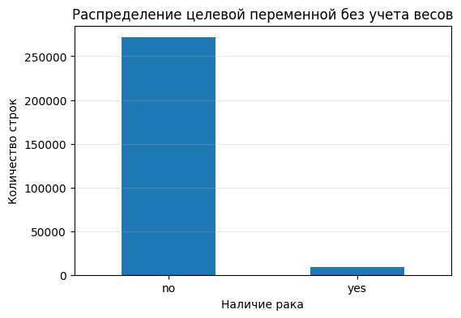
    


```python
target_weighted = df.groupby(target_col)[weight_col].sum().sort_values(ascending=False)

target_weighted_table = pd.DataFrame({
    "Количество наблюдений": target_weighted,
    "Доля, %": (target_weighted / target_weighted.sum() * 100).round(2)
})

display(target_weighted_table)
```


<div>
<style scoped>
    .dataframe tbody tr th:only-of-type {
        vertical-align: middle;
    }

    .dataframe tbody tr th {
        vertical-align: top;
    }

    .dataframe thead th {
        text-align: right;
    }
</style>
<table border="1" class="dataframe">
  <thead>
    <tr style="text-align: right;">
      <th></th>
      <th>Количество наблюдений</th>
      <th>Доля, %</th>
    </tr>
    <tr>
      <th>cancer</th>
      <th></th>
      <th></th>
    </tr>
  </thead>
  <tbody>
    <tr>
      <th>no</th>
      <td>2381360</td>
      <td>99.51</td>
    </tr>
    <tr>
      <th>yes</th>
      <td>11638</td>
      <td>0.49</td>
    </tr>
  </tbody>
</table>
</div>


```python
plt.figure(figsize=(6, 4))
target_weighted.plot(kind="bar")
plt.title("Распределение целевой переменной с учетом count")
plt.xlabel("Наличие рака")
plt.ylabel("Количество наблюдений")
plt.xticks(rotation=0)
plt.grid(axis="y", alpha=0.3)
plt.show()
```


    
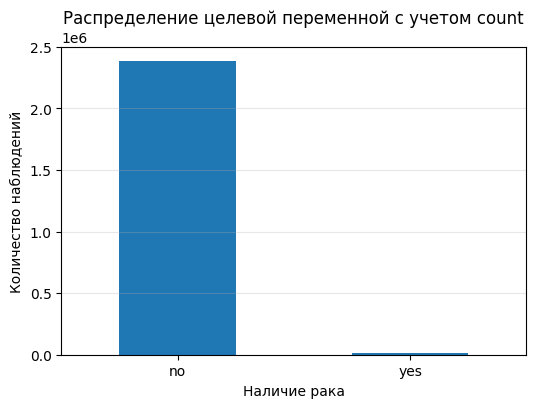
    


```python
split_weighted = df.groupby(split_col)[weight_col].sum()

split_table = pd.DataFrame({
    "Количество наблюдений": split_weighted,
    "Доля, %": (split_weighted / split_weighted.sum() * 100).round(2)
})

display(split_table)
```


<div>
<style scoped>
    .dataframe tbody tr th:only-of-type {
        vertical-align: middle;
    }

    .dataframe tbody tr th {
        vertical-align: top;
    }

    .dataframe thead th {
        text-align: right;
    }
</style>
<table border="1" class="dataframe">
  <thead>
    <tr style="text-align: right;">
      <th></th>
      <th>Количество наблюдений</th>
      <th>Доля, %</th>
    </tr>
    <tr>
      <th>training</th>
      <th></th>
      <th></th>
    </tr>
  </thead>
  <tbody>
    <tr>
      <th>training</th>
      <td>1795139</td>
      <td>75.02</td>
    </tr>
    <tr>
      <th>validation</th>
      <td>597859</td>
      <td>24.98</td>
    </tr>
  </tbody>
</table>
</div>


```python
plt.figure(figsize=(6, 4))
split_weighted.plot(kind="bar")
plt.title("Распределение наблюдений по обучающей и валидационной выборкам")
plt.xlabel("Выборка")
plt.ylabel("Количество наблюдений")
plt.xticks(rotation=0)
plt.grid(axis="y", alpha=0.3)
plt.show()
```


    
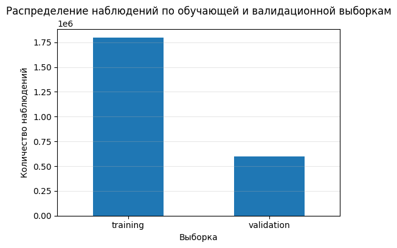
    


```python
split_target = pd.crosstab(
    df[split_col],
    df[target_col],
    values=df[weight_col],
    aggfunc="sum"
).fillna(0)

split_target_percent = split_target.div(split_target.sum(axis=1), axis=0) * 100

display(split_target)
display(split_target_percent.round(2))
```


<div>
<style scoped>
    .dataframe tbody tr th:only-of-type {
        vertical-align: middle;
    }

    .dataframe tbody tr th {
        vertical-align: top;
    }

    .dataframe thead th {
        text-align: right;
    }
</style>
<table border="1" class="dataframe">
  <thead>
    <tr style="text-align: right;">
      <th>cancer</th>
      <th>no</th>
      <th>yes</th>
    </tr>
    <tr>
      <th>training</th>
      <th></th>
      <th></th>
    </tr>
  </thead>
  <tbody>
    <tr>
      <th>training</th>
      <td>1786372</td>
      <td>8767</td>
    </tr>
    <tr>
      <th>validation</th>
      <td>594988</td>
      <td>2871</td>
    </tr>
  </tbody>
</table>
</div>


<div>
<style scoped>
    .dataframe tbody tr th:only-of-type {
        vertical-align: middle;
    }

    .dataframe tbody tr th {
        vertical-align: top;
    }

    .dataframe thead th {
        text-align: right;
    }
</style>
<table border="1" class="dataframe">
  <thead>
    <tr style="text-align: right;">
      <th>cancer</th>
      <th>no</th>
      <th>yes</th>
    </tr>
    <tr>
      <th>training</th>
      <th></th>
      <th></th>
    </tr>
  </thead>
  <tbody>
    <tr>
      <th>training</th>
      <td>99.51</td>
      <td>0.49</td>
    </tr>
    <tr>
      <th>validation</th>
      <td>99.52</td>
      <td>0.48</td>
    </tr>
  </tbody>
</table>
</div>


```python
split_target_percent.plot(kind="bar", stacked=True, figsize=(7, 4))
plt.title("Доля классов cancer в обучающей и валидационной выборках")
plt.xlabel("Выборка")
plt.ylabel("Доля, %")
plt.xticks(rotation=0)
plt.legend(title="cancer")
plt.grid(axis="y", alpha=0.3)
plt.show()
```


    
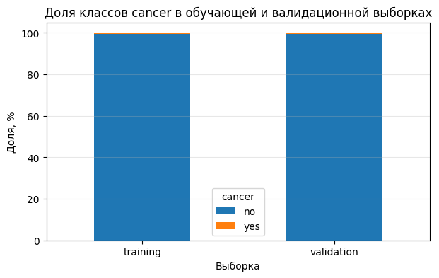
    


```python
def plot_weighted_distribution(data, column, weight_col="count"):
    values = data.groupby(column)[weight_col].sum().sort_values(ascending=False)

    plt.figure(figsize=(9, 4))
    values.plot(kind="bar")
    plt.title(f"Распределение признака: {column}")
    plt.xlabel(column)
    plt.ylabel("Количество наблюдений")
    plt.xticks(rotation=45, ha="right")
    plt.grid(axis="y", alpha=0.3)
    plt.tight_layout()
    plt.show()

    table = pd.DataFrame({
        "Количество наблюдений": values,
        "Доля, %": (values / values.sum() * 100).round(2)
    })

    display(table)
```


```python
for col in feature_cols:
    plot_weighted_distribution(df, col, weight_col)
```


    
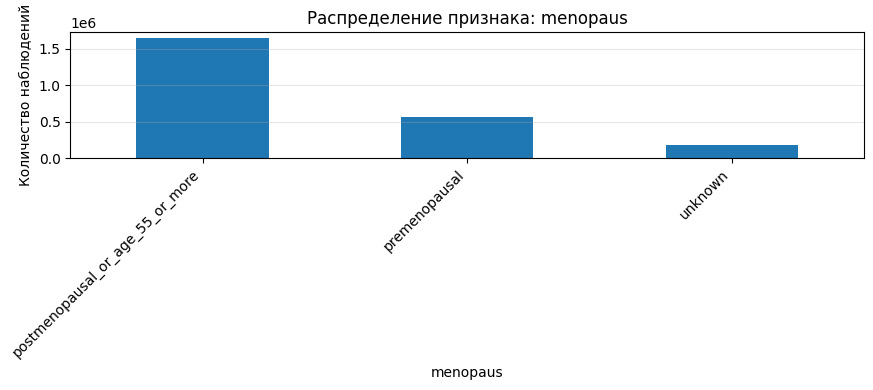
    


<div>
<style scoped>
    .dataframe tbody tr th:only-of-type {
        vertical-align: middle;
    }

    .dataframe tbody tr th {
        vertical-align: top;
    }

    .dataframe thead th {
        text-align: right;
    }
</style>
<table border="1" class="dataframe">
  <thead>
    <tr style="text-align: right;">
      <th></th>
      <th>Количество наблюдений</th>
      <th>Доля, %</th>
    </tr>
    <tr>
      <th>menopaus</th>
      <th></th>
      <th></th>
    </tr>
  </thead>
  <tbody>
    <tr>
      <th>postmenopausal_or_age_55_or_more</th>
      <td>1642824</td>
      <td>68.65</td>
    </tr>
    <tr>
      <th>premenopausal</th>
      <td>568215</td>
      <td>23.74</td>
    </tr>
    <tr>
      <th>unknown</th>
      <td>181959</td>
      <td>7.60</td>
    </tr>
  </tbody>
</table>
</div>


    
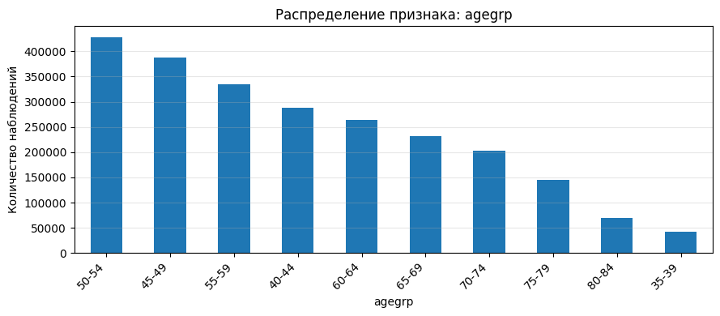
    


<div>
<style scoped>
    .dataframe tbody tr th:only-of-type {
        vertical-align: middle;
    }

    .dataframe tbody tr th {
        vertical-align: top;
    }

    .dataframe thead th {
        text-align: right;
    }
</style>
<table border="1" class="dataframe">
  <thead>
    <tr style="text-align: right;">
      <th></th>
      <th>Количество наблюдений</th>
      <th>Доля, %</th>
    </tr>
    <tr>
      <th>agegrp</th>
      <th></th>
      <th></th>
    </tr>
  </thead>
  <tbody>
    <tr>
      <th>50-54</th>
      <td>428312</td>
      <td>17.90</td>
    </tr>
    <tr>
      <th>45-49</th>
      <td>387246</td>
      <td>16.18</td>
    </tr>
    <tr>
      <th>55-59</th>
      <td>334132</td>
      <td>13.96</td>
    </tr>
    <tr>
      <th>40-44</th>
      <td>287281</td>
      <td>12.01</td>
    </tr>
    <tr>
      <th>60-64</th>
      <td>263521</td>
      <td>11.01</td>
    </tr>
    <tr>
      <th>65-69</th>
      <td>231904</td>
      <td>9.69</td>
    </tr>
    <tr>
      <th>70-74</th>
      <td>203106</td>
      <td>8.49</td>
    </tr>
    <tr>
      <th>75-79</th>
      <td>145102</td>
      <td>6.06</td>
    </tr>
    <tr>
      <th>80-84</th>
      <td>69636</td>
      <td>2.91</td>
    </tr>
    <tr>
      <th>35-39</th>
      <td>42758</td>
      <td>1.79</td>
    </tr>
  </tbody>
</table>
</div>


    
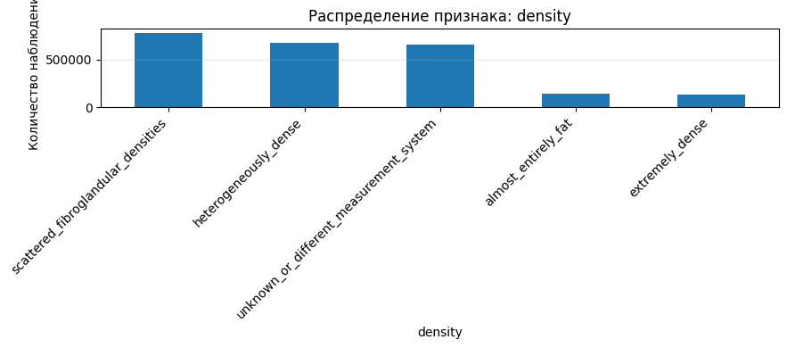
    


<div>
<style scoped>
    .dataframe tbody tr th:only-of-type {
        vertical-align: middle;
    }

    .dataframe tbody tr th {
        vertical-align: top;
    }

    .dataframe thead th {
        text-align: right;
    }
</style>
<table border="1" class="dataframe">
  <thead>
    <tr style="text-align: right;">
      <th></th>
      <th>Количество наблюдений</th>
      <th>Доля, %</th>
    </tr>
    <tr>
      <th>density</th>
      <th></th>
      <th></th>
    </tr>
  </thead>
  <tbody>
    <tr>
      <th>scattered_fibroglandular_densities</th>
      <td>782384</td>
      <td>32.69</td>
    </tr>
    <tr>
      <th>heterogeneously_dense</th>
      <td>674008</td>
      <td>28.17</td>
    </tr>
    <tr>
      <th>unknown_or_different_measurement_system</th>
      <td>652386</td>
      <td>27.26</td>
    </tr>
    <tr>
      <th>almost_entirely_fat</th>
      <td>148209</td>
      <td>6.19</td>
    </tr>
    <tr>
      <th>extremely_dense</th>
      <td>136011</td>
      <td>5.68</td>
    </tr>
  </tbody>
</table>
</div>


    
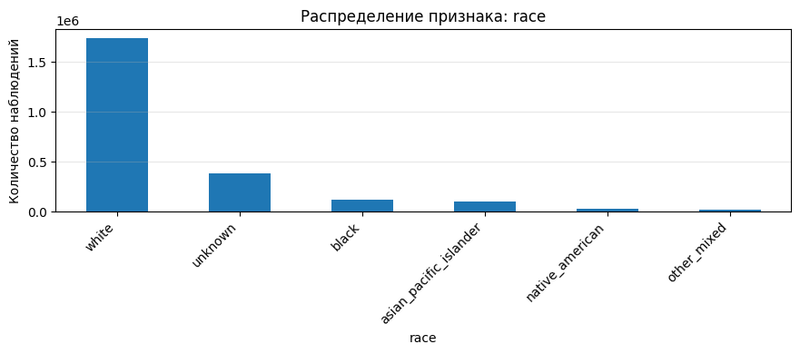
    


<div>
<style scoped>
    .dataframe tbody tr th:only-of-type {
        vertical-align: middle;
    }

    .dataframe tbody tr th {
        vertical-align: top;
    }

    .dataframe thead th {
        text-align: right;
    }
</style>
<table border="1" class="dataframe">
  <thead>
    <tr style="text-align: right;">
      <th></th>
      <th>Количество наблюдений</th>
      <th>Доля, %</th>
    </tr>
    <tr>
      <th>race</th>
      <th></th>
      <th></th>
    </tr>
  </thead>
  <tbody>
    <tr>
      <th>white</th>
      <td>1738015</td>
      <td>72.63</td>
    </tr>
    <tr>
      <th>unknown</th>
      <td>379804</td>
      <td>15.87</td>
    </tr>
    <tr>
      <th>black</th>
      <td>121534</td>
      <td>5.08</td>
    </tr>
    <tr>
      <th>asian_pacific_islander</th>
      <td>102998</td>
      <td>4.30</td>
    </tr>
    <tr>
      <th>native_american</th>
      <td>28359</td>
      <td>1.19</td>
    </tr>
    <tr>
      <th>other_mixed</th>
      <td>22288</td>
      <td>0.93</td>
    </tr>
  </tbody>
</table>
</div>


    
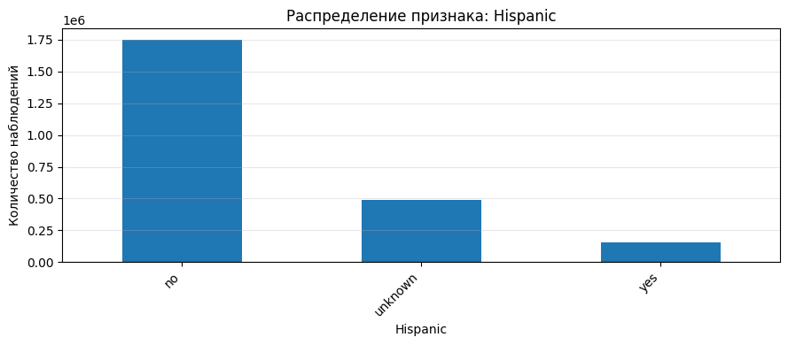
    


<div>
<style scoped>
    .dataframe tbody tr th:only-of-type {
        vertical-align: middle;
    }

    .dataframe tbody tr th {
        vertical-align: top;
    }

    .dataframe thead th {
        text-align: right;
    }
</style>
<table border="1" class="dataframe">
  <thead>
    <tr style="text-align: right;">
      <th></th>
      <th>Количество наблюдений</th>
      <th>Доля, %</th>
    </tr>
    <tr>
      <th>Hispanic</th>
      <th></th>
      <th></th>
    </tr>
  </thead>
  <tbody>
    <tr>
      <th>no</th>
      <td>1749604</td>
      <td>73.11</td>
    </tr>
    <tr>
      <th>unknown</th>
      <td>486054</td>
      <td>20.31</td>
    </tr>
    <tr>
      <th>yes</th>
      <td>157340</td>
      <td>6.58</td>
    </tr>
  </tbody>
</table>
</div>


    
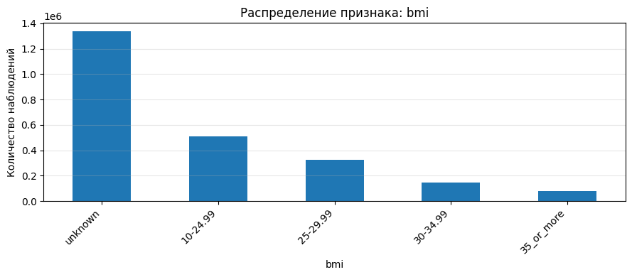
    


<div>
<style scoped>
    .dataframe tbody tr th:only-of-type {
        vertical-align: middle;
    }

    .dataframe tbody tr th {
        vertical-align: top;
    }

    .dataframe thead th {
        text-align: right;
    }
</style>
<table border="1" class="dataframe">
  <thead>
    <tr style="text-align: right;">
      <th></th>
      <th>Количество наблюдений</th>
      <th>Доля, %</th>
    </tr>
    <tr>
      <th>bmi</th>
      <th></th>
      <th></th>
    </tr>
  </thead>
  <tbody>
    <tr>
      <th>unknown</th>
      <td>1336105</td>
      <td>55.83</td>
    </tr>
    <tr>
      <th>10-24.99</th>
      <td>508897</td>
      <td>21.27</td>
    </tr>
    <tr>
      <th>25-29.99</th>
      <td>325352</td>
      <td>13.60</td>
    </tr>
    <tr>
      <th>30-34.99</th>
      <td>144823</td>
      <td>6.05</td>
    </tr>
    <tr>
      <th>35_or_more</th>
      <td>77821</td>
      <td>3.25</td>
    </tr>
  </tbody>
</table>
</div>


    
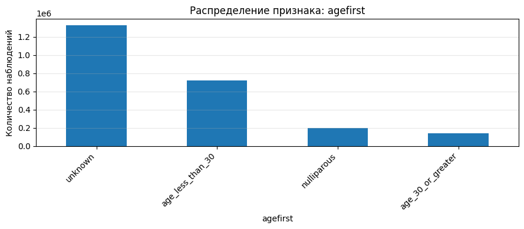
    


<div>
<style scoped>
    .dataframe tbody tr th:only-of-type {
        vertical-align: middle;
    }

    .dataframe tbody tr th {
        vertical-align: top;
    }

    .dataframe thead th {
        text-align: right;
    }
</style>
<table border="1" class="dataframe">
  <thead>
    <tr style="text-align: right;">
      <th></th>
      <th>Количество наблюдений</th>
      <th>Доля, %</th>
    </tr>
    <tr>
      <th>agefirst</th>
      <th></th>
      <th></th>
    </tr>
  </thead>
  <tbody>
    <tr>
      <th>unknown</th>
      <td>1328294</td>
      <td>55.51</td>
    </tr>
    <tr>
      <th>age_less_than_30</th>
      <td>722195</td>
      <td>30.18</td>
    </tr>
    <tr>
      <th>nulliparous</th>
      <td>201222</td>
      <td>8.41</td>
    </tr>
    <tr>
      <th>age_30_or_greater</th>
      <td>141287</td>
      <td>5.90</td>
    </tr>
  </tbody>
</table>
</div>


    
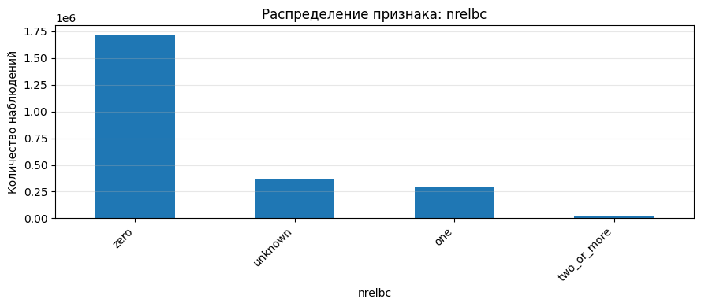
    


<div>
<style scoped>
    .dataframe tbody tr th:only-of-type {
        vertical-align: middle;
    }

    .dataframe tbody tr th {
        vertical-align: top;
    }

    .dataframe thead th {
        text-align: right;
    }
</style>
<table border="1" class="dataframe">
  <thead>
    <tr style="text-align: right;">
      <th></th>
      <th>Количество наблюдений</th>
      <th>Доля, %</th>
    </tr>
    <tr>
      <th>nrelbc</th>
      <th></th>
      <th></th>
    </tr>
  </thead>
  <tbody>
    <tr>
      <th>zero</th>
      <td>1718360</td>
      <td>71.81</td>
    </tr>
    <tr>
      <th>unknown</th>
      <td>363319</td>
      <td>15.18</td>
    </tr>
    <tr>
      <th>one</th>
      <td>295768</td>
      <td>12.36</td>
    </tr>
    <tr>
      <th>two_or_more</th>
      <td>15551</td>
      <td>0.65</td>
    </tr>
  </tbody>
</table>
</div>


    
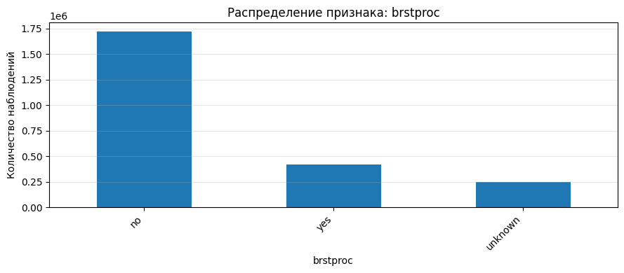
    


<div>
<style scoped>
    .dataframe tbody tr th:only-of-type {
        vertical-align: middle;
    }

    .dataframe tbody tr th {
        vertical-align: top;
    }

    .dataframe thead th {
        text-align: right;
    }
</style>
<table border="1" class="dataframe">
  <thead>
    <tr style="text-align: right;">
      <th></th>
      <th>Количество наблюдений</th>
      <th>Доля, %</th>
    </tr>
    <tr>
      <th>brstproc</th>
      <th></th>
      <th></th>
    </tr>
  </thead>
  <tbody>
    <tr>
      <th>no</th>
      <td>1722256</td>
      <td>71.97</td>
    </tr>
    <tr>
      <th>yes</th>
      <td>420430</td>
      <td>17.57</td>
    </tr>
    <tr>
      <th>unknown</th>
      <td>250312</td>
      <td>10.46</td>
    </tr>
  </tbody>
</table>
</div>


    
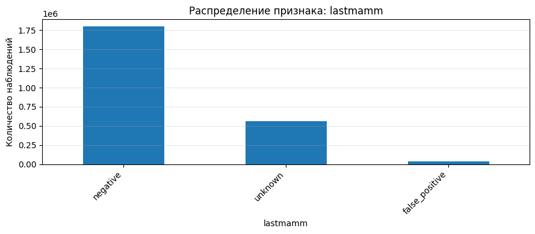
    


<div>
<style scoped>
    .dataframe tbody tr th:only-of-type {
        vertical-align: middle;
    }

    .dataframe tbody tr th {
        vertical-align: top;
    }

    .dataframe thead th {
        text-align: right;
    }
</style>
<table border="1" class="dataframe">
  <thead>
    <tr style="text-align: right;">
      <th></th>
      <th>Количество наблюдений</th>
      <th>Доля, %</th>
    </tr>
    <tr>
      <th>lastmamm</th>
      <th></th>
      <th></th>
    </tr>
  </thead>
  <tbody>
    <tr>
      <th>negative</th>
      <td>1799934</td>
      <td>75.22</td>
    </tr>
    <tr>
      <th>unknown</th>
      <td>559018</td>
      <td>23.36</td>
    </tr>
    <tr>
      <th>false_positive</th>
      <td>34046</td>
      <td>1.42</td>
    </tr>
  </tbody>
</table>
</div>


    
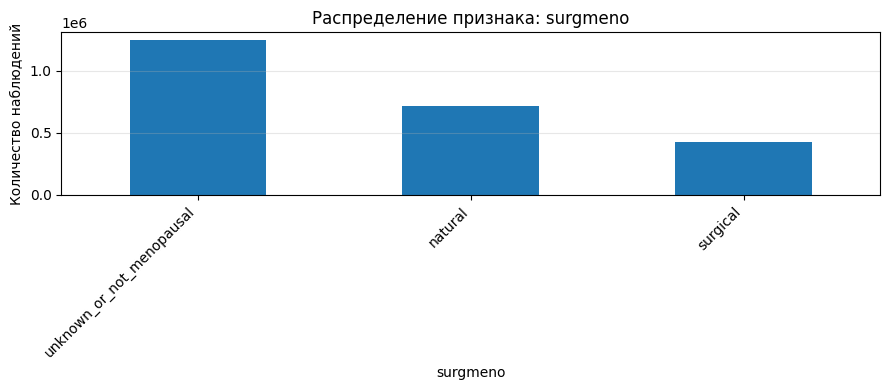
    


<div>
<style scoped>
    .dataframe tbody tr th:only-of-type {
        vertical-align: middle;
    }

    .dataframe tbody tr th {
        vertical-align: top;
    }

    .dataframe thead th {
        text-align: right;
    }
</style>
<table border="1" class="dataframe">
  <thead>
    <tr style="text-align: right;">
      <th></th>
      <th>Количество наблюдений</th>
      <th>Доля, %</th>
    </tr>
    <tr>
      <th>surgmeno</th>
      <th></th>
      <th></th>
    </tr>
  </thead>
  <tbody>
    <tr>
      <th>unknown_or_not_menopausal</th>
      <td>1247700</td>
      <td>52.14</td>
    </tr>
    <tr>
      <th>natural</th>
      <td>717966</td>
      <td>30.00</td>
    </tr>
    <tr>
      <th>surgical</th>
      <td>427332</td>
      <td>17.86</td>
    </tr>
  </tbody>
</table>
</div>


    
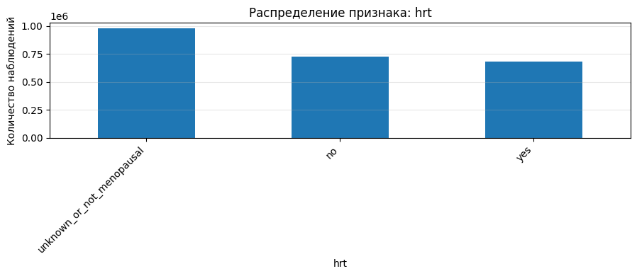
    


<div>
<style scoped>
    .dataframe tbody tr th:only-of-type {
        vertical-align: middle;
    }

    .dataframe tbody tr th {
        vertical-align: top;
    }

    .dataframe thead th {
        text-align: right;
    }
</style>
<table border="1" class="dataframe">
  <thead>
    <tr style="text-align: right;">
      <th></th>
      <th>Количество наблюдений</th>
      <th>Доля, %</th>
    </tr>
    <tr>
      <th>hrt</th>
      <th></th>
      <th></th>
    </tr>
  </thead>
  <tbody>
    <tr>
      <th>unknown_or_not_menopausal</th>
      <td>980452</td>
      <td>40.97</td>
    </tr>
    <tr>
      <th>no</th>
      <td>729196</td>
      <td>30.47</td>
    </tr>
    <tr>
      <th>yes</th>
      <td>683350</td>
      <td>28.56</td>
    </tr>
  </tbody>
</table>
</div>


```python
def cancer_rate_by_feature(data, column, target_col="cancer", weight_col="count", positive_class="yes"):
    table = pd.crosstab(
        data[column],
        data[target_col],
        values=data[weight_col],
        aggfunc="sum"
    ).fillna(0)

    if positive_class not in table.columns:
        table[positive_class] = 0

    table["total"] = table.sum(axis=1)
    table["cancer_rate"] = table[positive_class] / table["total"] * 100

    table = table.sort_values("cancer_rate", ascending=False)

    display(table.round(3))

    plt.figure(figsize=(9, 4))
    table["cancer_rate"].plot(kind="bar")
    plt.title(f"Доля случаев cancer = yes по признаку: {column}")
    plt.xlabel(column)
    plt.ylabel("Доля cancer = yes, %")
    plt.xticks(rotation=45, ha="right")
    plt.grid(axis="y", alpha=0.3)
    plt.tight_layout()
    plt.show()

    return table
```


```python
cancer_rate_tables = {}

for col in feature_cols:
    cancer_rate_tables[col] = cancer_rate_by_feature(
        df,
        column=col,
        target_col=target_col,
        weight_col=weight_col,
        positive_class="yes"
    )
```


<div>
<style scoped>
    .dataframe tbody tr th:only-of-type {
        vertical-align: middle;
    }

    .dataframe tbody tr th {
        vertical-align: top;
    }

    .dataframe thead th {
        text-align: right;
    }
</style>
<table border="1" class="dataframe">
  <thead>
    <tr style="text-align: right;">
      <th>cancer</th>
      <th>no</th>
      <th>yes</th>
      <th>total</th>
      <th>cancer_rate</th>
    </tr>
    <tr>
      <th>menopaus</th>
      <th></th>
      <th></th>
      <th></th>
      <th></th>
    </tr>
  </thead>
  <tbody>
    <tr>
      <th>postmenopausal_or_age_55_or_more</th>
      <td>1633524</td>
      <td>9300</td>
      <td>1642824</td>
      <td>0.566</td>
    </tr>
    <tr>
      <th>unknown</th>
      <td>181347</td>
      <td>612</td>
      <td>181959</td>
      <td>0.336</td>
    </tr>
    <tr>
      <th>premenopausal</th>
      <td>566489</td>
      <td>1726</td>
      <td>568215</td>
      <td>0.304</td>
    </tr>
  </tbody>
</table>
</div>


    
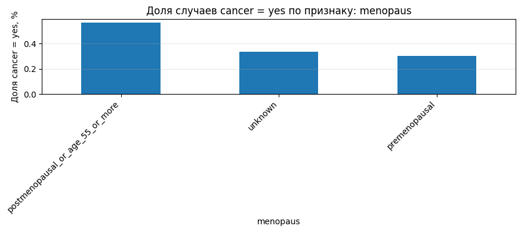
    


<div>
<style scoped>
    .dataframe tbody tr th:only-of-type {
        vertical-align: middle;
    }

    .dataframe tbody tr th {
        vertical-align: top;
    }

    .dataframe thead th {
        text-align: right;
    }
</style>
<table border="1" class="dataframe">
  <thead>
    <tr style="text-align: right;">
      <th>cancer</th>
      <th>no</th>
      <th>yes</th>
      <th>total</th>
      <th>cancer_rate</th>
    </tr>
    <tr>
      <th>agegrp</th>
      <th></th>
      <th></th>
      <th></th>
      <th></th>
    </tr>
  </thead>
  <tbody>
    <tr>
      <th>80-84</th>
      <td>69066</td>
      <td>570</td>
      <td>69636</td>
      <td>0.819</td>
    </tr>
    <tr>
      <th>75-79</th>
      <td>144013</td>
      <td>1089</td>
      <td>145102</td>
      <td>0.751</td>
    </tr>
    <tr>
      <th>70-74</th>
      <td>201686</td>
      <td>1420</td>
      <td>203106</td>
      <td>0.699</td>
    </tr>
    <tr>
      <th>65-69</th>
      <td>230437</td>
      <td>1467</td>
      <td>231904</td>
      <td>0.633</td>
    </tr>
    <tr>
      <th>60-64</th>
      <td>261945</td>
      <td>1576</td>
      <td>263521</td>
      <td>0.598</td>
    </tr>
    <tr>
      <th>55-59</th>
      <td>332337</td>
      <td>1795</td>
      <td>334132</td>
      <td>0.537</td>
    </tr>
    <tr>
      <th>50-54</th>
      <td>426608</td>
      <td>1704</td>
      <td>428312</td>
      <td>0.398</td>
    </tr>
    <tr>
      <th>45-49</th>
      <td>385965</td>
      <td>1281</td>
      <td>387246</td>
      <td>0.331</td>
    </tr>
    <tr>
      <th>40-44</th>
      <td>286633</td>
      <td>648</td>
      <td>287281</td>
      <td>0.226</td>
    </tr>
    <tr>
      <th>35-39</th>
      <td>42670</td>
      <td>88</td>
      <td>42758</td>
      <td>0.206</td>
    </tr>
  </tbody>
</table>
</div>


    
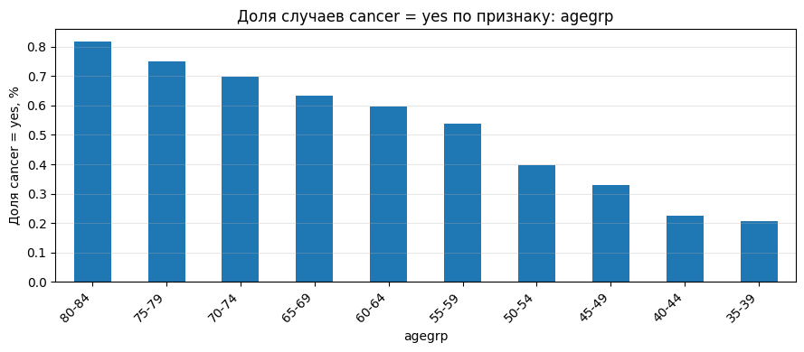
    


<div>
<style scoped>
    .dataframe tbody tr th:only-of-type {
        vertical-align: middle;
    }

    .dataframe tbody tr th {
        vertical-align: top;
    }

    .dataframe thead th {
        text-align: right;
    }
</style>
<table border="1" class="dataframe">
  <thead>
    <tr style="text-align: right;">
      <th>cancer</th>
      <th>no</th>
      <th>yes</th>
      <th>total</th>
      <th>cancer_rate</th>
    </tr>
    <tr>
      <th>density</th>
      <th></th>
      <th></th>
      <th></th>
      <th></th>
    </tr>
  </thead>
  <tbody>
    <tr>
      <th>heterogeneously_dense</th>
      <td>670282</td>
      <td>3726</td>
      <td>674008</td>
      <td>0.553</td>
    </tr>
    <tr>
      <th>unknown_or_different_measurement_system</th>
      <td>648880</td>
      <td>3506</td>
      <td>652386</td>
      <td>0.537</td>
    </tr>
    <tr>
      <th>extremely_dense</th>
      <td>135294</td>
      <td>717</td>
      <td>136011</td>
      <td>0.527</td>
    </tr>
    <tr>
      <th>scattered_fibroglandular_densities</th>
      <td>779023</td>
      <td>3361</td>
      <td>782384</td>
      <td>0.430</td>
    </tr>
    <tr>
      <th>almost_entirely_fat</th>
      <td>147881</td>
      <td>328</td>
      <td>148209</td>
      <td>0.221</td>
    </tr>
  </tbody>
</table>
</div>


    
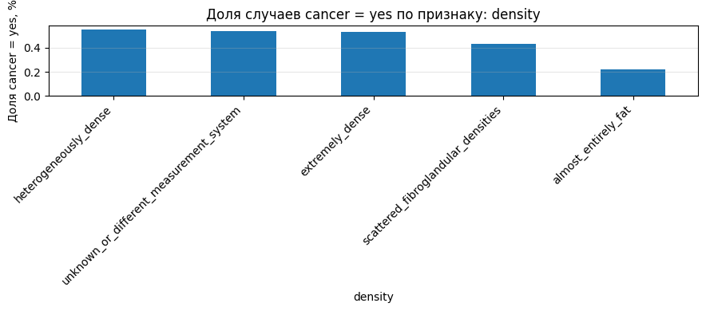
    


<div>
<style scoped>
    .dataframe tbody tr th:only-of-type {
        vertical-align: middle;
    }

    .dataframe tbody tr th {
        vertical-align: top;
    }

    .dataframe thead th {
        text-align: right;
    }
</style>
<table border="1" class="dataframe">
  <thead>
    <tr style="text-align: right;">
      <th>cancer</th>
      <th>no</th>
      <th>yes</th>
      <th>total</th>
      <th>cancer_rate</th>
    </tr>
    <tr>
      <th>race</th>
      <th></th>
      <th></th>
      <th></th>
      <th></th>
    </tr>
  </thead>
  <tbody>
    <tr>
      <th>white</th>
      <td>1729317</td>
      <td>8698</td>
      <td>1738015</td>
      <td>0.500</td>
    </tr>
    <tr>
      <th>black</th>
      <td>120958</td>
      <td>576</td>
      <td>121534</td>
      <td>0.474</td>
    </tr>
    <tr>
      <th>unknown</th>
      <td>378049</td>
      <td>1755</td>
      <td>379804</td>
      <td>0.462</td>
    </tr>
    <tr>
      <th>other_mixed</th>
      <td>22186</td>
      <td>102</td>
      <td>22288</td>
      <td>0.458</td>
    </tr>
    <tr>
      <th>asian_pacific_islander</th>
      <td>102573</td>
      <td>425</td>
      <td>102998</td>
      <td>0.413</td>
    </tr>
    <tr>
      <th>native_american</th>
      <td>28277</td>
      <td>82</td>
      <td>28359</td>
      <td>0.289</td>
    </tr>
  </tbody>
</table>
</div>


    
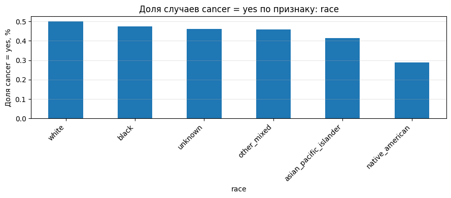
    


<div>
<style scoped>
    .dataframe tbody tr th:only-of-type {
        vertical-align: middle;
    }

    .dataframe tbody tr th {
        vertical-align: top;
    }

    .dataframe thead th {
        text-align: right;
    }
</style>
<table border="1" class="dataframe">
  <thead>
    <tr style="text-align: right;">
      <th>cancer</th>
      <th>no</th>
      <th>yes</th>
      <th>total</th>
      <th>cancer_rate</th>
    </tr>
    <tr>
      <th>Hispanic</th>
      <th></th>
      <th></th>
      <th></th>
      <th></th>
    </tr>
  </thead>
  <tbody>
    <tr>
      <th>no</th>
      <td>1740832</td>
      <td>8772</td>
      <td>1749604</td>
      <td>0.501</td>
    </tr>
    <tr>
      <th>unknown</th>
      <td>483772</td>
      <td>2282</td>
      <td>486054</td>
      <td>0.469</td>
    </tr>
    <tr>
      <th>yes</th>
      <td>156756</td>
      <td>584</td>
      <td>157340</td>
      <td>0.371</td>
    </tr>
  </tbody>
</table>
</div>


    
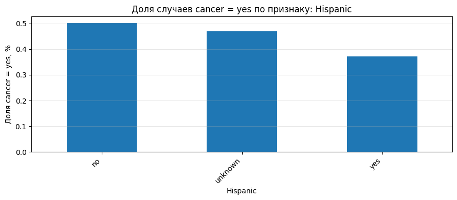
    


<div>
<style scoped>
    .dataframe tbody tr th:only-of-type {
        vertical-align: middle;
    }

    .dataframe tbody tr th {
        vertical-align: top;
    }

    .dataframe thead th {
        text-align: right;
    }
</style>
<table border="1" class="dataframe">
  <thead>
    <tr style="text-align: right;">
      <th>cancer</th>
      <th>no</th>
      <th>yes</th>
      <th>total</th>
      <th>cancer_rate</th>
    </tr>
    <tr>
      <th>bmi</th>
      <th></th>
      <th></th>
      <th></th>
      <th></th>
    </tr>
  </thead>
  <tbody>
    <tr>
      <th>25-29.99</th>
      <td>323649</td>
      <td>1703</td>
      <td>325352</td>
      <td>0.523</td>
    </tr>
    <tr>
      <th>30-34.99</th>
      <td>144069</td>
      <td>754</td>
      <td>144823</td>
      <td>0.521</td>
    </tr>
    <tr>
      <th>35_or_more</th>
      <td>77421</td>
      <td>400</td>
      <td>77821</td>
      <td>0.514</td>
    </tr>
    <tr>
      <th>10-24.99</th>
      <td>506423</td>
      <td>2474</td>
      <td>508897</td>
      <td>0.486</td>
    </tr>
    <tr>
      <th>unknown</th>
      <td>1329798</td>
      <td>6307</td>
      <td>1336105</td>
      <td>0.472</td>
    </tr>
  </tbody>
</table>
</div>


    
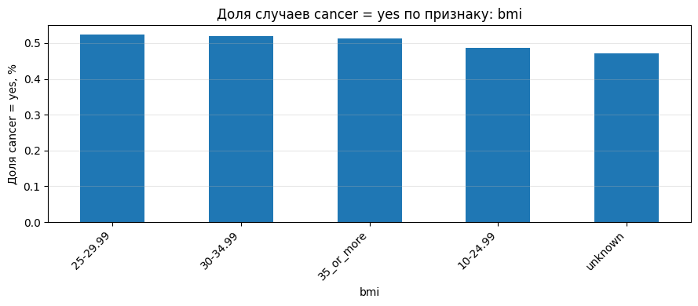
    


<div>
<style scoped>
    .dataframe tbody tr th:only-of-type {
        vertical-align: middle;
    }

    .dataframe tbody tr th {
        vertical-align: top;
    }

    .dataframe thead th {
        text-align: right;
    }
</style>
<table border="1" class="dataframe">
  <thead>
    <tr style="text-align: right;">
      <th>cancer</th>
      <th>no</th>
      <th>yes</th>
      <th>total</th>
      <th>cancer_rate</th>
    </tr>
    <tr>
      <th>agefirst</th>
      <th></th>
      <th></th>
      <th></th>
      <th></th>
    </tr>
  </thead>
  <tbody>
    <tr>
      <th>nulliparous</th>
      <td>200141</td>
      <td>1081</td>
      <td>201222</td>
      <td>0.537</td>
    </tr>
    <tr>
      <th>age_30_or_greater</th>
      <td>140563</td>
      <td>724</td>
      <td>141287</td>
      <td>0.512</td>
    </tr>
    <tr>
      <th>age_less_than_30</th>
      <td>718588</td>
      <td>3607</td>
      <td>722195</td>
      <td>0.499</td>
    </tr>
    <tr>
      <th>unknown</th>
      <td>1322068</td>
      <td>6226</td>
      <td>1328294</td>
      <td>0.469</td>
    </tr>
  </tbody>
</table>
</div>


    
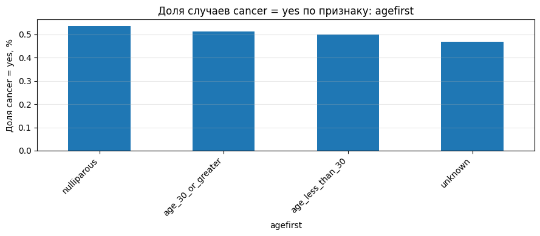
    


<div>
<style scoped>
    .dataframe tbody tr th:only-of-type {
        vertical-align: middle;
    }

    .dataframe tbody tr th {
        vertical-align: top;
    }

    .dataframe thead th {
        text-align: right;
    }
</style>
<table border="1" class="dataframe">
  <thead>
    <tr style="text-align: right;">
      <th>cancer</th>
      <th>no</th>
      <th>yes</th>
      <th>total</th>
      <th>cancer_rate</th>
    </tr>
    <tr>
      <th>nrelbc</th>
      <th></th>
      <th></th>
      <th></th>
      <th></th>
    </tr>
  </thead>
  <tbody>
    <tr>
      <th>two_or_more</th>
      <td>15408</td>
      <td>143</td>
      <td>15551</td>
      <td>0.920</td>
    </tr>
    <tr>
      <th>one</th>
      <td>293855</td>
      <td>1913</td>
      <td>295768</td>
      <td>0.647</td>
    </tr>
    <tr>
      <th>zero</th>
      <td>1710426</td>
      <td>7934</td>
      <td>1718360</td>
      <td>0.462</td>
    </tr>
    <tr>
      <th>unknown</th>
      <td>361671</td>
      <td>1648</td>
      <td>363319</td>
      <td>0.454</td>
    </tr>
  </tbody>
</table>
</div>


    
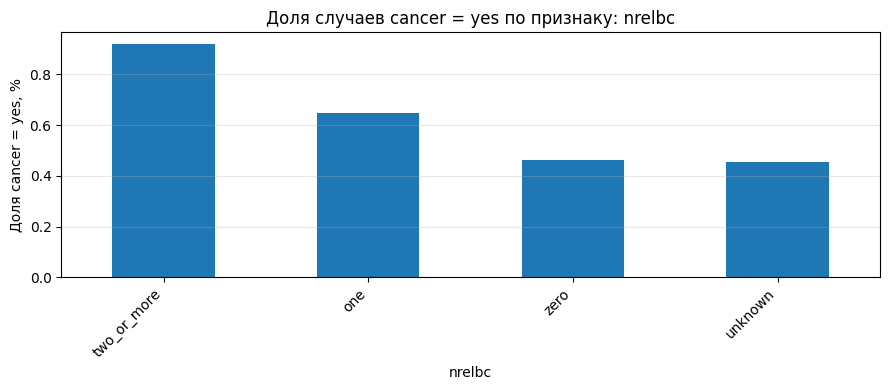
    


<div>
<style scoped>
    .dataframe tbody tr th:only-of-type {
        vertical-align: middle;
    }

    .dataframe tbody tr th {
        vertical-align: top;
    }

    .dataframe thead th {
        text-align: right;
    }
</style>
<table border="1" class="dataframe">
  <thead>
    <tr style="text-align: right;">
      <th>cancer</th>
      <th>no</th>
      <th>yes</th>
      <th>total</th>
      <th>cancer_rate</th>
    </tr>
    <tr>
      <th>brstproc</th>
      <th></th>
      <th></th>
      <th></th>
      <th></th>
    </tr>
  </thead>
  <tbody>
    <tr>
      <th>yes</th>
      <td>417631</td>
      <td>2799</td>
      <td>420430</td>
      <td>0.666</td>
    </tr>
    <tr>
      <th>unknown</th>
      <td>249087</td>
      <td>1225</td>
      <td>250312</td>
      <td>0.489</td>
    </tr>
    <tr>
      <th>no</th>
      <td>1714642</td>
      <td>7614</td>
      <td>1722256</td>
      <td>0.442</td>
    </tr>
  </tbody>
</table>
</div>


    
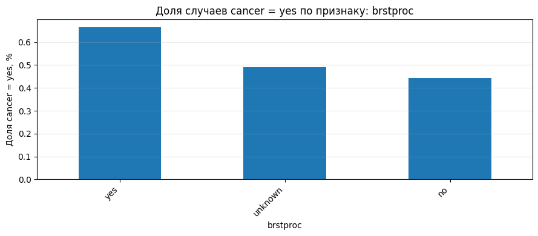
    


<div>
<style scoped>
    .dataframe tbody tr th:only-of-type {
        vertical-align: middle;
    }

    .dataframe tbody tr th {
        vertical-align: top;
    }

    .dataframe thead th {
        text-align: right;
    }
</style>
<table border="1" class="dataframe">
  <thead>
    <tr style="text-align: right;">
      <th>cancer</th>
      <th>no</th>
      <th>yes</th>
      <th>total</th>
      <th>cancer_rate</th>
    </tr>
    <tr>
      <th>lastmamm</th>
      <th></th>
      <th></th>
      <th></th>
      <th></th>
    </tr>
  </thead>
  <tbody>
    <tr>
      <th>false_positive</th>
      <td>33779</td>
      <td>267</td>
      <td>34046</td>
      <td>0.784</td>
    </tr>
    <tr>
      <th>unknown</th>
      <td>556213</td>
      <td>2805</td>
      <td>559018</td>
      <td>0.502</td>
    </tr>
    <tr>
      <th>negative</th>
      <td>1791368</td>
      <td>8566</td>
      <td>1799934</td>
      <td>0.476</td>
    </tr>
  </tbody>
</table>
</div>


    
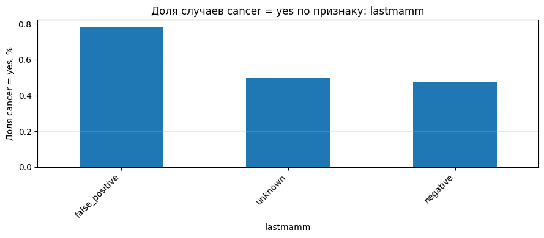
    


<div>
<style scoped>
    .dataframe tbody tr th:only-of-type {
        vertical-align: middle;
    }

    .dataframe tbody tr th {
        vertical-align: top;
    }

    .dataframe thead th {
        text-align: right;
    }
</style>
<table border="1" class="dataframe">
  <thead>
    <tr style="text-align: right;">
      <th>cancer</th>
      <th>no</th>
      <th>yes</th>
      <th>total</th>
      <th>cancer_rate</th>
    </tr>
    <tr>
      <th>surgmeno</th>
      <th></th>
      <th></th>
      <th></th>
      <th></th>
    </tr>
  </thead>
  <tbody>
    <tr>
      <th>natural</th>
      <td>713650</td>
      <td>4316</td>
      <td>717966</td>
      <td>0.601</td>
    </tr>
    <tr>
      <th>surgical</th>
      <td>425152</td>
      <td>2180</td>
      <td>427332</td>
      <td>0.510</td>
    </tr>
    <tr>
      <th>unknown_or_not_menopausal</th>
      <td>1242558</td>
      <td>5142</td>
      <td>1247700</td>
      <td>0.412</td>
    </tr>
  </tbody>
</table>
</div>


    
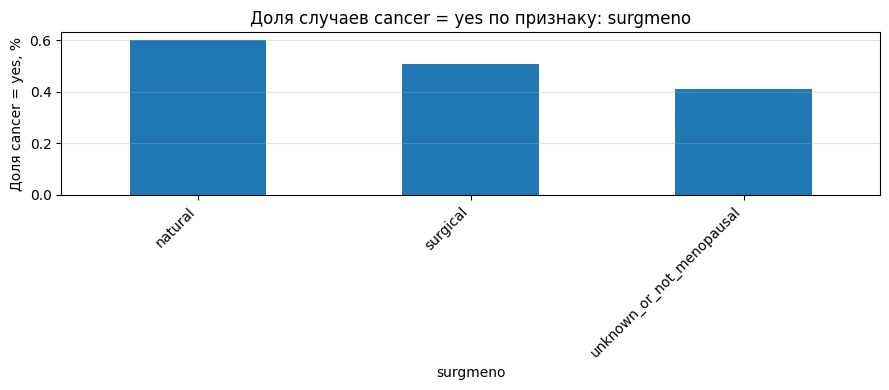
    


<div>
<style scoped>
    .dataframe tbody tr th:only-of-type {
        vertical-align: middle;
    }

    .dataframe tbody tr th {
        vertical-align: top;
    }

    .dataframe thead th {
        text-align: right;
    }
</style>
<table border="1" class="dataframe">
  <thead>
    <tr style="text-align: right;">
      <th>cancer</th>
      <th>no</th>
      <th>yes</th>
      <th>total</th>
      <th>cancer_rate</th>
    </tr>
    <tr>
      <th>hrt</th>
      <th></th>
      <th></th>
      <th></th>
      <th></th>
    </tr>
  </thead>
  <tbody>
    <tr>
      <th>yes</th>
      <td>679400</td>
      <td>3950</td>
      <td>683350</td>
      <td>0.578</td>
    </tr>
    <tr>
      <th>no</th>
      <td>725211</td>
      <td>3985</td>
      <td>729196</td>
      <td>0.546</td>
    </tr>
    <tr>
      <th>unknown_or_not_menopausal</th>
      <td>976749</td>
      <td>3703</td>
      <td>980452</td>
      <td>0.378</td>
    </tr>
  </tbody>
</table>
</div>


    
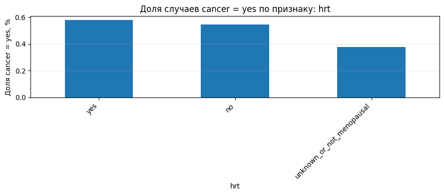
    


```python
def plot_feature_target_distribution(data, column, target_col="cancer", weight_col="count"):
    table = pd.crosstab(
        data[column],
        data[target_col],
        values=data[weight_col],
        aggfunc="sum"
    ).fillna(0)

    table_percent = table.div(table.sum(axis=1), axis=0) * 100

    table_percent.plot(kind="bar", stacked=True, figsize=(9, 4))
    plt.title(f"Структура классов cancer по признаку: {column}")
    plt.xlabel(column)
    plt.ylabel("Доля, %")
    plt.xticks(rotation=45, ha="right")
    plt.legend(title=target_col)
    plt.grid(axis="y", alpha=0.3)
    plt.tight_layout()
    plt.show()

    display(table)
    display(table_percent.round(2))
```


```python
for col in feature_cols:
    plot_feature_target_distribution(
        df,
        column=col,
        target_col=target_col,
        weight_col=weight_col
    )
```


    
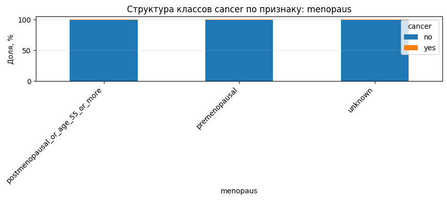
    


<div>
<style scoped>
    .dataframe tbody tr th:only-of-type {
        vertical-align: middle;
    }

    .dataframe tbody tr th {
        vertical-align: top;
    }

    .dataframe thead th {
        text-align: right;
    }
</style>
<table border="1" class="dataframe">
  <thead>
    <tr style="text-align: right;">
      <th>cancer</th>
      <th>no</th>
      <th>yes</th>
    </tr>
    <tr>
      <th>menopaus</th>
      <th></th>
      <th></th>
    </tr>
  </thead>
  <tbody>
    <tr>
      <th>postmenopausal_or_age_55_or_more</th>
      <td>1633524</td>
      <td>9300</td>
    </tr>
    <tr>
      <th>premenopausal</th>
      <td>566489</td>
      <td>1726</td>
    </tr>
    <tr>
      <th>unknown</th>
      <td>181347</td>
      <td>612</td>
    </tr>
  </tbody>
</table>
</div>


<div>
<style scoped>
    .dataframe tbody tr th:only-of-type {
        vertical-align: middle;
    }

    .dataframe tbody tr th {
        vertical-align: top;
    }

    .dataframe thead th {
        text-align: right;
    }
</style>
<table border="1" class="dataframe">
  <thead>
    <tr style="text-align: right;">
      <th>cancer</th>
      <th>no</th>
      <th>yes</th>
    </tr>
    <tr>
      <th>menopaus</th>
      <th></th>
      <th></th>
    </tr>
  </thead>
  <tbody>
    <tr>
      <th>postmenopausal_or_age_55_or_more</th>
      <td>99.43</td>
      <td>0.57</td>
    </tr>
    <tr>
      <th>premenopausal</th>
      <td>99.70</td>
      <td>0.30</td>
    </tr>
    <tr>
      <th>unknown</th>
      <td>99.66</td>
      <td>0.34</td>
    </tr>
  </tbody>
</table>
</div>


    
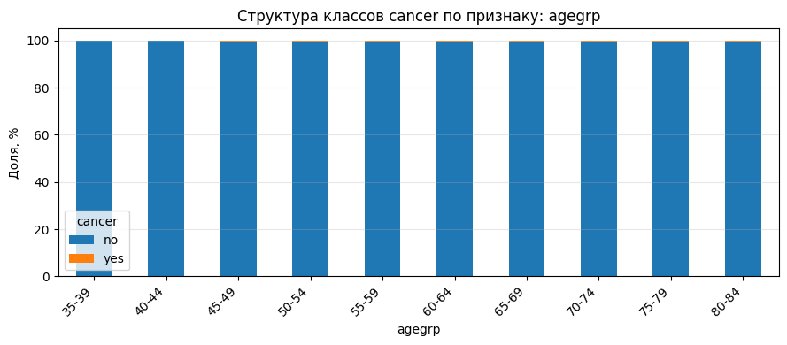
    


<div>
<style scoped>
    .dataframe tbody tr th:only-of-type {
        vertical-align: middle;
    }

    .dataframe tbody tr th {
        vertical-align: top;
    }

    .dataframe thead th {
        text-align: right;
    }
</style>
<table border="1" class="dataframe">
  <thead>
    <tr style="text-align: right;">
      <th>cancer</th>
      <th>no</th>
      <th>yes</th>
    </tr>
    <tr>
      <th>agegrp</th>
      <th></th>
      <th></th>
    </tr>
  </thead>
  <tbody>
    <tr>
      <th>35-39</th>
      <td>42670</td>
      <td>88</td>
    </tr>
    <tr>
      <th>40-44</th>
      <td>286633</td>
      <td>648</td>
    </tr>
    <tr>
      <th>45-49</th>
      <td>385965</td>
      <td>1281</td>
    </tr>
    <tr>
      <th>50-54</th>
      <td>426608</td>
      <td>1704</td>
    </tr>
    <tr>
      <th>55-59</th>
      <td>332337</td>
      <td>1795</td>
    </tr>
    <tr>
      <th>60-64</th>
      <td>261945</td>
      <td>1576</td>
    </tr>
    <tr>
      <th>65-69</th>
      <td>230437</td>
      <td>1467</td>
    </tr>
    <tr>
      <th>70-74</th>
      <td>201686</td>
      <td>1420</td>
    </tr>
    <tr>
      <th>75-79</th>
      <td>144013</td>
      <td>1089</td>
    </tr>
    <tr>
      <th>80-84</th>
      <td>69066</td>
      <td>570</td>
    </tr>
  </tbody>
</table>
</div>


<div>
<style scoped>
    .dataframe tbody tr th:only-of-type {
        vertical-align: middle;
    }

    .dataframe tbody tr th {
        vertical-align: top;
    }

    .dataframe thead th {
        text-align: right;
    }
</style>
<table border="1" class="dataframe">
  <thead>
    <tr style="text-align: right;">
      <th>cancer</th>
      <th>no</th>
      <th>yes</th>
    </tr>
    <tr>
      <th>agegrp</th>
      <th></th>
      <th></th>
    </tr>
  </thead>
  <tbody>
    <tr>
      <th>35-39</th>
      <td>99.79</td>
      <td>0.21</td>
    </tr>
    <tr>
      <th>40-44</th>
      <td>99.77</td>
      <td>0.23</td>
    </tr>
    <tr>
      <th>45-49</th>
      <td>99.67</td>
      <td>0.33</td>
    </tr>
    <tr>
      <th>50-54</th>
      <td>99.60</td>
      <td>0.40</td>
    </tr>
    <tr>
      <th>55-59</th>
      <td>99.46</td>
      <td>0.54</td>
    </tr>
    <tr>
      <th>60-64</th>
      <td>99.40</td>
      <td>0.60</td>
    </tr>
    <tr>
      <th>65-69</th>
      <td>99.37</td>
      <td>0.63</td>
    </tr>
    <tr>
      <th>70-74</th>
      <td>99.30</td>
      <td>0.70</td>
    </tr>
    <tr>
      <th>75-79</th>
      <td>99.25</td>
      <td>0.75</td>
    </tr>
    <tr>
      <th>80-84</th>
      <td>99.18</td>
      <td>0.82</td>
    </tr>
  </tbody>
</table>
</div>


    
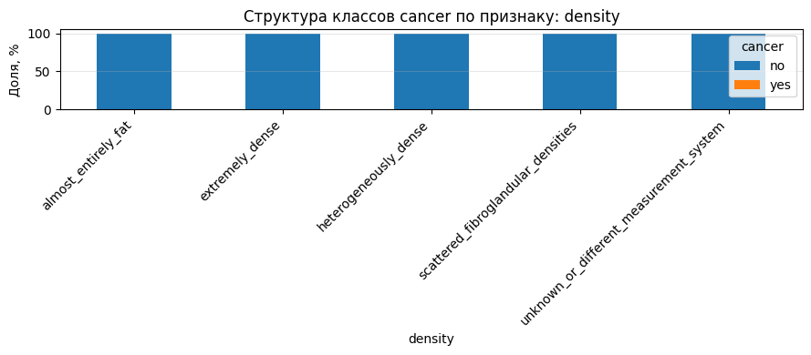
    


<div>
<style scoped>
    .dataframe tbody tr th:only-of-type {
        vertical-align: middle;
    }

    .dataframe tbody tr th {
        vertical-align: top;
    }

    .dataframe thead th {
        text-align: right;
    }
</style>
<table border="1" class="dataframe">
  <thead>
    <tr style="text-align: right;">
      <th>cancer</th>
      <th>no</th>
      <th>yes</th>
    </tr>
    <tr>
      <th>density</th>
      <th></th>
      <th></th>
    </tr>
  </thead>
  <tbody>
    <tr>
      <th>almost_entirely_fat</th>
      <td>147881</td>
      <td>328</td>
    </tr>
    <tr>
      <th>extremely_dense</th>
      <td>135294</td>
      <td>717</td>
    </tr>
    <tr>
      <th>heterogeneously_dense</th>
      <td>670282</td>
      <td>3726</td>
    </tr>
    <tr>
      <th>scattered_fibroglandular_densities</th>
      <td>779023</td>
      <td>3361</td>
    </tr>
    <tr>
      <th>unknown_or_different_measurement_system</th>
      <td>648880</td>
      <td>3506</td>
    </tr>
  </tbody>
</table>
</div>


<div>
<style scoped>
    .dataframe tbody tr th:only-of-type {
        vertical-align: middle;
    }

    .dataframe tbody tr th {
        vertical-align: top;
    }

    .dataframe thead th {
        text-align: right;
    }
</style>
<table border="1" class="dataframe">
  <thead>
    <tr style="text-align: right;">
      <th>cancer</th>
      <th>no</th>
      <th>yes</th>
    </tr>
    <tr>
      <th>density</th>
      <th></th>
      <th></th>
    </tr>
  </thead>
  <tbody>
    <tr>
      <th>almost_entirely_fat</th>
      <td>99.78</td>
      <td>0.22</td>
    </tr>
    <tr>
      <th>extremely_dense</th>
      <td>99.47</td>
      <td>0.53</td>
    </tr>
    <tr>
      <th>heterogeneously_dense</th>
      <td>99.45</td>
      <td>0.55</td>
    </tr>
    <tr>
      <th>scattered_fibroglandular_densities</th>
      <td>99.57</td>
      <td>0.43</td>
    </tr>
    <tr>
      <th>unknown_or_different_measurement_system</th>
      <td>99.46</td>
      <td>0.54</td>
    </tr>
  </tbody>
</table>
</div>


    
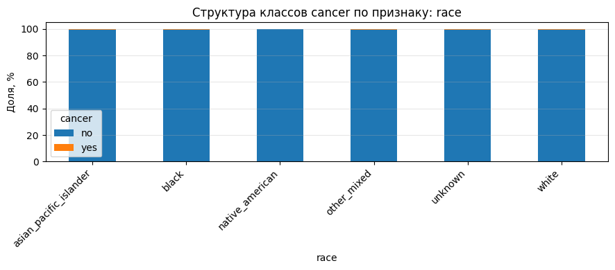
    


<div>
<style scoped>
    .dataframe tbody tr th:only-of-type {
        vertical-align: middle;
    }

    .dataframe tbody tr th {
        vertical-align: top;
    }

    .dataframe thead th {
        text-align: right;
    }
</style>
<table border="1" class="dataframe">
  <thead>
    <tr style="text-align: right;">
      <th>cancer</th>
      <th>no</th>
      <th>yes</th>
    </tr>
    <tr>
      <th>race</th>
      <th></th>
      <th></th>
    </tr>
  </thead>
  <tbody>
    <tr>
      <th>asian_pacific_islander</th>
      <td>102573</td>
      <td>425</td>
    </tr>
    <tr>
      <th>black</th>
      <td>120958</td>
      <td>576</td>
    </tr>
    <tr>
      <th>native_american</th>
      <td>28277</td>
      <td>82</td>
    </tr>
    <tr>
      <th>other_mixed</th>
      <td>22186</td>
      <td>102</td>
    </tr>
    <tr>
      <th>unknown</th>
      <td>378049</td>
      <td>1755</td>
    </tr>
    <tr>
      <th>white</th>
      <td>1729317</td>
      <td>8698</td>
    </tr>
  </tbody>
</table>
</div>


<div>
<style scoped>
    .dataframe tbody tr th:only-of-type {
        vertical-align: middle;
    }

    .dataframe tbody tr th {
        vertical-align: top;
    }

    .dataframe thead th {
        text-align: right;
    }
</style>
<table border="1" class="dataframe">
  <thead>
    <tr style="text-align: right;">
      <th>cancer</th>
      <th>no</th>
      <th>yes</th>
    </tr>
    <tr>
      <th>race</th>
      <th></th>
      <th></th>
    </tr>
  </thead>
  <tbody>
    <tr>
      <th>asian_pacific_islander</th>
      <td>99.59</td>
      <td>0.41</td>
    </tr>
    <tr>
      <th>black</th>
      <td>99.53</td>
      <td>0.47</td>
    </tr>
    <tr>
      <th>native_american</th>
      <td>99.71</td>
      <td>0.29</td>
    </tr>
    <tr>
      <th>other_mixed</th>
      <td>99.54</td>
      <td>0.46</td>
    </tr>
    <tr>
      <th>unknown</th>
      <td>99.54</td>
      <td>0.46</td>
    </tr>
    <tr>
      <th>white</th>
      <td>99.50</td>
      <td>0.50</td>
    </tr>
  </tbody>
</table>
</div>


    

    


<div>
<style scoped>
    .dataframe tbody tr th:only-of-type {
        vertical-align: middle;
    }

    .dataframe tbody tr th {
        vertical-align: top;
    }

    .dataframe thead th {
        text-align: right;
    }
</style>
<table border="1" class="dataframe">
  <thead>
    <tr style="text-align: right;">
      <th>cancer</th>
      <th>no</th>
      <th>yes</th>
    </tr>
    <tr>
      <th>Hispanic</th>
      <th></th>
      <th></th>
    </tr>
  </thead>
  <tbody>
    <tr>
      <th>no</th>
      <td>1740832</td>
      <td>8772</td>
    </tr>
    <tr>
      <th>unknown</th>
      <td>483772</td>
      <td>2282</td>
    </tr>
    <tr>
      <th>yes</th>
      <td>156756</td>
      <td>584</td>
    </tr>
  </tbody>
</table>
</div>


<div>
<style scoped>
    .dataframe tbody tr th:only-of-type {
        vertical-align: middle;
    }

    .dataframe tbody tr th {
        vertical-align: top;
    }

    .dataframe thead th {
        text-align: right;
    }
</style>
<table border="1" class="dataframe">
  <thead>
    <tr style="text-align: right;">
      <th>cancer</th>
      <th>no</th>
      <th>yes</th>
    </tr>
    <tr>
      <th>Hispanic</th>
      <th></th>
      <th></th>
    </tr>
  </thead>
  <tbody>
    <tr>
      <th>no</th>
      <td>99.50</td>
      <td>0.50</td>
    </tr>
    <tr>
      <th>unknown</th>
      <td>99.53</td>
      <td>0.47</td>
    </tr>
    <tr>
      <th>yes</th>
      <td>99.63</td>
      <td>0.37</td>
    </tr>
  </tbody>
</table>
</div>


    
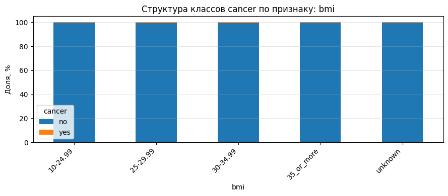
    


<div>
<style scoped>
    .dataframe tbody tr th:only-of-type {
        vertical-align: middle;
    }

    .dataframe tbody tr th {
        vertical-align: top;
    }

    .dataframe thead th {
        text-align: right;
    }
</style>
<table border="1" class="dataframe">
  <thead>
    <tr style="text-align: right;">
      <th>cancer</th>
      <th>no</th>
      <th>yes</th>
    </tr>
    <tr>
      <th>bmi</th>
      <th></th>
      <th></th>
    </tr>
  </thead>
  <tbody>
    <tr>
      <th>10-24.99</th>
      <td>506423</td>
      <td>2474</td>
    </tr>
    <tr>
      <th>25-29.99</th>
      <td>323649</td>
      <td>1703</td>
    </tr>
    <tr>
      <th>30-34.99</th>
      <td>144069</td>
      <td>754</td>
    </tr>
    <tr>
      <th>35_or_more</th>
      <td>77421</td>
      <td>400</td>
    </tr>
    <tr>
      <th>unknown</th>
      <td>1329798</td>
      <td>6307</td>
    </tr>
  </tbody>
</table>
</div>


<div>
<style scoped>
    .dataframe tbody tr th:only-of-type {
        vertical-align: middle;
    }

    .dataframe tbody tr th {
        vertical-align: top;
    }

    .dataframe thead th {
        text-align: right;
    }
</style>
<table border="1" class="dataframe">
  <thead>
    <tr style="text-align: right;">
      <th>cancer</th>
      <th>no</th>
      <th>yes</th>
    </tr>
    <tr>
      <th>bmi</th>
      <th></th>
      <th></th>
    </tr>
  </thead>
  <tbody>
    <tr>
      <th>10-24.99</th>
      <td>99.51</td>
      <td>0.49</td>
    </tr>
    <tr>
      <th>25-29.99</th>
      <td>99.48</td>
      <td>0.52</td>
    </tr>
    <tr>
      <th>30-34.99</th>
      <td>99.48</td>
      <td>0.52</td>
    </tr>
    <tr>
      <th>35_or_more</th>
      <td>99.49</td>
      <td>0.51</td>
    </tr>
    <tr>
      <th>unknown</th>
      <td>99.53</td>
      <td>0.47</td>
    </tr>
  </tbody>
</table>
</div>


    
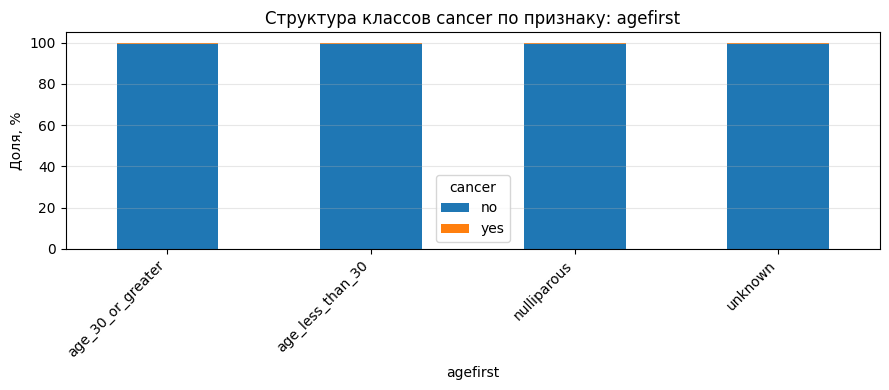
    


<div>
<style scoped>
    .dataframe tbody tr th:only-of-type {
        vertical-align: middle;
    }

    .dataframe tbody tr th {
        vertical-align: top;
    }

    .dataframe thead th {
        text-align: right;
    }
</style>
<table border="1" class="dataframe">
  <thead>
    <tr style="text-align: right;">
      <th>cancer</th>
      <th>no</th>
      <th>yes</th>
    </tr>
    <tr>
      <th>agefirst</th>
      <th></th>
      <th></th>
    </tr>
  </thead>
  <tbody>
    <tr>
      <th>age_30_or_greater</th>
      <td>140563</td>
      <td>724</td>
    </tr>
    <tr>
      <th>age_less_than_30</th>
      <td>718588</td>
      <td>3607</td>
    </tr>
    <tr>
      <th>nulliparous</th>
      <td>200141</td>
      <td>1081</td>
    </tr>
    <tr>
      <th>unknown</th>
      <td>1322068</td>
      <td>6226</td>
    </tr>
  </tbody>
</table>
</div>


<div>
<style scoped>
    .dataframe tbody tr th:only-of-type {
        vertical-align: middle;
    }

    .dataframe tbody tr th {
        vertical-align: top;
    }

    .dataframe thead th {
        text-align: right;
    }
</style>
<table border="1" class="dataframe">
  <thead>
    <tr style="text-align: right;">
      <th>cancer</th>
      <th>no</th>
      <th>yes</th>
    </tr>
    <tr>
      <th>agefirst</th>
      <th></th>
      <th></th>
    </tr>
  </thead>
  <tbody>
    <tr>
      <th>age_30_or_greater</th>
      <td>99.49</td>
      <td>0.51</td>
    </tr>
    <tr>
      <th>age_less_than_30</th>
      <td>99.50</td>
      <td>0.50</td>
    </tr>
    <tr>
      <th>nulliparous</th>
      <td>99.46</td>
      <td>0.54</td>
    </tr>
    <tr>
      <th>unknown</th>
      <td>99.53</td>
      <td>0.47</td>
    </tr>
  </tbody>
</table>
</div>


    
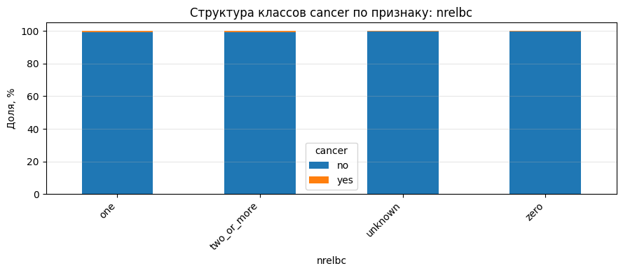
    


<div>
<style scoped>
    .dataframe tbody tr th:only-of-type {
        vertical-align: middle;
    }

    .dataframe tbody tr th {
        vertical-align: top;
    }

    .dataframe thead th {
        text-align: right;
    }
</style>
<table border="1" class="dataframe">
  <thead>
    <tr style="text-align: right;">
      <th>cancer</th>
      <th>no</th>
      <th>yes</th>
    </tr>
    <tr>
      <th>nrelbc</th>
      <th></th>
      <th></th>
    </tr>
  </thead>
  <tbody>
    <tr>
      <th>one</th>
      <td>293855</td>
      <td>1913</td>
    </tr>
    <tr>
      <th>two_or_more</th>
      <td>15408</td>
      <td>143</td>
    </tr>
    <tr>
      <th>unknown</th>
      <td>361671</td>
      <td>1648</td>
    </tr>
    <tr>
      <th>zero</th>
      <td>1710426</td>
      <td>7934</td>
    </tr>
  </tbody>
</table>
</div>


<div>
<style scoped>
    .dataframe tbody tr th:only-of-type {
        vertical-align: middle;
    }

    .dataframe tbody tr th {
        vertical-align: top;
    }

    .dataframe thead th {
        text-align: right;
    }
</style>
<table border="1" class="dataframe">
  <thead>
    <tr style="text-align: right;">
      <th>cancer</th>
      <th>no</th>
      <th>yes</th>
    </tr>
    <tr>
      <th>nrelbc</th>
      <th></th>
      <th></th>
    </tr>
  </thead>
  <tbody>
    <tr>
      <th>one</th>
      <td>99.35</td>
      <td>0.65</td>
    </tr>
    <tr>
      <th>two_or_more</th>
      <td>99.08</td>
      <td>0.92</td>
    </tr>
    <tr>
      <th>unknown</th>
      <td>99.55</td>
      <td>0.45</td>
    </tr>
    <tr>
      <th>zero</th>
      <td>99.54</td>
      <td>0.46</td>
    </tr>
  </tbody>
</table>
</div>


    
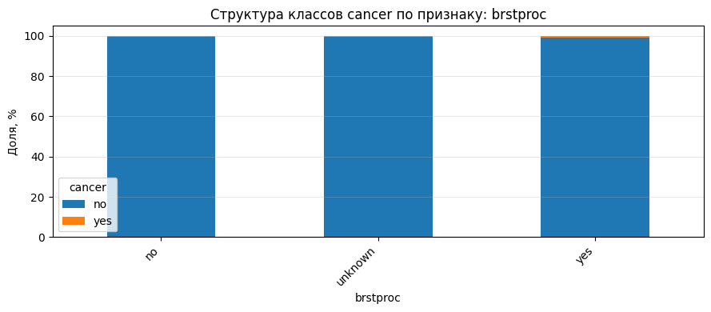
    


<div>
<style scoped>
    .dataframe tbody tr th:only-of-type {
        vertical-align: middle;
    }

    .dataframe tbody tr th {
        vertical-align: top;
    }

    .dataframe thead th {
        text-align: right;
    }
</style>
<table border="1" class="dataframe">
  <thead>
    <tr style="text-align: right;">
      <th>cancer</th>
      <th>no</th>
      <th>yes</th>
    </tr>
    <tr>
      <th>brstproc</th>
      <th></th>
      <th></th>
    </tr>
  </thead>
  <tbody>
    <tr>
      <th>no</th>
      <td>1714642</td>
      <td>7614</td>
    </tr>
    <tr>
      <th>unknown</th>
      <td>249087</td>
      <td>1225</td>
    </tr>
    <tr>
      <th>yes</th>
      <td>417631</td>
      <td>2799</td>
    </tr>
  </tbody>
</table>
</div>


<div>
<style scoped>
    .dataframe tbody tr th:only-of-type {
        vertical-align: middle;
    }

    .dataframe tbody tr th {
        vertical-align: top;
    }

    .dataframe thead th {
        text-align: right;
    }
</style>
<table border="1" class="dataframe">
  <thead>
    <tr style="text-align: right;">
      <th>cancer</th>
      <th>no</th>
      <th>yes</th>
    </tr>
    <tr>
      <th>brstproc</th>
      <th></th>
      <th></th>
    </tr>
  </thead>
  <tbody>
    <tr>
      <th>no</th>
      <td>99.56</td>
      <td>0.44</td>
    </tr>
    <tr>
      <th>unknown</th>
      <td>99.51</td>
      <td>0.49</td>
    </tr>
    <tr>
      <th>yes</th>
      <td>99.33</td>
      <td>0.67</td>
    </tr>
  </tbody>
</table>
</div>


    
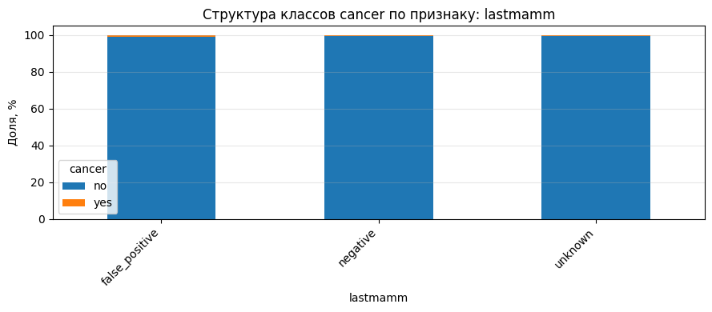
    


<div>
<style scoped>
    .dataframe tbody tr th:only-of-type {
        vertical-align: middle;
    }

    .dataframe tbody tr th {
        vertical-align: top;
    }

    .dataframe thead th {
        text-align: right;
    }
</style>
<table border="1" class="dataframe">
  <thead>
    <tr style="text-align: right;">
      <th>cancer</th>
      <th>no</th>
      <th>yes</th>
    </tr>
    <tr>
      <th>lastmamm</th>
      <th></th>
      <th></th>
    </tr>
  </thead>
  <tbody>
    <tr>
      <th>false_positive</th>
      <td>33779</td>
      <td>267</td>
    </tr>
    <tr>
      <th>negative</th>
      <td>1791368</td>
      <td>8566</td>
    </tr>
    <tr>
      <th>unknown</th>
      <td>556213</td>
      <td>2805</td>
    </tr>
  </tbody>
</table>
</div>


<div>
<style scoped>
    .dataframe tbody tr th:only-of-type {
        vertical-align: middle;
    }

    .dataframe tbody tr th {
        vertical-align: top;
    }

    .dataframe thead th {
        text-align: right;
    }
</style>
<table border="1" class="dataframe">
  <thead>
    <tr style="text-align: right;">
      <th>cancer</th>
      <th>no</th>
      <th>yes</th>
    </tr>
    <tr>
      <th>lastmamm</th>
      <th></th>
      <th></th>
    </tr>
  </thead>
  <tbody>
    <tr>
      <th>false_positive</th>
      <td>99.22</td>
      <td>0.78</td>
    </tr>
    <tr>
      <th>negative</th>
      <td>99.52</td>
      <td>0.48</td>
    </tr>
    <tr>
      <th>unknown</th>
      <td>99.50</td>
      <td>0.50</td>
    </tr>
  </tbody>
</table>
</div>


    
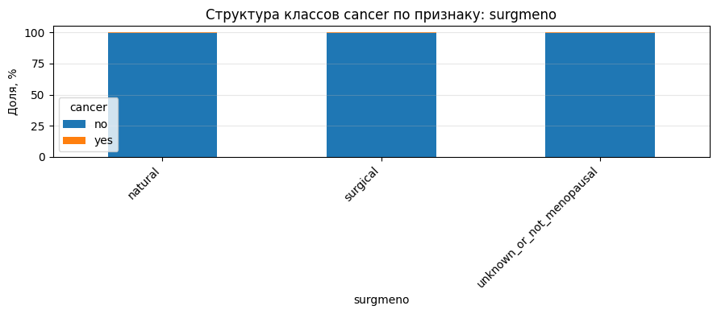
    


<div>
<style scoped>
    .dataframe tbody tr th:only-of-type {
        vertical-align: middle;
    }

    .dataframe tbody tr th {
        vertical-align: top;
    }

    .dataframe thead th {
        text-align: right;
    }
</style>
<table border="1" class="dataframe">
  <thead>
    <tr style="text-align: right;">
      <th>cancer</th>
      <th>no</th>
      <th>yes</th>
    </tr>
    <tr>
      <th>surgmeno</th>
      <th></th>
      <th></th>
    </tr>
  </thead>
  <tbody>
    <tr>
      <th>natural</th>
      <td>713650</td>
      <td>4316</td>
    </tr>
    <tr>
      <th>surgical</th>
      <td>425152</td>
      <td>2180</td>
    </tr>
    <tr>
      <th>unknown_or_not_menopausal</th>
      <td>1242558</td>
      <td>5142</td>
    </tr>
  </tbody>
</table>
</div>


<div>
<style scoped>
    .dataframe tbody tr th:only-of-type {
        vertical-align: middle;
    }

    .dataframe tbody tr th {
        vertical-align: top;
    }

    .dataframe thead th {
        text-align: right;
    }
</style>
<table border="1" class="dataframe">
  <thead>
    <tr style="text-align: right;">
      <th>cancer</th>
      <th>no</th>
      <th>yes</th>
    </tr>
    <tr>
      <th>surgmeno</th>
      <th></th>
      <th></th>
    </tr>
  </thead>
  <tbody>
    <tr>
      <th>natural</th>
      <td>99.40</td>
      <td>0.60</td>
    </tr>
    <tr>
      <th>surgical</th>
      <td>99.49</td>
      <td>0.51</td>
    </tr>
    <tr>
      <th>unknown_or_not_menopausal</th>
      <td>99.59</td>
      <td>0.41</td>
    </tr>
  </tbody>
</table>
</div>


    
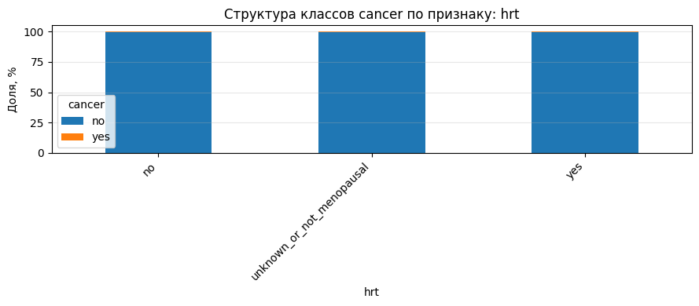
    


<div>
<style scoped>
    .dataframe tbody tr th:only-of-type {
        vertical-align: middle;
    }

    .dataframe tbody tr th {
        vertical-align: top;
    }

    .dataframe thead th {
        text-align: right;
    }
</style>
<table border="1" class="dataframe">
  <thead>
    <tr style="text-align: right;">
      <th>cancer</th>
      <th>no</th>
      <th>yes</th>
    </tr>
    <tr>
      <th>hrt</th>
      <th></th>
      <th></th>
    </tr>
  </thead>
  <tbody>
    <tr>
      <th>no</th>
      <td>725211</td>
      <td>3985</td>
    </tr>
    <tr>
      <th>unknown_or_not_menopausal</th>
      <td>976749</td>
      <td>3703</td>
    </tr>
    <tr>
      <th>yes</th>
      <td>679400</td>
      <td>3950</td>
    </tr>
  </tbody>
</table>
</div>


<div>
<style scoped>
    .dataframe tbody tr th:only-of-type {
        vertical-align: middle;
    }

    .dataframe tbody tr th {
        vertical-align: top;
    }

    .dataframe thead th {
        text-align: right;
    }
</style>
<table border="1" class="dataframe">
  <thead>
    <tr style="text-align: right;">
      <th>cancer</th>
      <th>no</th>
      <th>yes</th>
    </tr>
    <tr>
      <th>hrt</th>
      <th></th>
      <th></th>
    </tr>
  </thead>
  <tbody>
    <tr>
      <th>no</th>
      <td>99.45</td>
      <td>0.55</td>
    </tr>
    <tr>
      <th>unknown_or_not_menopausal</th>
      <td>99.62</td>
      <td>0.38</td>
    </tr>
    <tr>
      <th>yes</th>
      <td>99.42</td>
      <td>0.58</td>
    </tr>
  </tbody>
</table>
</div>


```python
invasive_table = pd.crosstab(
    df["invasive"],
    df[target_col],
    values=df[weight_col],
    aggfunc="sum"
).fillna(0)

invasive_percent = invasive_table.div(invasive_table.sum(axis=1), axis=0) * 100

display(invasive_table)
display(invasive_percent.round(2))
```


<div>
<style scoped>
    .dataframe tbody tr th:only-of-type {
        vertical-align: middle;
    }

    .dataframe tbody tr th {
        vertical-align: top;
    }

    .dataframe thead th {
        text-align: right;
    }
</style>
<table border="1" class="dataframe">
  <thead>
    <tr style="text-align: right;">
      <th>cancer</th>
      <th>no</th>
      <th>yes</th>
    </tr>
    <tr>
      <th>invasive</th>
      <th></th>
      <th></th>
    </tr>
  </thead>
  <tbody>
    <tr>
      <th>no</th>
      <td>2381360.0</td>
      <td>2303.0</td>
    </tr>
    <tr>
      <th>yes</th>
      <td>0.0</td>
      <td>9335.0</td>
    </tr>
  </tbody>
</table>
</div>


<div>
<style scoped>
    .dataframe tbody tr th:only-of-type {
        vertical-align: middle;
    }

    .dataframe tbody tr th {
        vertical-align: top;
    }

    .dataframe thead th {
        text-align: right;
    }
</style>
<table border="1" class="dataframe">
  <thead>
    <tr style="text-align: right;">
      <th>cancer</th>
      <th>no</th>
      <th>yes</th>
    </tr>
    <tr>
      <th>invasive</th>
      <th></th>
      <th></th>
    </tr>
  </thead>
  <tbody>
    <tr>
      <th>no</th>
      <td>99.9</td>
      <td>0.1</td>
    </tr>
    <tr>
      <th>yes</th>
      <td>0.0</td>
      <td>100.0</td>
    </tr>
  </tbody>
</table>
</div>


```python
invasive_percent.plot(kind="bar", stacked=True, figsize=(7, 4))
plt.title("Связь признака invasive с целевой переменной cancer")
plt.xlabel("invasive")
plt.ylabel("Доля, %")
plt.xticks(rotation=0)
plt.legend(title="cancer")
plt.grid(axis="y", alpha=0.3)
plt.show()
```


    
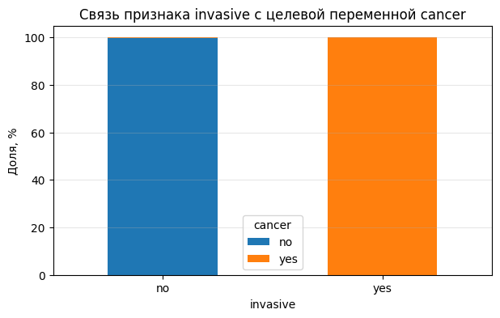
    


```python
summary_rows = []

for col in feature_cols:
    table = pd.crosstab(
        df[col],
        df[target_col],
        values=df[weight_col],
        aggfunc="sum"
    ).fillna(0)

    if "yes" not in table.columns:
        table["yes"] = 0

    table["total"] = table.sum(axis=1)
    table["cancer_rate_percent"] = table["yes"] / table["total"] * 100

    for category, row in table.iterrows():
        summary_rows.append({
            "feature": col,
            "category": category,
            "total": row["total"],
            "cancer_yes": row["yes"],
            "cancer_rate_percent": row["cancer_rate_percent"]
        })

cancer_rate_summary = pd.DataFrame(summary_rows)

cancer_rate_summary = cancer_rate_summary.sort_values(
    by="cancer_rate_percent",
    ascending=False
)

display(cancer_rate_summary.head(30))
```


<div>
<style scoped>
    .dataframe tbody tr th:only-of-type {
        vertical-align: middle;
    }

    .dataframe tbody tr th {
        vertical-align: top;
    }

    .dataframe thead th {
        text-align: right;
    }
</style>
<table border="1" class="dataframe">
  <thead>
    <tr style="text-align: right;">
      <th></th>
      <th>feature</th>
      <th>category</th>
      <th>total</th>
      <th>cancer_yes</th>
      <th>cancer_rate_percent</th>
    </tr>
  </thead>
  <tbody>
    <tr>
      <th>37</th>
      <td>nrelbc</td>
      <td>two_or_more</td>
      <td>15551.0</td>
      <td>143.0</td>
      <td>0.919555</td>
    </tr>
    <tr>
      <th>12</th>
      <td>agegrp</td>
      <td>80-84</td>
      <td>69636.0</td>
      <td>570.0</td>
      <td>0.818542</td>
    </tr>
    <tr>
      <th>43</th>
      <td>lastmamm</td>
      <td>false_positive</td>
      <td>34046.0</td>
      <td>267.0</td>
      <td>0.784233</td>
    </tr>
    <tr>
      <th>11</th>
      <td>agegrp</td>
      <td>75-79</td>
      <td>145102.0</td>
      <td>1089.0</td>
      <td>0.750507</td>
    </tr>
    <tr>
      <th>10</th>
      <td>agegrp</td>
      <td>70-74</td>
      <td>203106.0</td>
      <td>1420.0</td>
      <td>0.699142</td>
    </tr>
    <tr>
      <th>42</th>
      <td>brstproc</td>
      <td>yes</td>
      <td>420430.0</td>
      <td>2799.0</td>
      <td>0.665747</td>
    </tr>
    <tr>
      <th>36</th>
      <td>nrelbc</td>
      <td>one</td>
      <td>295768.0</td>
      <td>1913.0</td>
      <td>0.646791</td>
    </tr>
    <tr>
      <th>9</th>
      <td>agegrp</td>
      <td>65-69</td>
      <td>231904.0</td>
      <td>1467.0</td>
      <td>0.632589</td>
    </tr>
    <tr>
      <th>46</th>
      <td>surgmeno</td>
      <td>natural</td>
      <td>717966.0</td>
      <td>4316.0</td>
      <td>0.601143</td>
    </tr>
    <tr>
      <th>8</th>
      <td>agegrp</td>
      <td>60-64</td>
      <td>263521.0</td>
      <td>1576.0</td>
      <td>0.598055</td>
    </tr>
    <tr>
      <th>51</th>
      <td>hrt</td>
      <td>yes</td>
      <td>683350.0</td>
      <td>3950.0</td>
      <td>0.578035</td>
    </tr>
    <tr>
      <th>0</th>
      <td>menopaus</td>
      <td>postmenopausal_or_age_55_or_more</td>
      <td>1642824.0</td>
      <td>9300.0</td>
      <td>0.566098</td>
    </tr>
    <tr>
      <th>15</th>
      <td>density</td>
      <td>heterogeneously_dense</td>
      <td>674008.0</td>
      <td>3726.0</td>
      <td>0.552812</td>
    </tr>
    <tr>
      <th>49</th>
      <td>hrt</td>
      <td>no</td>
      <td>729196.0</td>
      <td>3985.0</td>
      <td>0.546492</td>
    </tr>
    <tr>
      <th>17</th>
      <td>density</td>
      <td>unknown_or_different_measurement_system</td>
      <td>652386.0</td>
      <td>3506.0</td>
      <td>0.537412</td>
    </tr>
    <tr>
      <th>34</th>
      <td>agefirst</td>
      <td>nulliparous</td>
      <td>201222.0</td>
      <td>1081.0</td>
      <td>0.537218</td>
    </tr>
    <tr>
      <th>7</th>
      <td>agegrp</td>
      <td>55-59</td>
      <td>334132.0</td>
      <td>1795.0</td>
      <td>0.537213</td>
    </tr>
    <tr>
      <th>14</th>
      <td>density</td>
      <td>extremely_dense</td>
      <td>136011.0</td>
      <td>717.0</td>
      <td>0.527163</td>
    </tr>
    <tr>
      <th>28</th>
      <td>bmi</td>
      <td>25-29.99</td>
      <td>325352.0</td>
      <td>1703.0</td>
      <td>0.523433</td>
    </tr>
    <tr>
      <th>29</th>
      <td>bmi</td>
      <td>30-34.99</td>
      <td>144823.0</td>
      <td>754.0</td>
      <td>0.520636</td>
    </tr>
    <tr>
      <th>30</th>
      <td>bmi</td>
      <td>35_or_more</td>
      <td>77821.0</td>
      <td>400.0</td>
      <td>0.514000</td>
    </tr>
    <tr>
      <th>32</th>
      <td>agefirst</td>
      <td>age_30_or_greater</td>
      <td>141287.0</td>
      <td>724.0</td>
      <td>0.512432</td>
    </tr>
    <tr>
      <th>47</th>
      <td>surgmeno</td>
      <td>surgical</td>
      <td>427332.0</td>
      <td>2180.0</td>
      <td>0.510142</td>
    </tr>
    <tr>
      <th>45</th>
      <td>lastmamm</td>
      <td>unknown</td>
      <td>559018.0</td>
      <td>2805.0</td>
      <td>0.501773</td>
    </tr>
    <tr>
      <th>24</th>
      <td>Hispanic</td>
      <td>no</td>
      <td>1749604.0</td>
      <td>8772.0</td>
      <td>0.501371</td>
    </tr>
    <tr>
      <th>23</th>
      <td>race</td>
      <td>white</td>
      <td>1738015.0</td>
      <td>8698.0</td>
      <td>0.500456</td>
    </tr>
    <tr>
      <th>33</th>
      <td>agefirst</td>
      <td>age_less_than_30</td>
      <td>722195.0</td>
      <td>3607.0</td>
      <td>0.499450</td>
    </tr>
    <tr>
      <th>41</th>
      <td>brstproc</td>
      <td>unknown</td>
      <td>250312.0</td>
      <td>1225.0</td>
      <td>0.489389</td>
    </tr>
    <tr>
      <th>27</th>
      <td>bmi</td>
      <td>10-24.99</td>
      <td>508897.0</td>
      <td>2474.0</td>
      <td>0.486149</td>
    </tr>
    <tr>
      <th>44</th>
      <td>lastmamm</td>
      <td>negative</td>
      <td>1799934.0</td>
      <td>8566.0</td>
      <td>0.475906</td>
    </tr>
  </tbody>
</table>
</div>


```python
top_categories = cancer_rate_summary[
    cancer_rate_summary["total"] >= 100
].head(20)

plt.figure(figsize=(10, 6))
plt.barh(
    top_categories["feature"] + ": " + top_categories["category"],
    top_categories["cancer_rate_percent"]
)
plt.title("Категории с наибольшей долей cancer = yes")
plt.xlabel("Доля cancer = yes, %")
plt.ylabel("Категория")
plt.gca().invert_yaxis()
plt.grid(axis="x", alpha=0.3)
plt.tight_layout()
plt.show()
```


    
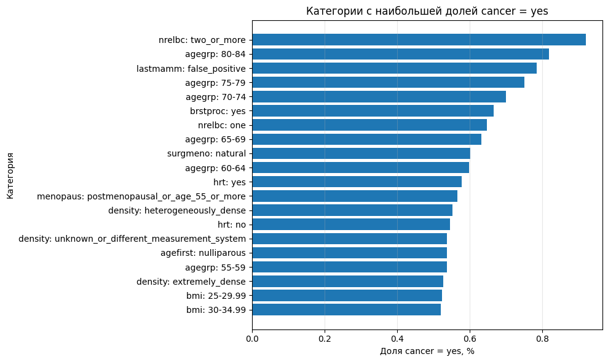
    


```python
from scipy.stats import chi2_contingency

def cramers_v_weighted(data, feature, target, weight_col):
    table = pd.crosstab(
        data[feature],
        data[target],
        values=data[weight_col],
        aggfunc="sum"
    ).fillna(0)

    chi2 = chi2_contingency(table)[0]
    n = table.values.sum()

    r, k = table.shape

    if n == 0:
        return np.nan

    return np.sqrt(chi2 / (n * min(k - 1, r - 1)))
```


```python
cramers_results = []

for col in feature_cols:
    value = cramers_v_weighted(df, col, target_col, weight_col)
    cramers_results.append({
        "feature": col,
        "cramers_v": value
    })

cramers_df = pd.DataFrame(cramers_results).sort_values(
    by="cramers_v",
    ascending=False
)

display(cramers_df)
```


<div>
<style scoped>
    .dataframe tbody tr th:only-of-type {
        vertical-align: middle;
    }

    .dataframe tbody tr th {
        vertical-align: top;
    }

    .dataframe thead th {
        text-align: right;
    }
</style>
<table border="1" class="dataframe">
  <thead>
    <tr style="text-align: right;">
      <th></th>
      <th>feature</th>
      <th>cramers_v</th>
    </tr>
  </thead>
  <tbody>
    <tr>
      <th>1</th>
      <td>agegrp</td>
      <td>0.024890</td>
    </tr>
    <tr>
      <th>0</th>
      <td>menopaus</td>
      <td>0.017004</td>
    </tr>
    <tr>
      <th>11</th>
      <td>hrt</td>
      <td>0.013128</td>
    </tr>
    <tr>
      <th>2</th>
      <td>density</td>
      <td>0.012410</td>
    </tr>
    <tr>
      <th>8</th>
      <td>brstproc</td>
      <td>0.012082</td>
    </tr>
    <tr>
      <th>10</th>
      <td>surgmeno</td>
      <td>0.011964</td>
    </tr>
    <tr>
      <th>7</th>
      <td>nrelbc</td>
      <td>0.010164</td>
    </tr>
    <tr>
      <th>9</th>
      <td>lastmamm</td>
      <td>0.005379</td>
    </tr>
    <tr>
      <th>4</th>
      <td>Hispanic</td>
      <td>0.004756</td>
    </tr>
    <tr>
      <th>3</th>
      <td>race</td>
      <td>0.004426</td>
    </tr>
    <tr>
      <th>6</th>
      <td>agefirst</td>
      <td>0.003156</td>
    </tr>
    <tr>
      <th>5</th>
      <td>bmi</td>
      <td>0.002865</td>
    </tr>
  </tbody>
</table>
</div>


```python
plt.figure(figsize=(8, 5))
plt.barh(cramers_df["feature"], cramers_df["cramers_v"])
plt.title("Связь признаков с целевой переменной cancer по Cramer's V")
plt.xlabel("Cramer's V")
plt.ylabel("Признак")
plt.gca().invert_yaxis()
plt.grid(axis="x", alpha=0.3)
plt.tight_layout()
plt.show()
```


    
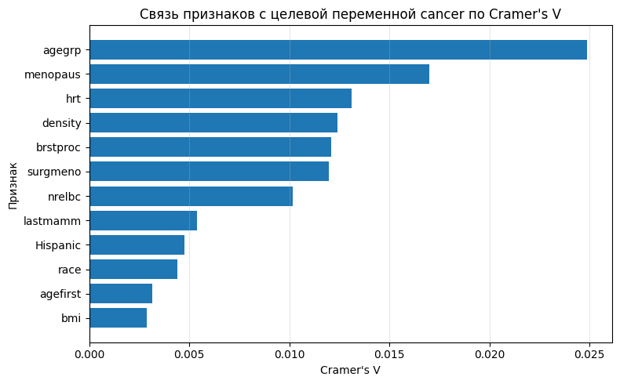
    


```python
print("Количество строк в исходном наборе:", len(df))
print("Суммарное количество наблюдений с учетом count:", df[weight_col].sum())
print("Количество признаков для будущего обучения:", len(feature_cols))
print("Признаки:")
print(feature_cols)
```

    Количество строк в исходном наборе: 280660
    Суммарное количество наблюдений с учетом count: 2392998
    Количество признаков для будущего обучения: 12
    Признаки:
    ['menopaus', 'agegrp', 'density', 'race', 'Hispanic', 'bmi', 'agefirst', 'nrelbc', 'brstproc', 'lastmamm', 'surgmeno', 'hrt']
    


```python
final_check = pd.DataFrame({
    "column": df.columns,
    "dtype": df.dtypes.astype(str),
    "missing": df.isna().sum().values,
    "unique_values": df.nunique().values
})

display(final_check)
```


<div>
<style scoped>
    .dataframe tbody tr th:only-of-type {
        vertical-align: middle;
    }

    .dataframe tbody tr th {
        vertical-align: top;
    }

    .dataframe thead th {
        text-align: right;
    }
</style>
<table border="1" class="dataframe">
  <thead>
    <tr style="text-align: right;">
      <th></th>
      <th>column</th>
      <th>dtype</th>
      <th>missing</th>
      <th>unique_values</th>
    </tr>
  </thead>
  <tbody>
    <tr>
      <th>menopaus</th>
      <td>menopaus</td>
      <td>object</td>
      <td>0</td>
      <td>3</td>
    </tr>
    <tr>
      <th>agegrp</th>
      <td>agegrp</td>
      <td>object</td>
      <td>0</td>
      <td>10</td>
    </tr>
    <tr>
      <th>density</th>
      <td>density</td>
      <td>object</td>
      <td>0</td>
      <td>5</td>
    </tr>
    <tr>
      <th>race</th>
      <td>race</td>
      <td>object</td>
      <td>0</td>
      <td>6</td>
    </tr>
    <tr>
      <th>Hispanic</th>
      <td>Hispanic</td>
      <td>object</td>
      <td>0</td>
      <td>3</td>
    </tr>
    <tr>
      <th>bmi</th>
      <td>bmi</td>
      <td>object</td>
      <td>0</td>
      <td>5</td>
    </tr>
    <tr>
      <th>agefirst</th>
      <td>agefirst</td>
      <td>object</td>
      <td>0</td>
      <td>4</td>
    </tr>
    <tr>
      <th>nrelbc</th>
      <td>nrelbc</td>
      <td>object</td>
      <td>0</td>
      <td>4</td>
    </tr>
    <tr>
      <th>brstproc</th>
      <td>brstproc</td>
      <td>object</td>
      <td>0</td>
      <td>3</td>
    </tr>
    <tr>
      <th>lastmamm</th>
      <td>lastmamm</td>
      <td>object</td>
      <td>0</td>
      <td>3</td>
    </tr>
    <tr>
      <th>surgmeno</th>
      <td>surgmeno</td>
      <td>object</td>
      <td>0</td>
      <td>3</td>
    </tr>
    <tr>
      <th>hrt</th>
      <td>hrt</td>
      <td>object</td>
      <td>0</td>
      <td>3</td>
    </tr>
    <tr>
      <th>invasive</th>
      <td>invasive</td>
      <td>object</td>
      <td>0</td>
      <td>2</td>
    </tr>
    <tr>
      <th>cancer</th>
      <td>cancer</td>
      <td>object</td>
      <td>0</td>
      <td>2</td>
    </tr>
    <tr>
      <th>training</th>
      <td>training</td>
      <td>object</td>
      <td>0</td>
      <td>2</td>
    </tr>
    <tr>
      <th>count</th>
      <td>count</td>
      <td>int64</td>
      <td>0</td>
      <td>822</td>
    </tr>
  </tbody>
</table>
</div>


```python
import pandas as pd
import numpy as np
import matplotlib.pyplot as plt
import seaborn as sns
from scipy.stats import chi2_contingency

df = pd.read_csv("risk_decoded.csv")

target_col = "cancer"
positive_class = "yes"
weight_col = "count"

feature_cols = [
    "menopaus",
    "agegrp",
    "density",
    "race",
    "Hispanic",
    "bmi",
    "agefirst",
    "nrelbc",
    "brstproc",
    "lastmamm",
    "surgmeno",
    "hrt"
]

sns.set_theme(style="whitegrid")
plt.rcParams["figure.figsize"] = (10, 5)
```


```python
def weighted_cancer_rate(data, group_cols):
    table = data.groupby(group_cols + [target_col])[weight_col].sum().reset_index()

    pivot = table.pivot_table(
        index=group_cols,
        columns=target_col,
        values=weight_col,
        aggfunc="sum",
        fill_value=0
    ).reset_index()

    if positive_class not in pivot.columns:
        pivot[positive_class] = 0

    class_cols = [col for col in pivot.columns if col not in group_cols]

    pivot["total"] = pivot[class_cols].sum(axis=1)
    pivot["cancer_yes"] = pivot[positive_class]
    pivot["cancer_rate"] = pivot["cancer_yes"] / pivot["total"] * 100

    return pivot
```


```python
age_density = weighted_cancer_rate(df, ["agegrp", "density"])

heatmap_data = age_density.pivot(
    index="agegrp",
    columns="density",
    values="cancer_rate"
)

plt.figure(figsize=(12, 6))
sns.heatmap(
    heatmap_data,
    annot=True,
    fmt=".2f",
    cmap="Reds",
    linewidths=0.5
)

plt.title("Доля случаев cancer = yes по возрасту и плотности ткани, %")
plt.xlabel("Плотность ткани")
plt.ylabel("Возрастная группа")
plt.xticks(rotation=35, ha="right")
plt.tight_layout()
plt.show()
```


    
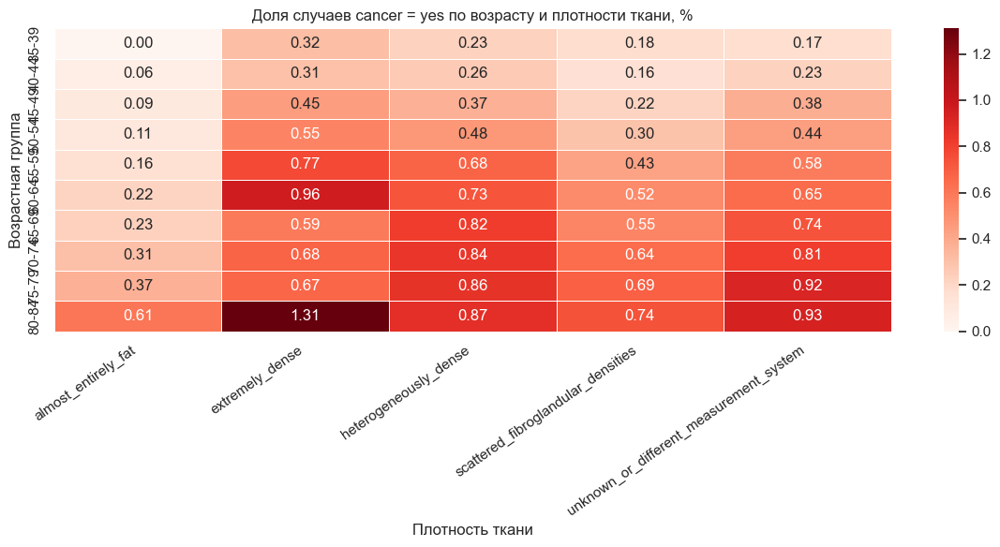
    


```python
age_bmi = weighted_cancer_rate(df, ["agegrp", "bmi"])

heatmap_data = age_bmi.pivot(
    index="agegrp",
    columns="bmi",
    values="cancer_rate"
)

plt.figure(figsize=(11, 6))
sns.heatmap(
    heatmap_data,
    annot=True,
    fmt=".2f",
    cmap="Oranges",
    linewidths=0.5
)

plt.title("Доля случаев cancer = yes по возрасту и BMI, %")
plt.xlabel("BMI")
plt.ylabel("Возрастная группа")
plt.xticks(rotation=30, ha="right")
plt.tight_layout()
plt.show()
```


    
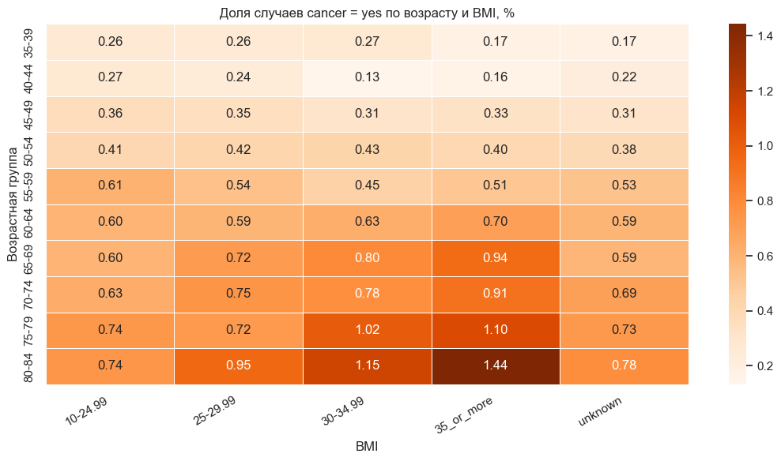
    


```python
bubble_data = weighted_cancer_rate(df, ["agegrp", "density"])

plt.figure(figsize=(13, 6))

scatter = sns.scatterplot(
    data=bubble_data,
    x="agegrp",
    y="density",
    size="total",
    hue="cancer_rate",
    sizes=(50, 1200),
    palette="Reds",
    alpha=0.75
)

plt.title("Возраст, плотность ткани и доля cancer = yes")
plt.xlabel("Возрастная группа")
plt.ylabel("Плотность ткани")
plt.xticks(rotation=45)
plt.legend(
    bbox_to_anchor=(1.05, 1),
    loc="upper left",
    title="Показатели"
)
plt.tight_layout()
plt.show()
```


    
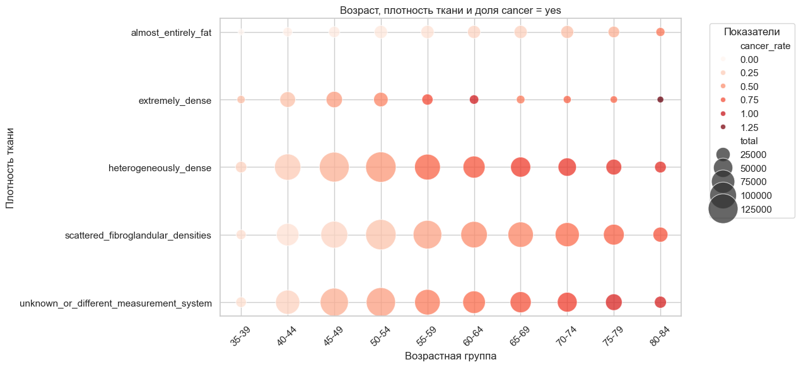
    


```python
overall_rate = (
    df.loc[df[target_col] == positive_class, weight_col].sum()
    / df[weight_col].sum()
)

risk_rows = []

for feature in feature_cols:
    temp = weighted_cancer_rate(df, [feature])

    for _, row in temp.iterrows():
        risk_rows.append({
            "feature": feature,
            "category": row[feature],
            "total": row["total"],
            "cancer_rate": row["cancer_rate"],
            "relative_risk": (row["cancer_rate"] / 100) / overall_rate
        })

risk_df = pd.DataFrame(risk_rows)

risk_df = risk_df[risk_df["total"] >= 500]
risk_df = risk_df.sort_values("relative_risk", ascending=False)

display(risk_df.head(30))
```


<div>
<style scoped>
    .dataframe tbody tr th:only-of-type {
        vertical-align: middle;
    }

    .dataframe tbody tr th {
        vertical-align: top;
    }

    .dataframe thead th {
        text-align: right;
    }
</style>
<table border="1" class="dataframe">
  <thead>
    <tr style="text-align: right;">
      <th></th>
      <th>feature</th>
      <th>category</th>
      <th>total</th>
      <th>cancer_rate</th>
      <th>relative_risk</th>
    </tr>
  </thead>
  <tbody>
    <tr>
      <th>37</th>
      <td>nrelbc</td>
      <td>two_or_more</td>
      <td>15551</td>
      <td>0.919555</td>
      <td>1.890783</td>
    </tr>
    <tr>
      <th>12</th>
      <td>agegrp</td>
      <td>80-84</td>
      <td>69636</td>
      <td>0.818542</td>
      <td>1.683081</td>
    </tr>
    <tr>
      <th>43</th>
      <td>lastmamm</td>
      <td>false_positive</td>
      <td>34046</td>
      <td>0.784233</td>
      <td>1.612535</td>
    </tr>
    <tr>
      <th>11</th>
      <td>agegrp</td>
      <td>75-79</td>
      <td>145102</td>
      <td>0.750507</td>
      <td>1.543187</td>
    </tr>
    <tr>
      <th>10</th>
      <td>agegrp</td>
      <td>70-74</td>
      <td>203106</td>
      <td>0.699142</td>
      <td>1.437572</td>
    </tr>
    <tr>
      <th>42</th>
      <td>brstproc</td>
      <td>yes</td>
      <td>420430</td>
      <td>0.665747</td>
      <td>1.368905</td>
    </tr>
    <tr>
      <th>36</th>
      <td>nrelbc</td>
      <td>one</td>
      <td>295768</td>
      <td>0.646791</td>
      <td>1.329927</td>
    </tr>
    <tr>
      <th>9</th>
      <td>agegrp</td>
      <td>65-69</td>
      <td>231904</td>
      <td>0.632589</td>
      <td>1.300726</td>
    </tr>
    <tr>
      <th>46</th>
      <td>surgmeno</td>
      <td>natural</td>
      <td>717966</td>
      <td>0.601143</td>
      <td>1.236066</td>
    </tr>
    <tr>
      <th>8</th>
      <td>agegrp</td>
      <td>60-64</td>
      <td>263521</td>
      <td>0.598055</td>
      <td>1.229716</td>
    </tr>
    <tr>
      <th>51</th>
      <td>hrt</td>
      <td>yes</td>
      <td>683350</td>
      <td>0.578035</td>
      <td>1.188551</td>
    </tr>
    <tr>
      <th>0</th>
      <td>menopaus</td>
      <td>postmenopausal_or_age_55_or_more</td>
      <td>1642824</td>
      <td>0.566098</td>
      <td>1.164008</td>
    </tr>
    <tr>
      <th>15</th>
      <td>density</td>
      <td>heterogeneously_dense</td>
      <td>674008</td>
      <td>0.552812</td>
      <td>1.136689</td>
    </tr>
    <tr>
      <th>49</th>
      <td>hrt</td>
      <td>no</td>
      <td>729196</td>
      <td>0.546492</td>
      <td>1.123694</td>
    </tr>
    <tr>
      <th>17</th>
      <td>density</td>
      <td>unknown_or_different_measurement_system</td>
      <td>652386</td>
      <td>0.537412</td>
      <td>1.105023</td>
    </tr>
    <tr>
      <th>34</th>
      <td>agefirst</td>
      <td>nulliparous</td>
      <td>201222</td>
      <td>0.537218</td>
      <td>1.104623</td>
    </tr>
    <tr>
      <th>7</th>
      <td>agegrp</td>
      <td>55-59</td>
      <td>334132</td>
      <td>0.537213</td>
      <td>1.104614</td>
    </tr>
    <tr>
      <th>14</th>
      <td>density</td>
      <td>extremely_dense</td>
      <td>136011</td>
      <td>0.527163</td>
      <td>1.083950</td>
    </tr>
    <tr>
      <th>28</th>
      <td>bmi</td>
      <td>25-29.99</td>
      <td>325352</td>
      <td>0.523433</td>
      <td>1.076280</td>
    </tr>
    <tr>
      <th>29</th>
      <td>bmi</td>
      <td>30-34.99</td>
      <td>144823</td>
      <td>0.520636</td>
      <td>1.070527</td>
    </tr>
    <tr>
      <th>30</th>
      <td>bmi</td>
      <td>35_or_more</td>
      <td>77821</td>
      <td>0.514000</td>
      <td>1.056884</td>
    </tr>
    <tr>
      <th>32</th>
      <td>agefirst</td>
      <td>age_30_or_greater</td>
      <td>141287</td>
      <td>0.512432</td>
      <td>1.053660</td>
    </tr>
    <tr>
      <th>47</th>
      <td>surgmeno</td>
      <td>surgical</td>
      <td>427332</td>
      <td>0.510142</td>
      <td>1.048951</td>
    </tr>
    <tr>
      <th>45</th>
      <td>lastmamm</td>
      <td>unknown</td>
      <td>559018</td>
      <td>0.501773</td>
      <td>1.031742</td>
    </tr>
    <tr>
      <th>24</th>
      <td>Hispanic</td>
      <td>no</td>
      <td>1749604</td>
      <td>0.501371</td>
      <td>1.030915</td>
    </tr>
    <tr>
      <th>23</th>
      <td>race</td>
      <td>white</td>
      <td>1738015</td>
      <td>0.500456</td>
      <td>1.029034</td>
    </tr>
    <tr>
      <th>33</th>
      <td>agefirst</td>
      <td>age_less_than_30</td>
      <td>722195</td>
      <td>0.499450</td>
      <td>1.026965</td>
    </tr>
    <tr>
      <th>41</th>
      <td>brstproc</td>
      <td>unknown</td>
      <td>250312</td>
      <td>0.489389</td>
      <td>1.006279</td>
    </tr>
    <tr>
      <th>27</th>
      <td>bmi</td>
      <td>10-24.99</td>
      <td>508897</td>
      <td>0.486149</td>
      <td>0.999617</td>
    </tr>
    <tr>
      <th>44</th>
      <td>lastmamm</td>
      <td>negative</td>
      <td>1799934</td>
      <td>0.475906</td>
      <td>0.978556</td>
    </tr>
  </tbody>
</table>
</div>


```python
top_risk = risk_df.head(25).copy()
top_risk["label"] = top_risk["feature"] + ": " + top_risk["category"]

plt.figure(figsize=(10, 8))
sns.barplot(
    data=top_risk,
    x="relative_risk",
    y="label",
    orient="h"
)

plt.axvline(1, color="black", linestyle="--")
plt.title("Категории с наибольшим относительным риском cancer = yes")
plt.xlabel("Относительный риск")
plt.ylabel("Категория")
plt.tight_layout()
plt.show()
```


    
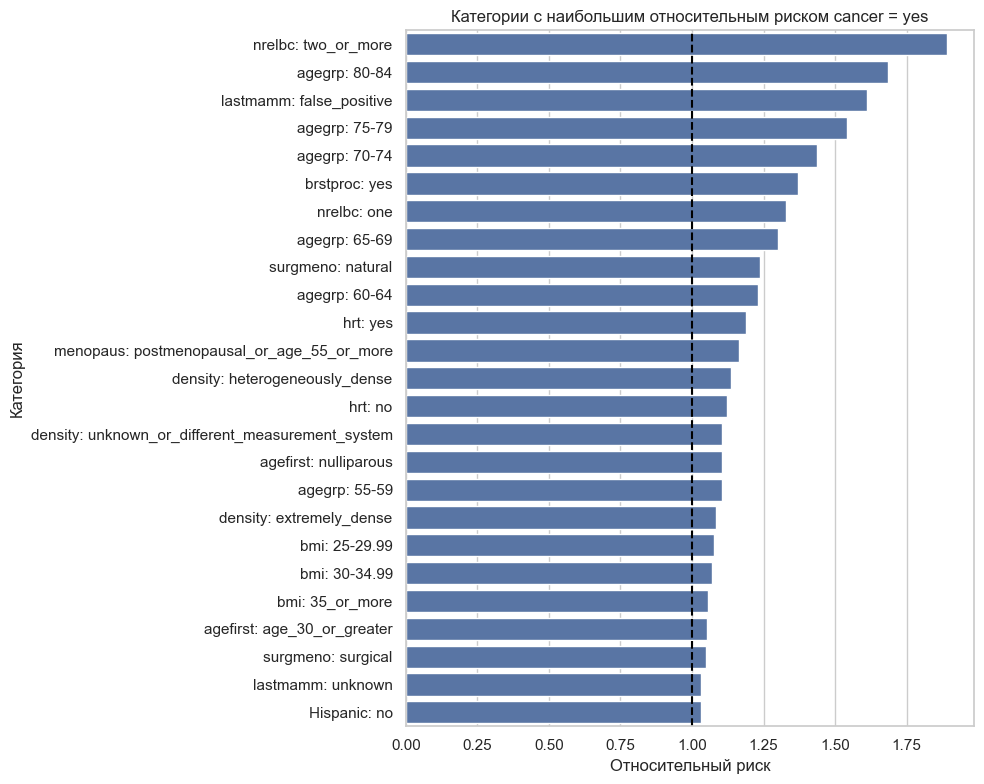
    


```python
profile_cols = ["agegrp", "density", "nrelbc", "brstproc"]

profile_risk = weighted_cancer_rate(df, profile_cols)

profile_risk = profile_risk[profile_risk["total"] >= 1000]
profile_risk = profile_risk.sort_values("cancer_rate", ascending=False)

profile_risk["profile"] = (
    "age: " + profile_risk["agegrp"].astype(str)
    + " | density: " + profile_risk["density"].astype(str)
    + " | relatives: " + profile_risk["nrelbc"].astype(str)
    + " | procedure: " + profile_risk["brstproc"].astype(str)
)

display(profile_risk.head(20))
```


<div>
<style scoped>
    .dataframe tbody tr th:only-of-type {
        vertical-align: middle;
    }

    .dataframe tbody tr th {
        vertical-align: top;
    }

    .dataframe thead th {
        text-align: right;
    }
</style>
<table border="1" class="dataframe">
  <thead>
    <tr style="text-align: right;">
      <th>cancer</th>
      <th>agegrp</th>
      <th>density</th>
      <th>nrelbc</th>
      <th>brstproc</th>
      <th>no</th>
      <th>yes</th>
      <th>total</th>
      <th>cancer_yes</th>
      <th>cancer_rate</th>
      <th>profile</th>
    </tr>
  </thead>
  <tbody>
    <tr>
      <th>527</th>
      <td>75-79</td>
      <td>unknown_or_different_measurement_system</td>
      <td>one</td>
      <td>yes</td>
      <td>1020</td>
      <td>20</td>
      <td>1040</td>
      <td>20</td>
      <td>1.923077</td>
      <td>age: 75-79 | density: unknown_or_different_mea...</td>
    </tr>
    <tr>
      <th>408</th>
      <td>65-69</td>
      <td>unknown_or_different_measurement_system</td>
      <td>one</td>
      <td>yes</td>
      <td>1603</td>
      <td>27</td>
      <td>1630</td>
      <td>27</td>
      <td>1.656442</td>
      <td>age: 65-69 | density: unknown_or_different_mea...</td>
    </tr>
    <tr>
      <th>585</th>
      <td>80-84</td>
      <td>unknown_or_different_measurement_system</td>
      <td>one</td>
      <td>no</td>
      <td>1504</td>
      <td>25</td>
      <td>1529</td>
      <td>25</td>
      <td>1.635056</td>
      <td>age: 80-84 | density: unknown_or_different_mea...</td>
    </tr>
    <tr>
      <th>321</th>
      <td>60-64</td>
      <td>extremely_dense</td>
      <td>zero</td>
      <td>yes</td>
      <td>1880</td>
      <td>30</td>
      <td>1910</td>
      <td>30</td>
      <td>1.570681</td>
      <td>age: 60-64 | density: extremely_dense | relati...</td>
    </tr>
    <tr>
      <th>348</th>
      <td>60-64</td>
      <td>unknown_or_different_measurement_system</td>
      <td>one</td>
      <td>yes</td>
      <td>1702</td>
      <td>25</td>
      <td>1727</td>
      <td>25</td>
      <td>1.447597</td>
      <td>age: 60-64 | density: unknown_or_different_mea...</td>
    </tr>
    <tr>
      <th>288</th>
      <td>55-59</td>
      <td>unknown_or_different_measurement_system</td>
      <td>one</td>
      <td>yes</td>
      <td>2391</td>
      <td>35</td>
      <td>2426</td>
      <td>35</td>
      <td>1.442704</td>
      <td>age: 55-59 | density: unknown_or_different_mea...</td>
    </tr>
    <tr>
      <th>558</th>
      <td>80-84</td>
      <td>extremely_dense</td>
      <td>zero</td>
      <td>no</td>
      <td>1045</td>
      <td>15</td>
      <td>1060</td>
      <td>15</td>
      <td>1.415094</td>
      <td>age: 80-84 | density: extremely_dense | relati...</td>
    </tr>
    <tr>
      <th>384</th>
      <td>65-69</td>
      <td>heterogeneously_dense</td>
      <td>one</td>
      <td>yes</td>
      <td>2206</td>
      <td>31</td>
      <td>2237</td>
      <td>31</td>
      <td>1.385785</td>
      <td>age: 65-69 | density: heterogeneously_dense | ...</td>
    </tr>
    <tr>
      <th>468</th>
      <td>70-74</td>
      <td>unknown_or_different_measurement_system</td>
      <td>one</td>
      <td>yes</td>
      <td>1377</td>
      <td>19</td>
      <td>1396</td>
      <td>19</td>
      <td>1.361032</td>
      <td>age: 70-74 | density: unknown_or_different_mea...</td>
    </tr>
    <tr>
      <th>596</th>
      <td>80-84</td>
      <td>unknown_or_different_measurement_system</td>
      <td>zero</td>
      <td>yes</td>
      <td>1553</td>
      <td>21</td>
      <td>1574</td>
      <td>21</td>
      <td>1.334180</td>
      <td>age: 80-84 | density: unknown_or_different_mea...</td>
    </tr>
    <tr>
      <th>515</th>
      <td>75-79</td>
      <td>scattered_fibroglandular_densities</td>
      <td>one</td>
      <td>yes</td>
      <td>1980</td>
      <td>25</td>
      <td>2005</td>
      <td>25</td>
      <td>1.246883</td>
      <td>age: 75-79 | density: scattered_fibroglandular...</td>
    </tr>
    <tr>
      <th>503</th>
      <td>75-79</td>
      <td>heterogeneously_dense</td>
      <td>one</td>
      <td>yes</td>
      <td>1427</td>
      <td>18</td>
      <td>1445</td>
      <td>18</td>
      <td>1.245675</td>
      <td>age: 75-79 | density: heterogeneously_dense | ...</td>
    </tr>
    <tr>
      <th>392</th>
      <td>65-69</td>
      <td>heterogeneously_dense</td>
      <td>zero</td>
      <td>unknown</td>
      <td>1643</td>
      <td>20</td>
      <td>1663</td>
      <td>20</td>
      <td>1.202646</td>
      <td>age: 65-69 | density: heterogeneously_dense | ...</td>
    </tr>
    <tr>
      <th>477</th>
      <td>70-74</td>
      <td>unknown_or_different_measurement_system</td>
      <td>zero</td>
      <td>yes</td>
      <td>5029</td>
      <td>59</td>
      <td>5088</td>
      <td>59</td>
      <td>1.159591</td>
      <td>age: 70-74 | density: unknown_or_different_mea...</td>
    </tr>
    <tr>
      <th>525</th>
      <td>75-79</td>
      <td>unknown_or_different_measurement_system</td>
      <td>one</td>
      <td>no</td>
      <td>3064</td>
      <td>35</td>
      <td>3099</td>
      <td>35</td>
      <td>1.129397</td>
      <td>age: 75-79 | density: unknown_or_different_mea...</td>
    </tr>
    <tr>
      <th>444</th>
      <td>70-74</td>
      <td>heterogeneously_dense</td>
      <td>one</td>
      <td>yes</td>
      <td>1842</td>
      <td>21</td>
      <td>1863</td>
      <td>21</td>
      <td>1.127214</td>
      <td>age: 70-74 | density: heterogeneously_dense | ...</td>
    </tr>
    <tr>
      <th>414</th>
      <td>65-69</td>
      <td>unknown_or_different_measurement_system</td>
      <td>unknown</td>
      <td>yes</td>
      <td>1416</td>
      <td>16</td>
      <td>1432</td>
      <td>16</td>
      <td>1.117318</td>
      <td>age: 65-69 | density: unknown_or_different_mea...</td>
    </tr>
    <tr>
      <th>456</th>
      <td>70-74</td>
      <td>scattered_fibroglandular_densities</td>
      <td>one</td>
      <td>yes</td>
      <td>2577</td>
      <td>29</td>
      <td>2606</td>
      <td>29</td>
      <td>1.112817</td>
      <td>age: 70-74 | density: scattered_fibroglandular...</td>
    </tr>
    <tr>
      <th>536</th>
      <td>75-79</td>
      <td>unknown_or_different_measurement_system</td>
      <td>zero</td>
      <td>yes</td>
      <td>3601</td>
      <td>40</td>
      <td>3641</td>
      <td>40</td>
      <td>1.098599</td>
      <td>age: 75-79 | density: unknown_or_different_mea...</td>
    </tr>
    <tr>
      <th>592</th>
      <td>80-84</td>
      <td>unknown_or_different_measurement_system</td>
      <td>unknown</td>
      <td>unknown</td>
      <td>1822</td>
      <td>20</td>
      <td>1842</td>
      <td>20</td>
      <td>1.085776</td>
      <td>age: 80-84 | density: unknown_or_different_mea...</td>
    </tr>
  </tbody>
</table>
</div>


```python
top_profiles = profile_risk.head(15)

plt.figure(figsize=(12, 8))
sns.barplot(
    data=top_profiles,
    x="cancer_rate",
    y="profile",
    orient="h"
)

plt.title("Профили пациенток с наибольшей долей cancer = yes")
plt.xlabel("Доля cancer = yes, %")
plt.ylabel("Профиль")
plt.tight_layout()
plt.show()
```


    
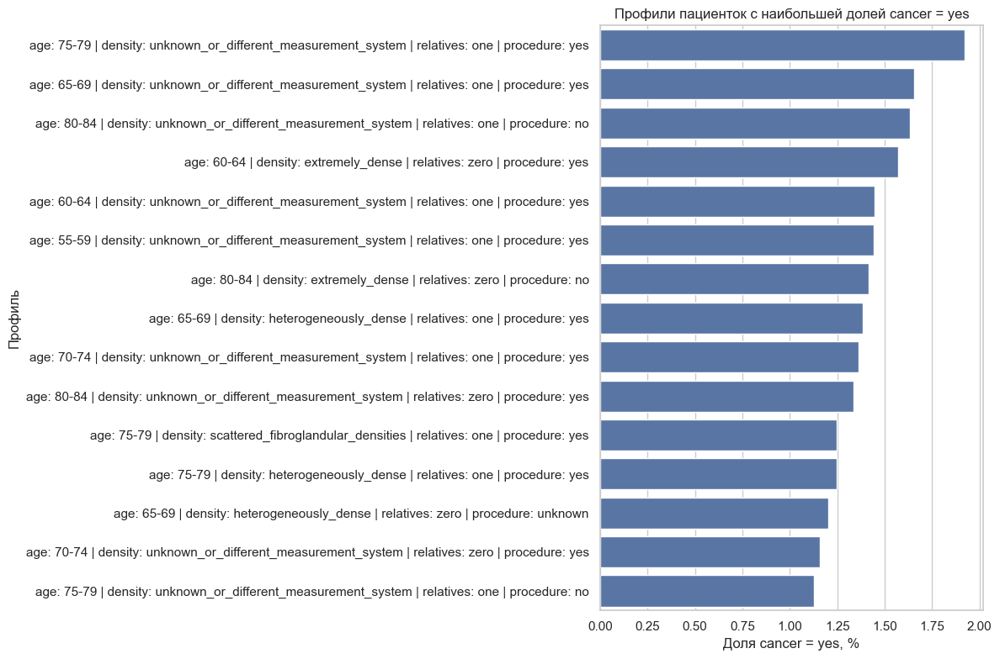
    


```python
def plot_100_stacked_bar(data, feature):
    table = pd.crosstab(
        data[feature],
        data[target_col],
        values=data[weight_col],
        aggfunc="sum"
    ).fillna(0)

    table_percent = table.div(table.sum(axis=1), axis=0) * 100

    table_percent.plot(
        kind="bar",
        stacked=True,
        figsize=(10, 5),
        colormap="Set2"
    )

    plt.title(f"Структура классов cancer по признаку {feature}, %")
    plt.xlabel(feature)
    plt.ylabel("Доля, %")
    plt.xticks(rotation=40, ha="right")
    plt.legend(title="cancer")
    plt.tight_layout()
    plt.show()
```


```python
important_features = ["agegrp", "density", "bmi", "nrelbc", "brstproc", "lastmamm"]

for feature in important_features:
    plot_100_stacked_bar(df, feature)
```


    
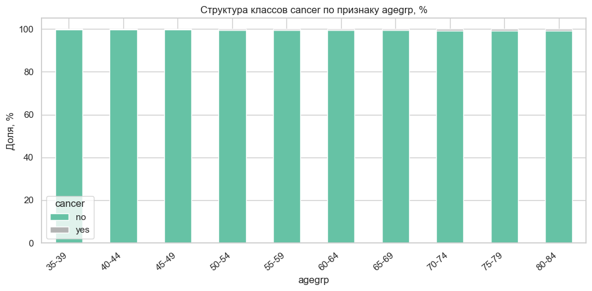
    


    
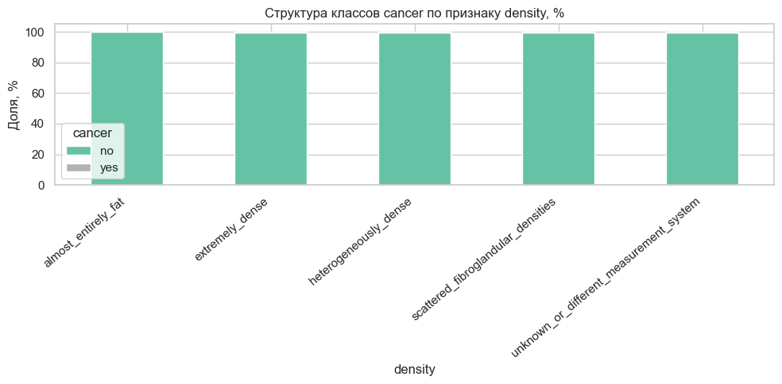
    


    
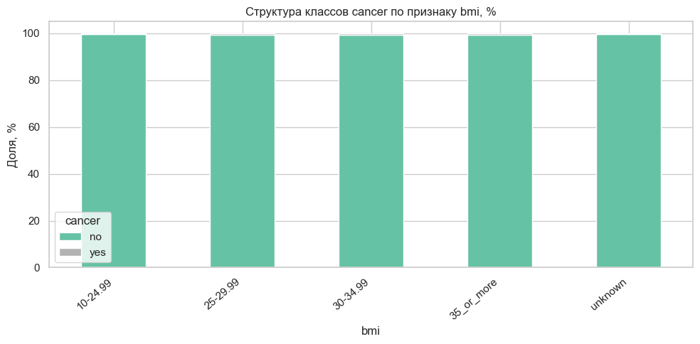
    


    
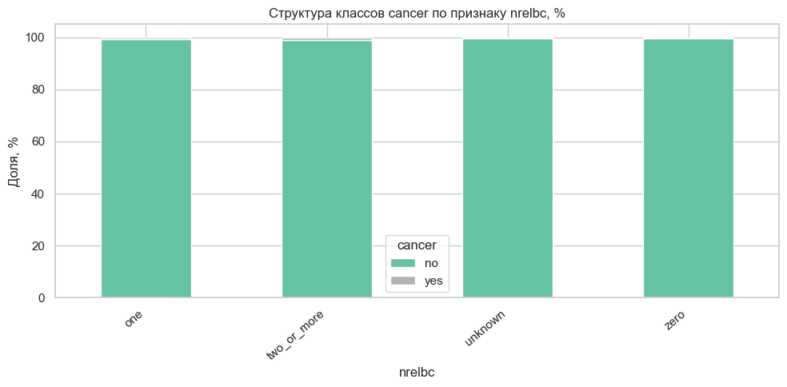
    


    
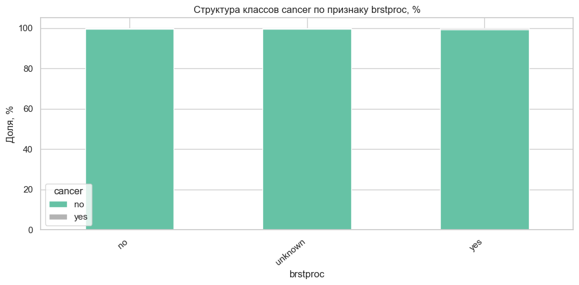
    


    
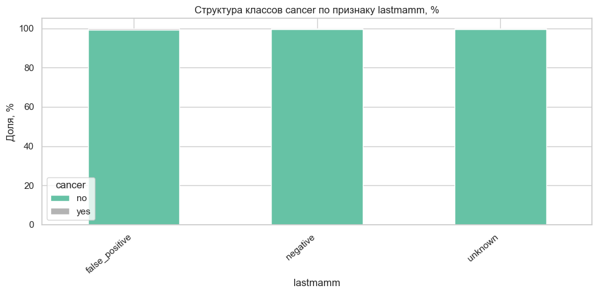
    


```python
def cramers_v(data, col1, col2, weight_col):
    table = pd.crosstab(
        data[col1],
        data[col2],
        values=data[weight_col],
        aggfunc="sum"
    ).fillna(0)

    chi2 = chi2_contingency(table)[0]
    n = table.values.sum()

    r, k = table.shape

    if n == 0 or min(r - 1, k - 1) == 0:
        return np.nan

    return np.sqrt(chi2 / (n * min(r - 1, k - 1)))
```


```python
cramers_matrix = pd.DataFrame(
    index=feature_cols,
    columns=feature_cols,
    dtype=float
)

for col1 in feature_cols:
    for col2 in feature_cols:
        cramers_matrix.loc[col1, col2] = cramers_v(df, col1, col2, weight_col)

plt.figure(figsize=(12, 9))
sns.heatmap(
    cramers_matrix,
    annot=True,
    fmt=".2f",
    cmap="Blues",
    linewidths=0.5,
    vmin=0,
    vmax=1
)

plt.title("Матрица связи категориальных признаков по Cramer's V")
plt.xlabel("Признаки")
plt.ylabel("Признаки")
plt.xticks(rotation=45, ha="right")
plt.yticks(rotation=0)
plt.tight_layout()
plt.show()
```


    
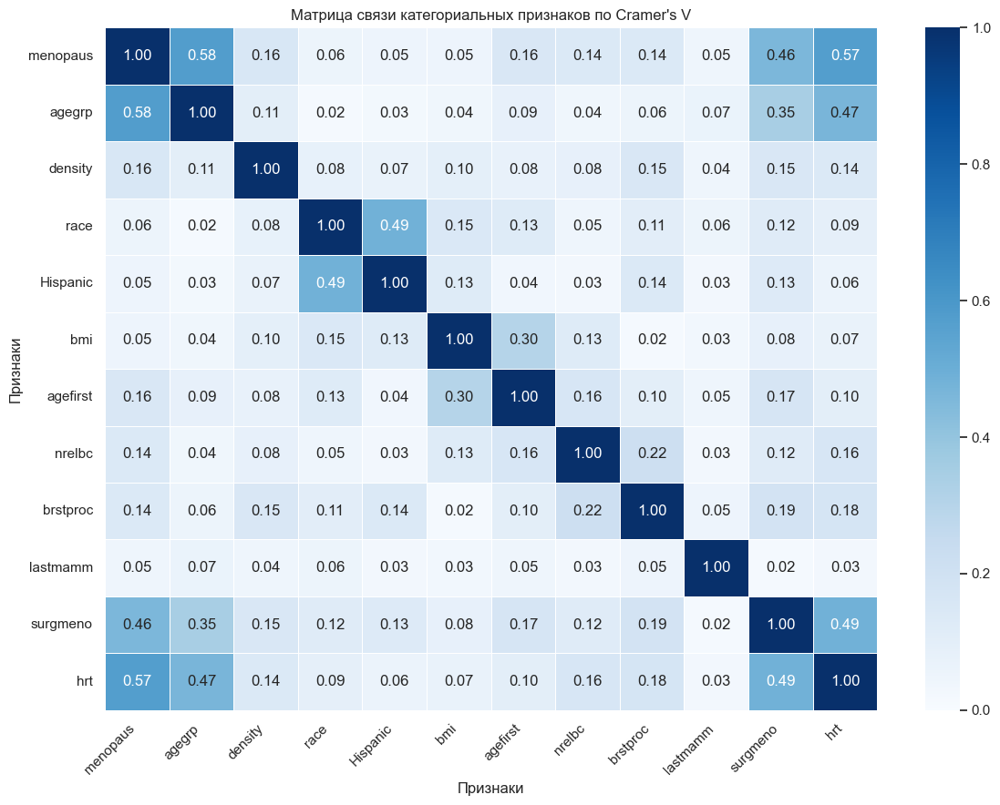
    


```python
target_association = []

for feature in feature_cols:
    value = cramers_v(df, feature, target_col, weight_col)

    target_association.append({
        "feature": feature,
        "cramers_v_with_cancer": value
    })

target_association = pd.DataFrame(target_association)
target_association = target_association.sort_values(
    "cramers_v_with_cancer",
    ascending=False
)

display(target_association)
```


<div>
<style scoped>
    .dataframe tbody tr th:only-of-type {
        vertical-align: middle;
    }

    .dataframe tbody tr th {
        vertical-align: top;
    }

    .dataframe thead th {
        text-align: right;
    }
</style>
<table border="1" class="dataframe">
  <thead>
    <tr style="text-align: right;">
      <th></th>
      <th>feature</th>
      <th>cramers_v_with_cancer</th>
    </tr>
  </thead>
  <tbody>
    <tr>
      <th>1</th>
      <td>agegrp</td>
      <td>0.024890</td>
    </tr>
    <tr>
      <th>0</th>
      <td>menopaus</td>
      <td>0.017004</td>
    </tr>
    <tr>
      <th>11</th>
      <td>hrt</td>
      <td>0.013128</td>
    </tr>
    <tr>
      <th>2</th>
      <td>density</td>
      <td>0.012410</td>
    </tr>
    <tr>
      <th>8</th>
      <td>brstproc</td>
      <td>0.012082</td>
    </tr>
    <tr>
      <th>10</th>
      <td>surgmeno</td>
      <td>0.011964</td>
    </tr>
    <tr>
      <th>7</th>
      <td>nrelbc</td>
      <td>0.010164</td>
    </tr>
    <tr>
      <th>9</th>
      <td>lastmamm</td>
      <td>0.005379</td>
    </tr>
    <tr>
      <th>4</th>
      <td>Hispanic</td>
      <td>0.004756</td>
    </tr>
    <tr>
      <th>3</th>
      <td>race</td>
      <td>0.004426</td>
    </tr>
    <tr>
      <th>6</th>
      <td>agefirst</td>
      <td>0.003156</td>
    </tr>
    <tr>
      <th>5</th>
      <td>bmi</td>
      <td>0.002865</td>
    </tr>
  </tbody>
</table>
</div>


```python
plt.figure(figsize=(9, 6))
sns.barplot(
    data=target_association,
    x="cramers_v_with_cancer",
    y="feature",
    orient="h"
)

plt.title("Сила связи признаков с целевой переменной cancer")
plt.xlabel("Cramer's V")
plt.ylabel("Признак")
plt.tight_layout()
plt.show()
```


    
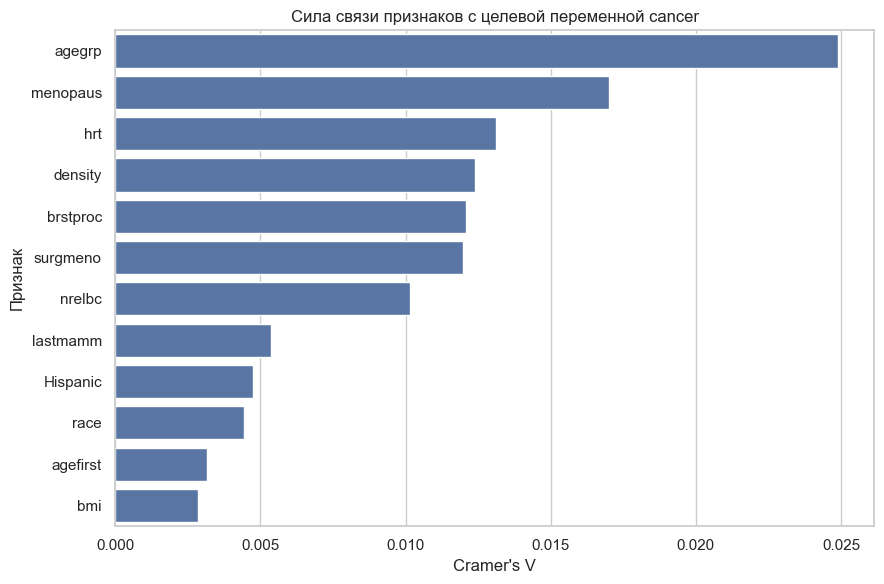
    


```python
import pandas as pd
import matplotlib.pyplot as plt
import seaborn as sns

df = pd.read_csv("risk_decoded.csv")

positive_df = df[df["cancer"] == "yes"].copy()

heatmap_counts = positive_df.pivot_table(
    index="agegrp",
    columns="density",
    values="count",
    aggfunc="sum",
    fill_value=0
)

plt.figure(figsize=(12, 6))
sns.heatmap(
    heatmap_counts,
    annot=True,
    fmt=".0f",
    cmap="OrRd",
    linewidths=0.5
)

plt.title("Тепловая карта количества положительных случаев cancer = yes")
plt.xlabel("Плотность ткани")
plt.ylabel("Возрастная группа")
plt.xticks(rotation=35, ha="right")
plt.yticks(rotation=0)
plt.tight_layout()
plt.show()
```


    
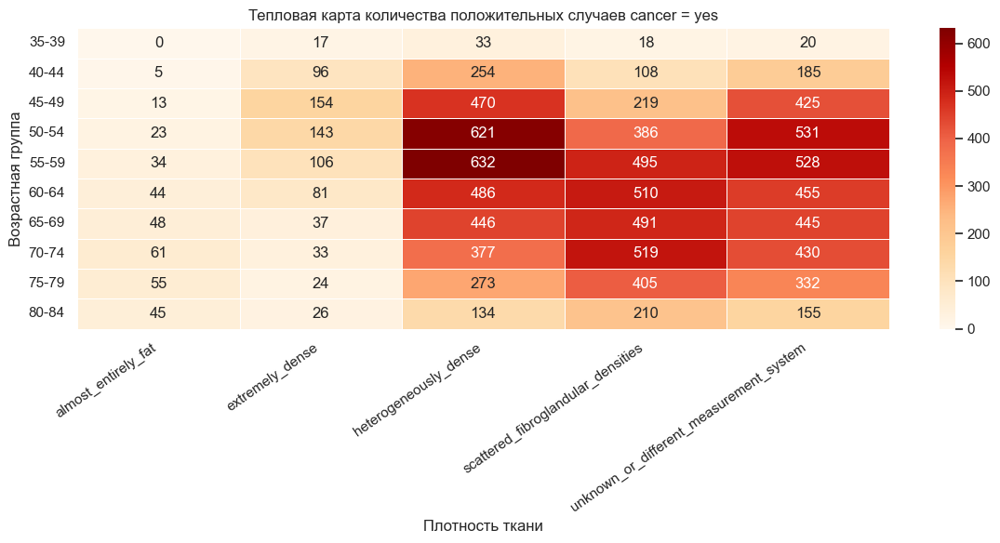
    


```python
import pandas as pd
import numpy as np

df = pd.read_csv("risk_decoded.csv")

display(df.head())
print(df.shape)
```


<div>
<style scoped>
    .dataframe tbody tr th:only-of-type {
        vertical-align: middle;
    }

    .dataframe tbody tr th {
        vertical-align: top;
    }

    .dataframe thead th {
        text-align: right;
    }
</style>
<table border="1" class="dataframe">
  <thead>
    <tr style="text-align: right;">
      <th></th>
      <th>menopaus</th>
      <th>agegrp</th>
      <th>density</th>
      <th>race</th>
      <th>Hispanic</th>
      <th>bmi</th>
      <th>agefirst</th>
      <th>nrelbc</th>
      <th>brstproc</th>
      <th>lastmamm</th>
      <th>surgmeno</th>
      <th>hrt</th>
      <th>invasive</th>
      <th>cancer</th>
      <th>training</th>
      <th>count</th>
    </tr>
  </thead>
  <tbody>
    <tr>
      <th>0</th>
      <td>premenopausal</td>
      <td>35-39</td>
      <td>almost_entirely_fat</td>
      <td>white</td>
      <td>no</td>
      <td>10-24.99</td>
      <td>age_less_than_30</td>
      <td>zero</td>
      <td>no</td>
      <td>negative</td>
      <td>unknown_or_not_menopausal</td>
      <td>unknown_or_not_menopausal</td>
      <td>no</td>
      <td>no</td>
      <td>training</td>
      <td>4</td>
    </tr>
    <tr>
      <th>1</th>
      <td>premenopausal</td>
      <td>35-39</td>
      <td>almost_entirely_fat</td>
      <td>white</td>
      <td>no</td>
      <td>10-24.99</td>
      <td>age_less_than_30</td>
      <td>zero</td>
      <td>no</td>
      <td>unknown</td>
      <td>unknown_or_not_menopausal</td>
      <td>unknown_or_not_menopausal</td>
      <td>no</td>
      <td>no</td>
      <td>validation</td>
      <td>2</td>
    </tr>
    <tr>
      <th>2</th>
      <td>premenopausal</td>
      <td>35-39</td>
      <td>almost_entirely_fat</td>
      <td>white</td>
      <td>no</td>
      <td>10-24.99</td>
      <td>age_less_than_30</td>
      <td>zero</td>
      <td>no</td>
      <td>unknown</td>
      <td>unknown_or_not_menopausal</td>
      <td>unknown_or_not_menopausal</td>
      <td>no</td>
      <td>no</td>
      <td>training</td>
      <td>4</td>
    </tr>
    <tr>
      <th>3</th>
      <td>premenopausal</td>
      <td>35-39</td>
      <td>almost_entirely_fat</td>
      <td>white</td>
      <td>no</td>
      <td>10-24.99</td>
      <td>age_less_than_30</td>
      <td>zero</td>
      <td>yes</td>
      <td>unknown</td>
      <td>unknown_or_not_menopausal</td>
      <td>unknown_or_not_menopausal</td>
      <td>no</td>
      <td>no</td>
      <td>training</td>
      <td>1</td>
    </tr>
    <tr>
      <th>4</th>
      <td>premenopausal</td>
      <td>35-39</td>
      <td>almost_entirely_fat</td>
      <td>white</td>
      <td>no</td>
      <td>10-24.99</td>
      <td>age_less_than_30</td>
      <td>one</td>
      <td>no</td>
      <td>negative</td>
      <td>unknown_or_not_menopausal</td>
      <td>unknown_or_not_menopausal</td>
      <td>no</td>
      <td>no</td>
      <td>training</td>
      <td>1</td>
    </tr>
  </tbody>
</table>
</div>


    (280660, 16)
    


```python
print("Размер набора данных:", df.shape)

print("\nТипы данных:")
print(df.dtypes)

print("\nКоличество пропусков:")
print(df.isna().sum())

print("\nЗначения целевой переменной:")
print(df["cancer"].value_counts())

print("\nРаспределение с учетом count:")
print(df.groupby("cancer")["count"].sum())
```

    Размер набора данных: (280660, 16)
    
    Типы данных:
    menopaus    object
    agegrp      object
    density     object
    race        object
    Hispanic    object
    bmi         object
    agefirst    object
    nrelbc      object
    brstproc    object
    lastmamm    object
    surgmeno    object
    hrt         object
    invasive    object
    cancer      object
    training    object
    count        int64
    dtype: object
    
    Количество пропусков:
    menopaus    0
    agegrp      0
    density     0
    race        0
    Hispanic    0
    bmi         0
    agefirst    0
    nrelbc      0
    brstproc    0
    lastmamm    0
    surgmeno    0
    hrt         0
    invasive    0
    cancer      0
    training    0
    count       0
    dtype: int64
    
    Значения целевой переменной:
    cancer
    no     271355
    yes      9305
    Name: count, dtype: int64
    
    Распределение с учетом count:
    cancer
    no     2381360
    yes      11638
    Name: count, dtype: int64
    


```python
target_col = "cancer"
weight_col = "count"
split_col = "training"

leakage_cols = ["invasive"]

service_cols = [
    target_col,
    weight_col,
    split_col
] + leakage_cols

feature_cols = [
    col for col in df.columns
    if col not in service_cols
]

print("Целевая переменная:", target_col)
print("Весовой столбец:", weight_col)
print("Столбец разбиения:", split_col)
print("Исключенные признаки:", leakage_cols)
print("Признаки для моделирования:")
print(feature_cols)
```

    Целевая переменная: cancer
    Весовой столбец: count
    Столбец разбиения: training
    Исключенные признаки: ['invasive']
    Признаки для моделирования:
    ['menopaus', 'agegrp', 'density', 'race', 'Hispanic', 'bmi', 'agefirst', 'nrelbc', 'brstproc', 'lastmamm', 'surgmeno', 'hrt']
    


```python
train_df = df[df[split_col] == "training"].copy()
valid_df = df[df[split_col] == "validation"].copy()

print("Размер обучающей выборки:", train_df.shape)
print("Размер валидационной выборки:", valid_df.shape)
```

    Размер обучающей выборки: (180465, 16)
    Размер валидационной выборки: (100195, 16)
    


```python
X_train = train_df[feature_cols].copy()
X_valid = valid_df[feature_cols].copy()

y_train = train_df[target_col].map({
    "no": 0,
    "yes": 1
})

y_valid = valid_df[target_col].map({
    "no": 0,
    "yes": 1
})

sample_weight_train = train_df[weight_col].copy()
sample_weight_valid = valid_df[weight_col].copy()

print("X_train:", X_train.shape)
print("X_valid:", X_valid.shape)
print("y_train:", y_train.shape)
print("y_valid:", y_valid.shape)

print("\nРаспределение классов в обучающей выборке:")
print(y_train.value_counts())

print("\nРаспределение классов в валидационной выборке:")
print(y_valid.value_counts())
```

    X_train: (180465, 12)
    X_valid: (100195, 12)
    y_train: (180465,)
    y_valid: (100195,)
    
    Распределение классов в обучающей выборке:
    cancer
    0    173696
    1      6769
    Name: count, dtype: int64
    
    Распределение классов в валидационной выборке:
    cancer
    0    97659
    1     2536
    Name: count, dtype: int64
    


```python
categorical_features = X_train.columns.tolist()

for col in categorical_features:
    print(col)
    print("Количество категорий:", X_train[col].nunique())
    print("Категории:", sorted(X_train[col].unique()))
    print()
```

    menopaus
    Количество категорий: 3
    Категории: ['postmenopausal_or_age_55_or_more', 'premenopausal', 'unknown']
    
    agegrp
    Количество категорий: 10
    Категории: ['35-39', '40-44', '45-49', '50-54', '55-59', '60-64', '65-69', '70-74', '75-79', '80-84']
    
    density
    Количество категорий: 5
    Категории: ['almost_entirely_fat', 'extremely_dense', 'heterogeneously_dense', 'scattered_fibroglandular_densities', 'unknown_or_different_measurement_system']
    
    race
    Количество категорий: 6
    Категории: ['asian_pacific_islander', 'black', 'native_american', 'other_mixed', 'unknown', 'white']
    
    Hispanic
    Количество категорий: 3
    Категории: ['no', 'unknown', 'yes']
    
    bmi
    Количество категорий: 5
    Категории: ['10-24.99', '25-29.99', '30-34.99', '35_or_more', 'unknown']
    
    agefirst
    Количество категорий: 4
    Категории: ['age_30_or_greater', 'age_less_than_30', 'nulliparous', 'unknown']
    
    nrelbc
    Количество категорий: 4
    Категории: ['one', 'two_or_more', 'unknown', 'zero']
    
    brstproc
    Количество категорий: 3
    Категории: ['no', 'unknown', 'yes']
    
    lastmamm
    Количество категорий: 3
    Категории: ['false_positive', 'negative', 'unknown']
    
    surgmeno
    Количество категорий: 3
    Категории: ['natural', 'surgical', 'unknown_or_not_menopausal']
    
    hrt
    Количество категорий: 3
    Категории: ['no', 'unknown_or_not_menopausal', 'yes']
    
    


```python
from sklearn.preprocessing import OneHotEncoder
from sklearn.compose import ColumnTransformer

try:
    encoder = OneHotEncoder(
        handle_unknown="ignore",
        sparse_output=False
    )
except TypeError:
    encoder = OneHotEncoder(
        handle_unknown="ignore",
        sparse=False
    )

preprocessor = ColumnTransformer(
    transformers=[
        ("cat", encoder, categorical_features)
    ],
    remainder="drop"
)
```


```python
X_train_encoded = preprocessor.fit_transform(X_train)
X_valid_encoded = preprocessor.transform(X_valid)

print("Размер X_train после кодирования:", X_train_encoded.shape)
print("Размер X_valid после кодирования:", X_valid_encoded.shape)
```

    Размер X_train после кодирования: (180465, 52)
    Размер X_valid после кодирования: (100195, 52)
    


```python
encoded_feature_names = preprocessor.get_feature_names_out()

encoded_feature_names = [
    name.replace("cat__", "")
    for name in encoded_feature_names
]

print("Количество признаков после кодирования:", len(encoded_feature_names))
print(encoded_feature_names[:20])
```

    Количество признаков после кодирования: 52
    ['menopaus_postmenopausal_or_age_55_or_more', 'menopaus_premenopausal', 'menopaus_unknown', 'agegrp_35-39', 'agegrp_40-44', 'agegrp_45-49', 'agegrp_50-54', 'agegrp_55-59', 'agegrp_60-64', 'agegrp_65-69', 'agegrp_70-74', 'agegrp_75-79', 'agegrp_80-84', 'density_almost_entirely_fat', 'density_extremely_dense', 'density_heterogeneously_dense', 'density_scattered_fibroglandular_densities', 'density_unknown_or_different_measurement_system', 'race_asian_pacific_islander', 'race_black']
    


```python
X_train_encoded_df = pd.DataFrame(
    X_train_encoded,
    columns=encoded_feature_names,
    index=X_train.index
)

X_valid_encoded_df = pd.DataFrame(
    X_valid_encoded,
    columns=encoded_feature_names,
    index=X_valid.index
)

display(X_train_encoded_df.head())
display(X_valid_encoded_df.head())
```


<div>
<style scoped>
    .dataframe tbody tr th:only-of-type {
        vertical-align: middle;
    }

    .dataframe tbody tr th {
        vertical-align: top;
    }

    .dataframe thead th {
        text-align: right;
    }
</style>
<table border="1" class="dataframe">
  <thead>
    <tr style="text-align: right;">
      <th></th>
      <th>menopaus_postmenopausal_or_age_55_or_more</th>
      <th>menopaus_premenopausal</th>
      <th>menopaus_unknown</th>
      <th>agegrp_35-39</th>
      <th>agegrp_40-44</th>
      <th>agegrp_45-49</th>
      <th>agegrp_50-54</th>
      <th>agegrp_55-59</th>
      <th>agegrp_60-64</th>
      <th>agegrp_65-69</th>
      <th>...</th>
      <th>brstproc_yes</th>
      <th>lastmamm_false_positive</th>
      <th>lastmamm_negative</th>
      <th>lastmamm_unknown</th>
      <th>surgmeno_natural</th>
      <th>surgmeno_surgical</th>
      <th>surgmeno_unknown_or_not_menopausal</th>
      <th>hrt_no</th>
      <th>hrt_unknown_or_not_menopausal</th>
      <th>hrt_yes</th>
    </tr>
  </thead>
  <tbody>
    <tr>
      <th>0</th>
      <td>0.0</td>
      <td>1.0</td>
      <td>0.0</td>
      <td>1.0</td>
      <td>0.0</td>
      <td>0.0</td>
      <td>0.0</td>
      <td>0.0</td>
      <td>0.0</td>
      <td>0.0</td>
      <td>...</td>
      <td>0.0</td>
      <td>0.0</td>
      <td>1.0</td>
      <td>0.0</td>
      <td>0.0</td>
      <td>0.0</td>
      <td>1.0</td>
      <td>0.0</td>
      <td>1.0</td>
      <td>0.0</td>
    </tr>
    <tr>
      <th>2</th>
      <td>0.0</td>
      <td>1.0</td>
      <td>0.0</td>
      <td>1.0</td>
      <td>0.0</td>
      <td>0.0</td>
      <td>0.0</td>
      <td>0.0</td>
      <td>0.0</td>
      <td>0.0</td>
      <td>...</td>
      <td>0.0</td>
      <td>0.0</td>
      <td>0.0</td>
      <td>1.0</td>
      <td>0.0</td>
      <td>0.0</td>
      <td>1.0</td>
      <td>0.0</td>
      <td>1.0</td>
      <td>0.0</td>
    </tr>
    <tr>
      <th>3</th>
      <td>0.0</td>
      <td>1.0</td>
      <td>0.0</td>
      <td>1.0</td>
      <td>0.0</td>
      <td>0.0</td>
      <td>0.0</td>
      <td>0.0</td>
      <td>0.0</td>
      <td>0.0</td>
      <td>...</td>
      <td>1.0</td>
      <td>0.0</td>
      <td>0.0</td>
      <td>1.0</td>
      <td>0.0</td>
      <td>0.0</td>
      <td>1.0</td>
      <td>0.0</td>
      <td>1.0</td>
      <td>0.0</td>
    </tr>
    <tr>
      <th>4</th>
      <td>0.0</td>
      <td>1.0</td>
      <td>0.0</td>
      <td>1.0</td>
      <td>0.0</td>
      <td>0.0</td>
      <td>0.0</td>
      <td>0.0</td>
      <td>0.0</td>
      <td>0.0</td>
      <td>...</td>
      <td>0.0</td>
      <td>0.0</td>
      <td>1.0</td>
      <td>0.0</td>
      <td>0.0</td>
      <td>0.0</td>
      <td>1.0</td>
      <td>0.0</td>
      <td>1.0</td>
      <td>0.0</td>
    </tr>
    <tr>
      <th>5</th>
      <td>0.0</td>
      <td>1.0</td>
      <td>0.0</td>
      <td>1.0</td>
      <td>0.0</td>
      <td>0.0</td>
      <td>0.0</td>
      <td>0.0</td>
      <td>0.0</td>
      <td>0.0</td>
      <td>...</td>
      <td>0.0</td>
      <td>0.0</td>
      <td>0.0</td>
      <td>1.0</td>
      <td>0.0</td>
      <td>0.0</td>
      <td>1.0</td>
      <td>0.0</td>
      <td>1.0</td>
      <td>0.0</td>
    </tr>
  </tbody>
</table>
<p>5 rows × 52 columns</p>
</div>


<div>
<style scoped>
    .dataframe tbody tr th:only-of-type {
        vertical-align: middle;
    }

    .dataframe tbody tr th {
        vertical-align: top;
    }

    .dataframe thead th {
        text-align: right;
    }
</style>
<table border="1" class="dataframe">
  <thead>
    <tr style="text-align: right;">
      <th></th>
      <th>menopaus_postmenopausal_or_age_55_or_more</th>
      <th>menopaus_premenopausal</th>
      <th>menopaus_unknown</th>
      <th>agegrp_35-39</th>
      <th>agegrp_40-44</th>
      <th>agegrp_45-49</th>
      <th>agegrp_50-54</th>
      <th>agegrp_55-59</th>
      <th>agegrp_60-64</th>
      <th>agegrp_65-69</th>
      <th>...</th>
      <th>brstproc_yes</th>
      <th>lastmamm_false_positive</th>
      <th>lastmamm_negative</th>
      <th>lastmamm_unknown</th>
      <th>surgmeno_natural</th>
      <th>surgmeno_surgical</th>
      <th>surgmeno_unknown_or_not_menopausal</th>
      <th>hrt_no</th>
      <th>hrt_unknown_or_not_menopausal</th>
      <th>hrt_yes</th>
    </tr>
  </thead>
  <tbody>
    <tr>
      <th>1</th>
      <td>0.0</td>
      <td>1.0</td>
      <td>0.0</td>
      <td>1.0</td>
      <td>0.0</td>
      <td>0.0</td>
      <td>0.0</td>
      <td>0.0</td>
      <td>0.0</td>
      <td>0.0</td>
      <td>...</td>
      <td>0.0</td>
      <td>0.0</td>
      <td>0.0</td>
      <td>1.0</td>
      <td>0.0</td>
      <td>0.0</td>
      <td>1.0</td>
      <td>0.0</td>
      <td>1.0</td>
      <td>0.0</td>
    </tr>
    <tr>
      <th>10</th>
      <td>0.0</td>
      <td>1.0</td>
      <td>0.0</td>
      <td>1.0</td>
      <td>0.0</td>
      <td>0.0</td>
      <td>0.0</td>
      <td>0.0</td>
      <td>0.0</td>
      <td>0.0</td>
      <td>...</td>
      <td>0.0</td>
      <td>0.0</td>
      <td>1.0</td>
      <td>0.0</td>
      <td>0.0</td>
      <td>0.0</td>
      <td>1.0</td>
      <td>0.0</td>
      <td>1.0</td>
      <td>0.0</td>
    </tr>
    <tr>
      <th>18</th>
      <td>0.0</td>
      <td>1.0</td>
      <td>0.0</td>
      <td>1.0</td>
      <td>0.0</td>
      <td>0.0</td>
      <td>0.0</td>
      <td>0.0</td>
      <td>0.0</td>
      <td>0.0</td>
      <td>...</td>
      <td>0.0</td>
      <td>0.0</td>
      <td>0.0</td>
      <td>1.0</td>
      <td>0.0</td>
      <td>0.0</td>
      <td>1.0</td>
      <td>0.0</td>
      <td>1.0</td>
      <td>0.0</td>
    </tr>
    <tr>
      <th>19</th>
      <td>0.0</td>
      <td>1.0</td>
      <td>0.0</td>
      <td>1.0</td>
      <td>0.0</td>
      <td>0.0</td>
      <td>0.0</td>
      <td>0.0</td>
      <td>0.0</td>
      <td>0.0</td>
      <td>...</td>
      <td>0.0</td>
      <td>0.0</td>
      <td>1.0</td>
      <td>0.0</td>
      <td>0.0</td>
      <td>0.0</td>
      <td>1.0</td>
      <td>0.0</td>
      <td>1.0</td>
      <td>0.0</td>
    </tr>
    <tr>
      <th>22</th>
      <td>0.0</td>
      <td>1.0</td>
      <td>0.0</td>
      <td>1.0</td>
      <td>0.0</td>
      <td>0.0</td>
      <td>0.0</td>
      <td>0.0</td>
      <td>0.0</td>
      <td>0.0</td>
      <td>...</td>
      <td>1.0</td>
      <td>0.0</td>
      <td>1.0</td>
      <td>0.0</td>
      <td>0.0</td>
      <td>0.0</td>
      <td>1.0</td>
      <td>0.0</td>
      <td>1.0</td>
      <td>0.0</td>
    </tr>
  </tbody>
</table>
<p>5 rows × 52 columns</p>
</div>


```python
print("Исходное количество признаков:", len(feature_cols))
print("Количество признаков после One-Hot Encoding:", X_train_encoded_df.shape[1])

print("\nРазмеры итоговых объектов:")
print("X_train_encoded_df:", X_train_encoded_df.shape)
print("X_valid_encoded_df:", X_valid_encoded_df.shape)
print("y_train:", y_train.shape)
print("y_valid:", y_valid.shape)
print("sample_weight_train:", sample_weight_train.shape)
print("sample_weight_valid:", sample_weight_valid.shape)
```

    Исходное количество признаков: 12
    Количество признаков после One-Hot Encoding: 52
    
    Размеры итоговых объектов:
    X_train_encoded_df: (180465, 52)
    X_valid_encoded_df: (100195, 52)
    y_train: (180465,)
    y_valid: (100195,)
    sample_weight_train: (180465,)
    sample_weight_valid: (100195,)
    


```python
train_class_balance = train_df.groupby(target_col)[weight_col].sum()
valid_class_balance = valid_df.groupby(target_col)[weight_col].sum()

train_class_balance_percent = train_class_balance / train_class_balance.sum() * 100
valid_class_balance_percent = valid_class_balance / valid_class_balance.sum() * 100

print("Баланс классов в обучающей выборке с учетом count:")
display(pd.DataFrame({
    "count": train_class_balance,
    "percent": train_class_balance_percent.round(2)
}))

print("Баланс классов в валидационной выборке с учетом count:")
display(pd.DataFrame({
    "count": valid_class_balance,
    "percent": valid_class_balance_percent.round(2)
}))
```

    Баланс классов в обучающей выборке с учетом count:
    


<div>
<style scoped>
    .dataframe tbody tr th:only-of-type {
        vertical-align: middle;
    }

    .dataframe tbody tr th {
        vertical-align: top;
    }

    .dataframe thead th {
        text-align: right;
    }
</style>
<table border="1" class="dataframe">
  <thead>
    <tr style="text-align: right;">
      <th></th>
      <th>count</th>
      <th>percent</th>
    </tr>
    <tr>
      <th>cancer</th>
      <th></th>
      <th></th>
    </tr>
  </thead>
  <tbody>
    <tr>
      <th>no</th>
      <td>1786372</td>
      <td>99.51</td>
    </tr>
    <tr>
      <th>yes</th>
      <td>8767</td>
      <td>0.49</td>
    </tr>
  </tbody>
</table>
</div>


    Баланс классов в валидационной выборке с учетом count:
    


<div>
<style scoped>
    .dataframe tbody tr th:only-of-type {
        vertical-align: middle;
    }

    .dataframe tbody tr th {
        vertical-align: top;
    }

    .dataframe thead th {
        text-align: right;
    }
</style>
<table border="1" class="dataframe">
  <thead>
    <tr style="text-align: right;">
      <th></th>
      <th>count</th>
      <th>percent</th>
    </tr>
    <tr>
      <th>cancer</th>
      <th></th>
      <th></th>
    </tr>
  </thead>
  <tbody>
    <tr>
      <th>no</th>
      <td>594988</td>
      <td>99.52</td>
    </tr>
    <tr>
      <th>yes</th>
      <td>2871</td>
      <td>0.48</td>
    </tr>
  </tbody>
</table>
</div>


```python
import pandas as pd
import numpy as np

from sklearn.preprocessing import OneHotEncoder
from sklearn.compose import ColumnTransformer

def prepare_data(path):
    df = pd.read_csv(path)

    target_col = "cancer"
    weight_col = "count"
    split_col = "training"

    leakage_cols = ["invasive"]

    service_cols = [
        target_col,
        weight_col,
        split_col
    ] + leakage_cols

    feature_cols = [
        col for col in df.columns
        if col not in service_cols
    ]

    train_df = df[df[split_col] == "training"].copy()
    valid_df = df[df[split_col] == "validation"].copy()

    X_train = train_df[feature_cols].copy()
    X_valid = valid_df[feature_cols].copy()

    y_train = train_df[target_col].map({
        "no": 0,
        "yes": 1
    })

    y_valid = valid_df[target_col].map({
        "no": 0,
        "yes": 1
    })

    sample_weight_train = train_df[weight_col].copy()
    sample_weight_valid = valid_df[weight_col].copy()

    categorical_features = X_train.columns.tolist()

    try:
        encoder = OneHotEncoder(
            handle_unknown="ignore",
            sparse_output=False
        )
    except TypeError:
        encoder = OneHotEncoder(
            handle_unknown="ignore",
            sparse=False
        )

    preprocessor = ColumnTransformer(
        transformers=[
            ("cat", encoder, categorical_features)
        ],
        remainder="drop"
    )

    X_train_encoded = preprocessor.fit_transform(X_train)
    X_valid_encoded = preprocessor.transform(X_valid)

    encoded_feature_names = preprocessor.get_feature_names_out()

    encoded_feature_names = [
        name.replace("cat__", "")
        for name in encoded_feature_names
    ]

    X_train_encoded = pd.DataFrame(
        X_train_encoded,
        columns=encoded_feature_names,
        index=X_train.index
    )

    X_valid_encoded = pd.DataFrame(
        X_valid_encoded,
        columns=encoded_feature_names,
        index=X_valid.index
    )

    return {
        "df": df,
        "train_df": train_df,
        "valid_df": valid_df,
        "X_train": X_train,
        "X_valid": X_valid,
        "X_train_encoded": X_train_encoded,
        "X_valid_encoded": X_valid_encoded,
        "y_train": y_train,
        "y_valid": y_valid,
        "sample_weight_train": sample_weight_train,
        "sample_weight_valid": sample_weight_valid,
        "feature_cols": feature_cols,
        "encoded_feature_names": encoded_feature_names,
        "preprocessor": preprocessor
    }
```


```python
data = prepare_data("risk_decoded.csv")

df = data["df"]

X_train = data["X_train"]
X_valid = data["X_valid"]

X_train_encoded = data["X_train_encoded"]
X_valid_encoded = data["X_valid_encoded"]

y_train = data["y_train"]
y_valid = data["y_valid"]

sample_weight_train = data["sample_weight_train"]
sample_weight_valid = data["sample_weight_valid"]

feature_cols = data["feature_cols"]
encoded_feature_names = data["encoded_feature_names"]
preprocessor = data["preprocessor"]

print("Готово.")

print("X_train_encoded:", X_train_encoded.shape)
print("X_valid_encoded:", X_valid_encoded.shape)
print("y_train:", y_train.shape)
print("y_valid:", y_valid.shape)
```

    Готово.
    X_train_encoded: (180465, 52)
    X_valid_encoded: (100195, 52)
    y_train: (180465,)
    y_valid: (100195,)
    


```python
display(X_train_encoded.head())

print("Есть ли пропуски в X_train_encoded:")
print(X_train_encoded.isna().sum().sum())

print("Есть ли пропуски в X_valid_encoded:")
print(X_valid_encoded.isna().sum().sum())

print("Уникальные значения y_train:")
print(y_train.unique())

print("Уникальные значения y_valid:")
print(y_valid.unique())
```


<div>
<style scoped>
    .dataframe tbody tr th:only-of-type {
        vertical-align: middle;
    }

    .dataframe tbody tr th {
        vertical-align: top;
    }

    .dataframe thead th {
        text-align: right;
    }
</style>
<table border="1" class="dataframe">
  <thead>
    <tr style="text-align: right;">
      <th></th>
      <th>menopaus_postmenopausal_or_age_55_or_more</th>
      <th>menopaus_premenopausal</th>
      <th>menopaus_unknown</th>
      <th>agegrp_35-39</th>
      <th>agegrp_40-44</th>
      <th>agegrp_45-49</th>
      <th>agegrp_50-54</th>
      <th>agegrp_55-59</th>
      <th>agegrp_60-64</th>
      <th>agegrp_65-69</th>
      <th>...</th>
      <th>brstproc_yes</th>
      <th>lastmamm_false_positive</th>
      <th>lastmamm_negative</th>
      <th>lastmamm_unknown</th>
      <th>surgmeno_natural</th>
      <th>surgmeno_surgical</th>
      <th>surgmeno_unknown_or_not_menopausal</th>
      <th>hrt_no</th>
      <th>hrt_unknown_or_not_menopausal</th>
      <th>hrt_yes</th>
    </tr>
  </thead>
  <tbody>
    <tr>
      <th>0</th>
      <td>0.0</td>
      <td>1.0</td>
      <td>0.0</td>
      <td>1.0</td>
      <td>0.0</td>
      <td>0.0</td>
      <td>0.0</td>
      <td>0.0</td>
      <td>0.0</td>
      <td>0.0</td>
      <td>...</td>
      <td>0.0</td>
      <td>0.0</td>
      <td>1.0</td>
      <td>0.0</td>
      <td>0.0</td>
      <td>0.0</td>
      <td>1.0</td>
      <td>0.0</td>
      <td>1.0</td>
      <td>0.0</td>
    </tr>
    <tr>
      <th>2</th>
      <td>0.0</td>
      <td>1.0</td>
      <td>0.0</td>
      <td>1.0</td>
      <td>0.0</td>
      <td>0.0</td>
      <td>0.0</td>
      <td>0.0</td>
      <td>0.0</td>
      <td>0.0</td>
      <td>...</td>
      <td>0.0</td>
      <td>0.0</td>
      <td>0.0</td>
      <td>1.0</td>
      <td>0.0</td>
      <td>0.0</td>
      <td>1.0</td>
      <td>0.0</td>
      <td>1.0</td>
      <td>0.0</td>
    </tr>
    <tr>
      <th>3</th>
      <td>0.0</td>
      <td>1.0</td>
      <td>0.0</td>
      <td>1.0</td>
      <td>0.0</td>
      <td>0.0</td>
      <td>0.0</td>
      <td>0.0</td>
      <td>0.0</td>
      <td>0.0</td>
      <td>...</td>
      <td>1.0</td>
      <td>0.0</td>
      <td>0.0</td>
      <td>1.0</td>
      <td>0.0</td>
      <td>0.0</td>
      <td>1.0</td>
      <td>0.0</td>
      <td>1.0</td>
      <td>0.0</td>
    </tr>
    <tr>
      <th>4</th>
      <td>0.0</td>
      <td>1.0</td>
      <td>0.0</td>
      <td>1.0</td>
      <td>0.0</td>
      <td>0.0</td>
      <td>0.0</td>
      <td>0.0</td>
      <td>0.0</td>
      <td>0.0</td>
      <td>...</td>
      <td>0.0</td>
      <td>0.0</td>
      <td>1.0</td>
      <td>0.0</td>
      <td>0.0</td>
      <td>0.0</td>
      <td>1.0</td>
      <td>0.0</td>
      <td>1.0</td>
      <td>0.0</td>
    </tr>
    <tr>
      <th>5</th>
      <td>0.0</td>
      <td>1.0</td>
      <td>0.0</td>
      <td>1.0</td>
      <td>0.0</td>
      <td>0.0</td>
      <td>0.0</td>
      <td>0.0</td>
      <td>0.0</td>
      <td>0.0</td>
      <td>...</td>
      <td>0.0</td>
      <td>0.0</td>
      <td>0.0</td>
      <td>1.0</td>
      <td>0.0</td>
      <td>0.0</td>
      <td>1.0</td>
      <td>0.0</td>
      <td>1.0</td>
      <td>0.0</td>
    </tr>
  </tbody>
</table>
<p>5 rows × 52 columns</p>
</div>


    Есть ли пропуски в X_train_encoded:
    0
    Есть ли пропуски в X_valid_encoded:
    0
    Уникальные значения y_train:
    [0 1]
    Уникальные значения y_valid:
    [0 1]
    


```python
X_train_encoded.to_csv("X_train_encoded.csv", index=False)
X_valid_encoded.to_csv("X_valid_encoded.csv", index=False)

y_train.to_csv("y_train.csv", index=False)
y_valid.to_csv("y_valid.csv", index=False)

sample_weight_train.to_csv("sample_weight_train.csv", index=False)
sample_weight_valid.to_csv("sample_weight_valid.csv", index=False)
```


```python

```


```python

```


```python

```


```python
import warnings
warnings.filterwarnings("ignore")

import numpy as np
import pandas as pd
import matplotlib.pyplot as plt

from sklearn.compose import ColumnTransformer
from sklearn.preprocessing import OneHotEncoder
from sklearn.pipeline import Pipeline
from sklearn.linear_model import LogisticRegression
from sklearn.model_selection import StratifiedKFold
from sklearn.metrics import (
    roc_auc_score,
    average_precision_score,
    log_loss,
    brier_score_loss,
    confusion_matrix,
    classification_report,
    RocCurveDisplay,
    PrecisionRecallDisplay
)
```


```python
DATA_PATH = "risk.txt"

columns = [
    "menopaus",
    "agegrp",
    "density",
    "race",
    "Hispanic",
    "bmi",
    "agefirst",
    "nrelbc",
    "brstproc",
    "lastmamm",
    "surgmeno",
    "hrt",
    "invasive",
    "cancer",
    "training",
    "count"
]

risk = pd.read_csv(DATA_PATH, sep=r"\s+", header=None)

if risk.shape[1] != 16:
    raise ValueError(f"Ожидалось 16 колонок, но найдено {risk.shape[1]}")

risk.columns = columns

for col in columns:
    risk[col] = risk[col].astype(int)

risk.head()
```


<div>
<style scoped>
    .dataframe tbody tr th:only-of-type {
        vertical-align: middle;
    }

    .dataframe tbody tr th {
        vertical-align: top;
    }

    .dataframe thead th {
        text-align: right;
    }
</style>
<table border="1" class="dataframe">
  <thead>
    <tr style="text-align: right;">
      <th></th>
      <th>menopaus</th>
      <th>agegrp</th>
      <th>density</th>
      <th>race</th>
      <th>Hispanic</th>
      <th>bmi</th>
      <th>agefirst</th>
      <th>nrelbc</th>
      <th>brstproc</th>
      <th>lastmamm</th>
      <th>surgmeno</th>
      <th>hrt</th>
      <th>invasive</th>
      <th>cancer</th>
      <th>training</th>
      <th>count</th>
    </tr>
  </thead>
  <tbody>
    <tr>
      <th>0</th>
      <td>0</td>
      <td>1</td>
      <td>1</td>
      <td>1</td>
      <td>0</td>
      <td>1</td>
      <td>0</td>
      <td>0</td>
      <td>0</td>
      <td>0</td>
      <td>9</td>
      <td>9</td>
      <td>0</td>
      <td>0</td>
      <td>1</td>
      <td>4</td>
    </tr>
    <tr>
      <th>1</th>
      <td>0</td>
      <td>1</td>
      <td>1</td>
      <td>1</td>
      <td>0</td>
      <td>1</td>
      <td>0</td>
      <td>0</td>
      <td>0</td>
      <td>9</td>
      <td>9</td>
      <td>9</td>
      <td>0</td>
      <td>0</td>
      <td>0</td>
      <td>2</td>
    </tr>
    <tr>
      <th>2</th>
      <td>0</td>
      <td>1</td>
      <td>1</td>
      <td>1</td>
      <td>0</td>
      <td>1</td>
      <td>0</td>
      <td>0</td>
      <td>0</td>
      <td>9</td>
      <td>9</td>
      <td>9</td>
      <td>0</td>
      <td>0</td>
      <td>1</td>
      <td>4</td>
    </tr>
    <tr>
      <th>3</th>
      <td>0</td>
      <td>1</td>
      <td>1</td>
      <td>1</td>
      <td>0</td>
      <td>1</td>
      <td>0</td>
      <td>0</td>
      <td>1</td>
      <td>9</td>
      <td>9</td>
      <td>9</td>
      <td>0</td>
      <td>0</td>
      <td>1</td>
      <td>1</td>
    </tr>
    <tr>
      <th>4</th>
      <td>0</td>
      <td>1</td>
      <td>1</td>
      <td>1</td>
      <td>0</td>
      <td>1</td>
      <td>0</td>
      <td>1</td>
      <td>0</td>
      <td>0</td>
      <td>9</td>
      <td>9</td>
      <td>0</td>
      <td>0</td>
      <td>1</td>
      <td>1</td>
    </tr>
  </tbody>
</table>
</div>


```python
print("Размер агрегированного датасета:", risk.shape)
print("Количество маммограмм с учётом count:", risk["count"].sum())
print("Количество уникальных комбинаций признаков:", len(risk))

weighted_cancer_rate = np.average(risk["cancer"], weights=risk["count"])

print(f"Взвешенная доля случаев cancer = 1: {weighted_cancer_rate:.5f}")
print(f"В процентах: {weighted_cancer_rate * 100:.3f}%")
```

    Размер агрегированного датасета: (280660, 16)
    Количество маммограмм с учётом count: 2392998
    Количество уникальных комбинаций признаков: 280660
    Взвешенная доля случаев cancer = 1: 0.00486
    В процентах: 0.486%
    


```python
risk["training"].value_counts()
```


    training
    1    180465
    0    100195
    Name: count, dtype: int64


```python
train_df = risk[risk["training"] == 1].copy()
valid_df = risk[risk["training"] == 0].copy()

print("Train:", train_df.shape)
print("Validation:", valid_df.shape)

print("Train, weighted N:", train_df["count"].sum())
print("Validation, weighted N:", valid_df["count"].sum())
```

    Train: (180465, 16)
    Validation: (100195, 16)
    Train, weighted N: 1795139
    Validation, weighted N: 597859
    


```python
target = "cancer"

drop_columns = [
    "invasive",   # не используем как признак, так как это другой вариант целевой переменной
    "cancer",     # целевая переменная
    "training",   # технический признак разбиения
    "count"       # вес наблюдения
]

features = [col for col in columns if col not in drop_columns]

X_train = train_df[features]
y_train = train_df[target]
w_train = train_df["count"]

X_valid = valid_df[features]
y_valid = valid_df[target]
w_valid = valid_df["count"]

features
```


    ['menopaus',
     'agegrp',
     'density',
     'race',
     'Hispanic',
     'bmi',
     'agefirst',
     'nrelbc',
     'brstproc',
     'lastmamm',
     'surgmeno',
     'hrt']


```python
class_weight_0 = w_train.sum() / (2 * w_train[y_train == 0].sum())
class_weight_1 = w_train.sum() / (2 * w_train[y_train == 1].sum())

print("Вес класса 0:", class_weight_0)
print("Вес класса 1:", class_weight_1)

w_train_balanced = w_train.copy().astype(float)

w_train_balanced[y_train == 0] = w_train[y_train == 0] * class_weight_0
w_train_balanced[y_train == 1] = w_train[y_train == 1] * class_weight_1

print("Суммарный исходный вес класса 0:", w_train[y_train == 0].sum())
print("Суммарный исходный вес класса 1:", w_train[y_train == 1].sum())

print("Суммарный сбалансированный вес класса 0:", w_train_balanced[y_train == 0].sum())
print("Суммарный сбалансированный вес класса 1:", w_train_balanced[y_train == 1].sum())
```

    Вес класса 0: 0.502453856195686
    Вес класса 1: 102.38046081898027
    Суммарный исходный вес класса 0: 1786372
    Суммарный исходный вес класса 1: 8767
    Суммарный сбалансированный вес класса 0: 897569.5000000002
    Суммарный сбалансированный вес класса 1: 897569.5
    


```python
balance_before_after = pd.DataFrame({
    "class": ["cancer=0", "cancer=1"],
    "before_balancing": [
        w_train[y_train == 0].sum(),
        w_train[y_train == 1].sum()
    ],
    "after_balancing": [
        w_train_balanced[y_train == 0].sum(),
        w_train_balanced[y_train == 1].sum()
    ]
})

balance_before_after
```


<div>
<style scoped>
    .dataframe tbody tr th:only-of-type {
        vertical-align: middle;
    }

    .dataframe tbody tr th {
        vertical-align: top;
    }

    .dataframe thead th {
        text-align: right;
    }
</style>
<table border="1" class="dataframe">
  <thead>
    <tr style="text-align: right;">
      <th></th>
      <th>class</th>
      <th>before_balancing</th>
      <th>after_balancing</th>
    </tr>
  </thead>
  <tbody>
    <tr>
      <th>0</th>
      <td>cancer=0</td>
      <td>1786372</td>
      <td>897569.5</td>
    </tr>
    <tr>
      <th>1</th>
      <td>cancer=1</td>
      <td>8767</td>
      <td>897569.5</td>
    </tr>
  </tbody>
</table>
</div>


```python

```


```python

```


```python
try:
    encoder = OneHotEncoder(
        drop="first",
        handle_unknown="ignore",
        sparse_output=True
    )
except TypeError:
    encoder = OneHotEncoder(
        drop="first",
        handle_unknown="ignore",
        sparse=True
    )

preprocessor = ColumnTransformer(
    transformers=[
        ("cat", encoder, features)
    ],
    remainder="drop"
)

def make_logistic_model(C=1.0):
    model = Pipeline(
        steps=[
            ("preprocess", preprocessor),
            ("model", LogisticRegression(
                C=C,
                penalty="l2",
                solver="lbfgs",
                max_iter=3000,
                random_state=42
            ))
        ]
    )
    
    return model
```


```python
baseline_model = make_logistic_model(C=1.0)

baseline_model.fit(
    X_train,
    y_train,
    model__sample_weight=w_train_balanced
)

baseline_valid_prob = baseline_model.predict_proba(X_valid)[:, 1]

baseline_auc = roc_auc_score(
    y_valid,
    baseline_valid_prob,
    sample_weight=w_valid
)

baseline_logloss = log_loss(
    y_valid,
    baseline_valid_prob,
    sample_weight=w_valid,
    labels=[0, 1]
)

print(f"Baseline ROC-AUC: {baseline_auc:.4f}")
print(f"Baseline Log Loss: {baseline_logloss:.6f}")
```

    Baseline ROC-AUC: 0.6446
    Baseline Log Loss: 0.660867
    


```python
def make_balanced_weights(y, weights):
    class_0_sum = weights[y == 0].sum()
    class_1_sum = weights[y == 1].sum()
    total_sum = weights.sum()
    
    class_weight_0 = total_sum / (2 * class_0_sum)
    class_weight_1 = total_sum / (2 * class_1_sum)
    
    balanced_weights = weights.copy().astype(float)
    balanced_weights[y == 0] = weights[y == 0] * class_weight_0
    balanced_weights[y == 1] = weights[y == 1] * class_weight_1
    
    return balanced_weights


C_grid = np.logspace(-3, 3, 7)

cv = StratifiedKFold(
    n_splits=5,
    shuffle=True,
    random_state=42
)

cv_results = []

for C in C_grid:
    fold_auc = []
    fold_logloss = []
    fold_brier = []
    
    for train_idx, val_idx in cv.split(X_train, y_train):
        X_tr = X_train.iloc[train_idx]
        y_tr = y_train.iloc[train_idx]
        w_tr = w_train.iloc[train_idx]
        
        X_val = X_train.iloc[val_idx]
        y_val = y_train.iloc[val_idx]
        w_val = w_train.iloc[val_idx]
        
        w_tr_balanced = make_balanced_weights(y_tr, w_tr)
        
        model = make_logistic_model(C=C)
        
        model.fit(
            X_tr,
            y_tr,
            model__sample_weight=w_tr_balanced
        )
        
        val_prob = model.predict_proba(X_val)[:, 1]
        
        fold_auc.append(
            roc_auc_score(
                y_val,
                val_prob,
                sample_weight=w_val
            )
        )
        
        fold_logloss.append(
            log_loss(
                y_val,
                val_prob,
                sample_weight=w_val,
                labels=[0, 1]
            )
        )
        
        fold_brier.append(
            brier_score_loss(
                y_val,
                val_prob,
                sample_weight=w_val
            )
        )
    
    cv_results.append({
        "C": C,
        "mean_auc": np.mean(fold_auc),
        "std_auc": np.std(fold_auc),
        "mean_log_loss": np.mean(fold_logloss),
        "std_log_loss": np.std(fold_logloss),
        "mean_brier": np.mean(fold_brier),
        "std_brier": np.std(fold_brier)
    })

cv_results = pd.DataFrame(cv_results)

cv_results
```


<div>
<style scoped>
    .dataframe tbody tr th:only-of-type {
        vertical-align: middle;
    }

    .dataframe tbody tr th {
        vertical-align: top;
    }

    .dataframe thead th {
        text-align: right;
    }
</style>
<table border="1" class="dataframe">
  <thead>
    <tr style="text-align: right;">
      <th></th>
      <th>C</th>
      <th>mean_auc</th>
      <th>std_auc</th>
      <th>mean_log_loss</th>
      <th>std_log_loss</th>
      <th>mean_brier</th>
      <th>std_brier</th>
    </tr>
  </thead>
  <tbody>
    <tr>
      <th>0</th>
      <td>0.001</td>
      <td>0.633152</td>
      <td>0.014556</td>
      <td>0.665130</td>
      <td>0.003574</td>
      <td>0.236714</td>
      <td>0.001727</td>
    </tr>
    <tr>
      <th>1</th>
      <td>0.010</td>
      <td>0.635352</td>
      <td>0.013972</td>
      <td>0.664289</td>
      <td>0.004171</td>
      <td>0.236497</td>
      <td>0.001990</td>
    </tr>
    <tr>
      <th>2</th>
      <td>0.100</td>
      <td>0.635511</td>
      <td>0.013928</td>
      <td>0.664230</td>
      <td>0.004356</td>
      <td>0.236550</td>
      <td>0.002064</td>
    </tr>
    <tr>
      <th>3</th>
      <td>1.000</td>
      <td>0.635548</td>
      <td>0.013900</td>
      <td>0.664251</td>
      <td>0.004346</td>
      <td>0.236571</td>
      <td>0.002056</td>
    </tr>
    <tr>
      <th>4</th>
      <td>10.000</td>
      <td>0.635554</td>
      <td>0.013894</td>
      <td>0.664163</td>
      <td>0.004400</td>
      <td>0.236532</td>
      <td>0.002082</td>
    </tr>
    <tr>
      <th>5</th>
      <td>100.000</td>
      <td>0.635559</td>
      <td>0.013889</td>
      <td>0.664187</td>
      <td>0.004383</td>
      <td>0.236539</td>
      <td>0.002076</td>
    </tr>
    <tr>
      <th>6</th>
      <td>1000.000</td>
      <td>0.635554</td>
      <td>0.013891</td>
      <td>0.664169</td>
      <td>0.004396</td>
      <td>0.236534</td>
      <td>0.002080</td>
    </tr>
  </tbody>
</table>
</div>


```python
cv_results_sorted = cv_results.sort_values(
    by=["mean_log_loss", "mean_auc"],
    ascending=[True, False]
)

best_C = cv_results_sorted.iloc[0]["C"]

print("Лучшее значение C:", best_C)

final_model = make_logistic_model(C=best_C)

final_model.fit(
    X_train,
    y_train,
    model__sample_weight=w_train_balanced
)

valid_prob = final_model.predict_proba(X_valid)[:, 1]
```

    Лучшее значение C: 10.0
    


```python
plt.figure(figsize=(8, 5))
plt.plot(cv_results["C"], cv_results["mean_log_loss"], marker="o")
plt.xscale("log")
plt.xlabel("C")
plt.ylabel("Mean weighted Log Loss")
plt.title("Подбор параметра регуляризации C")
plt.grid(True)
plt.show()
```


    
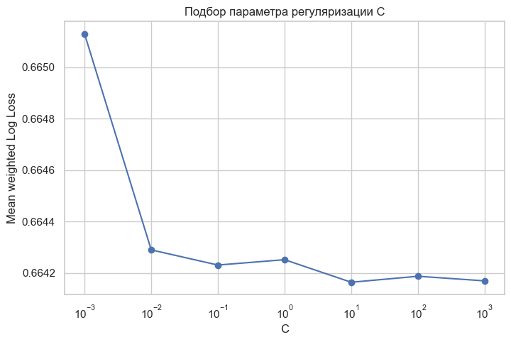
    


```python
final_model = make_logistic_model(C=best_C)

final_model.fit(
    X_train,
    y_train,
    model__sample_weight=w_train
)

valid_prob = final_model.predict_proba(X_valid)[:, 1]

valid_prob[:10]
```


    array([0.00376467, 0.00736027, 0.00592797, 0.00356361, 0.00472466,
           0.00573689, 0.00564944, 0.00635034, 0.00759088, 0.00845737])


```python
roc_auc = roc_auc_score(
    y_valid,
    valid_prob,
    sample_weight=w_valid
)

pr_auc = average_precision_score(
    y_valid,
    valid_prob,
    sample_weight=w_valid
)

valid_logloss = log_loss(
    y_valid,
    valid_prob,
    sample_weight=w_valid,
    labels=[0, 1]
)

brier = brier_score_loss(
    y_valid,
    valid_prob,
    sample_weight=w_valid
)

metrics_table = pd.DataFrame({
    "Метрика": [
        "ROC-AUC",
        "PR-AUC / Average Precision",
        "Log Loss",
        "Brier Score"
    ],
    "Значение": [
        roc_auc,
        pr_auc,
        valid_logloss,
        brier
    ]
})

metrics_table
```


<div>
<style scoped>
    .dataframe tbody tr th:only-of-type {
        vertical-align: middle;
    }

    .dataframe tbody tr th {
        vertical-align: top;
    }

    .dataframe thead th {
        text-align: right;
    }
</style>
<table border="1" class="dataframe">
  <thead>
    <tr style="text-align: right;">
      <th></th>
      <th>Метрика</th>
      <th>Значение</th>
    </tr>
  </thead>
  <tbody>
    <tr>
      <th>0</th>
      <td>ROC-AUC</td>
      <td>0.636770</td>
    </tr>
    <tr>
      <th>1</th>
      <td>PR-AUC / Average Precision</td>
      <td>0.007941</td>
    </tr>
    <tr>
      <th>2</th>
      <td>Log Loss</td>
      <td>0.029882</td>
    </tr>
    <tr>
      <th>3</th>
      <td>Brier Score</td>
      <td>0.004774</td>
    </tr>
  </tbody>
</table>
</div>


```python
RocCurveDisplay.from_predictions(
    y_valid,
    valid_prob,
    sample_weight=w_valid
)

plt.title("ROC-кривая логистической регрессии")
plt.grid(True)
plt.show()
```


    
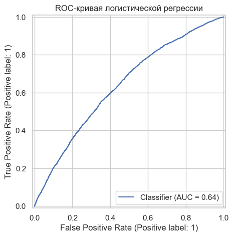
    


```python
PrecisionRecallDisplay.from_predictions(
    y_valid,
    valid_prob,
    sample_weight=w_valid
)

plt.title("Precision-Recall кривая")
plt.grid(True)
plt.show()
```


    
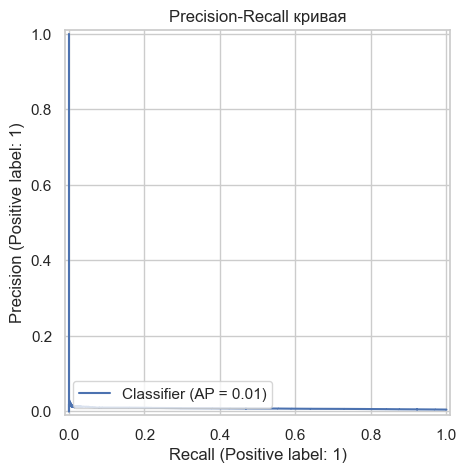
    


```python
train_prevalence = np.average(y_train, weights=w_train)

print(f"Взвешенная частота cancer=1 в train: {train_prevalence:.6f}")
```

    Взвешенная частота cancer=1 в train: 0.004884
    


```python
threshold = train_prevalence

valid_pred = (valid_prob >= threshold).astype(int)

cm = confusion_matrix(
    y_valid,
    valid_pred,
    sample_weight=w_valid
)

cm_table = pd.DataFrame(
    cm,
    index=["Факт: cancer=0", "Факт: cancer=1"],
    columns=["Прогноз: cancer=0", "Прогноз: cancer=1"]
)

cm_table
```


<div>
<style scoped>
    .dataframe tbody tr th:only-of-type {
        vertical-align: middle;
    }

    .dataframe tbody tr th {
        vertical-align: top;
    }

    .dataframe thead th {
        text-align: right;
    }
</style>
<table border="1" class="dataframe">
  <thead>
    <tr style="text-align: right;">
      <th></th>
      <th>Прогноз: cancer=0</th>
      <th>Прогноз: cancer=1</th>
    </tr>
  </thead>
  <tbody>
    <tr>
      <th>Факт: cancer=0</th>
      <td>344154</td>
      <td>250834</td>
    </tr>
    <tr>
      <th>Факт: cancer=1</th>
      <td>1104</td>
      <td>1767</td>
    </tr>
  </tbody>
</table>
</div>


```python
report = classification_report(
    y_valid,
    valid_pred,
    sample_weight=w_valid,
    zero_division=0,
    output_dict=True
)

pd.DataFrame(report).T
```


<div>
<style scoped>
    .dataframe tbody tr th:only-of-type {
        vertical-align: middle;
    }

    .dataframe tbody tr th {
        vertical-align: top;
    }

    .dataframe thead th {
        text-align: right;
    }
</style>
<table border="1" class="dataframe">
  <thead>
    <tr style="text-align: right;">
      <th></th>
      <th>precision</th>
      <th>recall</th>
      <th>f1-score</th>
      <th>support</th>
    </tr>
  </thead>
  <tbody>
    <tr>
      <th>0</th>
      <td>0.996802</td>
      <td>0.578422</td>
      <td>0.732051</td>
      <td>594988.0000</td>
    </tr>
    <tr>
      <th>1</th>
      <td>0.006995</td>
      <td>0.615465</td>
      <td>0.013833</td>
      <td>2871.0000</td>
    </tr>
    <tr>
      <th>accuracy</th>
      <td>0.578600</td>
      <td>0.578600</td>
      <td>0.578600</td>
      <td>0.5786</td>
    </tr>
    <tr>
      <th>macro avg</th>
      <td>0.501899</td>
      <td>0.596943</td>
      <td>0.372942</td>
      <td>597859.0000</td>
    </tr>
    <tr>
      <th>weighted avg</th>
      <td>0.992049</td>
      <td>0.578600</td>
      <td>0.728602</td>
      <td>597859.0000</td>
    </tr>
  </tbody>
</table>
</div>


```python
def weighted_calibration_table(y_true, y_prob, weights, n_bins=10):
    df = pd.DataFrame({
        "y_true": y_true,
        "y_prob": y_prob,
        "weight": weights
    })
    
    df["bin"] = pd.qcut(
        df["y_prob"],
        q=n_bins,
        duplicates="drop"
    )
    
    rows = []
    
    for interval, part in df.groupby("bin", observed=True):
        mean_predicted = np.average(
            part["y_prob"],
            weights=part["weight"]
        )
        
        observed_rate = np.average(
            part["y_true"],
            weights=part["weight"]
        )
        
        rows.append({
            "risk_bin": str(interval),
            "weighted_count": part["weight"].sum(),
            "mean_predicted_risk": mean_predicted,
            "observed_cancer_rate": observed_rate
        })
    
    return pd.DataFrame(rows)

calibration_table = weighted_calibration_table(
    y_valid,
    valid_prob,
    w_valid,
    n_bins=10
)

calibration_table
```


<div>
<style scoped>
    .dataframe tbody tr th:only-of-type {
        vertical-align: middle;
    }

    .dataframe tbody tr th {
        vertical-align: top;
    }

    .dataframe thead th {
        text-align: right;
    }
</style>
<table border="1" class="dataframe">
  <thead>
    <tr style="text-align: right;">
      <th></th>
      <th>risk_bin</th>
      <th>weighted_count</th>
      <th>mean_predicted_risk</th>
      <th>observed_cancer_rate</th>
    </tr>
  </thead>
  <tbody>
    <tr>
      <th>0</th>
      <td>(-0.00051, 0.00238]</td>
      <td>89781</td>
      <td>0.001764</td>
      <td>0.002005</td>
    </tr>
    <tr>
      <th>1</th>
      <td>(0.00238, 0.00316]</td>
      <td>76345</td>
      <td>0.002785</td>
      <td>0.002659</td>
    </tr>
    <tr>
      <th>2</th>
      <td>(0.00316, 0.00388]</td>
      <td>79952</td>
      <td>0.003530</td>
      <td>0.003114</td>
    </tr>
    <tr>
      <th>3</th>
      <td>(0.00388, 0.00458]</td>
      <td>69496</td>
      <td>0.004226</td>
      <td>0.004533</td>
    </tr>
    <tr>
      <th>4</th>
      <td>(0.00458, 0.00533]</td>
      <td>66865</td>
      <td>0.004934</td>
      <td>0.004771</td>
    </tr>
    <tr>
      <th>5</th>
      <td>(0.00533, 0.00616]</td>
      <td>62896</td>
      <td>0.005727</td>
      <td>0.005915</td>
    </tr>
    <tr>
      <th>6</th>
      <td>(0.00616, 0.00717]</td>
      <td>55287</td>
      <td>0.006640</td>
      <td>0.006946</td>
    </tr>
    <tr>
      <th>7</th>
      <td>(0.00717, 0.00849]</td>
      <td>46111</td>
      <td>0.007768</td>
      <td>0.007612</td>
    </tr>
    <tr>
      <th>8</th>
      <td>(0.00849, 0.0106]</td>
      <td>32420</td>
      <td>0.009356</td>
      <td>0.009254</td>
    </tr>
    <tr>
      <th>9</th>
      <td>(0.0106, 0.0414]</td>
      <td>18706</td>
      <td>0.012809</td>
      <td>0.010585</td>
    </tr>
  </tbody>
</table>
</div>


```python
plt.figure(figsize=(6, 6))

plt.plot(
    calibration_table["mean_predicted_risk"],
    calibration_table["observed_cancer_rate"],
    marker="o",
    label="Модель"
)

plt.plot(
    [0, calibration_table["mean_predicted_risk"].max()],
    [0, calibration_table["mean_predicted_risk"].max()],
    linestyle="--",
    label="Идеальная калибровка"
)

plt.xlabel("Средний предсказанный риск")
plt.ylabel("Фактическая доля cancer=1")
plt.title("Калибровка модели")
plt.legend()
plt.grid(True)
plt.show()
```


    
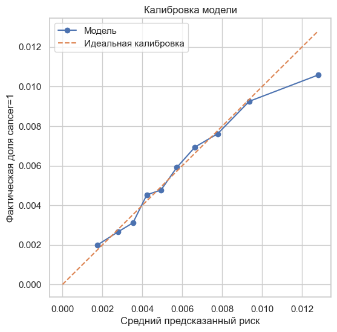
    


```python
valid_results = valid_df.copy()
valid_results["predicted_risk"] = valid_prob

valid_results[[
    "menopaus",
    "agegrp",
    "density",
    "race",
    "bmi",
    "nrelbc",
    "brstproc",
    "cancer",
    "count",
    "predicted_risk"
]].head(20)
```


<div>
<style scoped>
    .dataframe tbody tr th:only-of-type {
        vertical-align: middle;
    }

    .dataframe tbody tr th {
        vertical-align: top;
    }

    .dataframe thead th {
        text-align: right;
    }
</style>
<table border="1" class="dataframe">
  <thead>
    <tr style="text-align: right;">
      <th></th>
      <th>menopaus</th>
      <th>agegrp</th>
      <th>density</th>
      <th>race</th>
      <th>bmi</th>
      <th>nrelbc</th>
      <th>brstproc</th>
      <th>cancer</th>
      <th>count</th>
      <th>predicted_risk</th>
    </tr>
  </thead>
  <tbody>
    <tr>
      <th>1</th>
      <td>0</td>
      <td>1</td>
      <td>1</td>
      <td>1</td>
      <td>1</td>
      <td>0</td>
      <td>0</td>
      <td>0</td>
      <td>2</td>
      <td>0.003765</td>
    </tr>
    <tr>
      <th>10</th>
      <td>0</td>
      <td>1</td>
      <td>1</td>
      <td>1</td>
      <td>1</td>
      <td>2</td>
      <td>0</td>
      <td>0</td>
      <td>1</td>
      <td>0.007360</td>
    </tr>
    <tr>
      <th>18</th>
      <td>0</td>
      <td>1</td>
      <td>1</td>
      <td>1</td>
      <td>1</td>
      <td>1</td>
      <td>0</td>
      <td>0</td>
      <td>1</td>
      <td>0.005928</td>
    </tr>
    <tr>
      <th>19</th>
      <td>0</td>
      <td>1</td>
      <td>1</td>
      <td>1</td>
      <td>2</td>
      <td>0</td>
      <td>0</td>
      <td>0</td>
      <td>3</td>
      <td>0.003564</td>
    </tr>
    <tr>
      <th>22</th>
      <td>0</td>
      <td>1</td>
      <td>1</td>
      <td>1</td>
      <td>2</td>
      <td>0</td>
      <td>1</td>
      <td>0</td>
      <td>1</td>
      <td>0.004725</td>
    </tr>
    <tr>
      <th>23</th>
      <td>0</td>
      <td>1</td>
      <td>1</td>
      <td>1</td>
      <td>2</td>
      <td>0</td>
      <td>1</td>
      <td>0</td>
      <td>1</td>
      <td>0.005737</td>
    </tr>
    <tr>
      <th>27</th>
      <td>0</td>
      <td>1</td>
      <td>1</td>
      <td>1</td>
      <td>2</td>
      <td>1</td>
      <td>0</td>
      <td>0</td>
      <td>1</td>
      <td>0.005649</td>
    </tr>
    <tr>
      <th>33</th>
      <td>0</td>
      <td>1</td>
      <td>1</td>
      <td>1</td>
      <td>2</td>
      <td>0</td>
      <td>1</td>
      <td>0</td>
      <td>1</td>
      <td>0.006350</td>
    </tr>
    <tr>
      <th>35</th>
      <td>0</td>
      <td>1</td>
      <td>1</td>
      <td>1</td>
      <td>2</td>
      <td>1</td>
      <td>0</td>
      <td>0</td>
      <td>1</td>
      <td>0.007591</td>
    </tr>
    <tr>
      <th>36</th>
      <td>0</td>
      <td>1</td>
      <td>1</td>
      <td>1</td>
      <td>2</td>
      <td>2</td>
      <td>0</td>
      <td>0</td>
      <td>1</td>
      <td>0.008457</td>
    </tr>
    <tr>
      <th>43</th>
      <td>0</td>
      <td>1</td>
      <td>1</td>
      <td>1</td>
      <td>2</td>
      <td>0</td>
      <td>1</td>
      <td>0</td>
      <td>1</td>
      <td>0.006918</td>
    </tr>
    <tr>
      <th>44</th>
      <td>0</td>
      <td>1</td>
      <td>1</td>
      <td>1</td>
      <td>2</td>
      <td>1</td>
      <td>0</td>
      <td>0</td>
      <td>2</td>
      <td>0.005612</td>
    </tr>
    <tr>
      <th>47</th>
      <td>0</td>
      <td>1</td>
      <td>1</td>
      <td>1</td>
      <td>3</td>
      <td>0</td>
      <td>0</td>
      <td>0</td>
      <td>1</td>
      <td>0.004058</td>
    </tr>
    <tr>
      <th>49</th>
      <td>0</td>
      <td>1</td>
      <td>1</td>
      <td>1</td>
      <td>3</td>
      <td>0</td>
      <td>0</td>
      <td>0</td>
      <td>4</td>
      <td>0.004928</td>
    </tr>
    <tr>
      <th>51</th>
      <td>0</td>
      <td>1</td>
      <td>1</td>
      <td>1</td>
      <td>3</td>
      <td>0</td>
      <td>1</td>
      <td>0</td>
      <td>1</td>
      <td>0.005379</td>
    </tr>
    <tr>
      <th>53</th>
      <td>0</td>
      <td>1</td>
      <td>1</td>
      <td>1</td>
      <td>3</td>
      <td>1</td>
      <td>0</td>
      <td>0</td>
      <td>3</td>
      <td>0.005297</td>
    </tr>
    <tr>
      <th>55</th>
      <td>0</td>
      <td>1</td>
      <td>1</td>
      <td>1</td>
      <td>3</td>
      <td>1</td>
      <td>0</td>
      <td>0</td>
      <td>1</td>
      <td>0.006431</td>
    </tr>
    <tr>
      <th>57</th>
      <td>0</td>
      <td>1</td>
      <td>1</td>
      <td>1</td>
      <td>3</td>
      <td>0</td>
      <td>0</td>
      <td>0</td>
      <td>1</td>
      <td>0.005455</td>
    </tr>
    <tr>
      <th>62</th>
      <td>0</td>
      <td>1</td>
      <td>1</td>
      <td>1</td>
      <td>3</td>
      <td>0</td>
      <td>0</td>
      <td>0</td>
      <td>1</td>
      <td>0.004656</td>
    </tr>
    <tr>
      <th>64</th>
      <td>0</td>
      <td>1</td>
      <td>1</td>
      <td>1</td>
      <td>3</td>
      <td>0</td>
      <td>0</td>
      <td>0</td>
      <td>1</td>
      <td>0.005653</td>
    </tr>
  </tbody>
</table>
</div>


```python
risk_deciles = weighted_calibration_table(
    y_valid,
    valid_prob,
    w_valid,
    n_bins=10
)

risk_deciles
```


<div>
<style scoped>
    .dataframe tbody tr th:only-of-type {
        vertical-align: middle;
    }

    .dataframe tbody tr th {
        vertical-align: top;
    }

    .dataframe thead th {
        text-align: right;
    }
</style>
<table border="1" class="dataframe">
  <thead>
    <tr style="text-align: right;">
      <th></th>
      <th>risk_bin</th>
      <th>weighted_count</th>
      <th>mean_predicted_risk</th>
      <th>observed_cancer_rate</th>
    </tr>
  </thead>
  <tbody>
    <tr>
      <th>0</th>
      <td>(-0.00051, 0.00238]</td>
      <td>89781</td>
      <td>0.001764</td>
      <td>0.002005</td>
    </tr>
    <tr>
      <th>1</th>
      <td>(0.00238, 0.00316]</td>
      <td>76345</td>
      <td>0.002785</td>
      <td>0.002659</td>
    </tr>
    <tr>
      <th>2</th>
      <td>(0.00316, 0.00388]</td>
      <td>79952</td>
      <td>0.003530</td>
      <td>0.003114</td>
    </tr>
    <tr>
      <th>3</th>
      <td>(0.00388, 0.00458]</td>
      <td>69496</td>
      <td>0.004226</td>
      <td>0.004533</td>
    </tr>
    <tr>
      <th>4</th>
      <td>(0.00458, 0.00533]</td>
      <td>66865</td>
      <td>0.004934</td>
      <td>0.004771</td>
    </tr>
    <tr>
      <th>5</th>
      <td>(0.00533, 0.00616]</td>
      <td>62896</td>
      <td>0.005727</td>
      <td>0.005915</td>
    </tr>
    <tr>
      <th>6</th>
      <td>(0.00616, 0.00717]</td>
      <td>55287</td>
      <td>0.006640</td>
      <td>0.006946</td>
    </tr>
    <tr>
      <th>7</th>
      <td>(0.00717, 0.00849]</td>
      <td>46111</td>
      <td>0.007768</td>
      <td>0.007612</td>
    </tr>
    <tr>
      <th>8</th>
      <td>(0.00849, 0.0106]</td>
      <td>32420</td>
      <td>0.009356</td>
      <td>0.009254</td>
    </tr>
    <tr>
      <th>9</th>
      <td>(0.0106, 0.0414]</td>
      <td>18706</td>
      <td>0.012809</td>
      <td>0.010585</td>
    </tr>
  </tbody>
</table>
</div>


```python
value_labels = {
    "menopaus": {
        0: "premenopausal",
        1: "postmenopausal_or_age_55_plus",
        9: "unknown"
    },
    "agegrp": {
        1: "35-39",
        2: "40-44",
        3: "45-49",
        4: "50-54",
        5: "55-59",
        6: "60-64",
        7: "65-69",
        8: "70-74",
        9: "75-79",
        10: "80-84"
    },
    "density": {
        1: "almost_entirely_fat",
        2: "scattered_fibroglandular",
        3: "heterogeneously_dense",
        4: "extremely_dense",
        9: "unknown"
    },
    "race": {
        1: "white",
        2: "asian_pacific_islander",
        3: "black",
        4: "native_american",
        5: "other_mixed",
        9: "unknown"
    },
    "Hispanic": {
        0: "no",
        1: "yes",
        9: "unknown"
    },
    "bmi": {
        1: "10-24.99",
        2: "25-29.99",
        3: "30-34.99",
        4: "35_or_more",
        9: "unknown"
    },
    "agefirst": {
        0: "age_first_birth_under_30",
        1: "age_first_birth_30_or_more",
        2: "nulliparous",
        9: "unknown"
    },
    "nrelbc": {
        0: "zero",
        1: "one",
        2: "two_or_more",
        9: "unknown"
    },
    "brstproc": {
        0: "no",
        1: "yes",
        9: "unknown"
    },
    "lastmamm": {
        0: "negative",
        1: "false_positive",
        9: "unknown"
    },
    "surgmeno": {
        0: "natural",
        1: "surgical",
        9: "unknown_or_not_menopausal"
    },
    "hrt": {
        0: "no",
        1: "yes",
        9: "unknown_or_not_menopausal"
    }
}
```


```python
ohe = final_model.named_steps["preprocess"].named_transformers_["cat"]
model = final_model.named_steps["model"]

encoded_feature_names = final_model.named_steps["preprocess"].get_feature_names_out()
coefficients = model.coef_[0]

coef_table = pd.DataFrame({
    "encoded_feature": encoded_feature_names,
    "coef": coefficients
})

coef_table["odds_ratio"] = np.exp(coef_table["coef"])
coef_table["abs_coef"] = coef_table["coef"].abs()

coef_table.head()
```


<div>
<style scoped>
    .dataframe tbody tr th:only-of-type {
        vertical-align: middle;
    }

    .dataframe tbody tr th {
        vertical-align: top;
    }

    .dataframe thead th {
        text-align: right;
    }
</style>
<table border="1" class="dataframe">
  <thead>
    <tr style="text-align: right;">
      <th></th>
      <th>encoded_feature</th>
      <th>coef</th>
      <th>odds_ratio</th>
      <th>abs_coef</th>
    </tr>
  </thead>
  <tbody>
    <tr>
      <th>0</th>
      <td>cat__menopaus_1</td>
      <td>-0.004111</td>
      <td>0.995897</td>
      <td>0.004111</td>
    </tr>
    <tr>
      <th>1</th>
      <td>cat__menopaus_9</td>
      <td>0.058200</td>
      <td>1.059926</td>
      <td>0.058200</td>
    </tr>
    <tr>
      <th>2</th>
      <td>cat__agegrp_2</td>
      <td>-1.389294</td>
      <td>0.249251</td>
      <td>1.389294</td>
    </tr>
    <tr>
      <th>3</th>
      <td>cat__agegrp_3</td>
      <td>-0.776530</td>
      <td>0.459999</td>
      <td>0.776530</td>
    </tr>
    <tr>
      <th>4</th>
      <td>cat__agegrp_4</td>
      <td>-0.532273</td>
      <td>0.587269</td>
      <td>0.532273</td>
    </tr>
  </tbody>
</table>
</div>


```python
reference_categories = {}

for variable, categories in zip(features, ohe.categories_):
    reference_categories[variable] = categories[0]

reference_categories
```


    {'menopaus': np.int64(0),
     'agegrp': np.int64(1),
     'density': np.int64(1),
     'race': np.int64(1),
     'Hispanic': np.int64(0),
     'bmi': np.int64(1),
     'agefirst': np.int64(0),
     'nrelbc': np.int64(0),
     'brstproc': np.int64(0),
     'lastmamm': np.int64(0),
     'surgmeno': np.int64(0),
     'hrt': np.int64(0)}


```python
def parse_encoded_feature(encoded_name):
    name = encoded_name.replace("cat__", "")
    variable, category = name.rsplit("_", 1)
    
    try:
        category = int(category)
    except ValueError:
        pass
    
    reference = reference_categories.get(variable)
    
    category_label = value_labels.get(variable, {}).get(category, str(category))
    reference_label = value_labels.get(variable, {}).get(reference, str(reference))
    
    return pd.Series({
        "variable": variable,
        "category": category,
        "category_label": category_label,
        "reference_category": reference,
        "reference_label": reference_label
    })

parsed_features = coef_table["encoded_feature"].apply(parse_encoded_feature)

interpretation_table = pd.concat(
    [parsed_features, coef_table],
    axis=1
)

interpretation_table = interpretation_table[[
    "variable",
    "category",
    "category_label",
    "reference_category",
    "reference_label",
    "coef",
    "odds_ratio",
    "abs_coef"
]]

interpretation_table.sort_values(
    by="abs_coef",
    ascending=False
).head(30)
```


<div>
<style scoped>
    .dataframe tbody tr th:only-of-type {
        vertical-align: middle;
    }

    .dataframe tbody tr th {
        vertical-align: top;
    }

    .dataframe thead th {
        text-align: right;
    }
</style>
<table border="1" class="dataframe">
  <thead>
    <tr style="text-align: right;">
      <th></th>
      <th>variable</th>
      <th>category</th>
      <th>category_label</th>
      <th>reference_category</th>
      <th>reference_label</th>
      <th>coef</th>
      <th>odds_ratio</th>
      <th>abs_coef</th>
    </tr>
  </thead>
  <tbody>
    <tr>
      <th>2</th>
      <td>agegrp</td>
      <td>2</td>
      <td>40-44</td>
      <td>1</td>
      <td>35-39</td>
      <td>-1.389294</td>
      <td>0.249251</td>
      <td>1.389294</td>
    </tr>
    <tr>
      <th>13</th>
      <td>density</td>
      <td>4</td>
      <td>extremely_dense</td>
      <td>1</td>
      <td>almost_entirely_fat</td>
      <td>0.857709</td>
      <td>2.357752</td>
      <td>0.857709</td>
    </tr>
    <tr>
      <th>3</th>
      <td>agegrp</td>
      <td>3</td>
      <td>45-49</td>
      <td>1</td>
      <td>35-39</td>
      <td>-0.776530</td>
      <td>0.459999</td>
      <td>0.776530</td>
    </tr>
    <tr>
      <th>14</th>
      <td>density</td>
      <td>9</td>
      <td>unknown</td>
      <td>1</td>
      <td>almost_entirely_fat</td>
      <td>0.666462</td>
      <td>1.947336</td>
      <td>0.666462</td>
    </tr>
    <tr>
      <th>12</th>
      <td>density</td>
      <td>3</td>
      <td>heterogeneously_dense</td>
      <td>1</td>
      <td>almost_entirely_fat</td>
      <td>0.662179</td>
      <td>1.939013</td>
      <td>0.662179</td>
    </tr>
    <tr>
      <th>34</th>
      <td>lastmamm</td>
      <td>1</td>
      <td>false_positive</td>
      <td>0</td>
      <td>negative</td>
      <td>0.648903</td>
      <td>1.913441</td>
      <td>0.648903</td>
    </tr>
    <tr>
      <th>30</th>
      <td>nrelbc</td>
      <td>2</td>
      <td>two_or_more</td>
      <td>0</td>
      <td>zero</td>
      <td>0.571843</td>
      <td>1.771528</td>
      <td>0.571843</td>
    </tr>
    <tr>
      <th>4</th>
      <td>agegrp</td>
      <td>4</td>
      <td>50-54</td>
      <td>1</td>
      <td>35-39</td>
      <td>-0.532273</td>
      <td>0.587269</td>
      <td>0.532273</td>
    </tr>
    <tr>
      <th>17</th>
      <td>race</td>
      <td>4</td>
      <td>native_american</td>
      <td>1</td>
      <td>white</td>
      <td>-0.423227</td>
      <td>0.654930</td>
      <td>0.423227</td>
    </tr>
    <tr>
      <th>10</th>
      <td>agegrp</td>
      <td>10</td>
      <td>80-84</td>
      <td>1</td>
      <td>35-39</td>
      <td>0.365622</td>
      <td>1.441411</td>
      <td>0.365622</td>
    </tr>
    <tr>
      <th>11</th>
      <td>density</td>
      <td>2</td>
      <td>scattered_fibroglandular</td>
      <td>1</td>
      <td>almost_entirely_fat</td>
      <td>0.344752</td>
      <td>1.411640</td>
      <td>0.344752</td>
    </tr>
    <tr>
      <th>26</th>
      <td>agefirst</td>
      <td>1</td>
      <td>age_first_birth_30_or_more</td>
      <td>0</td>
      <td>age_first_birth_under_30</td>
      <td>0.297346</td>
      <td>1.346281</td>
      <td>0.297346</td>
    </tr>
    <tr>
      <th>24</th>
      <td>bmi</td>
      <td>4</td>
      <td>35_or_more</td>
      <td>1</td>
      <td>10-24.99</td>
      <td>0.286944</td>
      <td>1.332349</td>
      <td>0.286944</td>
    </tr>
    <tr>
      <th>32</th>
      <td>brstproc</td>
      <td>1</td>
      <td>yes</td>
      <td>0</td>
      <td>no</td>
      <td>0.283189</td>
      <td>1.327356</td>
      <td>0.283189</td>
    </tr>
    <tr>
      <th>39</th>
      <td>hrt</td>
      <td>9</td>
      <td>unknown_or_not_menopausal</td>
      <td>0</td>
      <td>no</td>
      <td>0.275860</td>
      <td>1.317663</td>
      <td>0.275860</td>
    </tr>
    <tr>
      <th>23</th>
      <td>bmi</td>
      <td>3</td>
      <td>30-34.99</td>
      <td>1</td>
      <td>10-24.99</td>
      <td>0.270340</td>
      <td>1.310410</td>
      <td>0.270340</td>
    </tr>
    <tr>
      <th>29</th>
      <td>nrelbc</td>
      <td>1</td>
      <td>one</td>
      <td>0</td>
      <td>zero</td>
      <td>0.267740</td>
      <td>1.307007</td>
      <td>0.267740</td>
    </tr>
    <tr>
      <th>20</th>
      <td>Hispanic</td>
      <td>1</td>
      <td>yes</td>
      <td>0</td>
      <td>no</td>
      <td>-0.261357</td>
      <td>0.770006</td>
      <td>0.261357</td>
    </tr>
    <tr>
      <th>9</th>
      <td>agegrp</td>
      <td>9</td>
      <td>75-79</td>
      <td>1</td>
      <td>35-39</td>
      <td>0.236208</td>
      <td>1.266437</td>
      <td>0.236208</td>
    </tr>
    <tr>
      <th>15</th>
      <td>race</td>
      <td>2</td>
      <td>asian_pacific_islander</td>
      <td>1</td>
      <td>white</td>
      <td>-0.206298</td>
      <td>0.813590</td>
      <td>0.206298</td>
    </tr>
    <tr>
      <th>37</th>
      <td>surgmeno</td>
      <td>9</td>
      <td>unknown_or_not_menopausal</td>
      <td>0</td>
      <td>natural</td>
      <td>-0.195812</td>
      <td>0.822167</td>
      <td>0.195812</td>
    </tr>
    <tr>
      <th>35</th>
      <td>lastmamm</td>
      <td>9</td>
      <td>unknown</td>
      <td>0</td>
      <td>negative</td>
      <td>0.195138</td>
      <td>1.215479</td>
      <td>0.195138</td>
    </tr>
    <tr>
      <th>36</th>
      <td>surgmeno</td>
      <td>1</td>
      <td>surgical</td>
      <td>0</td>
      <td>natural</td>
      <td>-0.189809</td>
      <td>0.827117</td>
      <td>0.189809</td>
    </tr>
    <tr>
      <th>28</th>
      <td>agefirst</td>
      <td>9</td>
      <td>unknown</td>
      <td>0</td>
      <td>age_first_birth_under_30</td>
      <td>0.188454</td>
      <td>1.207382</td>
      <td>0.188454</td>
    </tr>
    <tr>
      <th>5</th>
      <td>agegrp</td>
      <td>5</td>
      <td>55-59</td>
      <td>1</td>
      <td>35-39</td>
      <td>-0.182722</td>
      <td>0.833000</td>
      <td>0.182722</td>
    </tr>
    <tr>
      <th>38</th>
      <td>hrt</td>
      <td>1</td>
      <td>yes</td>
      <td>0</td>
      <td>no</td>
      <td>0.179549</td>
      <td>1.196678</td>
      <td>0.179549</td>
    </tr>
    <tr>
      <th>8</th>
      <td>agegrp</td>
      <td>8</td>
      <td>70-74</td>
      <td>1</td>
      <td>35-39</td>
      <td>0.167459</td>
      <td>1.182297</td>
      <td>0.167459</td>
    </tr>
    <tr>
      <th>16</th>
      <td>race</td>
      <td>3</td>
      <td>black</td>
      <td>1</td>
      <td>white</td>
      <td>0.143340</td>
      <td>1.154122</td>
      <td>0.143340</td>
    </tr>
    <tr>
      <th>22</th>
      <td>bmi</td>
      <td>2</td>
      <td>25-29.99</td>
      <td>1</td>
      <td>10-24.99</td>
      <td>0.140049</td>
      <td>1.150330</td>
      <td>0.140049</td>
    </tr>
    <tr>
      <th>27</th>
      <td>agefirst</td>
      <td>2</td>
      <td>nulliparous</td>
      <td>0</td>
      <td>age_first_birth_under_30</td>
      <td>0.138103</td>
      <td>1.148094</td>
      <td>0.138103</td>
    </tr>
  </tbody>
</table>
</div>


```python
positive_effects = interpretation_table[
    interpretation_table["odds_ratio"] > 1
].sort_values(
    by="odds_ratio",
    ascending=False
)

positive_effects.head(20)
```


<div>
<style scoped>
    .dataframe tbody tr th:only-of-type {
        vertical-align: middle;
    }

    .dataframe tbody tr th {
        vertical-align: top;
    }

    .dataframe thead th {
        text-align: right;
    }
</style>
<table border="1" class="dataframe">
  <thead>
    <tr style="text-align: right;">
      <th></th>
      <th>variable</th>
      <th>category</th>
      <th>category_label</th>
      <th>reference_category</th>
      <th>reference_label</th>
      <th>coef</th>
      <th>odds_ratio</th>
      <th>abs_coef</th>
    </tr>
  </thead>
  <tbody>
    <tr>
      <th>13</th>
      <td>density</td>
      <td>4</td>
      <td>extremely_dense</td>
      <td>1</td>
      <td>almost_entirely_fat</td>
      <td>0.857709</td>
      <td>2.357752</td>
      <td>0.857709</td>
    </tr>
    <tr>
      <th>14</th>
      <td>density</td>
      <td>9</td>
      <td>unknown</td>
      <td>1</td>
      <td>almost_entirely_fat</td>
      <td>0.666462</td>
      <td>1.947336</td>
      <td>0.666462</td>
    </tr>
    <tr>
      <th>12</th>
      <td>density</td>
      <td>3</td>
      <td>heterogeneously_dense</td>
      <td>1</td>
      <td>almost_entirely_fat</td>
      <td>0.662179</td>
      <td>1.939013</td>
      <td>0.662179</td>
    </tr>
    <tr>
      <th>34</th>
      <td>lastmamm</td>
      <td>1</td>
      <td>false_positive</td>
      <td>0</td>
      <td>negative</td>
      <td>0.648903</td>
      <td>1.913441</td>
      <td>0.648903</td>
    </tr>
    <tr>
      <th>30</th>
      <td>nrelbc</td>
      <td>2</td>
      <td>two_or_more</td>
      <td>0</td>
      <td>zero</td>
      <td>0.571843</td>
      <td>1.771528</td>
      <td>0.571843</td>
    </tr>
    <tr>
      <th>10</th>
      <td>agegrp</td>
      <td>10</td>
      <td>80-84</td>
      <td>1</td>
      <td>35-39</td>
      <td>0.365622</td>
      <td>1.441411</td>
      <td>0.365622</td>
    </tr>
    <tr>
      <th>11</th>
      <td>density</td>
      <td>2</td>
      <td>scattered_fibroglandular</td>
      <td>1</td>
      <td>almost_entirely_fat</td>
      <td>0.344752</td>
      <td>1.411640</td>
      <td>0.344752</td>
    </tr>
    <tr>
      <th>26</th>
      <td>agefirst</td>
      <td>1</td>
      <td>age_first_birth_30_or_more</td>
      <td>0</td>
      <td>age_first_birth_under_30</td>
      <td>0.297346</td>
      <td>1.346281</td>
      <td>0.297346</td>
    </tr>
    <tr>
      <th>24</th>
      <td>bmi</td>
      <td>4</td>
      <td>35_or_more</td>
      <td>1</td>
      <td>10-24.99</td>
      <td>0.286944</td>
      <td>1.332349</td>
      <td>0.286944</td>
    </tr>
    <tr>
      <th>32</th>
      <td>brstproc</td>
      <td>1</td>
      <td>yes</td>
      <td>0</td>
      <td>no</td>
      <td>0.283189</td>
      <td>1.327356</td>
      <td>0.283189</td>
    </tr>
    <tr>
      <th>39</th>
      <td>hrt</td>
      <td>9</td>
      <td>unknown_or_not_menopausal</td>
      <td>0</td>
      <td>no</td>
      <td>0.275860</td>
      <td>1.317663</td>
      <td>0.275860</td>
    </tr>
    <tr>
      <th>23</th>
      <td>bmi</td>
      <td>3</td>
      <td>30-34.99</td>
      <td>1</td>
      <td>10-24.99</td>
      <td>0.270340</td>
      <td>1.310410</td>
      <td>0.270340</td>
    </tr>
    <tr>
      <th>29</th>
      <td>nrelbc</td>
      <td>1</td>
      <td>one</td>
      <td>0</td>
      <td>zero</td>
      <td>0.267740</td>
      <td>1.307007</td>
      <td>0.267740</td>
    </tr>
    <tr>
      <th>9</th>
      <td>agegrp</td>
      <td>9</td>
      <td>75-79</td>
      <td>1</td>
      <td>35-39</td>
      <td>0.236208</td>
      <td>1.266437</td>
      <td>0.236208</td>
    </tr>
    <tr>
      <th>35</th>
      <td>lastmamm</td>
      <td>9</td>
      <td>unknown</td>
      <td>0</td>
      <td>negative</td>
      <td>0.195138</td>
      <td>1.215479</td>
      <td>0.195138</td>
    </tr>
    <tr>
      <th>28</th>
      <td>agefirst</td>
      <td>9</td>
      <td>unknown</td>
      <td>0</td>
      <td>age_first_birth_under_30</td>
      <td>0.188454</td>
      <td>1.207382</td>
      <td>0.188454</td>
    </tr>
    <tr>
      <th>38</th>
      <td>hrt</td>
      <td>1</td>
      <td>yes</td>
      <td>0</td>
      <td>no</td>
      <td>0.179549</td>
      <td>1.196678</td>
      <td>0.179549</td>
    </tr>
    <tr>
      <th>8</th>
      <td>agegrp</td>
      <td>8</td>
      <td>70-74</td>
      <td>1</td>
      <td>35-39</td>
      <td>0.167459</td>
      <td>1.182297</td>
      <td>0.167459</td>
    </tr>
    <tr>
      <th>16</th>
      <td>race</td>
      <td>3</td>
      <td>black</td>
      <td>1</td>
      <td>white</td>
      <td>0.143340</td>
      <td>1.154122</td>
      <td>0.143340</td>
    </tr>
    <tr>
      <th>22</th>
      <td>bmi</td>
      <td>2</td>
      <td>25-29.99</td>
      <td>1</td>
      <td>10-24.99</td>
      <td>0.140049</td>
      <td>1.150330</td>
      <td>0.140049</td>
    </tr>
  </tbody>
</table>
</div>


```python
negative_effects = interpretation_table[
    interpretation_table["odds_ratio"] < 1
].sort_values(
    by="odds_ratio",
    ascending=True
)

negative_effects.head(20)
```


<div>
<style scoped>
    .dataframe tbody tr th:only-of-type {
        vertical-align: middle;
    }

    .dataframe tbody tr th {
        vertical-align: top;
    }

    .dataframe thead th {
        text-align: right;
    }
</style>
<table border="1" class="dataframe">
  <thead>
    <tr style="text-align: right;">
      <th></th>
      <th>variable</th>
      <th>category</th>
      <th>category_label</th>
      <th>reference_category</th>
      <th>reference_label</th>
      <th>coef</th>
      <th>odds_ratio</th>
      <th>abs_coef</th>
    </tr>
  </thead>
  <tbody>
    <tr>
      <th>2</th>
      <td>agegrp</td>
      <td>2</td>
      <td>40-44</td>
      <td>1</td>
      <td>35-39</td>
      <td>-1.389294</td>
      <td>0.249251</td>
      <td>1.389294</td>
    </tr>
    <tr>
      <th>3</th>
      <td>agegrp</td>
      <td>3</td>
      <td>45-49</td>
      <td>1</td>
      <td>35-39</td>
      <td>-0.776530</td>
      <td>0.459999</td>
      <td>0.776530</td>
    </tr>
    <tr>
      <th>4</th>
      <td>agegrp</td>
      <td>4</td>
      <td>50-54</td>
      <td>1</td>
      <td>35-39</td>
      <td>-0.532273</td>
      <td>0.587269</td>
      <td>0.532273</td>
    </tr>
    <tr>
      <th>17</th>
      <td>race</td>
      <td>4</td>
      <td>native_american</td>
      <td>1</td>
      <td>white</td>
      <td>-0.423227</td>
      <td>0.654930</td>
      <td>0.423227</td>
    </tr>
    <tr>
      <th>20</th>
      <td>Hispanic</td>
      <td>1</td>
      <td>yes</td>
      <td>0</td>
      <td>no</td>
      <td>-0.261357</td>
      <td>0.770006</td>
      <td>0.261357</td>
    </tr>
    <tr>
      <th>15</th>
      <td>race</td>
      <td>2</td>
      <td>asian_pacific_islander</td>
      <td>1</td>
      <td>white</td>
      <td>-0.206298</td>
      <td>0.813590</td>
      <td>0.206298</td>
    </tr>
    <tr>
      <th>37</th>
      <td>surgmeno</td>
      <td>9</td>
      <td>unknown_or_not_menopausal</td>
      <td>0</td>
      <td>natural</td>
      <td>-0.195812</td>
      <td>0.822167</td>
      <td>0.195812</td>
    </tr>
    <tr>
      <th>36</th>
      <td>surgmeno</td>
      <td>1</td>
      <td>surgical</td>
      <td>0</td>
      <td>natural</td>
      <td>-0.189809</td>
      <td>0.827117</td>
      <td>0.189809</td>
    </tr>
    <tr>
      <th>5</th>
      <td>agegrp</td>
      <td>5</td>
      <td>55-59</td>
      <td>1</td>
      <td>35-39</td>
      <td>-0.182722</td>
      <td>0.833000</td>
      <td>0.182722</td>
    </tr>
    <tr>
      <th>25</th>
      <td>bmi</td>
      <td>9</td>
      <td>unknown</td>
      <td>1</td>
      <td>10-24.99</td>
      <td>-0.118047</td>
      <td>0.888655</td>
      <td>0.118047</td>
    </tr>
    <tr>
      <th>31</th>
      <td>nrelbc</td>
      <td>9</td>
      <td>unknown</td>
      <td>0</td>
      <td>zero</td>
      <td>-0.102295</td>
      <td>0.902763</td>
      <td>0.102295</td>
    </tr>
    <tr>
      <th>21</th>
      <td>Hispanic</td>
      <td>9</td>
      <td>unknown</td>
      <td>0</td>
      <td>no</td>
      <td>-0.067434</td>
      <td>0.934789</td>
      <td>0.067434</td>
    </tr>
    <tr>
      <th>6</th>
      <td>agegrp</td>
      <td>6</td>
      <td>60-64</td>
      <td>1</td>
      <td>35-39</td>
      <td>-0.044993</td>
      <td>0.956004</td>
      <td>0.044993</td>
    </tr>
    <tr>
      <th>33</th>
      <td>brstproc</td>
      <td>9</td>
      <td>unknown</td>
      <td>0</td>
      <td>no</td>
      <td>-0.007515</td>
      <td>0.992513</td>
      <td>0.007515</td>
    </tr>
    <tr>
      <th>0</th>
      <td>menopaus</td>
      <td>1</td>
      <td>postmenopausal_or_age_55_plus</td>
      <td>0</td>
      <td>premenopausal</td>
      <td>-0.004111</td>
      <td>0.995897</td>
      <td>0.004111</td>
    </tr>
  </tbody>
</table>
</div>


```python
top_interpretation = interpretation_table.sort_values(
    by="abs_coef",
    ascending=False
).head(20).copy()

plt.figure(figsize=(10, 7))

plt.barh(
    top_interpretation["variable"] + "=" + top_interpretation["category_label"],
    top_interpretation["coef"]
)

plt.xlabel("Коэффициент логистической регрессии")
plt.title("Наиболее сильные признаки по модулю коэффициента")
plt.gca().invert_yaxis()
plt.grid(True)
plt.show()
```


    
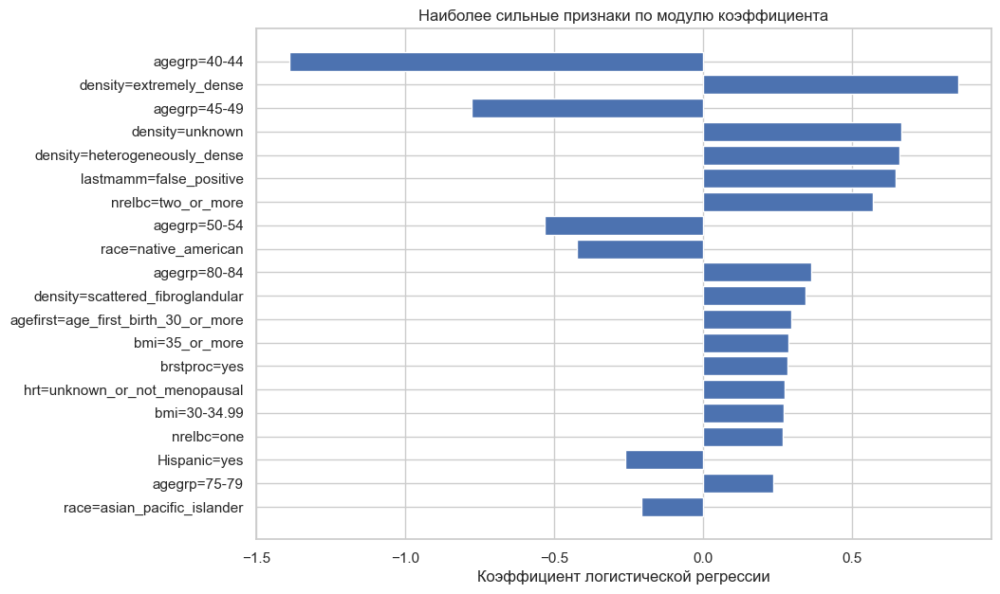
    


```python
top_or = interpretation_table.sort_values(
    by="abs_coef",
    ascending=False
).head(20).copy()

plt.figure(figsize=(10, 7))

plt.barh(
    top_or["variable"] + "=" + top_or["category_label"],
    top_or["odds_ratio"]
)

plt.axvline(1, linestyle="--")
plt.xlabel("Odds Ratio")
plt.title("Отношение шансов для наиболее значимых категорий")
plt.gca().invert_yaxis()
plt.grid(True)
plt.show()
```


    
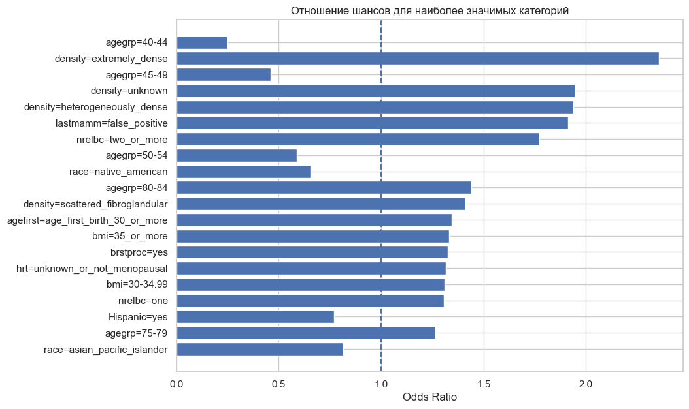
    


```python
import statsmodels.api as sm
import statsmodels.formula.api as smf
import numpy as np
import pandas as pd

glm_train_df = train_df.copy()

for col in features:
    glm_train_df[col] = glm_train_df[col].astype("category")

formula = "cancer ~ " + " + ".join(features)

formula
```


    'cancer ~ menopaus + agegrp + density + race + Hispanic + bmi + agefirst + nrelbc + brstproc + lastmamm + surgmeno + hrt'


```python
glm_model = smf.glm(
    formula=formula,
    data=glm_train_df,
    family=sm.families.Binomial(),
    freq_weights=glm_train_df["count"]
)

glm_result = glm_model.fit(maxiter=200)

print(glm_result.summary())
```

                     Generalized Linear Model Regression Results                  
    ==============================================================================
    Dep. Variable:                 cancer   No. Observations:               180465
    Model:                            GLM   Df Residuals:                  1795098
    Model Family:                Binomial   Df Model:                           40
    Link Function:                  Logit   Scale:                          1.0000
    Method:                          IRLS   Log-Likelihood:                -54273.
    Date:                Wed, 06 May 2026   Deviance:                   1.0855e+05
    Time:                        11:47:30   Pearson chi2:                 1.78e+06
    No. Iterations:                     9   Pseudo R-squ. (CS):            0.01243
    Covariance Type:            nonrobust                                         
    =================================================================================
                        coef    std err          z      P>|z|      [0.025      0.975]
    ---------------------------------------------------------------------------------
    Intercept        -7.5713      0.151    -50.166      0.000      -7.867      -7.275
    menopaus[T.1]    -0.1343      0.062     -2.163      0.031      -0.256      -0.013
    menopaus[T.9]     0.0776      0.058      1.346      0.178      -0.035       0.191
    agegrp[T.2]       0.1862      0.132      1.407      0.159      -0.073       0.445
    agegrp[T.3]       0.6143      0.129      4.749      0.000       0.361       0.868
    agegrp[T.4]       0.8942      0.131      6.843      0.000       0.638       1.150
    agegrp[T.5]       1.2762      0.135      9.427      0.000       1.011       1.542
    agegrp[T.6]       1.4049      0.136     10.340      0.000       1.139       1.671
    agegrp[T.7]       1.4927      0.136     10.962      0.000       1.226       1.760
    agegrp[T.8]       1.6186      0.136     11.870      0.000       1.351       1.886
    agegrp[T.9]       1.7158      0.137     12.486      0.000       1.446       1.985
    agegrp[T.10]      1.7834      0.142     12.589      0.000       1.506       2.061
    density[T.2]      0.7643      0.068     11.289      0.000       0.632       0.897
    density[T.3]      1.1271      0.068     16.581      0.000       0.994       1.260
    density[T.4]      1.2473      0.079     15.802      0.000       1.093       1.402
    density[T.9]      1.0910      0.069     15.926      0.000       0.957       1.225
    race[T.2]        -0.2016      0.060     -3.372      0.001      -0.319      -0.084
    race[T.3]         0.1022      0.051      2.012      0.044       0.003       0.202
    race[T.4]        -0.5590      0.128     -4.354      0.000      -0.811      -0.307
    race[T.5]         0.1130      0.114      0.993      0.321      -0.110       0.336
    race[T.9]         0.0537      0.043      1.259      0.208      -0.030       0.137
    Hispanic[T.1]    -0.2636      0.051     -5.132      0.000      -0.364      -0.163
    Hispanic[T.9]    -0.0534      0.038     -1.400      0.162      -0.128       0.021
    bmi[T.2]          0.1219      0.037      3.314      0.001       0.050       0.194
    bmi[T.3]          0.2021      0.049      4.151      0.000       0.107       0.298
    bmi[T.4]          0.3134      0.063      4.943      0.000       0.189       0.438
    bmi[T.9]         -0.0187      0.032     -0.578      0.563      -0.082       0.045
    agefirst[T.1]     0.1817      0.048      3.786      0.000       0.088       0.276
    agefirst[T.2]     0.1619      0.041      3.929      0.000       0.081       0.243
    agefirst[T.9]     0.0593      0.031      1.933      0.053      -0.001       0.119
    nrelbc[T.1]       0.3041      0.030     10.257      0.000       0.246       0.362
    nrelbc[T.2]       0.6086      0.095      6.374      0.000       0.421       0.796
    nrelbc[T.9]      -0.0609      0.035     -1.717      0.086      -0.131       0.009
    brstproc[T.1]     0.2578      0.026      9.854      0.000       0.207       0.309
    brstproc[T.9]     0.1034      0.040      2.553      0.011       0.024       0.183
    lastmamm[T.1]     0.5213      0.072      7.280      0.000       0.381       0.662
    lastmamm[T.9]     0.1671      0.026      6.535      0.000       0.117       0.217
    surgmeno[T.1]    -0.1391      0.031     -4.453      0.000      -0.200      -0.078
    surgmeno[T.9]    -0.1139      0.034     -3.399      0.001      -0.180      -0.048
    hrt[T.1]          0.1651      0.028      5.989      0.000       0.111       0.219
    hrt[T.9]          0.1509      0.042      3.609      0.000       0.069       0.233
    =================================================================================
    


```python
params = glm_result.params
conf_intervals = glm_result.conf_int()
p_values = glm_result.pvalues

or_ci_table = pd.DataFrame({
    "coef": params,
    "odds_ratio": np.exp(params),
    "ci_lower": np.exp(conf_intervals[0]),
    "ci_upper": np.exp(conf_intervals[1]),
    "p_value": p_values
})

or_ci_table = or_ci_table.drop(index="Intercept", errors="ignore")

or_ci_table = or_ci_table.sort_values(
    by="odds_ratio",
    ascending=False
)

or_ci_table.head(30)
```


<div>
<style scoped>
    .dataframe tbody tr th:only-of-type {
        vertical-align: middle;
    }

    .dataframe tbody tr th {
        vertical-align: top;
    }

    .dataframe thead th {
        text-align: right;
    }
</style>
<table border="1" class="dataframe">
  <thead>
    <tr style="text-align: right;">
      <th></th>
      <th>coef</th>
      <th>odds_ratio</th>
      <th>ci_lower</th>
      <th>ci_upper</th>
      <th>p_value</th>
    </tr>
  </thead>
  <tbody>
    <tr>
      <th>agegrp[T.10]</th>
      <td>1.783439</td>
      <td>5.950283</td>
      <td>4.507667</td>
      <td>7.854588</td>
      <td>2.424443e-36</td>
    </tr>
    <tr>
      <th>agegrp[T.9]</th>
      <td>1.715827</td>
      <td>5.561272</td>
      <td>4.248215</td>
      <td>7.280175</td>
      <td>8.848293e-36</td>
    </tr>
    <tr>
      <th>agegrp[T.8]</th>
      <td>1.618633</td>
      <td>5.046186</td>
      <td>3.862723</td>
      <td>6.592237</td>
      <td>1.688359e-32</td>
    </tr>
    <tr>
      <th>agegrp[T.7]</th>
      <td>1.492650</td>
      <td>4.448870</td>
      <td>3.406770</td>
      <td>5.809738</td>
      <td>5.833693e-28</td>
    </tr>
    <tr>
      <th>agegrp[T.6]</th>
      <td>1.404858</td>
      <td>4.074950</td>
      <td>3.122277</td>
      <td>5.318303</td>
      <td>4.650179e-25</td>
    </tr>
    <tr>
      <th>agegrp[T.5]</th>
      <td>1.276193</td>
      <td>3.582972</td>
      <td>2.747991</td>
      <td>4.671665</td>
      <td>4.205625e-21</td>
    </tr>
    <tr>
      <th>density[T.4]</th>
      <td>1.247287</td>
      <td>3.480885</td>
      <td>2.981959</td>
      <td>4.063289</td>
      <td>3.023567e-56</td>
    </tr>
    <tr>
      <th>density[T.3]</th>
      <td>1.127128</td>
      <td>3.086777</td>
      <td>2.701746</td>
      <td>3.526680</td>
      <td>9.498193e-62</td>
    </tr>
    <tr>
      <th>density[T.9]</th>
      <td>1.090997</td>
      <td>2.977242</td>
      <td>2.603164</td>
      <td>3.405075</td>
      <td>4.214571e-57</td>
    </tr>
    <tr>
      <th>agegrp[T.4]</th>
      <td>0.894151</td>
      <td>2.445258</td>
      <td>1.892767</td>
      <td>3.159017</td>
      <td>7.768149e-12</td>
    </tr>
    <tr>
      <th>density[T.2]</th>
      <td>0.764257</td>
      <td>2.147398</td>
      <td>1.880562</td>
      <td>2.452095</td>
      <td>1.484489e-29</td>
    </tr>
    <tr>
      <th>agegrp[T.3]</th>
      <td>0.614299</td>
      <td>1.848360</td>
      <td>1.434417</td>
      <td>2.381758</td>
      <td>2.046625e-06</td>
    </tr>
    <tr>
      <th>nrelbc[T.2]</th>
      <td>0.608621</td>
      <td>1.837894</td>
      <td>1.524191</td>
      <td>2.216163</td>
      <td>1.845565e-10</td>
    </tr>
    <tr>
      <th>lastmamm[T.1]</th>
      <td>0.521317</td>
      <td>1.684244</td>
      <td>1.463689</td>
      <td>1.938032</td>
      <td>3.344110e-13</td>
    </tr>
    <tr>
      <th>bmi[T.4]</th>
      <td>0.313402</td>
      <td>1.368072</td>
      <td>1.208191</td>
      <td>1.549110</td>
      <td>7.708675e-07</td>
    </tr>
    <tr>
      <th>nrelbc[T.1]</th>
      <td>0.304099</td>
      <td>1.355403</td>
      <td>1.278889</td>
      <td>1.436495</td>
      <td>1.096863e-24</td>
    </tr>
    <tr>
      <th>brstproc[T.1]</th>
      <td>0.257813</td>
      <td>1.294097</td>
      <td>1.229411</td>
      <td>1.362187</td>
      <td>6.574030e-23</td>
    </tr>
    <tr>
      <th>bmi[T.3]</th>
      <td>0.202127</td>
      <td>1.224003</td>
      <td>1.112587</td>
      <td>1.346577</td>
      <td>3.310894e-05</td>
    </tr>
    <tr>
      <th>agegrp[T.2]</th>
      <td>0.186190</td>
      <td>1.204651</td>
      <td>0.929502</td>
      <td>1.561247</td>
      <td>1.593174e-01</td>
    </tr>
    <tr>
      <th>agefirst[T.1]</th>
      <td>0.181655</td>
      <td>1.199201</td>
      <td>1.091576</td>
      <td>1.317436</td>
      <td>1.528887e-04</td>
    </tr>
    <tr>
      <th>lastmamm[T.9]</th>
      <td>0.167110</td>
      <td>1.181884</td>
      <td>1.124107</td>
      <td>1.242631</td>
      <td>6.370135e-11</td>
    </tr>
    <tr>
      <th>hrt[T.1]</th>
      <td>0.165088</td>
      <td>1.179497</td>
      <td>1.117461</td>
      <td>1.244977</td>
      <td>2.114281e-09</td>
    </tr>
    <tr>
      <th>agefirst[T.2]</th>
      <td>0.161922</td>
      <td>1.175768</td>
      <td>1.084525</td>
      <td>1.274687</td>
      <td>8.539042e-05</td>
    </tr>
    <tr>
      <th>hrt[T.9]</th>
      <td>0.150894</td>
      <td>1.162873</td>
      <td>1.071381</td>
      <td>1.262178</td>
      <td>3.073070e-04</td>
    </tr>
    <tr>
      <th>bmi[T.2]</th>
      <td>0.121861</td>
      <td>1.129597</td>
      <td>1.051055</td>
      <td>1.214007</td>
      <td>9.189842e-04</td>
    </tr>
    <tr>
      <th>race[T.5]</th>
      <td>0.112968</td>
      <td>1.119596</td>
      <td>0.895785</td>
      <td>1.399327</td>
      <td>3.208160e-01</td>
    </tr>
    <tr>
      <th>brstproc[T.9]</th>
      <td>0.103366</td>
      <td>1.108897</td>
      <td>1.024297</td>
      <td>1.200485</td>
      <td>1.068436e-02</td>
    </tr>
    <tr>
      <th>race[T.3]</th>
      <td>0.102207</td>
      <td>1.107612</td>
      <td>1.002664</td>
      <td>1.223546</td>
      <td>4.418297e-02</td>
    </tr>
    <tr>
      <th>menopaus[T.9]</th>
      <td>0.077646</td>
      <td>1.080740</td>
      <td>0.965196</td>
      <td>1.210115</td>
      <td>1.783292e-01</td>
    </tr>
    <tr>
      <th>agefirst[T.9]</th>
      <td>0.059278</td>
      <td>1.061070</td>
      <td>0.999188</td>
      <td>1.126786</td>
      <td>5.317964e-02</td>
    </tr>
  </tbody>
</table>
</div>


```python
tn, fp, fn, tp = cm.ravel()

accuracy = (tp + tn) / (tp + tn + fp + fn)
precision = tp / (tp + fp) if (tp + fp) > 0 else 0
recall = tp / (tp + fn) if (tp + fn) > 0 else 0
specificity = tn / (tn + fp) if (tn + fp) > 0 else 0
f1 = 2 * precision * recall / (precision + recall) if (precision + recall) > 0 else 0

classification_metrics = pd.DataFrame({
    "Метрика": [
        "Accuracy",
        "Precision",
        "Recall / Sensitivity",
        "Specificity",
        "F1-score"
    ],
    "Значение": [
        accuracy,
        precision,
        recall,
        specificity,
        f1
    ]
})

classification_metrics
```


<div>
<style scoped>
    .dataframe tbody tr th:only-of-type {
        vertical-align: middle;
    }

    .dataframe tbody tr th {
        vertical-align: top;
    }

    .dataframe thead th {
        text-align: right;
    }
</style>
<table border="1" class="dataframe">
  <thead>
    <tr style="text-align: right;">
      <th></th>
      <th>Метрика</th>
      <th>Значение</th>
    </tr>
  </thead>
  <tbody>
    <tr>
      <th>0</th>
      <td>Accuracy</td>
      <td>0.578600</td>
    </tr>
    <tr>
      <th>1</th>
      <td>Precision</td>
      <td>0.006995</td>
    </tr>
    <tr>
      <th>2</th>
      <td>Recall / Sensitivity</td>
      <td>0.615465</td>
    </tr>
    <tr>
      <th>3</th>
      <td>Specificity</td>
      <td>0.578422</td>
    </tr>
    <tr>
      <th>4</th>
      <td>F1-score</td>
      <td>0.013833</td>
    </tr>
  </tbody>
</table>
</div>


```python
plt.figure(figsize=(9, 5))

plt.bar(
    classification_metrics["Метрика"],
    classification_metrics["Значение"]
)

plt.ylim(0, 1)
plt.ylabel("Значение")
plt.title("Метрики качества классификации")

for i, value in enumerate(classification_metrics["Значение"]):
    plt.text(i, value + 0.02, f"{value:.3f}", ha="center")

plt.xticks(rotation=25, ha="right")
plt.grid(axis="y")
plt.tight_layout()
plt.show()
```


    
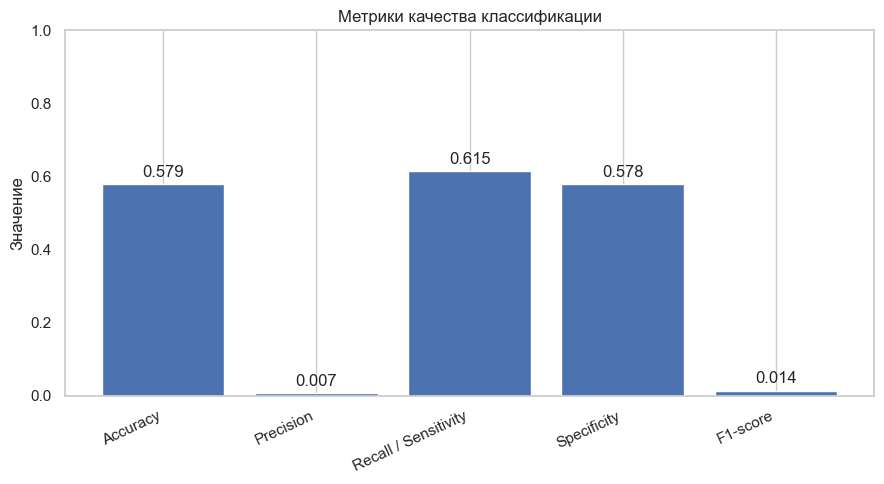
    


```python
import warnings
warnings.filterwarnings("ignore")

import numpy as np
import pandas as pd
import matplotlib.pyplot as plt

from sklearn.compose import ColumnTransformer
from sklearn.preprocessing import OneHotEncoder
from sklearn.pipeline import Pipeline
from sklearn.svm import LinearSVC
from sklearn.model_selection import StratifiedKFold
from sklearn.metrics import (
    roc_auc_score,
    average_precision_score,
    confusion_matrix,
    classification_report,
    RocCurveDisplay,
    PrecisionRecallDisplay,
    roc_curve
)
```


```python
try:
    encoder = OneHotEncoder(
        drop="first",
        handle_unknown="ignore",
        sparse_output=True
    )
except TypeError:
    encoder = OneHotEncoder(
        drop="first",
        handle_unknown="ignore",
        sparse=True
    )

preprocessor_svm = ColumnTransformer(
    transformers=[
        ("cat", encoder, features)
    ],
    remainder="drop"
)

def make_svm_model(C=1.0):
    model = Pipeline(
        steps=[
            ("preprocess", preprocessor_svm),
            ("svm", LinearSVC(
                C=C,
                penalty="l2",
                loss="squared_hinge",
                dual=False,
                max_iter=10000,
                random_state=42
            ))
        ]
    )
    
    return model
```


```python
svm_baseline = make_svm_model(C=1.0)

svm_baseline.fit(
    X_train,
    y_train,
    svm__sample_weight=w_train_balanced
)

valid_scores_baseline = svm_baseline.decision_function(X_valid)

baseline_auc = roc_auc_score(
    y_valid,
    valid_scores_baseline,
    sample_weight=w_valid
)

baseline_pr_auc = average_precision_score(
    y_valid,
    valid_scores_baseline,
    sample_weight=w_valid
)

print(f"Baseline SVM ROC-AUC: {baseline_auc:.4f}")
print(f"Baseline SVM PR-AUC: {baseline_pr_auc:.4f}")
```

    Baseline SVM ROC-AUC: 0.6447
    Baseline SVM PR-AUC: 0.0083
    


```python
C_grid = np.logspace(-3, 2, 6)

cv = StratifiedKFold(
    n_splits=5,
    shuffle=True,
    random_state=42
)

svm_cv_results = []

for C in C_grid:
    fold_auc = []
    fold_pr_auc = []
    
    for train_idx, val_idx in cv.split(X_train, y_train):
        X_tr = X_train.iloc[train_idx]
        y_tr = y_train.iloc[train_idx]
        w_tr = w_train.iloc[train_idx]
        
        X_val = X_train.iloc[val_idx]
        y_val = y_train.iloc[val_idx]
        w_val = w_train.iloc[val_idx]
        
        w_tr_balanced = make_balanced_weights(y_tr, w_tr)
        
        model = make_svm_model(C=C)
        
        model.fit(
            X_tr,
            y_tr,
            svm__sample_weight=w_tr_balanced
        )
        
        val_scores = model.decision_function(X_val)
        
        fold_auc.append(
            roc_auc_score(
                y_val,
                val_scores,
                sample_weight=w_val
            )
        )
        
        fold_pr_auc.append(
            average_precision_score(
                y_val,
                val_scores,
                sample_weight=w_val
            )
        )
    
    svm_cv_results.append({
        "C": C,
        "mean_roc_auc": np.mean(fold_auc),
        "std_roc_auc": np.std(fold_auc),
        "mean_pr_auc": np.mean(fold_pr_auc),
        "std_pr_auc": np.std(fold_pr_auc)
    })

svm_cv_results = pd.DataFrame(svm_cv_results)

svm_cv_results
```


<div>
<style scoped>
    .dataframe tbody tr th:only-of-type {
        vertical-align: middle;
    }

    .dataframe tbody tr th {
        vertical-align: top;
    }

    .dataframe thead th {
        text-align: right;
    }
</style>
<table border="1" class="dataframe">
  <thead>
    <tr style="text-align: right;">
      <th></th>
      <th>C</th>
      <th>mean_roc_auc</th>
      <th>std_roc_auc</th>
      <th>mean_pr_auc</th>
      <th>std_pr_auc</th>
    </tr>
  </thead>
  <tbody>
    <tr>
      <th>0</th>
      <td>0.001</td>
      <td>0.635367</td>
      <td>0.013980</td>
      <td>0.008210</td>
      <td>0.000421</td>
    </tr>
    <tr>
      <th>1</th>
      <td>0.010</td>
      <td>0.635598</td>
      <td>0.013890</td>
      <td>0.008217</td>
      <td>0.000423</td>
    </tr>
    <tr>
      <th>2</th>
      <td>0.100</td>
      <td>0.635631</td>
      <td>0.013888</td>
      <td>0.008218</td>
      <td>0.000425</td>
    </tr>
    <tr>
      <th>3</th>
      <td>1.000</td>
      <td>0.635625</td>
      <td>0.013886</td>
      <td>0.008218</td>
      <td>0.000425</td>
    </tr>
    <tr>
      <th>4</th>
      <td>10.000</td>
      <td>0.635626</td>
      <td>0.013886</td>
      <td>0.008218</td>
      <td>0.000425</td>
    </tr>
    <tr>
      <th>5</th>
      <td>100.000</td>
      <td>0.635626</td>
      <td>0.013887</td>
      <td>0.008218</td>
      <td>0.000425</td>
    </tr>
  </tbody>
</table>
</div>


```python
svm_cv_results_sorted = svm_cv_results.sort_values(
    by=["mean_roc_auc", "mean_pr_auc"],
    ascending=[False, False]
)

best_svm_C = svm_cv_results_sorted.iloc[0]["C"]

print("Лучшее значение C для SVM:", best_svm_C)

final_svm = make_svm_model(C=best_svm_C)

final_svm.fit(
    X_train,
    y_train,
    svm__sample_weight=w_train_balanced
)

train_scores = final_svm.decision_function(X_train)
valid_scores = final_svm.decision_function(X_valid)
```

    Лучшее значение C для SVM: 0.1
    


```python
plt.figure(figsize=(8, 5))
plt.plot(
    svm_cv_results["C"],
    svm_cv_results["mean_roc_auc"],
    marker="o"
)

plt.xscale("log")
plt.xlabel("C")
plt.ylabel("Mean weighted ROC-AUC")
plt.title("Подбор параметра C для линейного SVM")
plt.grid(True)
plt.show()
```


    
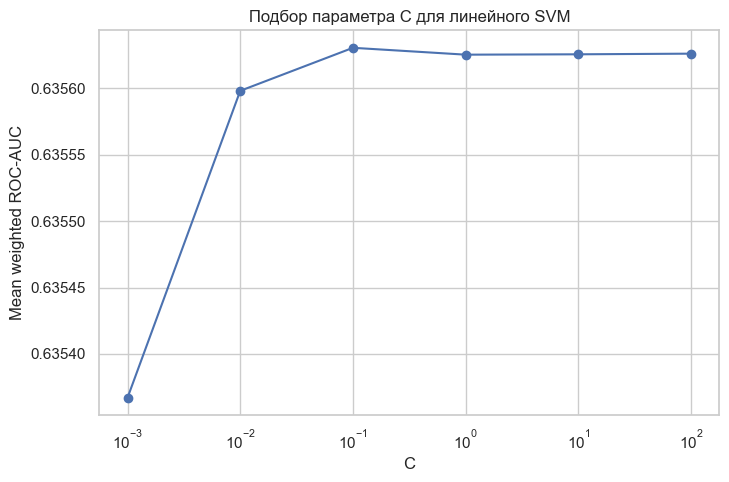
    


```python
final_svm = make_svm_model(C=best_svm_C)

final_svm.fit(
    X_train,
    y_train,
    svm__sample_weight=w_train
)

train_scores = final_svm.decision_function(X_train)
valid_scores = final_svm.decision_function(X_valid)

valid_scores[:10]
```


    array([-1.00558291, -0.99671502, -1.00158694, -1.00591748, -1.00300163,
           -1.00138941, -1.00091304, -1.00127099, -0.9991824 , -0.99543737])


```python
svm_roc_auc = roc_auc_score(
    y_valid,
    valid_scores,
    sample_weight=w_valid
)

svm_pr_auc = average_precision_score(
    y_valid,
    valid_scores,
    sample_weight=w_valid
)

svm_metrics_table = pd.DataFrame({
    "Метрика": [
        "ROC-AUC",
        "PR-AUC / Average Precision"
    ],
    "Значение": [
        svm_roc_auc,
        svm_pr_auc
    ]
})

svm_metrics_table
```


<div>
<style scoped>
    .dataframe tbody tr th:only-of-type {
        vertical-align: middle;
    }

    .dataframe tbody tr th {
        vertical-align: top;
    }

    .dataframe thead th {
        text-align: right;
    }
</style>
<table border="1" class="dataframe">
  <thead>
    <tr style="text-align: right;">
      <th></th>
      <th>Метрика</th>
      <th>Значение</th>
    </tr>
  </thead>
  <tbody>
    <tr>
      <th>0</th>
      <td>ROC-AUC</td>
      <td>0.645230</td>
    </tr>
    <tr>
      <th>1</th>
      <td>PR-AUC / Average Precision</td>
      <td>0.008229</td>
    </tr>
  </tbody>
</table>
</div>


```python
RocCurveDisplay.from_predictions(
    y_valid,
    valid_scores,
    sample_weight=w_valid
)

plt.title("ROC-кривая модели SVM")
plt.grid(True)
plt.show()
```


    
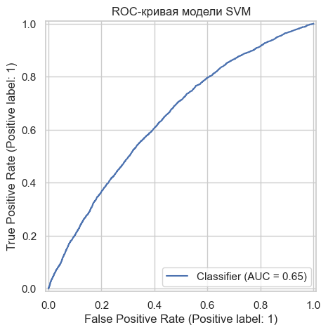
    


```python
PrecisionRecallDisplay.from_predictions(
    y_valid,
    valid_scores,
    sample_weight=w_valid
)

plt.title("Precision-Recall кривая модели SVM")
plt.grid(True)
plt.show()
```


    
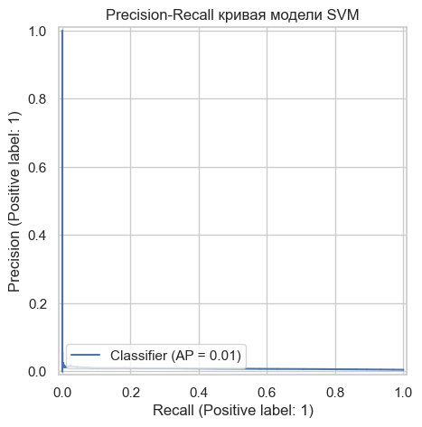
    


```python
default_threshold = 0

valid_pred_default = (valid_scores >= default_threshold).astype(int)

cm_default = confusion_matrix(
    y_valid,
    valid_pred_default,
    sample_weight=w_valid
)

cm_default_table = pd.DataFrame(
    cm_default,
    index=["Факт: cancer=0", "Факт: cancer=1"],
    columns=["Прогноз: cancer=0", "Прогноз: cancer=1"]
)

cm_default_table
```


<div>
<style scoped>
    .dataframe tbody tr th:only-of-type {
        vertical-align: middle;
    }

    .dataframe tbody tr th {
        vertical-align: top;
    }

    .dataframe thead th {
        text-align: right;
    }
</style>
<table border="1" class="dataframe">
  <thead>
    <tr style="text-align: right;">
      <th></th>
      <th>Прогноз: cancer=0</th>
      <th>Прогноз: cancer=1</th>
    </tr>
  </thead>
  <tbody>
    <tr>
      <th>Факт: cancer=0</th>
      <td>594988</td>
      <td>0</td>
    </tr>
    <tr>
      <th>Факт: cancer=1</th>
      <td>2871</td>
      <td>0</td>
    </tr>
  </tbody>
</table>
</div>


```python
report_default = classification_report(
    y_valid,
    valid_pred_default,
    sample_weight=w_valid,
    zero_division=0,
    output_dict=True
)

pd.DataFrame(report_default).T
```


<div>
<style scoped>
    .dataframe tbody tr th:only-of-type {
        vertical-align: middle;
    }

    .dataframe tbody tr th {
        vertical-align: top;
    }

    .dataframe thead th {
        text-align: right;
    }
</style>
<table border="1" class="dataframe">
  <thead>
    <tr style="text-align: right;">
      <th></th>
      <th>precision</th>
      <th>recall</th>
      <th>f1-score</th>
      <th>support</th>
    </tr>
  </thead>
  <tbody>
    <tr>
      <th>0</th>
      <td>0.995198</td>
      <td>1.000000</td>
      <td>0.997593</td>
      <td>594988.000000</td>
    </tr>
    <tr>
      <th>1</th>
      <td>0.000000</td>
      <td>0.000000</td>
      <td>0.000000</td>
      <td>2871.000000</td>
    </tr>
    <tr>
      <th>accuracy</th>
      <td>0.995198</td>
      <td>0.995198</td>
      <td>0.995198</td>
      <td>0.995198</td>
    </tr>
    <tr>
      <th>macro avg</th>
      <td>0.497599</td>
      <td>0.500000</td>
      <td>0.498797</td>
      <td>597859.000000</td>
    </tr>
    <tr>
      <th>weighted avg</th>
      <td>0.990419</td>
      <td>0.995198</td>
      <td>0.992803</td>
      <td>597859.000000</td>
    </tr>
  </tbody>
</table>
</div>


```python
fpr, tpr, thresholds = roc_curve(
    y_train,
    train_scores,
    sample_weight=w_train
)

youden_j = tpr - fpr
best_threshold_index = np.argmax(youden_j)
best_svm_threshold = thresholds[best_threshold_index]

print("Оптимальный порог SVM по Youden's J:", best_svm_threshold)
print("TPR на train:", tpr[best_threshold_index])
print("FPR на train:", fpr[best_threshold_index])
```

    Оптимальный порог SVM по Youden's J: -0.9896609445699802
    TPR на train: 0.654271700695791
    FPR на train: 0.4454301791564131
    


```python
valid_pred_youden = (valid_scores >= best_svm_threshold).astype(int)

cm_youden = confusion_matrix(
    y_valid,
    valid_pred_youden,
    sample_weight=w_valid
)

cm_youden_table = pd.DataFrame(
    cm_youden,
    index=["Факт: cancer=0", "Факт: cancer=1"],
    columns=["Прогноз: cancer=0", "Прогноз: cancer=1"]
)

cm_youden_table
```


<div>
<style scoped>
    .dataframe tbody tr th:only-of-type {
        vertical-align: middle;
    }

    .dataframe tbody tr th {
        vertical-align: top;
    }

    .dataframe thead th {
        text-align: right;
    }
</style>
<table border="1" class="dataframe">
  <thead>
    <tr style="text-align: right;">
      <th></th>
      <th>Прогноз: cancer=0</th>
      <th>Прогноз: cancer=1</th>
    </tr>
  </thead>
  <tbody>
    <tr>
      <th>Факт: cancer=0</th>
      <td>330459</td>
      <td>264529</td>
    </tr>
    <tr>
      <th>Факт: cancer=1</th>
      <td>985</td>
      <td>1886</td>
    </tr>
  </tbody>
</table>
</div>


```python
report_youden = classification_report(
    y_valid,
    valid_pred_youden,
    sample_weight=w_valid,
    zero_division=0,
    output_dict=True
)

pd.DataFrame(report_youden).T
```


<div>
<style scoped>
    .dataframe tbody tr th:only-of-type {
        vertical-align: middle;
    }

    .dataframe tbody tr th {
        vertical-align: top;
    }

    .dataframe thead th {
        text-align: right;
    }
</style>
<table border="1" class="dataframe">
  <thead>
    <tr style="text-align: right;">
      <th></th>
      <th>precision</th>
      <th>recall</th>
      <th>f1-score</th>
      <th>support</th>
    </tr>
  </thead>
  <tbody>
    <tr>
      <th>0</th>
      <td>0.997028</td>
      <td>0.555404</td>
      <td>0.713402</td>
      <td>594988.000000</td>
    </tr>
    <tr>
      <th>1</th>
      <td>0.007079</td>
      <td>0.656914</td>
      <td>0.014007</td>
      <td>2871.000000</td>
    </tr>
    <tr>
      <th>accuracy</th>
      <td>0.555892</td>
      <td>0.555892</td>
      <td>0.555892</td>
      <td>0.555892</td>
    </tr>
    <tr>
      <th>macro avg</th>
      <td>0.502054</td>
      <td>0.606159</td>
      <td>0.363704</td>
      <td>597859.000000</td>
    </tr>
    <tr>
      <th>weighted avg</th>
      <td>0.992274</td>
      <td>0.555892</td>
      <td>0.710043</td>
      <td>597859.000000</td>
    </tr>
  </tbody>
</table>
</div>


```python
def weighted_classification_metrics(y_true, y_pred, weights):
    cm = confusion_matrix(
        y_true,
        y_pred,
        sample_weight=weights
    )
    
    tn, fp, fn, tp = cm.ravel()
    
    accuracy = (tp + tn) / (tp + tn + fp + fn)
    sensitivity = tp / (tp + fn) if (tp + fn) > 0 else 0
    specificity = tn / (tn + fp) if (tn + fp) > 0 else 0
    precision = tp / (tp + fp) if (tp + fp) > 0 else 0
    f1 = 2 * precision * sensitivity / (precision + sensitivity) if (precision + sensitivity) > 0 else 0
    
    return {
        "accuracy": accuracy,
        "sensitivity_recall": sensitivity,
        "specificity": specificity,
        "precision": precision,
        "f1_score": f1
    }

default_metrics = weighted_classification_metrics(
    y_valid,
    valid_pred_default,
    w_valid
)

youden_metrics = weighted_classification_metrics(
    y_valid,
    valid_pred_youden,
    w_valid
)

threshold_comparison = pd.DataFrame([
    {
        "threshold_type": "default_0",
        "threshold": default_threshold,
        **default_metrics
    },
    {
        "threshold_type": "youden_train",
        "threshold": best_svm_threshold,
        **youden_metrics
    }
])

threshold_comparison
```


<div>
<style scoped>
    .dataframe tbody tr th:only-of-type {
        vertical-align: middle;
    }

    .dataframe tbody tr th {
        vertical-align: top;
    }

    .dataframe thead th {
        text-align: right;
    }
</style>
<table border="1" class="dataframe">
  <thead>
    <tr style="text-align: right;">
      <th></th>
      <th>threshold_type</th>
      <th>threshold</th>
      <th>accuracy</th>
      <th>sensitivity_recall</th>
      <th>specificity</th>
      <th>precision</th>
      <th>f1_score</th>
    </tr>
  </thead>
  <tbody>
    <tr>
      <th>0</th>
      <td>default_0</td>
      <td>0.000000</td>
      <td>0.995198</td>
      <td>0.000000</td>
      <td>1.000000</td>
      <td>0.000000</td>
      <td>0.000000</td>
    </tr>
    <tr>
      <th>1</th>
      <td>youden_train</td>
      <td>-0.989661</td>
      <td>0.555892</td>
      <td>0.656914</td>
      <td>0.555404</td>
      <td>0.007079</td>
      <td>0.014007</td>
    </tr>
  </tbody>
</table>
</div>


```python
scores_df = pd.DataFrame({
    "score": valid_scores,
    "cancer": y_valid,
    "count": w_valid
})

plt.figure(figsize=(8, 5))

plt.hist(
    scores_df.loc[scores_df["cancer"] == 0, "score"],
    bins=50,
    alpha=0.6,
    weights=scores_df.loc[scores_df["cancer"] == 0, "count"],
    label="cancer=0"
)

plt.hist(
    scores_df.loc[scores_df["cancer"] == 1, "score"],
    bins=50,
    alpha=0.6,
    weights=scores_df.loc[scores_df["cancer"] == 1, "count"],
    label="cancer=1"
)

plt.axvline(default_threshold, linestyle="--", label="threshold=0")
plt.axvline(best_svm_threshold, linestyle="--", label="Youden threshold")

plt.xlabel("Значение решающей функции SVM")
plt.ylabel("Взвешенная частота")
plt.title("Распределение SVM-score по классам")
plt.legend()
plt.grid(True)
plt.show()
```


    
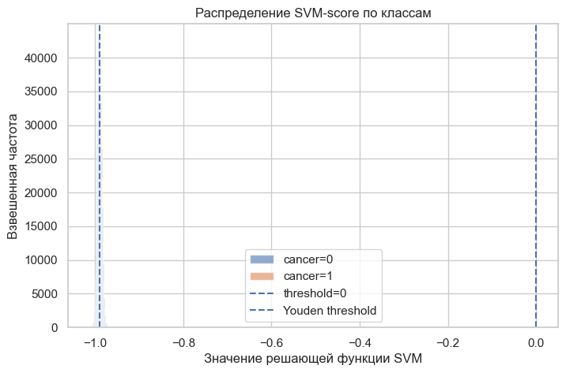
    


```python
svm_final_results = pd.DataFrame({
    "Показатель": [
        "ROC-AUC",
        "PR-AUC",
        "Порог по умолчанию",
        "Порог по Youden's J",
        "Accuracy при пороге 0",
        "Recall при пороге 0",
        "Precision при пороге 0",
        "F1-score при пороге 0",
        "Accuracy при пороге Youden",
        "Recall при пороге Youden",
        "Precision при пороге Youden",
        "F1-score при пороге Youden"
    ],
    "Значение": [
        svm_roc_auc,
        svm_pr_auc,
        default_threshold,
        best_svm_threshold,
        default_metrics["accuracy"],
        default_metrics["sensitivity_recall"],
        default_metrics["precision"],
        default_metrics["f1_score"],
        youden_metrics["accuracy"],
        youden_metrics["sensitivity_recall"],
        youden_metrics["precision"],
        youden_metrics["f1_score"]
    ]
})

svm_final_results
```


<div>
<style scoped>
    .dataframe tbody tr th:only-of-type {
        vertical-align: middle;
    }

    .dataframe tbody tr th {
        vertical-align: top;
    }

    .dataframe thead th {
        text-align: right;
    }
</style>
<table border="1" class="dataframe">
  <thead>
    <tr style="text-align: right;">
      <th></th>
      <th>Показатель</th>
      <th>Значение</th>
    </tr>
  </thead>
  <tbody>
    <tr>
      <th>0</th>
      <td>ROC-AUC</td>
      <td>0.645230</td>
    </tr>
    <tr>
      <th>1</th>
      <td>PR-AUC</td>
      <td>0.008229</td>
    </tr>
    <tr>
      <th>2</th>
      <td>Порог по умолчанию</td>
      <td>0.000000</td>
    </tr>
    <tr>
      <th>3</th>
      <td>Порог по Youden's J</td>
      <td>-0.989661</td>
    </tr>
    <tr>
      <th>4</th>
      <td>Accuracy при пороге 0</td>
      <td>0.995198</td>
    </tr>
    <tr>
      <th>5</th>
      <td>Recall при пороге 0</td>
      <td>0.000000</td>
    </tr>
    <tr>
      <th>6</th>
      <td>Precision при пороге 0</td>
      <td>0.000000</td>
    </tr>
    <tr>
      <th>7</th>
      <td>F1-score при пороге 0</td>
      <td>0.000000</td>
    </tr>
    <tr>
      <th>8</th>
      <td>Accuracy при пороге Youden</td>
      <td>0.555892</td>
    </tr>
    <tr>
      <th>9</th>
      <td>Recall при пороге Youden</td>
      <td>0.656914</td>
    </tr>
    <tr>
      <th>10</th>
      <td>Precision при пороге Youden</td>
      <td>0.007079</td>
    </tr>
    <tr>
      <th>11</th>
      <td>F1-score при пороге Youden</td>
      <td>0.014007</td>
    </tr>
  </tbody>
</table>
</div>


```python

```


```python
import warnings
warnings.filterwarnings("ignore")

import os
import random
import numpy as np
import pandas as pd
import matplotlib.pyplot as plt

from sklearn.preprocessing import OneHotEncoder
from sklearn.metrics import (
    roc_auc_score,
    average_precision_score,
    log_loss,
    brier_score_loss,
    confusion_matrix,
    classification_report,
    RocCurveDisplay,
    PrecisionRecallDisplay,
    roc_curve
)

import tensorflow as tf
from tensorflow.keras import layers, models, callbacks, optimizers, regularizers

SEED = 42

os.environ["PYTHONHASHSEED"] = str(SEED)
random.seed(SEED)
np.random.seed(SEED)
tf.random.set_seed(SEED)

print("TensorFlow version:", tf.__version__)
```

    TensorFlow version: 2.18.0
    


```python
def make_balanced_weights(y, weights, normalize=True):
    y = pd.Series(y).reset_index(drop=True)
    weights = pd.Series(weights).reset_index(drop=True).astype(float)
    
    class_0_sum = weights[y == 0].sum()
    class_1_sum = weights[y == 1].sum()
    total_sum = weights.sum()
    
    class_weight_0 = total_sum / (2 * class_0_sum)
    class_weight_1 = total_sum / (2 * class_1_sum)
    
    balanced_weights = weights.copy()
    balanced_weights[y == 0] = weights[y == 0] * class_weight_0
    balanced_weights[y == 1] = weights[y == 1] * class_weight_1
    
    if normalize:
        balanced_weights = balanced_weights / balanced_weights.mean()
    
    return balanced_weights

w_train_nn = make_balanced_weights(
    y_train,
    w_train,
    normalize=True
)

w_valid_nn = w_valid.astype(float) / w_valid.astype(float).mean()

print("Средний вес train после балансировки:", w_train_nn.mean())
print("Средний вес validation:", w_valid_nn.mean())

print("Суммарный вес класса 0 train:", w_train_nn[y_train.reset_index(drop=True) == 0].sum())
print("Суммарный вес класса 1 train:", w_train_nn[y_train.reset_index(drop=True) == 1].sum())
```

    Средний вес train после балансировки: 1.0
    Средний вес validation: 0.9999999999999997
    Суммарный вес класса 0 train: 90232.49999999997
    Суммарный вес класса 1 train: 90232.5
    


```python
try:
    encoder_nn = OneHotEncoder(
        handle_unknown="ignore",
        sparse_output=False
    )
except TypeError:
    encoder_nn = OneHotEncoder(
        handle_unknown="ignore",
        sparse=False
    )

X_train_ohe = encoder_nn.fit_transform(X_train).astype("float32")
X_valid_ohe = encoder_nn.transform(X_valid).astype("float32")

y_train_np = y_train.to_numpy().astype("float32")
y_valid_np = y_valid.to_numpy().astype("float32")

w_train_nn_np = w_train_nn.to_numpy().astype("float32")
w_valid_nn_np = w_valid_nn.to_numpy().astype("float32")

print("X_train_ohe:", X_train_ohe.shape)
print("X_valid_ohe:", X_valid_ohe.shape)
```

    X_train_ohe: (180465, 52)
    X_valid_ohe: (100195, 52)
    


```python
def build_token_mapping(dataframe, features):
    token_to_id = {}
    token_to_id["UNKNOWN"] = 0
    
    current_id = 1
    
    for feature in features:
        values = sorted(dataframe[feature].unique())
        
        for value in values:
            token = f"{feature}={value}"
            
            if token not in token_to_id:
                token_to_id[token] = current_id
                current_id += 1
    
    return token_to_id

def dataframe_to_token_sequence(dataframe, features, token_to_id):
    sequences = []
    
    for _, row in dataframe[features].iterrows():
        sequence = []
        
        for feature in features:
            token = f"{feature}={row[feature]}"
            token_id = token_to_id.get(token, 0)
            sequence.append(token_id)
        
        sequences.append(sequence)
    
    return np.array(sequences, dtype="int32")

token_to_id = build_token_mapping(train_df, features)

X_train_seq = dataframe_to_token_sequence(
    train_df,
    features,
    token_to_id
)

X_valid_seq = dataframe_to_token_sequence(
    valid_df,
    features,
    token_to_id
)

vocab_size = len(token_to_id)
seq_len = len(features)

print("Количество токенов:", vocab_size)
print("Длина последовательности:", seq_len)

print("X_train_seq:", X_train_seq.shape)
print("X_valid_seq:", X_valid_seq.shape)
```

    Количество токенов: 53
    Длина последовательности: 12
    X_train_seq: (180465, 12)
    X_valid_seq: (100195, 12)
    


```python
def build_mlp_simple(input_dim):
    inputs = layers.Input(shape=(input_dim,))
    
    x = layers.Dense(64, activation="relu")(inputs)
    x = layers.Dropout(0.25)(x)
    
    outputs = layers.Dense(1, activation="sigmoid")(x)
    
    model = models.Model(inputs, outputs, name="MLP_simple")
    
    return model
```


```python
def build_mlp_deep(input_dim):
    inputs = layers.Input(shape=(input_dim,))
    
    x = layers.Dense(256, activation="relu")(inputs)
    x = layers.BatchNormalization()(x)
    x = layers.Dropout(0.35)(x)
    
    x = layers.Dense(128, activation="relu")(x)
    x = layers.BatchNormalization()(x)
    x = layers.Dropout(0.30)(x)
    
    x = layers.Dense(64, activation="relu")(x)
    x = layers.BatchNormalization()(x)
    x = layers.Dropout(0.25)(x)
    
    x = layers.Dense(32, activation="relu")(x)
    
    outputs = layers.Dense(1, activation="sigmoid")(x)
    
    model = models.Model(inputs, outputs, name="MLP_deep")
    
    return model
```


```python
def build_mlp_wide(input_dim):
    inputs = layers.Input(shape=(input_dim,))
    
    x = layers.Dense(512, activation="relu")(inputs)
    x = layers.BatchNormalization()(x)
    x = layers.Dropout(0.40)(x)
    
    x = layers.Dense(256, activation="relu")(x)
    x = layers.BatchNormalization()(x)
    x = layers.Dropout(0.35)(x)
    
    x = layers.Dense(128, activation="relu")(x)
    x = layers.Dropout(0.25)(x)
    
    outputs = layers.Dense(1, activation="sigmoid")(x)
    
    model = models.Model(inputs, outputs, name="MLP_wide")
    
    return model
```


```python
def residual_block(x, units, dropout_rate=0.25):
    shortcut = x
    
    x = layers.Dense(units, activation="relu")(x)
    x = layers.BatchNormalization()(x)
    x = layers.Dropout(dropout_rate)(x)
    
    x = layers.Dense(units, activation=None)(x)
    x = layers.BatchNormalization()(x)
    
    if shortcut.shape[-1] != units:
        shortcut = layers.Dense(units, activation=None)(shortcut)
    
    x = layers.Add()([x, shortcut])
    x = layers.Activation("relu")(x)
    
    return x

def build_mlp_residual(input_dim):
    inputs = layers.Input(shape=(input_dim,))
    
    x = layers.Dense(128, activation="relu")(inputs)
    x = layers.BatchNormalization()(x)
    
    x = residual_block(x, 128, dropout_rate=0.30)
    x = residual_block(x, 128, dropout_rate=0.30)
    x = residual_block(x, 64, dropout_rate=0.25)
    
    x = layers.Dense(32, activation="relu")(x)
    x = layers.Dropout(0.20)(x)
    
    outputs = layers.Dense(1, activation="sigmoid")(x)
    
    model = models.Model(inputs, outputs, name="MLP_residual")
    
    return model
```


```python
def build_embedding_mlp(vocab_size, seq_len, embedding_dim=16):
    inputs = layers.Input(shape=(seq_len,), dtype="int32")
    
    x = layers.Embedding(
        input_dim=vocab_size,
        output_dim=embedding_dim
    )(inputs)
    
    x = layers.Flatten()(x)
    
    x = layers.Dense(128, activation="relu")(x)
    x = layers.BatchNormalization()(x)
    x = layers.Dropout(0.30)(x)
    
    x = layers.Dense(64, activation="relu")(x)
    x = layers.Dropout(0.25)(x)
    
    outputs = layers.Dense(1, activation="sigmoid")(x)
    
    model = models.Model(inputs, outputs, name="Embedding_MLP")
    
    return model
```


```python
def build_lstm_model(vocab_size, seq_len, embedding_dim=16):
    inputs = layers.Input(shape=(seq_len,), dtype="int32")
    
    x = layers.Embedding(
        input_dim=vocab_size,
        output_dim=embedding_dim
    )(inputs)
    
    x = layers.LSTM(
        64,
        return_sequences=False
    )(x)
    
    x = layers.Dropout(0.30)(x)
    x = layers.Dense(64, activation="relu")(x)
    x = layers.Dropout(0.25)(x)
    
    outputs = layers.Dense(1, activation="sigmoid")(x)
    
    model = models.Model(inputs, outputs, name="Embedding_LSTM")
    
    return model
```


```python
def build_gru_model(vocab_size, seq_len, embedding_dim=16):
    inputs = layers.Input(shape=(seq_len,), dtype="int32")
    
    x = layers.Embedding(
        input_dim=vocab_size,
        output_dim=embedding_dim
    )(inputs)
    
    x = layers.GRU(
        64,
        return_sequences=False
    )(x)
    
    x = layers.Dropout(0.30)(x)
    x = layers.Dense(64, activation="relu")(x)
    x = layers.Dropout(0.25)(x)
    
    outputs = layers.Dense(1, activation="sigmoid")(x)
    
    model = models.Model(inputs, outputs, name="Embedding_GRU")
    
    return model
```


```python
def build_cnn1d_model(vocab_size, seq_len, embedding_dim=16):
    inputs = layers.Input(shape=(seq_len,), dtype="int32")
    
    x = layers.Embedding(
        input_dim=vocab_size,
        output_dim=embedding_dim
    )(inputs)
    
    x = layers.Conv1D(
        filters=64,
        kernel_size=3,
        padding="same",
        activation="relu"
    )(x)
    
    x = layers.BatchNormalization()(x)
    
    x = layers.Conv1D(
        filters=64,
        kernel_size=3,
        padding="same",
        activation="relu"
    )(x)
    
    x = layers.GlobalMaxPooling1D()(x)
    
    x = layers.Dense(64, activation="relu")(x)
    x = layers.Dropout(0.25)(x)
    
    outputs = layers.Dense(1, activation="sigmoid")(x)
    
    model = models.Model(inputs, outputs, name="Embedding_CNN1D")
    
    return model
```


```python
def build_attention_model(vocab_size, seq_len, embedding_dim=16):
    inputs = layers.Input(shape=(seq_len,), dtype="int32")
    
    x = layers.Embedding(
        input_dim=vocab_size,
        output_dim=embedding_dim
    )(inputs)
    
    attention_output = layers.MultiHeadAttention(
        num_heads=2,
        key_dim=embedding_dim
    )(x, x)
    
    x = layers.Add()([x, attention_output])
    x = layers.LayerNormalization()(x)
    
    x_ff = layers.Dense(64, activation="relu")(x)
    x_ff = layers.Dense(embedding_dim)(x_ff)
    
    x = layers.Add()([x, x_ff])
    x = layers.LayerNormalization()(x)
    
    x = layers.GlobalAveragePooling1D()(x)
    
    x = layers.Dense(64, activation="relu")(x)
    x = layers.Dropout(0.25)(x)
    
    outputs = layers.Dense(1, activation="sigmoid")(x)
    
    model = models.Model(inputs, outputs, name="Embedding_Attention")
    
    return model
```


```python
def compile_neural_model(model, learning_rate=0.001):
    model.compile(
        optimizer=optimizers.Adam(learning_rate=learning_rate),
        loss="binary_crossentropy",
        metrics=[
            tf.keras.metrics.AUC(name="roc_auc", curve="ROC"),
            tf.keras.metrics.AUC(name="pr_auc", curve="PR")
        ]
    )
    
    return model
```


```python
neural_architectures = [
    {
        "name": "MLP_simple",
        "input_type": "onehot",
        "builder": lambda: build_mlp_simple(X_train_ohe.shape[1])
    },
    {
        "name": "MLP_deep",
        "input_type": "onehot",
        "builder": lambda: build_mlp_deep(X_train_ohe.shape[1])
    },
    {
        "name": "MLP_wide",
        "input_type": "onehot",
        "builder": lambda: build_mlp_wide(X_train_ohe.shape[1])
    },
    {
        "name": "MLP_residual",
        "input_type": "onehot",
        "builder": lambda: build_mlp_residual(X_train_ohe.shape[1])
    },
    {
        "name": "Embedding_MLP",
        "input_type": "sequence",
        "builder": lambda: build_embedding_mlp(vocab_size, seq_len)
    },
    {
        "name": "Embedding_LSTM",
        "input_type": "sequence",
        "builder": lambda: build_lstm_model(vocab_size, seq_len)
    },
    {
        "name": "Embedding_GRU",
        "input_type": "sequence",
        "builder": lambda: build_gru_model(vocab_size, seq_len)
    },
    {
        "name": "Embedding_CNN1D",
        "input_type": "sequence",
        "builder": lambda: build_cnn1d_model(vocab_size, seq_len)
    },
    {
        "name": "Embedding_Attention",
        "input_type": "sequence",
        "builder": lambda: build_attention_model(vocab_size, seq_len)
    }
]
```


```python
EPOCHS = 50
BATCH_SIZE = 4096

trained_neural_models = {}
neural_histories = {}
neural_results = []

for architecture in neural_architectures:
    tf.keras.backend.clear_session()
    
    model_name = architecture["name"]
    input_type = architecture["input_type"]
    
    print("=" * 80)
    print("Обучается модель:", model_name)
    print("=" * 80)
    
    model = architecture["builder"]()
    model = compile_neural_model(model, learning_rate=0.001)
    
    if input_type == "onehot":
        X_tr = X_train_ohe
        X_val = X_valid_ohe
    else:
        X_tr = X_train_seq
        X_val = X_valid_seq
    
    early_stop = callbacks.EarlyStopping(
        monitor="val_pr_auc",
        mode="max",
        patience=6,
        restore_best_weights=True
    )
    
    reduce_lr = callbacks.ReduceLROnPlateau(
        monitor="val_pr_auc",
        mode="max",
        factor=0.5,
        patience=3,
        min_lr=1e-5
    )
    
    history = model.fit(
        X_tr,
        y_train_np,
        sample_weight=w_train_nn_np,
        validation_data=(X_val, y_valid_np, w_valid_nn_np),
        epochs=EPOCHS,
        batch_size=BATCH_SIZE,
        callbacks=[early_stop, reduce_lr],
        verbose=1
    )
    
    valid_prob = model.predict(
        X_val,
        batch_size=BATCH_SIZE
    ).ravel()
    
    valid_prob = np.clip(valid_prob, 1e-7, 1 - 1e-7)
    
    roc_auc = roc_auc_score(
        y_valid,
        valid_prob,
        sample_weight=w_valid
    )
    
    pr_auc = average_precision_score(
        y_valid,
        valid_prob,
        sample_weight=w_valid
    )
    
    valid_logloss = log_loss(
        y_valid,
        valid_prob,
        sample_weight=w_valid,
        labels=[0, 1]
    )
    
    brier = brier_score_loss(
        y_valid,
        valid_prob,
        sample_weight=w_valid
    )
    
    neural_results.append({
        "model": model_name,
        "input_type": input_type,
        "roc_auc": roc_auc,
        "pr_auc": pr_auc,
        "log_loss": valid_logloss,
        "brier_score": brier,
        "epochs_trained": len(history.history["loss"])
    })
    
    trained_neural_models[model_name] = {
        "model": model,
        "input_type": input_type
    }
    
    neural_histories[model_name] = history
    
    print("ROC-AUC:", roc_auc)
    print("PR-AUC:", pr_auc)
    print("Log Loss:", valid_logloss)
    print("Brier Score:", brier)
```

    WARNING:tensorflow:From C:\Program Files\Python312\Lib\site-packages\keras\src\backend\common\global_state.py:82: The name tf.reset_default_graph is deprecated. Please use tf.compat.v1.reset_default_graph instead.
    
    ================================================================================
    Обучается модель: MLP_simple
    ================================================================================
    Epoch 1/50
    45/45 ━━━━━━━━━━━━━━━━━━━━ 1s 6ms/step - loss: 0.6941 - pr_auc: 0.0386 - roc_auc: 0.5081 - val_loss: 0.6822 - val_pr_auc: 0.0269 - val_roc_auc: 0.5260 - learning_rate: 0.0010
    Epoch 2/50
    45/45 ━━━━━━━━━━━━━━━━━━━━ 0s 3ms/step - loss: 0.6816 - pr_auc: 0.0393 - roc_auc: 0.5160 - val_loss: 0.6707 - val_pr_auc: 0.0277 - val_roc_auc: 0.5349 - learning_rate: 0.0010
    Epoch 3/50
    45/45 ━━━━━━━━━━━━━━━━━━━━ 0s 3ms/step - loss: 0.6756 - pr_auc: 0.0398 - roc_auc: 0.5276 - val_loss: 0.6709 - val_pr_auc: 0.0279 - val_roc_auc: 0.5447 - learning_rate: 0.0010
    Epoch 4/50
    45/45 ━━━━━━━━━━━━━━━━━━━━ 0s 3ms/step - loss: 0.6734 - pr_auc: 0.0409 - roc_auc: 0.5346 - val_loss: 0.6687 - val_pr_auc: 0.0280 - val_roc_auc: 0.5486 - learning_rate: 0.0010
    Epoch 5/50
    45/45 ━━━━━━━━━━━━━━━━━━━━ 0s 3ms/step - loss: 0.6725 - pr_auc: 0.0405 - roc_auc: 0.5410 - val_loss: 0.6676 - val_pr_auc: 0.0281 - val_roc_auc: 0.5531 - learning_rate: 0.0010
    Epoch 6/50
    45/45 ━━━━━━━━━━━━━━━━━━━━ 0s 3ms/step - loss: 0.6675 - pr_auc: 0.0411 - roc_auc: 0.5451 - val_loss: 0.6702 - val_pr_auc: 0.0281 - val_roc_auc: 0.5550 - learning_rate: 0.0010
    Epoch 7/50
    45/45 ━━━━━━━━━━━━━━━━━━━━ 0s 3ms/step - loss: 0.6692 - pr_auc: 0.0412 - roc_auc: 0.5479 - val_loss: 0.6768 - val_pr_auc: 0.0281 - val_roc_auc: 0.5565 - learning_rate: 0.0010
    Epoch 8/50
    45/45 ━━━━━━━━━━━━━━━━━━━━ 0s 3ms/step - loss: 0.6674 - pr_auc: 0.0415 - roc_auc: 0.5509 - val_loss: 0.6673 - val_pr_auc: 0.0281 - val_roc_auc: 0.5576 - learning_rate: 0.0010
    Epoch 9/50
    45/45 ━━━━━━━━━━━━━━━━━━━━ 0s 3ms/step - loss: 0.6682 - pr_auc: 0.0408 - roc_auc: 0.5480 - val_loss: 0.6666 - val_pr_auc: 0.0281 - val_roc_auc: 0.5585 - learning_rate: 5.0000e-04
    Epoch 10/50
    45/45 ━━━━━━━━━━━━━━━━━━━━ 0s 3ms/step - loss: 0.6645 - pr_auc: 0.0413 - roc_auc: 0.5541 - val_loss: 0.6681 - val_pr_auc: 0.0282 - val_roc_auc: 0.5596 - learning_rate: 5.0000e-04
    Epoch 11/50
    45/45 ━━━━━━━━━━━━━━━━━━━━ 0s 3ms/step - loss: 0.6642 - pr_auc: 0.0421 - roc_auc: 0.5561 - val_loss: 0.6648 - val_pr_auc: 0.0281 - val_roc_auc: 0.5598 - learning_rate: 5.0000e-04
    Epoch 12/50
    45/45 ━━━━━━━━━━━━━━━━━━━━ 0s 3ms/step - loss: 0.6650 - pr_auc: 0.0415 - roc_auc: 0.5549 - val_loss: 0.6586 - val_pr_auc: 0.0280 - val_roc_auc: 0.5593 - learning_rate: 2.5000e-04
    Epoch 13/50
    45/45 ━━━━━━━━━━━━━━━━━━━━ 0s 3ms/step - loss: 0.6628 - pr_auc: 0.0415 - roc_auc: 0.5563 - val_loss: 0.6580 - val_pr_auc: 0.0280 - val_roc_auc: 0.5590 - learning_rate: 2.5000e-04
    Epoch 14/50
    45/45 ━━━━━━━━━━━━━━━━━━━━ 0s 3ms/step - loss: 0.6630 - pr_auc: 0.0416 - roc_auc: 0.5567 - val_loss: 0.6581 - val_pr_auc: 0.0280 - val_roc_auc: 0.5589 - learning_rate: 2.5000e-04
    Epoch 15/50
    45/45 ━━━━━━━━━━━━━━━━━━━━ 0s 3ms/step - loss: 0.6639 - pr_auc: 0.0416 - roc_auc: 0.5547 - val_loss: 0.6568 - val_pr_auc: 0.0280 - val_roc_auc: 0.5591 - learning_rate: 1.2500e-04
    Epoch 16/50
    45/45 ━━━━━━━━━━━━━━━━━━━━ 0s 3ms/step - loss: 0.6660 - pr_auc: 0.0414 - roc_auc: 0.5552 - val_loss: 0.6574 - val_pr_auc: 0.0280 - val_roc_auc: 0.5594 - learning_rate: 1.2500e-04
    25/25 ━━━━━━━━━━━━━━━━━━━━ 0s 1ms/step 
    ROC-AUC: 0.6430659828708656
    PR-AUC: 0.008341950998286806
    Log Loss: 0.6680747659654984
    Brier Score: 0.23828838771517816
    ================================================================================
    Обучается модель: MLP_deep
    ================================================================================
    Epoch 1/50
    45/45 ━━━━━━━━━━━━━━━━━━━━ 2s 13ms/step - loss: 0.7396 - pr_auc: 0.0361 - roc_auc: 0.4977 - val_loss: 0.7313 - val_pr_auc: 0.0233 - val_roc_auc: 0.4817 - learning_rate: 0.0010
    Epoch 2/50
    45/45 ━━━━━━━━━━━━━━━━━━━━ 0s 9ms/step - loss: 0.6973 - pr_auc: 0.0380 - roc_auc: 0.5152 - val_loss: 0.7938 - val_pr_auc: 0.0235 - val_roc_auc: 0.4893 - learning_rate: 0.0010
    Epoch 3/50
    45/45 ━━━━━━━━━━━━━━━━━━━━ 0s 9ms/step - loss: 0.6912 - pr_auc: 0.0387 - roc_auc: 0.5236 - val_loss: 0.7967 - val_pr_auc: 0.0234 - val_roc_auc: 0.4895 - learning_rate: 0.0010
    Epoch 4/50
    45/45 ━━━━━━━━━━━━━━━━━━━━ 0s 9ms/step - loss: 0.6893 - pr_auc: 0.0378 - roc_auc: 0.5181 - val_loss: 0.7866 - val_pr_auc: 0.0248 - val_roc_auc: 0.5136 - learning_rate: 0.0010
    Epoch 5/50
    45/45 ━━━━━━━━━━━━━━━━━━━━ 0s 9ms/step - loss: 0.6803 - pr_auc: 0.0392 - roc_auc: 0.5313 - val_loss: 0.7689 - val_pr_auc: 0.0259 - val_roc_auc: 0.5301 - learning_rate: 0.0010
    Epoch 6/50
    45/45 ━━━━━━━━━━━━━━━━━━━━ 0s 9ms/step - loss: 0.6812 - pr_auc: 0.0402 - roc_auc: 0.5418 - val_loss: 0.8156 - val_pr_auc: 0.0296 - val_roc_auc: 0.5722 - learning_rate: 0.0010
    Epoch 7/50
    45/45 ━━━━━━━━━━━━━━━━━━━━ 0s 9ms/step - loss: 0.6826 - pr_auc: 0.0403 - roc_auc: 0.5450 - val_loss: 0.7590 - val_pr_auc: 0.0278 - val_roc_auc: 0.5542 - learning_rate: 0.0010
    Epoch 8/50
    45/45 ━━━━━━━━━━━━━━━━━━━━ 0s 9ms/step - loss: 0.6738 - pr_auc: 0.0410 - roc_auc: 0.5516 - val_loss: 0.7394 - val_pr_auc: 0.0283 - val_roc_auc: 0.5623 - learning_rate: 0.0010
    Epoch 9/50
    45/45 ━━━━━━━━━━━━━━━━━━━━ 0s 9ms/step - loss: 0.6754 - pr_auc: 0.0417 - roc_auc: 0.5530 - val_loss: 0.7333 - val_pr_auc: 0.0284 - val_roc_auc: 0.5625 - learning_rate: 0.0010
    Epoch 10/50
    45/45 ━━━━━━━━━━━━━━━━━━━━ 0s 9ms/step - loss: 0.6677 - pr_auc: 0.0415 - roc_auc: 0.5569 - val_loss: 0.7137 - val_pr_auc: 0.0286 - val_roc_auc: 0.5638 - learning_rate: 5.0000e-04
    Epoch 11/50
    45/45 ━━━━━━━━━━━━━━━━━━━━ 0s 9ms/step - loss: 0.6736 - pr_auc: 0.0413 - roc_auc: 0.5559 - val_loss: 0.6979 - val_pr_auc: 0.0283 - val_roc_auc: 0.5615 - learning_rate: 5.0000e-04
    Epoch 12/50
    45/45 ━━━━━━━━━━━━━━━━━━━━ 0s 9ms/step - loss: 0.6718 - pr_auc: 0.0415 - roc_auc: 0.5595 - val_loss: 0.6892 - val_pr_auc: 0.0288 - val_roc_auc: 0.5670 - learning_rate: 5.0000e-04
    25/25 ━━━━━━━━━━━━━━━━━━━━ 0s 4ms/step 
    ROC-AUC: 0.6279564973743507
    PR-AUC: 0.007692326488090787
    Log Loss: 0.8156415591094717
    Brier Score: 0.3101681191931328
    ================================================================================
    Обучается модель: MLP_wide
    ================================================================================
    Epoch 1/50
    45/45 ━━━━━━━━━━━━━━━━━━━━ 2s 20ms/step - loss: 0.8065 - pr_auc: 0.0384 - roc_auc: 0.5182 - val_loss: 0.7069 - val_pr_auc: 0.0258 - val_roc_auc: 0.5256 - learning_rate: 0.0010
    Epoch 2/50
    45/45 ━━━━━━━━━━━━━━━━━━━━ 1s 15ms/step - loss: 0.7246 - pr_auc: 0.0373 - roc_auc: 0.5180 - val_loss: 0.7695 - val_pr_auc: 0.0276 - val_roc_auc: 0.5511 - learning_rate: 0.0010
    Epoch 3/50
    45/45 ━━━━━━━━━━━━━━━━━━━━ 1s 15ms/step - loss: 0.7104 - pr_auc: 0.0376 - roc_auc: 0.5256 - val_loss: 0.7690 - val_pr_auc: 0.0263 - val_roc_auc: 0.5330 - learning_rate: 0.0010
    Epoch 4/50
    45/45 ━━━━━━━━━━━━━━━━━━━━ 1s 15ms/step - loss: 0.6959 - pr_auc: 0.0378 - roc_auc: 0.5324 - val_loss: 0.7638 - val_pr_auc: 0.0249 - val_roc_auc: 0.5170 - learning_rate: 0.0010
    Epoch 5/50
    45/45 ━━━━━━━━━━━━━━━━━━━━ 1s 15ms/step - loss: 0.6925 - pr_auc: 0.0383 - roc_auc: 0.5352 - val_loss: 0.7328 - val_pr_auc: 0.0234 - val_roc_auc: 0.4936 - learning_rate: 0.0010
    Epoch 6/50
    45/45 ━━━━━━━━━━━━━━━━━━━━ 1s 15ms/step - loss: 0.6844 - pr_auc: 0.0392 - roc_auc: 0.5487 - val_loss: 0.7157 - val_pr_auc: 0.0244 - val_roc_auc: 0.5139 - learning_rate: 5.0000e-04
    Epoch 7/50
    45/45 ━━━━━━━━━━━━━━━━━━━━ 1s 15ms/step - loss: 0.6759 - pr_auc: 0.0391 - roc_auc: 0.5500 - val_loss: 0.7018 - val_pr_auc: 0.0252 - val_roc_auc: 0.5289 - learning_rate: 5.0000e-04
    Epoch 8/50
    45/45 ━━━━━━━━━━━━━━━━━━━━ 1s 15ms/step - loss: 0.6765 - pr_auc: 0.0393 - roc_auc: 0.5481 - val_loss: 0.6948 - val_pr_auc: 0.0253 - val_roc_auc: 0.5332 - learning_rate: 5.0000e-04
    25/25 ━━━━━━━━━━━━━━━━━━━━ 0s 5ms/step 
    ROC-AUC: 0.6224168465326676
    PR-AUC: 0.007413731925134793
    Log Loss: 0.7694789117346028
    Brier Score: 0.28800792121736485
    ================================================================================
    Обучается модель: MLP_residual
    ================================================================================
    Epoch 1/50
    45/45 ━━━━━━━━━━━━━━━━━━━━ 3s 20ms/step - loss: 0.7887 - pr_auc: 0.0368 - roc_auc: 0.4986 - val_loss: 0.6957 - val_pr_auc: 0.0276 - val_roc_auc: 0.5367 - learning_rate: 0.0010
    Epoch 2/50
    45/45 ━━━━━━━━━━━━━━━━━━━━ 1s 14ms/step - loss: 0.6915 - pr_auc: 0.0386 - roc_auc: 0.5168 - val_loss: 0.7217 - val_pr_auc: 0.0305 - val_roc_auc: 0.5536 - learning_rate: 0.0010
    Epoch 3/50
    45/45 ━━━━━━━━━━━━━━━━━━━━ 1s 14ms/step - loss: 0.6896 - pr_auc: 0.0396 - roc_auc: 0.5211 - val_loss: 0.7000 - val_pr_auc: 0.0286 - val_roc_auc: 0.5366 - learning_rate: 0.0010
    Epoch 4/50
    45/45 ━━━━━━━━━━━━━━━━━━━━ 1s 14ms/step - loss: 0.6844 - pr_auc: 0.0399 - roc_auc: 0.5255 - val_loss: 0.6955 - val_pr_auc: 0.0278 - val_roc_auc: 0.5337 - learning_rate: 0.0010
    Epoch 5/50
    45/45 ━━━━━━━━━━━━━━━━━━━━ 1s 15ms/step - loss: 0.6778 - pr_auc: 0.0414 - roc_auc: 0.5373 - val_loss: 0.6921 - val_pr_auc: 0.0298 - val_roc_auc: 0.5490 - learning_rate: 0.0010
    Epoch 6/50
    45/45 ━━━━━━━━━━━━━━━━━━━━ 1s 14ms/step - loss: 0.6751 - pr_auc: 0.0428 - roc_auc: 0.5456 - val_loss: 0.6680 - val_pr_auc: 0.0289 - val_roc_auc: 0.5458 - learning_rate: 5.0000e-04
    Epoch 7/50
    45/45 ━━━━━━━━━━━━━━━━━━━━ 1s 14ms/step - loss: 0.6713 - pr_auc: 0.0431 - roc_auc: 0.5498 - val_loss: 0.6781 - val_pr_auc: 0.0290 - val_roc_auc: 0.5494 - learning_rate: 5.0000e-04
    Epoch 8/50
    45/45 ━━━━━━━━━━━━━━━━━━━━ 1s 15ms/step - loss: 0.6710 - pr_auc: 0.0438 - roc_auc: 0.5556 - val_loss: 0.6770 - val_pr_auc: 0.0298 - val_roc_auc: 0.5607 - learning_rate: 5.0000e-04
    25/25 ━━━━━━━━━━━━━━━━━━━━ 0s 7ms/step 
    ROC-AUC: 0.595059033378595
    PR-AUC: 0.0068450414414157135
    Log Loss: 0.7216983935921105
    Brier Score: 0.2642291242333156
    ================================================================================
    Обучается модель: Embedding_MLP
    ================================================================================
    Epoch 1/50
    45/45 ━━━━━━━━━━━━━━━━━━━━ 1s 9ms/step - loss: 0.7131 - pr_auc: 0.0394 - roc_auc: 0.5173 - val_loss: 0.7049 - val_pr_auc: 0.0320 - val_roc_auc: 0.5745 - learning_rate: 0.0010
    Epoch 2/50
    45/45 ━━━━━━━━━━━━━━━━━━━━ 0s 5ms/step - loss: 0.6810 - pr_auc: 0.0398 - roc_auc: 0.5329 - val_loss: 0.7019 - val_pr_auc: 0.0313 - val_roc_auc: 0.5737 - learning_rate: 0.0010
    Epoch 3/50
    45/45 ━━━━━━━━━━━━━━━━━━━━ 0s 5ms/step - loss: 0.6752 - pr_auc: 0.0403 - roc_auc: 0.5443 - val_loss: 0.6998 - val_pr_auc: 0.0294 - val_roc_auc: 0.5639 - learning_rate: 0.0010
    Epoch 4/50
    45/45 ━━━━━━━━━━━━━━━━━━━━ 0s 5ms/step - loss: 0.6707 - pr_auc: 0.0406 - roc_auc: 0.5490 - val_loss: 0.7011 - val_pr_auc: 0.0291 - val_roc_auc: 0.5653 - learning_rate: 0.0010
    Epoch 5/50
    45/45 ━━━━━━━━━━━━━━━━━━━━ 0s 5ms/step - loss: 0.6692 - pr_auc: 0.0408 - roc_auc: 0.5526 - val_loss: 0.6981 - val_pr_auc: 0.0291 - val_roc_auc: 0.5756 - learning_rate: 5.0000e-04
    Epoch 6/50
    45/45 ━━━━━━━━━━━━━━━━━━━━ 0s 5ms/step - loss: 0.6652 - pr_auc: 0.0407 - roc_auc: 0.5554 - val_loss: 0.6975 - val_pr_auc: 0.0294 - val_roc_auc: 0.5786 - learning_rate: 5.0000e-04
    Epoch 7/50
    45/45 ━━━━━━━━━━━━━━━━━━━━ 0s 5ms/step - loss: 0.6684 - pr_auc: 0.0406 - roc_auc: 0.5542 - val_loss: 0.6937 - val_pr_auc: 0.0288 - val_roc_auc: 0.5727 - learning_rate: 5.0000e-04
    25/25 ━━━━━━━━━━━━━━━━━━━━ 0s 3ms/step 
    ROC-AUC: 0.6142615532543826
    PR-AUC: 0.007445799659268856
    Log Loss: 0.7048869405456054
    Brier Score: 0.2558693491204218
    ================================================================================
    Обучается модель: Embedding_LSTM
    ================================================================================
    Epoch 1/50
    45/45 ━━━━━━━━━━━━━━━━━━━━ 2s 31ms/step - loss: 0.6948 - pr_auc: 0.0376 - roc_auc: 0.4945 - val_loss: 0.6750 - val_pr_auc: 0.0285 - val_roc_auc: 0.5334 - learning_rate: 0.0010
    Epoch 2/50
    45/45 ━━━━━━━━━━━━━━━━━━━━ 1s 26ms/step - loss: 0.6806 - pr_auc: 0.0421 - roc_auc: 0.5375 - val_loss: 0.7260 - val_pr_auc: 0.0287 - val_roc_auc: 0.5552 - learning_rate: 0.0010
    Epoch 3/50
    45/45 ━━━━━━━━━━━━━━━━━━━━ 1s 26ms/step - loss: 0.6721 - pr_auc: 0.0416 - roc_auc: 0.5463 - val_loss: 0.6357 - val_pr_auc: 0.0282 - val_roc_auc: 0.5558 - learning_rate: 0.0010
    Epoch 4/50
    45/45 ━━━━━━━━━━━━━━━━━━━━ 1s 26ms/step - loss: 0.6701 - pr_auc: 0.0409 - roc_auc: 0.5457 - val_loss: 0.6138 - val_pr_auc: 0.0284 - val_roc_auc: 0.5596 - learning_rate: 0.0010
    Epoch 5/50
    45/45 ━━━━━━━━━━━━━━━━━━━━ 1s 26ms/step - loss: 0.6692 - pr_auc: 0.0411 - roc_auc: 0.5494 - val_loss: 0.6101 - val_pr_auc: 0.0281 - val_roc_auc: 0.5594 - learning_rate: 0.0010
    Epoch 6/50
    45/45 ━━━━━━━━━━━━━━━━━━━━ 1s 26ms/step - loss: 0.6669 - pr_auc: 0.0409 - roc_auc: 0.5490 - val_loss: 0.6472 - val_pr_auc: 0.0279 - val_roc_auc: 0.5574 - learning_rate: 5.0000e-04
    Epoch 7/50
    45/45 ━━━━━━━━━━━━━━━━━━━━ 1s 26ms/step - loss: 0.6651 - pr_auc: 0.0408 - roc_auc: 0.5486 - val_loss: 0.6484 - val_pr_auc: 0.0278 - val_roc_auc: 0.5575 - learning_rate: 5.0000e-04
    Epoch 8/50
    45/45 ━━━━━━━━━━━━━━━━━━━━ 1s 26ms/step - loss: 0.6653 - pr_auc: 0.0404 - roc_auc: 0.5469 - val_loss: 0.6508 - val_pr_auc: 0.0277 - val_roc_auc: 0.5570 - learning_rate: 5.0000e-04
    25/25 ━━━━━━━━━━━━━━━━━━━━ 0s 12ms/step
    ROC-AUC: 0.6343249667136466
    PR-AUC: 0.008165894318785937
    Log Loss: 0.7259651023951305
    Brier Score: 0.26616701839589574
    ================================================================================
    Обучается модель: Embedding_GRU
    ================================================================================
    Epoch 1/50
    45/45 ━━━━━━━━━━━━━━━━━━━━ 2s 31ms/step - loss: 0.6940 - pr_auc: 0.0387 - roc_auc: 0.5034 - val_loss: 0.6831 - val_pr_auc: 0.0267 - val_roc_auc: 0.5060 - learning_rate: 0.0010
    Epoch 2/50
    45/45 ━━━━━━━━━━━━━━━━━━━━ 1s 26ms/step - loss: 0.6898 - pr_auc: 0.0372 - roc_auc: 0.4931 - val_loss: 0.6735 - val_pr_auc: 0.0266 - val_roc_auc: 0.5211 - learning_rate: 0.0010
    Epoch 3/50
    45/45 ━━━━━━━━━━━━━━━━━━━━ 1s 26ms/step - loss: 0.6757 - pr_auc: 0.0402 - roc_auc: 0.5304 - val_loss: 0.6971 - val_pr_auc: 0.0284 - val_roc_auc: 0.5587 - learning_rate: 0.0010
    Epoch 4/50
    45/45 ━━━━━━━━━━━━━━━━━━━━ 1s 26ms/step - loss: 0.6707 - pr_auc: 0.0415 - roc_auc: 0.5477 - val_loss: 0.6697 - val_pr_auc: 0.0281 - val_roc_auc: 0.5574 - learning_rate: 0.0010
    Epoch 5/50
    45/45 ━━━━━━━━━━━━━━━━━━━━ 1s 26ms/step - loss: 0.6693 - pr_auc: 0.0411 - roc_auc: 0.5485 - val_loss: 0.6090 - val_pr_auc: 0.0281 - val_roc_auc: 0.5580 - learning_rate: 0.0010
    Epoch 6/50
    45/45 ━━━━━━━━━━━━━━━━━━━━ 1s 26ms/step - loss: 0.6695 - pr_auc: 0.0406 - roc_auc: 0.5464 - val_loss: 0.6161 - val_pr_auc: 0.0282 - val_roc_auc: 0.5597 - learning_rate: 0.0010
    Epoch 7/50
    45/45 ━━━━━━━━━━━━━━━━━━━━ 1s 26ms/step - loss: 0.6667 - pr_auc: 0.0410 - roc_auc: 0.5496 - val_loss: 0.6345 - val_pr_auc: 0.0282 - val_roc_auc: 0.5597 - learning_rate: 5.0000e-04
    Epoch 8/50
    45/45 ━━━━━━━━━━━━━━━━━━━━ 1s 26ms/step - loss: 0.6648 - pr_auc: 0.0411 - roc_auc: 0.5515 - val_loss: 0.6386 - val_pr_auc: 0.0280 - val_roc_auc: 0.5584 - learning_rate: 5.0000e-04
    Epoch 9/50
    45/45 ━━━━━━━━━━━━━━━━━━━━ 1s 27ms/step - loss: 0.6644 - pr_auc: 0.0408 - roc_auc: 0.5496 - val_loss: 0.6326 - val_pr_auc: 0.0278 - val_roc_auc: 0.5578 - learning_rate: 5.0000e-04
    25/25 ━━━━━━━━━━━━━━━━━━━━ 0s 12ms/step
    ROC-AUC: 0.6369671284221574
    PR-AUC: 0.00818976647041808
    Log Loss: 0.6971223472465579
    Brier Score: 0.25345227801940606
    ================================================================================
    Обучается модель: Embedding_CNN1D
    ================================================================================
    Epoch 1/50
    45/45 ━━━━━━━━━━━━━━━━━━━━ 2s 18ms/step - loss: 0.6891 - pr_auc: 0.0413 - roc_auc: 0.5160 - val_loss: 0.6865 - val_pr_auc: 0.0316 - val_roc_auc: 0.5609 - learning_rate: 0.0010
    Epoch 2/50
    45/45 ━━━━━━━━━━━━━━━━━━━━ 1s 14ms/step - loss: 0.6712 - pr_auc: 0.0471 - roc_auc: 0.5672 - val_loss: 0.6897 - val_pr_auc: 0.0305 - val_roc_auc: 0.5590 - learning_rate: 0.0010
    Epoch 3/50
    45/45 ━━━━━━━━━━━━━━━━━━━━ 1s 14ms/step - loss: 0.6715 - pr_auc: 0.0450 - roc_auc: 0.5640 - val_loss: 0.6832 - val_pr_auc: 0.0279 - val_roc_auc: 0.5466 - learning_rate: 0.0010
    Epoch 4/50
    45/45 ━━━━━━━━━━━━━━━━━━━━ 1s 14ms/step - loss: 0.6684 - pr_auc: 0.0427 - roc_auc: 0.5558 - val_loss: 0.6808 - val_pr_auc: 0.0301 - val_roc_auc: 0.5742 - learning_rate: 0.0010
    Epoch 5/50
    45/45 ━━━━━━━━━━━━━━━━━━━━ 1s 13ms/step - loss: 0.6644 - pr_auc: 0.0441 - roc_auc: 0.5707 - val_loss: 0.6856 - val_pr_auc: 0.0296 - val_roc_auc: 0.5709 - learning_rate: 5.0000e-04
    Epoch 6/50
    45/45 ━━━━━━━━━━━━━━━━━━━━ 1s 14ms/step - loss: 0.6635 - pr_auc: 0.0428 - roc_auc: 0.5696 - val_loss: 0.6831 - val_pr_auc: 0.0289 - val_roc_auc: 0.5676 - learning_rate: 5.0000e-04
    Epoch 7/50
    45/45 ━━━━━━━━━━━━━━━━━━━━ 1s 14ms/step - loss: 0.6618 - pr_auc: 0.0434 - roc_auc: 0.5707 - val_loss: 0.6796 - val_pr_auc: 0.0289 - val_roc_auc: 0.5694 - learning_rate: 5.0000e-04
    25/25 ━━━━━━━━━━━━━━━━━━━━ 0s 5ms/step 
    ROC-AUC: 0.6313818971336782
    PR-AUC: 0.008087035238690301
    Log Loss: 0.6865181495510013
    Brier Score: 0.24668572701357772
    ================================================================================
    Обучается модель: Embedding_Attention
    ================================================================================
    Epoch 1/50
    45/45 ━━━━━━━━━━━━━━━━━━━━ 7s 134ms/step - loss: 0.6953 - pr_auc: 0.0425 - roc_auc: 0.5306 - val_loss: 0.7107 - val_pr_auc: 0.0314 - val_roc_auc: 0.5604 - learning_rate: 0.0010
    Epoch 2/50
    45/45 ━━━━━━━━━━━━━━━━━━━━ 6s 130ms/step - loss: 0.6793 - pr_auc: 0.0425 - roc_auc: 0.5404 - val_loss: 0.7023 - val_pr_auc: 0.0293 - val_roc_auc: 0.5472 - learning_rate: 0.0010
    Epoch 3/50
    45/45 ━━━━━━━━━━━━━━━━━━━━ 6s 131ms/step - loss: 0.6758 - pr_auc: 0.0413 - roc_auc: 0.5345 - val_loss: 0.6954 - val_pr_auc: 0.0282 - val_roc_auc: 0.5457 - learning_rate: 0.0010
    Epoch 4/50
    45/45 ━━━━━━━━━━━━━━━━━━━━ 6s 130ms/step - loss: 0.6726 - pr_auc: 0.0407 - roc_auc: 0.5362 - val_loss: 0.6479 - val_pr_auc: 0.0282 - val_roc_auc: 0.5488 - learning_rate: 0.0010
    Epoch 5/50
    45/45 ━━━━━━━━━━━━━━━━━━━━ 6s 128ms/step - loss: 0.6702 - pr_auc: 0.0407 - roc_auc: 0.5405 - val_loss: 0.6086 - val_pr_auc: 0.0278 - val_roc_auc: 0.5485 - learning_rate: 5.0000e-04
    Epoch 6/50
    45/45 ━━━━━━━━━━━━━━━━━━━━ 6s 129ms/step - loss: 0.6706 - pr_auc: 0.0403 - roc_auc: 0.5396 - val_loss: 0.6143 - val_pr_auc: 0.0277 - val_roc_auc: 0.5497 - learning_rate: 5.0000e-04
    Epoch 7/50
    45/45 ━━━━━━━━━━━━━━━━━━━━ 6s 129ms/step - loss: 0.6697 - pr_auc: 0.0402 - roc_auc: 0.5402 - val_loss: 0.6241 - val_pr_auc: 0.0276 - val_roc_auc: 0.5500 - learning_rate: 5.0000e-04
    25/25 ━━━━━━━━━━━━━━━━━━━━ 1s 44ms/step 
    ROC-AUC: 0.6145540854018893
    PR-AUC: 0.0076577394868172464
    Log Loss: 0.7106914057821684
    Brier Score: 0.25867258238331126
    


```python
neural_results_df = pd.DataFrame(neural_results)

neural_results_df = neural_results_df.sort_values(
    by=["pr_auc", "roc_auc"],
    ascending=[False, False]
).reset_index(drop=True)

neural_results_df
```


<div>
<style scoped>
    .dataframe tbody tr th:only-of-type {
        vertical-align: middle;
    }

    .dataframe tbody tr th {
        vertical-align: top;
    }

    .dataframe thead th {
        text-align: right;
    }
</style>
<table border="1" class="dataframe">
  <thead>
    <tr style="text-align: right;">
      <th></th>
      <th>model</th>
      <th>input_type</th>
      <th>roc_auc</th>
      <th>pr_auc</th>
      <th>log_loss</th>
      <th>brier_score</th>
      <th>epochs_trained</th>
    </tr>
  </thead>
  <tbody>
    <tr>
      <th>0</th>
      <td>MLP_simple</td>
      <td>onehot</td>
      <td>0.643066</td>
      <td>0.008342</td>
      <td>0.668075</td>
      <td>0.238288</td>
      <td>16</td>
    </tr>
    <tr>
      <th>1</th>
      <td>Embedding_GRU</td>
      <td>sequence</td>
      <td>0.636967</td>
      <td>0.008190</td>
      <td>0.697122</td>
      <td>0.253452</td>
      <td>9</td>
    </tr>
    <tr>
      <th>2</th>
      <td>Embedding_LSTM</td>
      <td>sequence</td>
      <td>0.634325</td>
      <td>0.008166</td>
      <td>0.725965</td>
      <td>0.266167</td>
      <td>8</td>
    </tr>
    <tr>
      <th>3</th>
      <td>Embedding_CNN1D</td>
      <td>sequence</td>
      <td>0.631382</td>
      <td>0.008087</td>
      <td>0.686518</td>
      <td>0.246686</td>
      <td>7</td>
    </tr>
    <tr>
      <th>4</th>
      <td>MLP_deep</td>
      <td>onehot</td>
      <td>0.627956</td>
      <td>0.007692</td>
      <td>0.815642</td>
      <td>0.310168</td>
      <td>12</td>
    </tr>
    <tr>
      <th>5</th>
      <td>Embedding_Attention</td>
      <td>sequence</td>
      <td>0.614554</td>
      <td>0.007658</td>
      <td>0.710691</td>
      <td>0.258673</td>
      <td>7</td>
    </tr>
    <tr>
      <th>6</th>
      <td>Embedding_MLP</td>
      <td>sequence</td>
      <td>0.614262</td>
      <td>0.007446</td>
      <td>0.704887</td>
      <td>0.255869</td>
      <td>7</td>
    </tr>
    <tr>
      <th>7</th>
      <td>MLP_wide</td>
      <td>onehot</td>
      <td>0.622417</td>
      <td>0.007414</td>
      <td>0.769479</td>
      <td>0.288008</td>
      <td>8</td>
    </tr>
    <tr>
      <th>8</th>
      <td>MLP_residual</td>
      <td>onehot</td>
      <td>0.595059</td>
      <td>0.006845</td>
      <td>0.721698</td>
      <td>0.264229</td>
      <td>8</td>
    </tr>
  </tbody>
</table>
</div>


```python
plt.figure(figsize=(10, 5))

plt.bar(
    neural_results_df["model"],
    neural_results_df["roc_auc"]
)

plt.xticks(rotation=45, ha="right")
plt.ylabel("ROC-AUC")
plt.title("Сравнение нейросетевых моделей по ROC-AUC")
plt.grid(True)
plt.show()
```


    
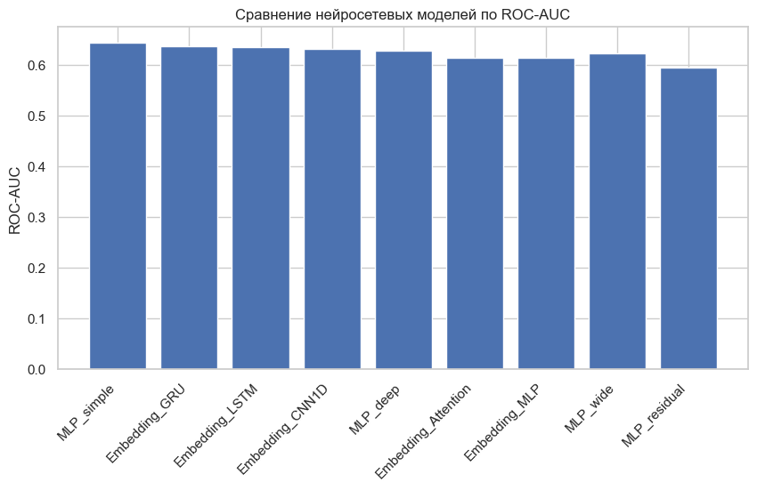
    


```python
plt.figure(figsize=(10, 5))

plt.bar(
    neural_results_df["model"],
    neural_results_df["pr_auc"]
)

plt.xticks(rotation=45, ha="right")
plt.ylabel("PR-AUC")
plt.title("Сравнение нейросетевых моделей по PR-AUC")
plt.grid(True)
plt.show()
```


    
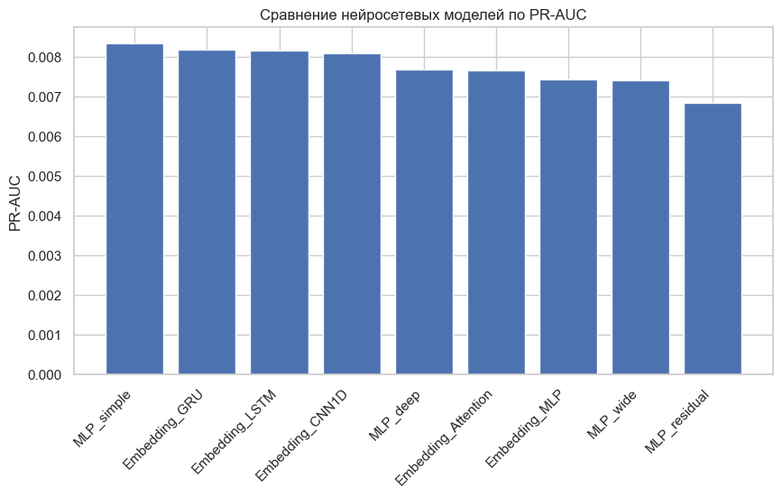
    


```python
best_neural_model_name = neural_results_df.iloc[0]["model"]

best_neural_model_info = trained_neural_models[best_neural_model_name]
best_neural_model = best_neural_model_info["model"]
best_input_type = best_neural_model_info["input_type"]

print("Лучшая нейросетевая модель:", best_neural_model_name)
print("Тип входных данных:", best_input_type)

if best_input_type == "onehot":
    X_best_valid = X_valid_ohe
    X_best_train = X_train_ohe
else:
    X_best_valid = X_valid_seq
    X_best_train = X_train_seq

best_valid_prob = best_neural_model.predict(
    X_best_valid,
    batch_size=BATCH_SIZE
).ravel()

best_train_prob = best_neural_model.predict(
    X_best_train,
    batch_size=BATCH_SIZE
).ravel()

best_valid_prob = np.clip(best_valid_prob, 1e-7, 1 - 1e-7)
best_train_prob = np.clip(best_train_prob, 1e-7, 1 - 1e-7)
```

    Лучшая нейросетевая модель: MLP_simple
    Тип входных данных: onehot
    25/25 ━━━━━━━━━━━━━━━━━━━━ 0s 1ms/step 
    45/45 ━━━━━━━━━━━━━━━━━━━━ 0s 753us/step
    


```python
RocCurveDisplay.from_predictions(
    y_valid,
    best_valid_prob,
    sample_weight=w_valid
)

plt.title(f"ROC-кривая лучшей нейросети: {best_neural_model_name}")
plt.grid(True)
plt.show()
```


    
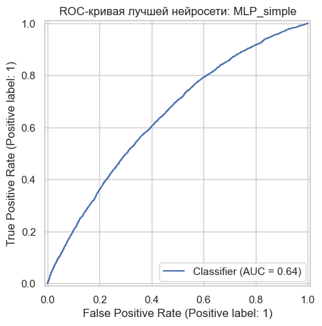
    


```python
fpr, tpr, thresholds = roc_curve(
    y_train,
    best_train_prob,
    sample_weight=w_train
)

youden_j = tpr - fpr
best_threshold_index = np.argmax(youden_j)
best_nn_threshold = thresholds[best_threshold_index]

print("Оптимальный порог по Youden's J:", best_nn_threshold)
print("TPR на train:", tpr[best_threshold_index])
print("FPR на train:", fpr[best_threshold_index])
```

    Оптимальный порог по Youden's J: 0.49264786
    TPR на train: 0.6738907265883427
    FPR на train: 0.46174704932679195
    


```python
valid_pred_05 = (best_valid_prob >= 0.5).astype(int)

cm_05 = confusion_matrix(
    y_valid,
    valid_pred_05,
    sample_weight=w_valid
)

cm_05_table = pd.DataFrame(
    cm_05,
    index=["Факт: cancer=0", "Факт: cancer=1"],
    columns=["Прогноз: cancer=0", "Прогноз: cancer=1"]
)

cm_05_table
```


<div>
<style scoped>
    .dataframe tbody tr th:only-of-type {
        vertical-align: middle;
    }

    .dataframe tbody tr th {
        vertical-align: top;
    }

    .dataframe thead th {
        text-align: right;
    }
</style>
<table border="1" class="dataframe">
  <thead>
    <tr style="text-align: right;">
      <th></th>
      <th>Прогноз: cancer=0</th>
      <th>Прогноз: cancer=1</th>
    </tr>
  </thead>
  <tbody>
    <tr>
      <th>Факт: cancer=0</th>
      <td>333283</td>
      <td>261705</td>
    </tr>
    <tr>
      <th>Факт: cancer=1</th>
      <td>1023</td>
      <td>1848</td>
    </tr>
  </tbody>
</table>
</div>


```python
best_history = neural_histories[best_neural_model_name]

plt.figure(figsize=(8, 5))

plt.plot(
    best_history.history["loss"],
    label="Train loss"
)

plt.plot(
    best_history.history["val_loss"],
    label="Validation loss"
)

plt.xlabel("Эпоха")
plt.ylabel("Loss")
plt.title(f"Динамика ошибки: {best_neural_model_name}")
plt.legend()
plt.grid(True)
plt.show()
```


    
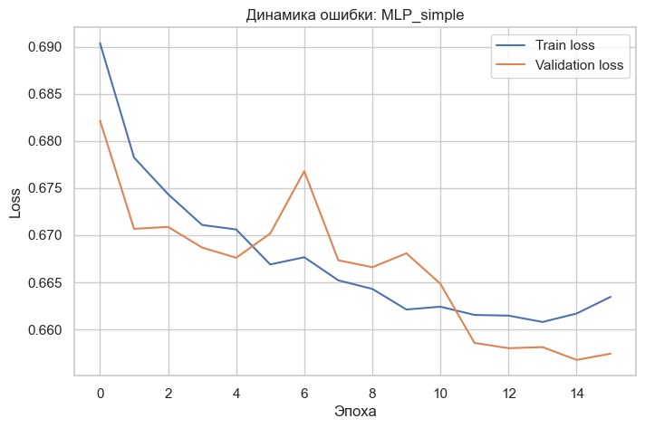
    


```python
plt.figure(figsize=(8, 5))

plt.plot(
    best_history.history["pr_auc"],
    label="Train PR-AUC"
)

plt.plot(
    best_history.history["val_pr_auc"],
    label="Validation PR-AUC"
)

plt.xlabel("Эпоха")
plt.ylabel("PR-AUC")
plt.title(f"Динамика PR-AUC: {best_neural_model_name}")
plt.legend()
plt.grid(True)
plt.show()
```


    
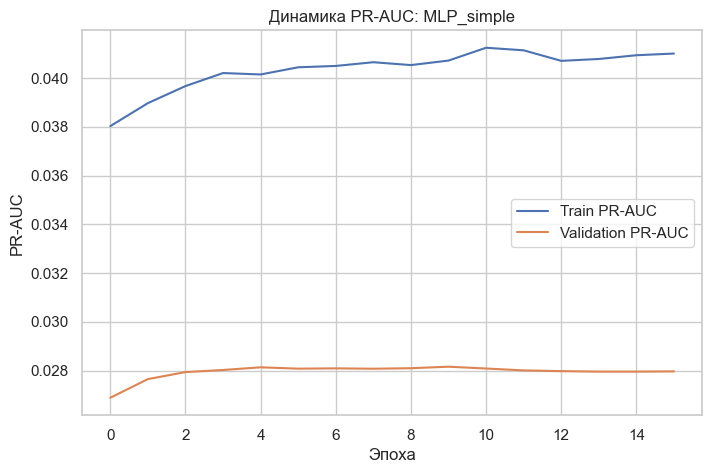
    


```python
best_nn_metrics = neural_results_df.iloc[0]

best_nn_summary = pd.DataFrame({
    "model_type": ["Neural network"],
    "model_name": [best_nn_metrics["model"]],
    "roc_auc": [best_nn_metrics["roc_auc"]],
    "pr_auc": [best_nn_metrics["pr_auc"]],
    "log_loss": [best_nn_metrics["log_loss"]],
    "brier_score": [best_nn_metrics["brier_score"]]
})

best_nn_summary
```


<div>
<style scoped>
    .dataframe tbody tr th:only-of-type {
        vertical-align: middle;
    }

    .dataframe tbody tr th {
        vertical-align: top;
    }

    .dataframe thead th {
        text-align: right;
    }
</style>
<table border="1" class="dataframe">
  <thead>
    <tr style="text-align: right;">
      <th></th>
      <th>model_type</th>
      <th>model_name</th>
      <th>roc_auc</th>
      <th>pr_auc</th>
      <th>log_loss</th>
      <th>brier_score</th>
    </tr>
  </thead>
  <tbody>
    <tr>
      <th>0</th>
      <td>Neural network</td>
      <td>MLP_simple</td>
      <td>0.643066</td>
      <td>0.008342</td>
      <td>0.668075</td>
      <td>0.238288</td>
    </tr>
  </tbody>
</table>
</div>


```python
logistic_summary = pd.DataFrame({
    "model_type": ["Logistic regression"],
    "model_name": ["Logistic regression"],
    "roc_auc": [roc_auc],
    "pr_auc": [pr_auc],
    "log_loss": [valid_logloss],
    "brier_score": [brier]
})

logistic_summary
```


<div>
<style scoped>
    .dataframe tbody tr th:only-of-type {
        vertical-align: middle;
    }

    .dataframe tbody tr th {
        vertical-align: top;
    }

    .dataframe thead th {
        text-align: right;
    }
</style>
<table border="1" class="dataframe">
  <thead>
    <tr style="text-align: right;">
      <th></th>
      <th>model_type</th>
      <th>model_name</th>
      <th>roc_auc</th>
      <th>pr_auc</th>
      <th>log_loss</th>
      <th>brier_score</th>
    </tr>
  </thead>
  <tbody>
    <tr>
      <th>0</th>
      <td>Logistic regression</td>
      <td>Logistic regression</td>
      <td>0.614554</td>
      <td>0.007658</td>
      <td>0.710691</td>
      <td>0.258673</td>
    </tr>
  </tbody>
</table>
</div>


```python
svm_summary = pd.DataFrame({
    "model_type": ["SVM"],
    "model_name": ["LinearSVM"],
    "roc_auc": [svm_roc_auc],
    "pr_auc": [svm_pr_auc],
    "log_loss": [np.nan],
    "brier_score": [np.nan]
})

svm_summary
```


<div>
<style scoped>
    .dataframe tbody tr th:only-of-type {
        vertical-align: middle;
    }

    .dataframe tbody tr th {
        vertical-align: top;
    }

    .dataframe thead th {
        text-align: right;
    }
</style>
<table border="1" class="dataframe">
  <thead>
    <tr style="text-align: right;">
      <th></th>
      <th>model_type</th>
      <th>model_name</th>
      <th>roc_auc</th>
      <th>pr_auc</th>
      <th>log_loss</th>
      <th>brier_score</th>
    </tr>
  </thead>
  <tbody>
    <tr>
      <th>0</th>
      <td>SVM</td>
      <td>LinearSVM</td>
      <td>0.64523</td>
      <td>0.008229</td>
      <td>NaN</td>
      <td>NaN</td>
    </tr>
  </tbody>
</table>
</div>


```python
model_summaries = []

if "logistic_summary" in globals():
    model_summaries.append(logistic_summary)

if "svm_summary" in globals():
    model_summaries.append(svm_summary)

model_summaries.append(best_nn_summary)

final_model_comparison = pd.concat(
    model_summaries,
    ignore_index=True
)

final_model_comparison = final_model_comparison.sort_values(
    by=["pr_auc", "roc_auc"],
    ascending=[False, False]
).reset_index(drop=True)

final_model_comparison
```


<div>
<style scoped>
    .dataframe tbody tr th:only-of-type {
        vertical-align: middle;
    }

    .dataframe tbody tr th {
        vertical-align: top;
    }

    .dataframe thead th {
        text-align: right;
    }
</style>
<table border="1" class="dataframe">
  <thead>
    <tr style="text-align: right;">
      <th></th>
      <th>model_type</th>
      <th>model_name</th>
      <th>roc_auc</th>
      <th>pr_auc</th>
      <th>log_loss</th>
      <th>brier_score</th>
    </tr>
  </thead>
  <tbody>
    <tr>
      <th>0</th>
      <td>Neural network</td>
      <td>MLP_simple</td>
      <td>0.643066</td>
      <td>0.008342</td>
      <td>0.668075</td>
      <td>0.238288</td>
    </tr>
    <tr>
      <th>1</th>
      <td>SVM</td>
      <td>LinearSVM</td>
      <td>0.645230</td>
      <td>0.008229</td>
      <td>NaN</td>
      <td>NaN</td>
    </tr>
    <tr>
      <th>2</th>
      <td>Logistic regression</td>
      <td>Logistic regression</td>
      <td>0.614554</td>
      <td>0.007658</td>
      <td>0.710691</td>
      <td>0.258673</td>
    </tr>
  </tbody>
</table>
</div>


```python

```


```python

```


```python
import warnings
warnings.filterwarnings("ignore")

import time
import numpy as np
import pandas as pd
import matplotlib.pyplot as plt

from sklearn.preprocessing import OneHotEncoder
from sklearn.metrics import (
    roc_auc_score,
    average_precision_score,
    log_loss,
    brier_score_loss,
    confusion_matrix,
    classification_report,
    roc_curve,
    RocCurveDisplay,
    PrecisionRecallDisplay
)

from sklearn.linear_model import LogisticRegression, SGDClassifier, RidgeClassifier
from sklearn.svm import LinearSVC
from sklearn.naive_bayes import BernoulliNB
from sklearn.tree import DecisionTreeClassifier
from sklearn.ensemble import (
    RandomForestClassifier,
    ExtraTreesClassifier,
    GradientBoostingClassifier,
    HistGradientBoostingClassifier,
    AdaBoostClassifier
)
```


```python
def make_balanced_weights(y, weights, normalize=True):
    y = pd.Series(y).reset_index(drop=True)
    weights = pd.Series(weights).reset_index(drop=True).astype(float)
    
    class_0_sum = weights[y == 0].sum()
    class_1_sum = weights[y == 1].sum()
    total_sum = weights.sum()
    
    class_weight_0 = total_sum / (2 * class_0_sum)
    class_weight_1 = total_sum / (2 * class_1_sum)
    
    balanced_weights = weights.copy()
    balanced_weights[y == 0] = weights[y == 0] * class_weight_0
    balanced_weights[y == 1] = weights[y == 1] * class_weight_1
    
    if normalize:
        balanced_weights = balanced_weights / balanced_weights.mean()
    
    return balanced_weights

w_train_clf = make_balanced_weights(
    y_train,
    w_train,
    normalize=True
)

print("Средний вес после нормализации:", w_train_clf.mean())

print("Суммарный вес класса 0 после балансировки:")
print(w_train_clf[y_train.reset_index(drop=True) == 0].sum())

print("Суммарный вес класса 1 после балансировки:")
print(w_train_clf[y_train.reset_index(drop=True) == 1].sum())

try:
    encoder_clf = OneHotEncoder(
        handle_unknown="ignore",
        sparse_output=False
    )
except TypeError:
    encoder_clf = OneHotEncoder(
        handle_unknown="ignore",
        sparse=False
    )

X_train_clf = encoder_clf.fit_transform(X_train).astype("float32")
X_valid_clf = encoder_clf.transform(X_valid).astype("float32")

y_train_clf = y_train.to_numpy()
y_valid_clf = y_valid.to_numpy()

w_train_clf_np = w_train_clf.to_numpy().astype("float32")
w_valid_np = w_valid.to_numpy().astype("float32")

print("X_train_clf:", X_train_clf.shape)
print("X_valid_clf:", X_valid_clf.shape)

```

    Средний вес после нормализации: 1.0
    Суммарный вес класса 0 после балансировки:
    90232.49999999997
    Суммарный вес класса 1 после балансировки:
    90232.5
    X_train_clf: (180465, 52)
    X_valid_clf: (100195, 52)
    


```python

```


```python

```


```python
RUN_SLOW_MODELS = True

classification_models = {
    "LogisticRegression": LogisticRegression(
        C=1.0,
        penalty="l2",
        solver="lbfgs",
        max_iter=3000,
        random_state=42
    ),
    
    "SGD_LogLoss": SGDClassifier(
        loss="log_loss",
        penalty="l2",
        alpha=0.0001,
        max_iter=2000,
        tol=1e-4,
        random_state=42
    ),
    
    "RidgeClassifier": RidgeClassifier(
        alpha=1.0,
        random_state=42
    ),
    
    "LinearSVC": LinearSVC(
        C=1.0,
        penalty="l2",
        loss="squared_hinge",
        dual=False,
        max_iter=10000,
        random_state=42
    ),
    
    "BernoulliNB": BernoulliNB(
        alpha=1.0
    ),
    
    "DecisionTree": DecisionTreeClassifier(
        max_depth=8,
        min_samples_leaf=100,
        random_state=42
    ),
    
    "RandomForest": RandomForestClassifier(
        n_estimators=150,
        max_depth=12,
        min_samples_leaf=50,
        n_jobs=-1,
        random_state=42
    ),
    
    "ExtraTrees": ExtraTreesClassifier(
        n_estimators=150,
        max_depth=12,
        min_samples_leaf=50,
        n_jobs=-1,
        random_state=42
    ),
    
    "HistGradientBoosting": HistGradientBoostingClassifier(
        max_iter=150,
        learning_rate=0.05,
        max_leaf_nodes=31,
        l2_regularization=0.1,
        random_state=42
    )
}

if RUN_SLOW_MODELS:
    classification_models["GradientBoosting"] = GradientBoostingClassifier(
        n_estimators=150,
        learning_rate=0.05,
        max_depth=3,
        min_samples_leaf=100,
        random_state=42
    )
    
    classification_models["AdaBoost"] = AdaBoostClassifier(
        n_estimators=150,
        learning_rate=0.05,
        random_state=42
    )

def get_model_scores(model, X):
    if hasattr(model, "predict_proba"):
        scores = model.predict_proba(X)[:, 1]
        score_type = "probability"
    elif hasattr(model, "decision_function"):
        scores = model.decision_function(X)
        score_type = "decision_function"
    else:
        scores = model.predict(X)
        score_type = "class_prediction"
    
    return scores, score_type

def get_default_threshold(score_type):
    if score_type == "probability":
        return 0.5
    else:
        return 0.0

def find_youden_threshold(y_true, scores, weights):
    fpr, tpr, thresholds = roc_curve(
        y_true,
        scores,
        sample_weight=weights
    )
    
    youden_j = tpr - fpr
    best_index = np.argmax(youden_j)
    
    return thresholds[best_index], tpr[best_index], fpr[best_index]

def weighted_classification_metrics(y_true, y_pred, weights):
    cm = confusion_matrix(
        y_true,
        y_pred,
        sample_weight=weights
    )
    
    tn, fp, fn, tp = cm.ravel()
    
    accuracy = (tp + tn) / (tp + tn + fp + fn)
    
    recall = tp / (tp + fn) if (tp + fn) > 0 else 0
    specificity = tn / (tn + fp) if (tn + fp) > 0 else 0
    precision = tp / (tp + fp) if (tp + fp) > 0 else 0
    
    f1 = (
        2 * precision * recall / (precision + recall)
        if (precision + recall) > 0
        else 0
    )
    
    return {
        "accuracy": accuracy,
        "recall": recall,
        "specificity": specificity,
        "precision": precision,
        "f1_score": f1
    }
```


```python
def evaluate_classifier(
    model_name,
    model,
    X_train_data,
    y_train_data,
    w_train_data,
    X_valid_data,
    y_valid_data,
    w_valid_data
):
    start_time = time.time()
    
    model.fit(
        X_train_data,
        y_train_data,
        sample_weight=w_train_data
    )
    
    fit_time = time.time() - start_time
    
    train_scores, train_score_type = get_model_scores(
        model,
        X_train_data
    )
    
    valid_scores, valid_score_type = get_model_scores(
        model,
        X_valid_data
    )
    
    roc_auc = roc_auc_score(
        y_valid_data,
        valid_scores,
        sample_weight=w_valid_data
    )
    
    pr_auc = average_precision_score(
        y_valid_data,
        valid_scores,
        sample_weight=w_valid_data
    )
    
    if valid_score_type == "probability":
        valid_prob = np.clip(valid_scores, 1e-7, 1 - 1e-7)
        
        model_log_loss = log_loss(
            y_valid_data,
            valid_prob,
            sample_weight=w_valid_data,
            labels=[0, 1]
        )
        
        model_brier = brier_score_loss(
            y_valid_data,
            valid_prob,
            sample_weight=w_valid_data
        )
    else:
        model_log_loss = np.nan
        model_brier = np.nan
    
    default_threshold = get_default_threshold(valid_score_type)
    
    valid_pred_default = (valid_scores >= default_threshold).astype(int)
    
    default_metrics = weighted_classification_metrics(
        y_valid_data,
        valid_pred_default,
        w_valid_data
    )
    
    youden_threshold, train_tpr, train_fpr = find_youden_threshold(
        y_train_data,
        train_scores,
        w_train_data
    )
    
    valid_pred_youden = (valid_scores >= youden_threshold).astype(int)
    
    youden_metrics = weighted_classification_metrics(
        y_valid_data,
        valid_pred_youden,
        w_valid_data
    )
    
    result = {
        "model": model_name,
        "score_type": valid_score_type,
        "fit_time_sec": fit_time,
        "roc_auc": roc_auc,
        "pr_auc": pr_auc,
        "log_loss": model_log_loss,
        "brier_score": model_brier,
        "default_threshold": default_threshold,
        "youden_threshold": youden_threshold,
        "default_accuracy": default_metrics["accuracy"],
        "default_recall": default_metrics["recall"],
        "default_specificity": default_metrics["specificity"],
        "default_precision": default_metrics["precision"],
        "default_f1": default_metrics["f1_score"],
        "youden_accuracy": youden_metrics["accuracy"],
        "youden_recall": youden_metrics["recall"],
        "youden_specificity": youden_metrics["specificity"],
        "youden_precision": youden_metrics["precision"],
        "youden_f1": youden_metrics["f1_score"]
    }
    
    prediction_info = {
        "model": model,
        "valid_scores": valid_scores,
        "train_scores": train_scores,
        "score_type": valid_score_type,
        "default_threshold": default_threshold,
        "youden_threshold": youden_threshold
    }
    
    return result, prediction_info
```


```python
classification_results = []
classification_predictions = {}

for model_name, model in classification_models.items():
    print("=" * 90)
    print("Обучается модель:", model_name)
    print("=" * 90)
    
    try:
        result, prediction_info = evaluate_classifier(
            model_name=model_name,
            model=model,
            X_train_data=X_train_clf,
            y_train_data=y_train_clf,
            w_train_data=w_train_clf_np,
            X_valid_data=X_valid_clf,
            y_valid_data=y_valid_clf,
            w_valid_data=w_valid_np
        )
        
        classification_results.append(result)
        classification_predictions[model_name] = prediction_info
        
        print("ROC-AUC:", result["roc_auc"])
        print("PR-AUC:", result["pr_auc"])
        print("Recall по Youden:", result["youden_recall"])
        print("Precision по Youden:", result["youden_precision"])
        print("F1 по Youden:", result["youden_f1"])
        print("Время обучения, сек:", result["fit_time_sec"])
    
    except Exception as error:
        print("Ошибка при обучении модели:", model_name)
        print(error)
```

    ==========================================================================================
    Обучается модель: LogisticRegression
    ==========================================================================================
    ROC-AUC: 0.6446422791905158
    PR-AUC: 0.00826562190756184
    Recall по Youden: 0.6886102403343782
    Precision по Youden: 0.006992265005782677
    F1 по Youden: 0.013843956136296794
    Время обучения, сек: 0.21903347969055176
    ==========================================================================================
    Обучается модель: SGD_LogLoss
    ==========================================================================================
    ROC-AUC: 0.6368533783927904
    PR-AUC: 0.008131193612478927
    Recall по Youden: 0.6663183559735284
    Precision по Youden: 0.006914949375919493
    F1 по Youden: 0.01368784836754699
    Время обучения, сек: 1.31839919090271
    ==========================================================================================
    Обучается модель: RidgeClassifier
    ==========================================================================================
    ROC-AUC: 0.644713564606791
    PR-AUC: 0.00827678689665145
    Recall по Youden: 0.6941832114245907
    Precision по Youden: 0.006920907878653184
    F1 по Youden: 0.013705177091105388
    Время обучения, сек: 0.049529314041137695
    ==========================================================================================
    Обучается модель: LinearSVC
    ==========================================================================================
    ROC-AUC: 0.6447120492783657
    PR-AUC: 0.008278113294114962
    Recall по Youden: 0.6927899686520376
    Precision по Youden: 0.006957878424280162
    F1 по Youden: 0.013777386798922191
    Время обучения, сек: 0.3145151138305664
    ==========================================================================================
    Обучается модель: BernoulliNB
    ==========================================================================================
    ROC-AUC: 0.6176377257682172
    PR-AUC: 0.007709319576299724
    Recall по Youden: 0.5207244862417276
    Precision по Youden: 0.007000997466528676
    F1 по Youden: 0.01381623939522762
    Время обучения, сек: 0.08354020118713379
    ==========================================================================================
    Обучается модель: DecisionTree
    ==========================================================================================
    ROC-AUC: 0.6234157992097822
    PR-AUC: 0.007166093897724455
    Recall по Youden: 0.709508881922675
    Precision по Youden: 0.006492181972322971
    F1 по Youden: 0.012866631083936294
    Время обучения, сек: 0.34447336196899414
    ==========================================================================================
    Обучается модель: RandomForest
    ==========================================================================================
    ROC-AUC: 0.6422370674882403
    PR-AUC: 0.008267303970513831
    Recall по Youden: 0.6140717520027865
    Precision по Youden: 0.007246853394059471
    F1 по Youden: 0.014324657016685014
    Время обучения, сек: 1.071819543838501
    ==========================================================================================
    Обучается модель: ExtraTrees
    ==========================================================================================
    ROC-AUC: 0.6399852256385903
    PR-AUC: 0.008199812547117756
    Recall по Youden: 0.5642633228840125
    Precision по Youden: 0.007423904974016332
    F1 по Youden: 0.014654996946875633
    Время обучения, сек: 1.445441722869873
    ==========================================================================================
    Обучается модель: HistGradientBoosting
    ==========================================================================================
    ROC-AUC: 0.6436602658772482
    PR-AUC: 0.008269662126624243
    Recall по Youden: 0.6509926854754441
    Precision по Youden: 0.0070545339251743815
    F1 по Youden: 0.013957812902575362
    Время обучения, сек: 2.3045690059661865
    ==========================================================================================
    Обучается модель: GradientBoosting
    ==========================================================================================
    ROC-AUC: 0.6424513961612652
    PR-AUC: 0.008268247107234212
    Recall по Youden: 0.64576802507837
    Precision по Youden: 0.0069451208091402886
    F1 по Youden: 0.013742444064768863
    Время обучения, сек: 24.545968770980835
    ==========================================================================================
    Обучается модель: AdaBoost
    ==========================================================================================
    ROC-AUC: 0.5735111240514363
    PR-AUC: 0.005705883223607364
    Recall по Youden: 0.7746429815395333
    Precision по Youden: 0.005868399040580085
    F1 по Youden: 0.011648553096765745
    Время обучения, сек: 12.142610311508179
    


```python
classification_results = []
classification_predictions = {}

for model_name, model in classification_models.items():
    print("=" * 90)
    print("Обучается модель:", model_name)
    print("=" * 90)
    
    try:
        result, prediction_info = evaluate_classifier(
            model_name=model_name,
            model=model,
            X_train_data=X_train_clf,
            y_train_data=y_train_clf,
            w_train_data=w_train_clf_np,
            X_valid_data=X_valid_clf,
            y_valid_data=y_valid_clf,
            w_valid_data=w_valid_np
        )
        
        classification_results.append(result)
        classification_predictions[model_name] = prediction_info
        
        print("ROC-AUC:", result["roc_auc"])
        print("PR-AUC:", result["pr_auc"])
        print("Recall по Youden:", result["youden_recall"])
        print("Precision по Youden:", result["youden_precision"])
        print("F1 по Youden:", result["youden_f1"])
        print("Время обучения, сек:", result["fit_time_sec"])
    
    except Exception as error:
        print("Ошибка при обучении модели:", model_name)
        print(error)
```

    ==========================================================================================
    Обучается модель: LogisticRegression
    ==========================================================================================
    ROC-AUC: 0.6446422791905158
    PR-AUC: 0.00826562190756184
    Recall по Youden: 0.6886102403343782
    Precision по Youden: 0.006992265005782677
    F1 по Youden: 0.013843956136296794
    Время обучения, сек: 0.23399686813354492
    ==========================================================================================
    Обучается модель: SGD_LogLoss
    ==========================================================================================
    ROC-AUC: 0.6368533783927904
    PR-AUC: 0.008131193612478927
    Recall по Youden: 0.6663183559735284
    Precision по Youden: 0.006914949375919493
    F1 по Youden: 0.01368784836754699
    Время обучения, сек: 1.4467558860778809
    ==========================================================================================
    Обучается модель: RidgeClassifier
    ==========================================================================================
    ROC-AUC: 0.644713564606791
    PR-AUC: 0.00827678689665145
    Recall по Youden: 0.6941832114245907
    Precision по Youden: 0.006920907878653184
    F1 по Youden: 0.013705177091105388
    Время обучения, сек: 0.05330538749694824
    ==========================================================================================
    Обучается модель: LinearSVC
    ==========================================================================================
    ROC-AUC: 0.6447120492783657
    PR-AUC: 0.008278113294114962
    Recall по Youden: 0.6927899686520376
    Precision по Youden: 0.006957878424280162
    F1 по Youden: 0.013777386798922191
    Время обучения, сек: 0.39216089248657227
    ==========================================================================================
    Обучается модель: BernoulliNB
    ==========================================================================================
    ROC-AUC: 0.6176377257682172
    PR-AUC: 0.007709319576299724
    Recall по Youden: 0.5207244862417276
    Precision по Youden: 0.007000997466528676
    F1 по Youden: 0.01381623939522762
    Время обучения, сек: 0.0842888355255127
    ==========================================================================================
    Обучается модель: DecisionTree
    ==========================================================================================
    ROC-AUC: 0.6234157992097822
    PR-AUC: 0.007166093897724455
    Recall по Youden: 0.709508881922675
    Precision по Youden: 0.006492181972322971
    F1 по Youden: 0.012866631083936294
    Время обучения, сек: 0.3324449062347412
    ==========================================================================================
    Обучается модель: RandomForest
    ==========================================================================================
    ROC-AUC: 0.6422370674882403
    PR-AUC: 0.008267303970513831
    Recall по Youden: 0.6140717520027865
    Precision по Youden: 0.007245394058201514
    F1 по Youden: 0.014321806026044078
    Время обучения, сек: 0.9859127998352051
    ==========================================================================================
    Обучается модель: ExtraTrees
    ==========================================================================================
    ROC-AUC: 0.6399852256385903
    PR-AUC: 0.008199812547117756
    Recall по Youden: 0.5642633228840125
    Precision по Youden: 0.007423904974016332
    F1 по Youden: 0.014654996946875633
    Время обучения, сек: 1.4597737789154053
    ==========================================================================================
    Обучается модель: HistGradientBoosting
    ==========================================================================================
    ROC-AUC: 0.6436602658772482
    PR-AUC: 0.008269662126624243
    Recall по Youden: 0.6509926854754441
    Precision по Youden: 0.0070545339251743815
    F1 по Youden: 0.013957812902575362
    Время обучения, сек: 0.5162773132324219
    ==========================================================================================
    Обучается модель: GradientBoosting
    ==========================================================================================
    ROC-AUC: 0.6424513961612652
    PR-AUC: 0.008268247107234212
    Recall по Youden: 0.64576802507837
    Precision по Youden: 0.0069451208091402886
    F1 по Youden: 0.013742444064768863
    Время обучения, сек: 24.832921266555786
    ==========================================================================================
    Обучается модель: AdaBoost
    ==========================================================================================
    ROC-AUC: 0.5735111240514363
    PR-AUC: 0.005705883223607364
    Recall по Youden: 0.7746429815395333
    Precision по Youden: 0.005868399040580085
    F1 по Youden: 0.011648553096765745
    Время обучения, сек: 12.245812177658081
    


```python
classification_results_df = pd.DataFrame(classification_results)

classification_results_df = classification_results_df.sort_values(
    by=["pr_auc", "roc_auc"],
    ascending=[False, False]
).reset_index(drop=True)

classification_results_df
```


<div>
<style scoped>
    .dataframe tbody tr th:only-of-type {
        vertical-align: middle;
    }

    .dataframe tbody tr th {
        vertical-align: top;
    }

    .dataframe thead th {
        text-align: right;
    }
</style>
<table border="1" class="dataframe">
  <thead>
    <tr style="text-align: right;">
      <th></th>
      <th>model</th>
      <th>score_type</th>
      <th>fit_time_sec</th>
      <th>roc_auc</th>
      <th>pr_auc</th>
      <th>log_loss</th>
      <th>brier_score</th>
      <th>default_threshold</th>
      <th>youden_threshold</th>
      <th>default_accuracy</th>
      <th>default_recall</th>
      <th>default_specificity</th>
      <th>default_precision</th>
      <th>default_f1</th>
      <th>youden_accuracy</th>
      <th>youden_recall</th>
      <th>youden_specificity</th>
      <th>youden_precision</th>
      <th>youden_f1</th>
    </tr>
  </thead>
  <tbody>
    <tr>
      <th>0</th>
      <td>LinearSVC</td>
      <td>decision_function</td>
      <td>0.392161</td>
      <td>0.644712</td>
      <td>0.008278</td>
      <td>NaN</td>
      <td>NaN</td>
      <td>0.0</td>
      <td>-0.034608</td>
      <td>0.574806</td>
      <td>0.635319</td>
      <td>0.574514</td>
      <td>0.007153</td>
      <td>0.014148</td>
      <td>0.523707</td>
      <td>0.692790</td>
      <td>0.522891</td>
      <td>0.006958</td>
      <td>0.013777</td>
    </tr>
    <tr>
      <th>1</th>
      <td>RidgeClassifier</td>
      <td>decision_function</td>
      <td>0.053305</td>
      <td>0.644714</td>
      <td>0.008277</td>
      <td>NaN</td>
      <td>NaN</td>
      <td>0.0</td>
      <td>-0.037048</td>
      <td>0.575405</td>
      <td>0.634970</td>
      <td>0.575117</td>
      <td>0.007160</td>
      <td>0.014160</td>
      <td>0.520200</td>
      <td>0.694183</td>
      <td>0.519360</td>
      <td>0.006921</td>
      <td>0.013705</td>
    </tr>
    <tr>
      <th>2</th>
      <td>HistGradientBoosting</td>
      <td>probability</td>
      <td>0.516277</td>
      <td>0.643660</td>
      <td>0.008270</td>
      <td>0.651376</td>
      <td>0.230855</td>
      <td>0.5</td>
      <td>0.502845</td>
      <td>0.547654</td>
      <td>0.662487</td>
      <td>0.547100</td>
      <td>0.007009</td>
      <td>0.013871</td>
      <td>0.558309</td>
      <td>0.650993</td>
      <td>0.557862</td>
      <td>0.007055</td>
      <td>0.013958</td>
    </tr>
    <tr>
      <th>3</th>
      <td>GradientBoosting</td>
      <td>probability</td>
      <td>24.832921</td>
      <td>0.642451</td>
      <td>0.008268</td>
      <td>0.660144</td>
      <td>0.234857</td>
      <td>0.5</td>
      <td>0.503219</td>
      <td>0.544434</td>
      <td>0.657262</td>
      <td>0.543890</td>
      <td>0.006905</td>
      <td>0.013667</td>
      <td>0.554890</td>
      <td>0.645768</td>
      <td>0.554452</td>
      <td>0.006945</td>
      <td>0.013742</td>
    </tr>
    <tr>
      <th>4</th>
      <td>RandomForest</td>
      <td>probability</td>
      <td>0.985913</td>
      <td>0.642237</td>
      <td>0.008267</td>
      <td>0.625961</td>
      <td>0.218557</td>
      <td>0.5</td>
      <td>0.499956</td>
      <td>0.595288</td>
      <td>0.613375</td>
      <td>0.595200</td>
      <td>0.007259</td>
      <td>0.014347</td>
      <td>0.594098</td>
      <td>0.614072</td>
      <td>0.594002</td>
      <td>0.007245</td>
      <td>0.014322</td>
    </tr>
    <tr>
      <th>5</th>
      <td>LogisticRegression</td>
      <td>probability</td>
      <td>0.233997</td>
      <td>0.644642</td>
      <td>0.008266</td>
      <td>0.661014</td>
      <td>0.235024</td>
      <td>0.5</td>
      <td>0.484030</td>
      <td>0.575634</td>
      <td>0.635667</td>
      <td>0.575344</td>
      <td>0.007171</td>
      <td>0.014182</td>
      <td>0.528889</td>
      <td>0.688610</td>
      <td>0.528118</td>
      <td>0.006992</td>
      <td>0.013844</td>
    </tr>
    <tr>
      <th>6</th>
      <td>ExtraTrees</td>
      <td>probability</td>
      <td>1.459774</td>
      <td>0.639985</td>
      <td>0.008200</td>
      <td>0.633782</td>
      <td>0.222637</td>
      <td>0.5</td>
      <td>0.519531</td>
      <td>0.567520</td>
      <td>0.637409</td>
      <td>0.567183</td>
      <td>0.007056</td>
      <td>0.013958</td>
      <td>0.635625</td>
      <td>0.564263</td>
      <td>0.635969</td>
      <td>0.007424</td>
      <td>0.014655</td>
    </tr>
    <tr>
      <th>7</th>
      <td>SGD_LogLoss</td>
      <td>probability</td>
      <td>1.446756</td>
      <td>0.636853</td>
      <td>0.008131</td>
      <td>0.578881</td>
      <td>0.197519</td>
      <td>0.5</td>
      <td>0.430588</td>
      <td>0.673523</td>
      <td>0.514107</td>
      <td>0.674293</td>
      <td>0.007559</td>
      <td>0.014899</td>
      <td>0.538868</td>
      <td>0.666318</td>
      <td>0.538253</td>
      <td>0.006915</td>
      <td>0.013688</td>
    </tr>
    <tr>
      <th>8</th>
      <td>BernoulliNB</td>
      <td>probability</td>
      <td>0.084289</td>
      <td>0.617638</td>
      <td>0.007709</td>
      <td>0.775401</td>
      <td>0.290049</td>
      <td>0.5</td>
      <td>0.636086</td>
      <td>0.452396</td>
      <td>0.705329</td>
      <td>0.451175</td>
      <td>0.006163</td>
      <td>0.012219</td>
      <td>0.643023</td>
      <td>0.520724</td>
      <td>0.643613</td>
      <td>0.007001</td>
      <td>0.013816</td>
    </tr>
    <tr>
      <th>9</th>
      <td>DecisionTree</td>
      <td>probability</td>
      <td>0.332445</td>
      <td>0.623416</td>
      <td>0.007166</td>
      <td>0.660658</td>
      <td>0.237409</td>
      <td>0.5</td>
      <td>0.505890</td>
      <td>0.477203</td>
      <td>0.709509</td>
      <td>0.476082</td>
      <td>0.006492</td>
      <td>0.012867</td>
      <td>0.477203</td>
      <td>0.709509</td>
      <td>0.476082</td>
      <td>0.006492</td>
      <td>0.012867</td>
    </tr>
    <tr>
      <th>10</th>
      <td>AdaBoost</td>
      <td>probability</td>
      <td>12.245812</td>
      <td>0.573511</td>
      <td>0.005706</td>
      <td>0.778882</td>
      <td>0.293730</td>
      <td>0.5</td>
      <td>0.633283</td>
      <td>0.368744</td>
      <td>0.774643</td>
      <td>0.366786</td>
      <td>0.005868</td>
      <td>0.011649</td>
      <td>0.368744</td>
      <td>0.774643</td>
      <td>0.366786</td>
      <td>0.005868</td>
      <td>0.011649</td>
    </tr>
  </tbody>
</table>
</div>


```python
plt.figure(figsize=(11, 5))

plt.bar(
    classification_results_df["model"],
    classification_results_df["roc_auc"]
)

plt.xticks(rotation=45, ha="right")
plt.ylabel("ROC-AUC")
plt.title("Сравнение моделей классификации по ROC-AUC")
plt.grid(True)
plt.show()
```


    
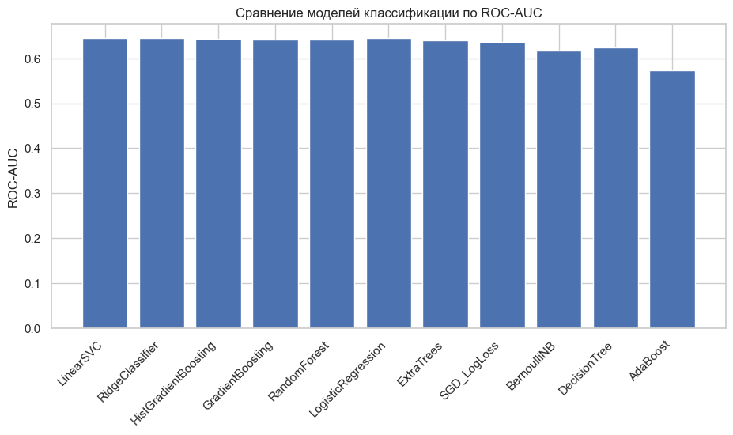
    


```python
import warnings
warnings.filterwarnings("ignore")

import time
import numpy as np
import pandas as pd
import matplotlib.pyplot as plt

from sklearn.model_selection import StratifiedShuffleSplit
from sklearn.preprocessing import OneHotEncoder
from sklearn.metrics import (
    accuracy_score,
    balanced_accuracy_score,
    precision_score,
    recall_score,
    f1_score,
    roc_auc_score,
    average_precision_score,
    log_loss,
    brier_score_loss,
    confusion_matrix,
    classification_report,
    roc_curve,
    precision_recall_curve,
    RocCurveDisplay,
    PrecisionRecallDisplay
)

from sklearn.ensemble import HistGradientBoostingClassifier
from sklearn.linear_model import LogisticRegression

try:
    from xgboost import XGBClassifier
    XGBOOST_AVAILABLE = True
    print("XGBoost доступен")
except Exception as error:
    XGBOOST_AVAILABLE = False
    print("XGBoost недоступен:", error)

try:
    from imblearn.over_sampling import RandomOverSampler, SMOTE, BorderlineSMOTE
    from imblearn.under_sampling import RandomUnderSampler
    from imblearn.combine import SMOTEENN, SMOTETomek
    IMBLEARN_AVAILABLE = True
    print("imbalanced-learn доступен")
except Exception as error:
    IMBLEARN_AVAILABLE = False
    print("imbalanced-learn недоступен:", error)
```

    XGBoost доступен
    imbalanced-learn доступен
    


```python
try:
    encoder_fusion = OneHotEncoder(
        handle_unknown="ignore",
        sparse_output=True
    )
except TypeError:
    encoder_fusion = OneHotEncoder(
        handle_unknown="ignore",
        sparse=True
    )

X_train_ohe = encoder_fusion.fit_transform(X_train)
X_valid_ohe = encoder_fusion.transform(X_valid)

y_train_np = y_train.to_numpy().astype(int)
y_valid_np = y_valid.to_numpy().astype(int)

w_train_np = w_train.to_numpy().astype(float)
w_valid_np = w_valid.to_numpy().astype(float)

print("X_train_ohe:", X_train_ohe.shape)
print("X_valid_ohe:", X_valid_ohe.shape)
```

    X_train_ohe: (180465, 52)
    X_valid_ohe: (100195, 52)
    


```python
splitter = StratifiedShuffleSplit(
    n_splits=1,
    test_size=0.2,
    random_state=42
)

inner_train_idx, inner_tune_idx = next(
    splitter.split(X_train_ohe, y_train_np)
)

X_inner_train = X_train_ohe[inner_train_idx]
y_inner_train = y_train_np[inner_train_idx]
w_inner_train = w_train_np[inner_train_idx]

X_inner_tune = X_train_ohe[inner_tune_idx]
y_inner_tune = y_train_np[inner_tune_idx]
w_inner_tune = w_train_np[inner_tune_idx]

print("Inner train:", X_inner_train.shape)
print("Inner tune:", X_inner_tune.shape)

print("Inner train weighted cancer rate:", np.average(y_inner_train, weights=w_inner_train))
print("Inner tune weighted cancer rate:", np.average(y_inner_tune, weights=w_inner_tune))
```

    Inner train: (144372, 52)
    Inner tune: (36093, 52)
    Inner train weighted cancer rate: 0.004879177795987815
    Inner tune weighted cancer rate: 0.004902180867183729
    


```python
def make_balanced_weights(y, weights, normalize=True):
    y = np.asarray(y)
    weights = np.asarray(weights).astype(float)

    class_0_weight_sum = weights[y == 0].sum()
    class_1_weight_sum = weights[y == 1].sum()
    total_weight_sum = weights.sum()

    class_weight_0 = total_weight_sum / (2 * class_0_weight_sum)
    class_weight_1 = total_weight_sum / (2 * class_1_weight_sum)

    balanced_weights = weights.copy()

    balanced_weights[y == 0] = weights[y == 0] * class_weight_0
    balanced_weights[y == 1] = weights[y == 1] * class_weight_1

    if normalize:
        balanced_weights = balanced_weights / balanced_weights.mean()

    return balanced_weights

w_inner_train_balanced = make_balanced_weights(
    y_inner_train,
    w_inner_train,
    normalize=True
)

w_train_balanced_full = make_balanced_weights(
    y_train_np,
    w_train_np,
    normalize=True
)

print("До балансировки:")
print("class 0 weight:", w_inner_train[y_inner_train == 0].sum())
print("class 1 weight:", w_inner_train[y_inner_train == 1].sum())

print("\nПосле балансировки:")
print("class 0 weight:", w_inner_train_balanced[y_inner_train == 0].sum())
print("class 1 weight:", w_inner_train_balanced[y_inner_train == 1].sum())
```

    До балансировки:
    class 0 weight: 1431747.0
    class 1 weight: 7020.0
    
    После балансировки:
    class 0 weight: 72185.99999999997
    class 1 weight: 72186.0
    


```python
def find_best_f1_threshold(y_true, y_prob, weights):
    precision, recall, thresholds = precision_recall_curve(
        y_true,
        y_prob,
        sample_weight=weights
    )

    f1_values = []

    for p, r in zip(precision[:-1], recall[:-1]):
        if p + r == 0:
            f1_values.append(0)
        else:
            f1_values.append(2 * p * r / (p + r))

    f1_values = np.array(f1_values)

    best_index = np.argmax(f1_values)
    best_threshold = thresholds[best_index]

    return best_threshold, precision[best_index], recall[best_index], f1_values[best_index]

def find_youden_threshold(y_true, y_prob, weights):
    fpr, tpr, thresholds = roc_curve(
        y_true,
        y_prob,
        sample_weight=weights
    )

    youden_j = tpr - fpr
    best_index = np.argmax(youden_j)

    return thresholds[best_index], tpr[best_index], fpr[best_index], youden_j[best_index]
```


```python
def evaluate_probabilistic_model(
    model_name,
    y_true,
    y_prob,
    weights,
    threshold
):
    y_prob = np.clip(y_prob, 1e-7, 1 - 1e-7)
    y_pred = (y_prob >= threshold).astype(int)

    result = {
        "model": model_name,
        "threshold": threshold,

        "accuracy": accuracy_score(
            y_true,
            y_pred,
            sample_weight=weights
        ),

        "balanced_accuracy": balanced_accuracy_score(
            y_true,
            y_pred,
            sample_weight=weights
        ),

        "precision": precision_score(
            y_true,
            y_pred,
            sample_weight=weights,
            zero_division=0
        ),

        "recall": recall_score(
            y_true,
            y_pred,
            sample_weight=weights,
            zero_division=0
        ),

        "f1_score": f1_score(
            y_true,
            y_pred,
            sample_weight=weights,
            zero_division=0
        ),

        "roc_auc": roc_auc_score(
            y_true,
            y_prob,
            sample_weight=weights
        ),

        "pr_auc": average_precision_score(
            y_true,
            y_prob,
            sample_weight=weights
        ),

        "log_loss": log_loss(
            y_true,
            y_prob,
            sample_weight=weights,
            labels=[0, 1]
        ),

        "brier_score": brier_score_loss(
            y_true,
            y_prob,
            sample_weight=weights
        )
    }

    return result
```


```python
def get_confusion_matrix_table(y_true, y_prob, weights, threshold):
    y_pred = (y_prob >= threshold).astype(int)

    cm = confusion_matrix(
        y_true,
        y_pred,
        sample_weight=weights
    )

    cm_table = pd.DataFrame(
        cm,
        index=["Факт: cancer=0", "Факт: cancer=1"],
        columns=["Прогноз: cancer=0", "Прогноз: cancer=1"]
    )

    return cm_table
```


```python
def make_xgboost_model(
    n_estimators=500,
    max_depth=3,
    learning_rate=0.03,
    min_child_weight=10,
    subsample=0.8,
    colsample_bytree=0.8,
    reg_lambda=3.0,
    reg_alpha=0.1
):
    model = XGBClassifier(
        n_estimators=n_estimators,
        max_depth=max_depth,
        learning_rate=learning_rate,
        min_child_weight=min_child_weight,
        subsample=subsample,
        colsample_bytree=colsample_bytree,
        reg_lambda=reg_lambda,
        reg_alpha=reg_alpha,
        objective="binary:logistic",
        eval_metric="aucpr",
        tree_method="hist",
        random_state=42,
        n_jobs=-1
    )

    return model
```


```python
if not XGBOOST_AVAILABLE:
    raise ImportError("Установи xgboost: !pip install xgboost")

xgb_balanced = make_xgboost_model(
    n_estimators=500,
    max_depth=3,
    learning_rate=0.03,
    min_child_weight=10,
    subsample=0.8,
    colsample_bytree=0.8,
    reg_lambda=3.0,
    reg_alpha=0.1
)

start_time = time.time()

xgb_balanced.fit(
    X_inner_train,
    y_inner_train,
    sample_weight=w_inner_train_balanced
)

fit_time = time.time() - start_time

tune_prob_balanced = xgb_balanced.predict_proba(X_inner_tune)[:, 1]

best_threshold_f1, tune_precision, tune_recall, tune_f1 = find_best_f1_threshold(
    y_inner_tune,
    tune_prob_balanced,
    w_inner_tune
)

print("Время обучения:", fit_time)
print("Лучший порог по F1:", best_threshold_f1)
print("Tune precision:", tune_precision)
print("Tune recall:", tune_recall)
print("Tune F1:", tune_f1)
```

    Время обучения: 0.6131761074066162
    Лучший порог по F1: 0.66799676
    Tune precision: 0.009352247049962339
    Tune recall: 0.08528906697195192
    Tune F1: 0.01685615702245602
    


```python
xgb_balanced_final = make_xgboost_model(
    n_estimators=500,
    max_depth=3,
    learning_rate=0.03,
    min_child_weight=10,
    subsample=0.8,
    colsample_bytree=0.8,
    reg_lambda=3.0,
    reg_alpha=0.1
)

xgb_balanced_final.fit(
    X_train_ohe,
    y_train_np,
    sample_weight=w_train_balanced_full
)

valid_prob_xgb_balanced = xgb_balanced_final.predict_proba(X_valid_ohe)[:, 1]

result_xgb_balanced = evaluate_probabilistic_model(
    model_name="BalancedWeight_XGBoost",
    y_true=y_valid_np,
    y_prob=valid_prob_xgb_balanced,
    weights=w_valid_np,
    threshold=best_threshold_f1
)

result_xgb_balanced
```


    {'model': 'BalancedWeight_XGBoost',
     'threshold': np.float32(0.66799676),
     'accuracy': 0.9634077600236846,
     'balanced_accuracy': np.float64(0.5252772177589902),
     'precision': 0.012216404886561954,
     'recall': 0.08289794496691048,
     'f1_score': 0.02129468080347157,
     'roc_auc': np.float64(0.6476746972411271),
     'pr_auc': np.float64(0.008468032192327526),
     'log_loss': 0.6539435706739936,
     'brier_score': np.float64(0.232229047953082)}


```python
cm_xgb_balanced = get_confusion_matrix_table(
    y_valid_np,
    valid_prob_xgb_balanced,
    w_valid_np,
    best_threshold_f1
)

cm_xgb_balanced
```


<div>
<style scoped>
    .dataframe tbody tr th:only-of-type {
        vertical-align: middle;
    }

    .dataframe tbody tr th {
        vertical-align: top;
    }

    .dataframe thead th {
        text-align: right;
    }
</style>
<table border="1" class="dataframe">
  <thead>
    <tr style="text-align: right;">
      <th></th>
      <th>Прогноз: cancer=0</th>
      <th>Прогноз: cancer=1</th>
    </tr>
  </thead>
  <tbody>
    <tr>
      <th>Факт: cancer=0</th>
      <td>575744.0</td>
      <td>19244.0</td>
    </tr>
    <tr>
      <th>Факт: cancer=1</th>
      <td>2633.0</td>
      <td>238.0</td>
    </tr>
  </tbody>
</table>
</div>


```python
def resample_by_indices(X, y, weights, resampler):
    indices = np.arange(len(y)).reshape(-1, 1)

    resampled_indices, resampled_y = resampler.fit_resample(
        indices,
        y
    )

    resampled_indices = resampled_indices.ravel()

    X_resampled = X[resampled_indices]
    y_resampled = y[resampled_indices]
    weights_resampled = weights[resampled_indices]

    weights_resampled = weights_resampled.astype(float)
    weights_resampled = weights_resampled / weights_resampled.mean()

    return X_resampled, y_resampled, weights_resampled, resampled_indices
```


```python
if not IMBLEARN_AVAILABLE:
    raise ImportError("Установи imbalanced-learn: !pip install imbalanced-learn")

ros = RandomOverSampler(
    sampling_strategy="auto",
    random_state=42
)

X_ros_train, y_ros_train, w_ros_train, ros_idx = resample_by_indices(
    X_inner_train,
    y_inner_train,
    w_inner_train,
    ros
)

print("До ROS:", X_inner_train.shape)
print("После ROS:", X_ros_train.shape)

print("Классы после ROS:")
print(pd.Series(y_ros_train).value_counts())
```

    До ROS: (144372, 52)
    После ROS: (277914, 52)
    Классы после ROS:
    0    138957
    1    138957
    Name: count, dtype: int64
    


```python
xgb_ros = make_xgboost_model(
    n_estimators=500,
    max_depth=3,
    learning_rate=0.03,
    min_child_weight=10,
    subsample=0.8,
    colsample_bytree=0.8,
    reg_lambda=3.0,
    reg_alpha=0.1
)

start_time = time.time()

xgb_ros.fit(
    X_ros_train,
    y_ros_train,
    sample_weight=w_ros_train
)

fit_time_ros = time.time() - start_time

tune_prob_ros = xgb_ros.predict_proba(X_inner_tune)[:, 1]

best_threshold_ros, tune_precision_ros, tune_recall_ros, tune_f1_ros = find_best_f1_threshold(
    y_inner_tune,
    tune_prob_ros,
    w_inner_tune
)

print("Время обучения ROS + XGBoost:", fit_time_ros)
print("Лучший порог по F1:", best_threshold_ros)
print("Tune precision:", tune_precision_ros)
print("Tune recall:", tune_recall_ros)
print("Tune F1:", tune_f1_ros)
```

    Время обучения ROS + XGBoost: 0.7292525768280029
    Лучший порог по F1: 0.18261963
    Tune precision: 0.00867520416918237
    Tune recall: 0.15626788780767029
    Tune F1: 0.0164378612716763
    


```python
X_ros_full, y_ros_full, w_ros_full, ros_full_idx = resample_by_indices(
    X_train_ohe,
    y_train_np,
    w_train_np,
    RandomOverSampler(
        sampling_strategy="auto",
        random_state=42
    )
)

xgb_ros_final = make_xgboost_model(
    n_estimators=500,
    max_depth=3,
    learning_rate=0.03,
    min_child_weight=10,
    subsample=0.8,
    colsample_bytree=0.8,
    reg_lambda=3.0,
    reg_alpha=0.1
)

xgb_ros_final.fit(
    X_ros_full,
    y_ros_full,
    sample_weight=w_ros_full
)

valid_prob_xgb_ros = xgb_ros_final.predict_proba(X_valid_ohe)[:, 1]

result_xgb_ros = evaluate_probabilistic_model(
    model_name="ROS_XGBoost",
    y_true=y_valid_np,
    y_prob=valid_prob_xgb_ros,
    weights=w_valid_np,
    threshold=best_threshold_ros
)

result_xgb_ros
```


    {'model': 'ROS_XGBoost',
     'threshold': np.float32(0.18261963),
     'accuracy': 0.9265796784860645,
     'balanced_accuracy': np.float64(0.5455968821239242),
     'precision': 0.011013635930199295,
     'recall': 0.16091954022988506,
     'f1_score': 0.02061625649836007,
     'roc_auc': np.float64(0.6470946150602976),
     'pr_auc': np.float64(0.008459337242019081),
     'log_loss': 0.12610244510257873,
     'brier_score': np.float64(0.017640511936546963)}


```python
cm_xgb_ros = get_confusion_matrix_table(
    y_valid_np,
    valid_prob_xgb_ros,
    w_valid_np,
    best_threshold_ros
)

cm_xgb_ros
```


<div>
<style scoped>
    .dataframe tbody tr th:only-of-type {
        vertical-align: middle;
    }

    .dataframe tbody tr th {
        vertical-align: top;
    }

    .dataframe thead th {
        text-align: right;
    }
</style>
<table border="1" class="dataframe">
  <thead>
    <tr style="text-align: right;">
      <th></th>
      <th>Прогноз: cancer=0</th>
      <th>Прогноз: cancer=1</th>
    </tr>
  </thead>
  <tbody>
    <tr>
      <th>Факт: cancer=0</th>
      <td>553502.0</td>
      <td>41486.0</td>
    </tr>
    <tr>
      <th>Факт: cancer=1</th>
      <td>2409.0</td>
      <td>462.0</td>
    </tr>
  </tbody>
</table>
</div>


```python
rus = RandomUnderSampler(
    sampling_strategy="auto",
    random_state=42
)

X_rus_train, y_rus_train, w_rus_train, rus_idx = resample_by_indices(
    X_inner_train,
    y_inner_train,
    w_inner_train,
    rus
)

print("До RUS:", X_inner_train.shape)
print("После RUS:", X_rus_train.shape)

print("Классы после RUS:")
print(pd.Series(y_rus_train).value_counts())
```

    До RUS: (144372, 52)
    После RUS: (10830, 52)
    Классы после RUS:
    0    5415
    1    5415
    Name: count, dtype: int64
    


```python
xgb_rus = make_xgboost_model(
    n_estimators=500,
    max_depth=3,
    learning_rate=0.03,
    min_child_weight=5,
    subsample=0.9,
    colsample_bytree=0.9,
    reg_lambda=2.0,
    reg_alpha=0.05
)

start_time = time.time()

xgb_rus.fit(
    X_rus_train,
    y_rus_train,
    sample_weight=w_rus_train
)

fit_time_rus = time.time() - start_time

tune_prob_rus = xgb_rus.predict_proba(X_inner_tune)[:, 1]

best_threshold_rus, tune_precision_rus, tune_recall_rus, tune_f1_rus = find_best_f1_threshold(
    y_inner_tune,
    tune_prob_rus,
    w_inner_tune
)

print("Время обучения RUS + XGBoost:", fit_time_rus)
print("Лучший порог по F1:", best_threshold_rus)
print("Tune precision:", tune_precision_rus)
print("Tune recall:", tune_recall_rus)
print("Tune F1:", tune_f1_rus)
```

    Время обучения RUS + XGBoost: 0.1448984146118164
    Лучший порог по F1: 0.18442513
    Tune precision: 0.005984613164630025
    Tune recall: 0.45105895821408126
    Tune F1: 0.011812499063094934
    


```python
X_rus_full, y_rus_full, w_rus_full, rus_full_idx = resample_by_indices(
    X_train_ohe,
    y_train_np,
    w_train_np,
    RandomUnderSampler(
        sampling_strategy="auto",
        random_state=42
    )
)

xgb_rus_final = make_xgboost_model(
    n_estimators=500,
    max_depth=3,
    learning_rate=0.03,
    min_child_weight=5,
    subsample=0.9,
    colsample_bytree=0.9,
    reg_lambda=2.0,
    reg_alpha=0.05
)

xgb_rus_final.fit(
    X_rus_full,
    y_rus_full,
    sample_weight=w_rus_full
)

valid_prob_xgb_rus = xgb_rus_final.predict_proba(X_valid_ohe)[:, 1]

result_xgb_rus = evaluate_probabilistic_model(
    model_name="RUS_XGBoost",
    y_true=y_valid_np,
    y_prob=valid_prob_xgb_rus,
    weights=w_valid_np,
    threshold=best_threshold_rus
)

result_xgb_rus
```


    {'model': 'RUS_XGBoost',
     'threshold': np.float32(0.18442513),
     'accuracy': 0.7489190595106873,
     'balanced_accuracy': np.float64(0.5579005252694412),
     'precision': 0.007017731826217389,
     'recall': 0.36502960640891674,
     'f1_score': 0.013770720137707202,
     'roc_auc': np.float64(0.5974667190147803),
     'pr_auc': np.float64(0.006749086879960363),
     'log_loss': 0.16768858509833148,
     'brier_score': np.float64(0.029824709231326105)}


```python
smote_resamplers = {
    "SMOTE": SMOTE(
        sampling_strategy="auto",
        random_state=42,
        k_neighbors=5
    ),

    "BorderlineSMOTE": BorderlineSMOTE(
        sampling_strategy="auto",
        random_state=42,
        k_neighbors=5
    )

}
```


```python
def fit_smote_xgboost_experiment(
    resampler_name,
    resampler,
    X_train_data,
    y_train_data,
    X_tune_data,
    y_tune_data,
    w_tune_data
):
    print("=" * 90)
    print("Resampling:", resampler_name)
    print("=" * 90)

    start_resample = time.time()

    X_resampled, y_resampled = resampler.fit_resample(
        X_train_data,
        y_train_data
    )

    resample_time = time.time() - start_resample

    print("После resampling:", X_resampled.shape)
    print(pd.Series(y_resampled).value_counts())
    print("Время resampling:", resample_time)

    model = make_xgboost_model(
        n_estimators=500,
        max_depth=3,
        learning_rate=0.03,
        min_child_weight=10,
        subsample=0.8,
        colsample_bytree=0.8,
        reg_lambda=3.0,
        reg_alpha=0.1
    )

    start_fit = time.time()

    model.fit(
        X_resampled,
        y_resampled
    )

    fit_time = time.time() - start_fit

    tune_prob = model.predict_proba(X_tune_data)[:, 1]

    threshold, precision, recall, f1 = find_best_f1_threshold(
        y_tune_data,
        tune_prob,
        w_tune_data
    )

    return {
        "resampler": resampler_name,
        "model": model,
        "threshold": threshold,
        "tune_precision": precision,
        "tune_recall": recall,
        "tune_f1": f1,
        "resample_time": resample_time,
        "fit_time": fit_time
    }
```


```python
smote_experiments = {}

for resampler_name, resampler in smote_resamplers.items():
    try:
        experiment_result = fit_smote_xgboost_experiment(
            resampler_name=resampler_name,
            resampler=resampler,
            X_train_data=X_inner_train,
            y_train_data=y_inner_train,
            X_tune_data=X_inner_tune,
            y_tune_data=y_inner_tune,
            w_tune_data=w_inner_tune
        )

        smote_experiments[resampler_name] = experiment_result

    except Exception as error:
        print("Ошибка для", resampler_name)
        print(error)
```

    ==========================================================================================
    Resampling: SMOTE
    ==========================================================================================
    После resampling: (277914, 52)
    0    138957
    1    138957
    Name: count, dtype: int64
    Время resampling: 0.5782930850982666
    ==========================================================================================
    Resampling: BorderlineSMOTE
    ==========================================================================================
    После resampling: (277914, 52)
    0    138957
    1    138957
    Name: count, dtype: int64
    Время resampling: 14.792855024337769
    


```python
smote_results = []

for resampler_name, info in smote_experiments.items():
    model = info["model"]
    threshold = info["threshold"]

    valid_prob = model.predict_proba(X_valid_ohe)[:, 1]

    result = evaluate_probabilistic_model(
        model_name=f"{resampler_name}_XGBoost",
        y_true=y_valid_np,
        y_prob=valid_prob,
        weights=w_valid_np,
        threshold=threshold
    )

    result["resample_time"] = info["resample_time"]
    result["fit_time"] = info["fit_time"]
    result["tune_f1"] = info["tune_f1"]

    smote_results.append(result)

smote_results_df = pd.DataFrame(smote_results)

smote_results_df
```


<div>
<style scoped>
    .dataframe tbody tr th:only-of-type {
        vertical-align: middle;
    }

    .dataframe tbody tr th {
        vertical-align: top;
    }

    .dataframe thead th {
        text-align: right;
    }
</style>
<table border="1" class="dataframe">
  <thead>
    <tr style="text-align: right;">
      <th></th>
      <th>model</th>
      <th>threshold</th>
      <th>accuracy</th>
      <th>balanced_accuracy</th>
      <th>precision</th>
      <th>recall</th>
      <th>f1_score</th>
      <th>roc_auc</th>
      <th>pr_auc</th>
      <th>log_loss</th>
      <th>brier_score</th>
      <th>resample_time</th>
      <th>fit_time</th>
      <th>tune_f1</th>
    </tr>
  </thead>
  <tbody>
    <tr>
      <th>0</th>
      <td>SMOTE_XGBoost</td>
      <td>0.427827</td>
      <td>0.974429</td>
      <td>0.494938</td>
      <td>0.002484</td>
      <td>0.010798</td>
      <td>0.004039</td>
      <td>0.504596</td>
      <td>0.004746</td>
      <td>0.287611</td>
      <td>0.069774</td>
      <td>0.578293</td>
      <td>1.186880</td>
      <td>0.014773</td>
    </tr>
    <tr>
      <th>1</th>
      <td>BorderlineSMOTE_XGBoost</td>
      <td>0.466094</td>
      <td>0.975421</td>
      <td>0.495263</td>
      <td>0.002524</td>
      <td>0.010449</td>
      <td>0.004066</td>
      <td>0.502321</td>
      <td>0.004735</td>
      <td>0.319715</td>
      <td>0.083090</td>
      <td>14.792855</td>
      <td>1.212781</td>
      <td>0.014773</td>
    </tr>
  </tbody>
</table>
</div>


```python
xgb_param_grid = [
    {
        "n_estimators": 300,
        "max_depth": 2,
        "learning_rate": 0.03,
        "min_child_weight": 10,
        "subsample": 0.8,
        "colsample_bytree": 0.8,
        "reg_lambda": 5.0,
        "reg_alpha": 0.1
    },
    {
        "n_estimators": 500,
        "max_depth": 3,
        "learning_rate": 0.03,
        "min_child_weight": 10,
        "subsample": 0.8,
        "colsample_bytree": 0.8,
        "reg_lambda": 3.0,
        "reg_alpha": 0.1
    },
    {
        "n_estimators": 700,
        "max_depth": 3,
        "learning_rate": 0.02,
        "min_child_weight": 15,
        "subsample": 0.9,
        "colsample_bytree": 0.8,
        "reg_lambda": 5.0,
        "reg_alpha": 0.2
    },
    {
        "n_estimators": 500,
        "max_depth": 4,
        "learning_rate": 0.02,
        "min_child_weight": 20,
        "subsample": 0.8,
        "colsample_bytree": 0.7,
        "reg_lambda": 8.0,
        "reg_alpha": 0.5
    },
    {
        "n_estimators": 900,
        "max_depth": 2,
        "learning_rate": 0.015,
        "min_child_weight": 10,
        "subsample": 0.9,
        "colsample_bytree": 0.9,
        "reg_lambda": 3.0,
        "reg_alpha": 0.1
    }
]
```


```python
xgb_tuning_results = []
xgb_tuning_models = {}

for i, params in enumerate(xgb_param_grid, start=1):
    print("=" * 90)
    print("XGBoost config:", i)
    print(params)
    print("=" * 90)

    model = make_xgboost_model(**params)

    start_time = time.time()

    model.fit(
        X_inner_train,
        y_inner_train,
        sample_weight=w_inner_train_balanced
    )

    fit_time = time.time() - start_time

    tune_prob = model.predict_proba(X_inner_tune)[:, 1]
    tune_prob = np.clip(tune_prob, 1e-7, 1 - 1e-7)

    threshold_f1, precision_f1, recall_f1, f1_value = find_best_f1_threshold(
        y_inner_tune,
        tune_prob,
        w_inner_tune
    )

    threshold_youden, tpr_youden, fpr_youden, youden_value = find_youden_threshold(
        y_inner_tune,
        tune_prob,
        w_inner_tune
    )

    tune_result = evaluate_probabilistic_model(
        model_name=f"XGB_config_{i}",
        y_true=y_inner_tune,
        y_prob=tune_prob,
        weights=w_inner_tune,
        threshold=threshold_f1
    )

    tune_result["config_id"] = i
    tune_result["fit_time"] = fit_time
    tune_result["f1_threshold"] = threshold_f1
    tune_result["youden_threshold"] = threshold_youden

    for key, value in params.items():
        tune_result[key] = value

    xgb_tuning_results.append(tune_result)
    xgb_tuning_models[i] = model

xgb_tuning_results_df = pd.DataFrame(xgb_tuning_results)

xgb_tuning_results_df = xgb_tuning_results_df.sort_values(
    by=["pr_auc", "f1_score", "roc_auc"],
    ascending=[False, False, False]
).reset_index(drop=True)

xgb_tuning_results_df
```

    ==========================================================================================
    XGBoost config: 1
    {'n_estimators': 300, 'max_depth': 2, 'learning_rate': 0.03, 'min_child_weight': 10, 'subsample': 0.8, 'colsample_bytree': 0.8, 'reg_lambda': 5.0, 'reg_alpha': 0.1}
    ==========================================================================================
    ==========================================================================================
    XGBoost config: 2
    {'n_estimators': 500, 'max_depth': 3, 'learning_rate': 0.03, 'min_child_weight': 10, 'subsample': 0.8, 'colsample_bytree': 0.8, 'reg_lambda': 3.0, 'reg_alpha': 0.1}
    ==========================================================================================
    ==========================================================================================
    XGBoost config: 3
    {'n_estimators': 700, 'max_depth': 3, 'learning_rate': 0.02, 'min_child_weight': 15, 'subsample': 0.9, 'colsample_bytree': 0.8, 'reg_lambda': 5.0, 'reg_alpha': 0.2}
    ==========================================================================================
    ==========================================================================================
    XGBoost config: 4
    {'n_estimators': 500, 'max_depth': 4, 'learning_rate': 0.02, 'min_child_weight': 20, 'subsample': 0.8, 'colsample_bytree': 0.7, 'reg_lambda': 8.0, 'reg_alpha': 0.5}
    ==========================================================================================
    ==========================================================================================
    XGBoost config: 5
    {'n_estimators': 900, 'max_depth': 2, 'learning_rate': 0.015, 'min_child_weight': 10, 'subsample': 0.9, 'colsample_bytree': 0.9, 'reg_lambda': 3.0, 'reg_alpha': 0.1}
    ==========================================================================================
    


<div>
<style scoped>
    .dataframe tbody tr th:only-of-type {
        vertical-align: middle;
    }

    .dataframe tbody tr th {
        vertical-align: top;
    }

    .dataframe thead th {
        text-align: right;
    }
</style>
<table border="1" class="dataframe">
  <thead>
    <tr style="text-align: right;">
      <th></th>
      <th>model</th>
      <th>threshold</th>
      <th>accuracy</th>
      <th>balanced_accuracy</th>
      <th>precision</th>
      <th>recall</th>
      <th>f1_score</th>
      <th>roc_auc</th>
      <th>pr_auc</th>
      <th>log_loss</th>
      <th>...</th>
      <th>f1_threshold</th>
      <th>youden_threshold</th>
      <th>n_estimators</th>
      <th>max_depth</th>
      <th>learning_rate</th>
      <th>min_child_weight</th>
      <th>subsample</th>
      <th>colsample_bytree</th>
      <th>reg_lambda</th>
      <th>reg_alpha</th>
    </tr>
  </thead>
  <tbody>
    <tr>
      <th>0</th>
      <td>XGB_config_5</td>
      <td>0.631328</td>
      <td>0.931555</td>
      <td>0.531866</td>
      <td>0.009700</td>
      <td>0.128220</td>
      <td>0.018035</td>
      <td>0.608435</td>
      <td>0.007167</td>
      <td>0.670910</td>
      <td>...</td>
      <td>0.631328</td>
      <td>0.515368</td>
      <td>900</td>
      <td>2</td>
      <td>0.015</td>
      <td>10</td>
      <td>0.9</td>
      <td>0.9</td>
      <td>3.0</td>
      <td>0.1</td>
    </tr>
    <tr>
      <th>1</th>
      <td>XGB_config_1</td>
      <td>0.638067</td>
      <td>0.959206</td>
      <td>0.520128</td>
      <td>0.010261</td>
      <td>0.076703</td>
      <td>0.018101</td>
      <td>0.607258</td>
      <td>0.007107</td>
      <td>0.671106</td>
      <td>...</td>
      <td>0.638067</td>
      <td>0.517228</td>
      <td>300</td>
      <td>2</td>
      <td>0.030</td>
      <td>10</td>
      <td>0.8</td>
      <td>0.8</td>
      <td>5.0</td>
      <td>0.1</td>
    </tr>
    <tr>
      <th>2</th>
      <td>XGB_config_2</td>
      <td>0.667997</td>
      <td>0.951228</td>
      <td>0.520391</td>
      <td>0.009352</td>
      <td>0.085289</td>
      <td>0.016856</td>
      <td>0.603558</td>
      <td>0.006896</td>
      <td>0.669605</td>
      <td>...</td>
      <td>0.667997</td>
      <td>0.505600</td>
      <td>500</td>
      <td>3</td>
      <td>0.030</td>
      <td>10</td>
      <td>0.8</td>
      <td>0.8</td>
      <td>3.0</td>
      <td>0.1</td>
    </tr>
    <tr>
      <th>3</th>
      <td>XGB_config_3</td>
      <td>0.641414</td>
      <td>0.922017</td>
      <td>0.529922</td>
      <td>0.008826</td>
      <td>0.133944</td>
      <td>0.016561</td>
      <td>0.603867</td>
      <td>0.006895</td>
      <td>0.670559</td>
      <td>...</td>
      <td>0.641414</td>
      <td>0.500145</td>
      <td>700</td>
      <td>3</td>
      <td>0.020</td>
      <td>15</td>
      <td>0.9</td>
      <td>0.8</td>
      <td>5.0</td>
      <td>0.2</td>
    </tr>
    <tr>
      <th>4</th>
      <td>XGB_config_4</td>
      <td>0.622730</td>
      <td>0.881562</td>
      <td>0.539783</td>
      <td>0.008264</td>
      <td>0.194619</td>
      <td>0.015855</td>
      <td>0.597565</td>
      <td>0.006699</td>
      <td>0.671427</td>
      <td>...</td>
      <td>0.622730</td>
      <td>0.487270</td>
      <td>500</td>
      <td>4</td>
      <td>0.020</td>
      <td>20</td>
      <td>0.8</td>
      <td>0.7</td>
      <td>8.0</td>
      <td>0.5</td>
    </tr>
  </tbody>
</table>
<p>5 rows × 23 columns</p>
</div>


```python
best_xgb_config = xgb_tuning_results_df.iloc[0]

best_config_id = int(best_xgb_config["config_id"])
best_threshold_final = best_xgb_config["f1_threshold"]

best_xgb_params = {
    "n_estimators": int(best_xgb_config["n_estimators"]),
    "max_depth": int(best_xgb_config["max_depth"]),
    "learning_rate": float(best_xgb_config["learning_rate"]),
    "min_child_weight": float(best_xgb_config["min_child_weight"]),
    "subsample": float(best_xgb_config["subsample"]),
    "colsample_bytree": float(best_xgb_config["colsample_bytree"]),
    "reg_lambda": float(best_xgb_config["reg_lambda"]),
    "reg_alpha": float(best_xgb_config["reg_alpha"])
}

print("Лучший config_id:", best_config_id)
print("Лучший порог:", best_threshold_final)
print("Лучшие параметры:")
print(best_xgb_params)
```

    Лучший config_id: 5
    Лучший порог: 0.6313282
    Лучшие параметры:
    {'n_estimators': 900, 'max_depth': 2, 'learning_rate': 0.015, 'min_child_weight': 10.0, 'subsample': 0.9, 'colsample_bytree': 0.9, 'reg_lambda': 3.0, 'reg_alpha': 0.1}
    


```python
best_xgb_final = make_xgboost_model(**best_xgb_params)

best_xgb_final.fit(
    X_train_ohe,
    y_train_np,
    sample_weight=w_train_balanced_full
)

best_xgb_valid_prob = best_xgb_final.predict_proba(X_valid_ohe)[:, 1]

best_xgb_result = evaluate_probabilistic_model(
    model_name="Best_BalancedWeight_XGBoost",
    y_true=y_valid_np,
    y_prob=best_xgb_valid_prob,
    weights=w_valid_np,
    threshold=best_threshold_final
)

best_xgb_result
```


    {'model': 'Best_BalancedWeight_XGBoost',
     'threshold': np.float32(0.6313282),
     'accuracy': 0.9425985056677243,
     'balanced_accuracy': np.float64(0.5351002392943893),
     'precision': 0.011039587026152937,
     'recall': 0.12365029606408917,
     'f1_score': 0.020269498686764875,
     'roc_auc': np.float64(0.643750089406426),
     'pr_auc': np.float64(0.008354074003267929),
     'log_loss': 0.6607016489750882,
     'brier_score': np.float64(0.23504741178541147)}


```python
best_xgb_cm = get_confusion_matrix_table(
    y_valid_np,
    best_xgb_valid_prob,
    w_valid_np,
    best_threshold_final
)

best_xgb_cm
```


<div>
<style scoped>
    .dataframe tbody tr th:only-of-type {
        vertical-align: middle;
    }

    .dataframe tbody tr th {
        vertical-align: top;
    }

    .dataframe thead th {
        text-align: right;
    }
</style>
<table border="1" class="dataframe">
  <thead>
    <tr style="text-align: right;">
      <th></th>
      <th>Прогноз: cancer=0</th>
      <th>Прогноз: cancer=1</th>
    </tr>
  </thead>
  <tbody>
    <tr>
      <th>Факт: cancer=0</th>
      <td>563186.0</td>
      <td>31802.0</td>
    </tr>
    <tr>
      <th>Факт: cancer=1</th>
      <td>2516.0</td>
      <td>355.0</td>
    </tr>
  </tbody>
</table>
</div>


```python
best_xgb_pred = (best_xgb_valid_prob >= best_threshold_final).astype(int)

best_xgb_report = classification_report(
    y_valid_np,
    best_xgb_pred,
    sample_weight=w_valid_np,
    zero_division=0,
    output_dict=True
)

pd.DataFrame(best_xgb_report).T
```


<div>
<style scoped>
    .dataframe tbody tr th:only-of-type {
        vertical-align: middle;
    }

    .dataframe tbody tr th {
        vertical-align: top;
    }

    .dataframe thead th {
        text-align: right;
    }
</style>
<table border="1" class="dataframe">
  <thead>
    <tr style="text-align: right;">
      <th></th>
      <th>precision</th>
      <th>recall</th>
      <th>f1-score</th>
      <th>support</th>
    </tr>
  </thead>
  <tbody>
    <tr>
      <th>0</th>
      <td>0.995552</td>
      <td>0.946550</td>
      <td>0.970433</td>
      <td>594988.000000</td>
    </tr>
    <tr>
      <th>1</th>
      <td>0.011040</td>
      <td>0.123650</td>
      <td>0.020269</td>
      <td>2871.000000</td>
    </tr>
    <tr>
      <th>accuracy</th>
      <td>0.942599</td>
      <td>0.942599</td>
      <td>0.942599</td>
      <td>0.942599</td>
    </tr>
    <tr>
      <th>macro avg</th>
      <td>0.503296</td>
      <td>0.535100</td>
      <td>0.495351</td>
      <td>597859.000000</td>
    </tr>
    <tr>
      <th>weighted avg</th>
      <td>0.990825</td>
      <td>0.942599</td>
      <td>0.965870</td>
      <td>597859.000000</td>
    </tr>
  </tbody>
</table>
</div>


```python
fusion_results = []

fusion_results.append(result_xgb_balanced)
fusion_results.append(result_xgb_ros)
fusion_results.append(result_xgb_rus)
fusion_results.append(best_xgb_result)

if "smote_results_df" in globals() and len(smote_results_df) > 0:
    fusion_results_df = pd.concat(
        [
            pd.DataFrame(fusion_results),
            smote_results_df
        ],
        ignore_index=True
    )
else:
    fusion_results_df = pd.DataFrame(fusion_results)

fusion_results_df = fusion_results_df.sort_values(
    by=["pr_auc", "f1_score", "roc_auc"],
    ascending=[False, False, False]
).reset_index(drop=True)

fusion_results_df
```


<div>
<style scoped>
    .dataframe tbody tr th:only-of-type {
        vertical-align: middle;
    }

    .dataframe tbody tr th {
        vertical-align: top;
    }

    .dataframe thead th {
        text-align: right;
    }
</style>
<table border="1" class="dataframe">
  <thead>
    <tr style="text-align: right;">
      <th></th>
      <th>model</th>
      <th>threshold</th>
      <th>accuracy</th>
      <th>balanced_accuracy</th>
      <th>precision</th>
      <th>recall</th>
      <th>f1_score</th>
      <th>roc_auc</th>
      <th>pr_auc</th>
      <th>log_loss</th>
      <th>brier_score</th>
      <th>resample_time</th>
      <th>fit_time</th>
      <th>tune_f1</th>
    </tr>
  </thead>
  <tbody>
    <tr>
      <th>0</th>
      <td>BalancedWeight_XGBoost</td>
      <td>0.667997</td>
      <td>0.963408</td>
      <td>0.525277</td>
      <td>0.012216</td>
      <td>0.082898</td>
      <td>0.021295</td>
      <td>0.647675</td>
      <td>0.008468</td>
      <td>0.653944</td>
      <td>0.232229</td>
      <td>NaN</td>
      <td>NaN</td>
      <td>NaN</td>
    </tr>
    <tr>
      <th>1</th>
      <td>ROS_XGBoost</td>
      <td>0.182620</td>
      <td>0.926580</td>
      <td>0.545597</td>
      <td>0.011014</td>
      <td>0.160920</td>
      <td>0.020616</td>
      <td>0.647095</td>
      <td>0.008459</td>
      <td>0.126102</td>
      <td>0.017641</td>
      <td>NaN</td>
      <td>NaN</td>
      <td>NaN</td>
    </tr>
    <tr>
      <th>2</th>
      <td>Best_BalancedWeight_XGBoost</td>
      <td>0.631328</td>
      <td>0.942599</td>
      <td>0.535100</td>
      <td>0.011040</td>
      <td>0.123650</td>
      <td>0.020269</td>
      <td>0.643750</td>
      <td>0.008354</td>
      <td>0.660702</td>
      <td>0.235047</td>
      <td>NaN</td>
      <td>NaN</td>
      <td>NaN</td>
    </tr>
    <tr>
      <th>3</th>
      <td>RUS_XGBoost</td>
      <td>0.184425</td>
      <td>0.748919</td>
      <td>0.557901</td>
      <td>0.007018</td>
      <td>0.365030</td>
      <td>0.013771</td>
      <td>0.597467</td>
      <td>0.006749</td>
      <td>0.167689</td>
      <td>0.029825</td>
      <td>NaN</td>
      <td>NaN</td>
      <td>NaN</td>
    </tr>
    <tr>
      <th>4</th>
      <td>SMOTE_XGBoost</td>
      <td>0.427827</td>
      <td>0.974429</td>
      <td>0.494938</td>
      <td>0.002484</td>
      <td>0.010798</td>
      <td>0.004039</td>
      <td>0.504596</td>
      <td>0.004746</td>
      <td>0.287611</td>
      <td>0.069774</td>
      <td>0.578293</td>
      <td>1.186880</td>
      <td>0.014773</td>
    </tr>
    <tr>
      <th>5</th>
      <td>BorderlineSMOTE_XGBoost</td>
      <td>0.466094</td>
      <td>0.975421</td>
      <td>0.495263</td>
      <td>0.002524</td>
      <td>0.010449</td>
      <td>0.004066</td>
      <td>0.502321</td>
      <td>0.004735</td>
      <td>0.319715</td>
      <td>0.083090</td>
      <td>14.792855</td>
      <td>1.212781</td>
      <td>0.014773</td>
    </tr>
  </tbody>
</table>
</div>


```python
plt.figure(figsize=(10, 5))

plt.bar(
    fusion_results_df["model"],
    fusion_results_df["accuracy"]
)

plt.xticks(rotation=45, ha="right")
plt.ylabel("Accuracy")
plt.title("Сравнение fusion-моделей по Accuracy")
plt.grid(True)
plt.show()
```


    
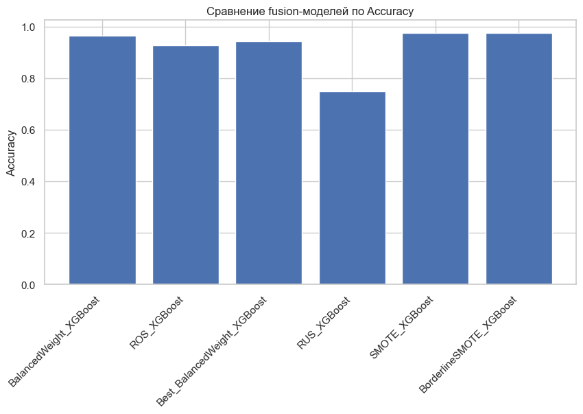
    


```python

```
